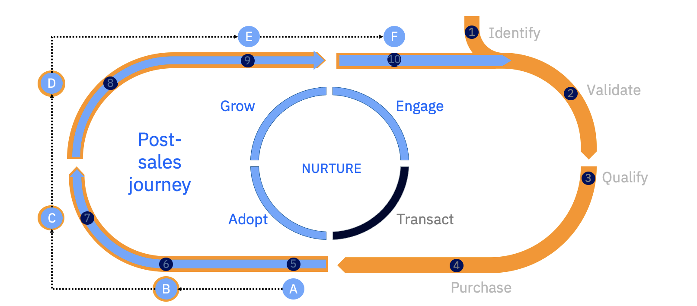
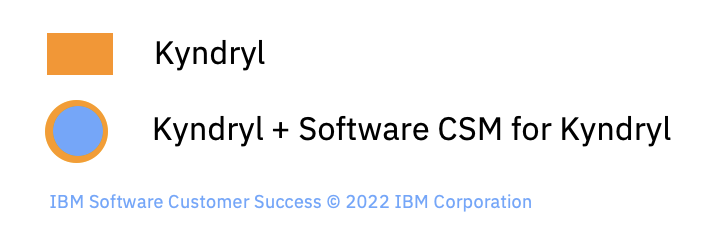
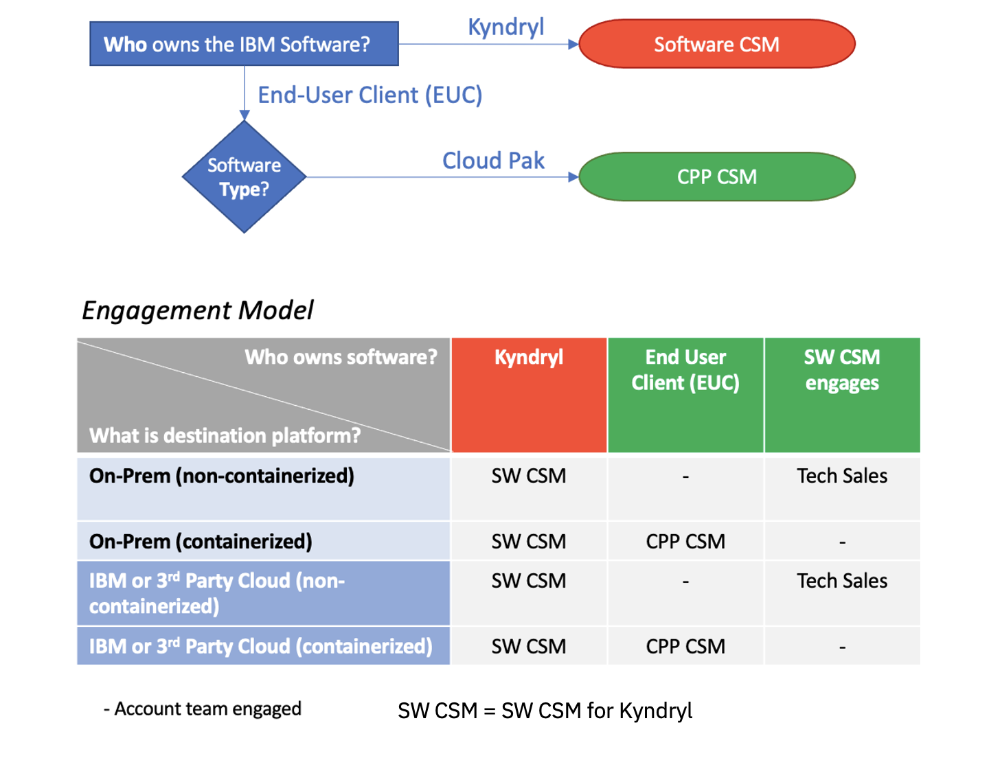

<AnchorLinks small>

  <AnchorLink>The Mission</AnchorLink>
  <AnchorLink>The Journey</AnchorLink>
  <AnchorLink>The Who</AnchorLink>
  <AnchorLink>The What</AnchorLink>
  <AnchorLink>Engagement Model</AnchorLink>

</AnchorLinks>

## The Mission

<Column colMd={16} colLg={16} noGutterSm>

</Column>

### Business Challenge
Today’s agile businesses depend on IT leaders to deliver high-performing applications to support rapid change while saving costs and improving time to value. But achieving these results in complex, heterogeneous IT environments can be a challenge.  According to Kyndryl's website:

<Row>

* 'We design, build, and manage the systems that the world depends on'

</Row>

<Row>

* 'Kyndryl is the world's largest provider of IT infrastructure services serving thousands of enterprise customers in more than 60 countries. As a focused, independent company, we're building on our foundation of excellence by bringing in the right partners, investing in our business, and working side-by-side with our customers to unlock their potential.'

</Row>

<Row>

###  The Mission
#### The Mission of the Kyndryl CSM organization is to enhance, grow, and modernize with IBM Software – retain, grow, and modernize workloads on IBM Software. Our Kyndryl CSMs work with Kyndryl and Kyndryl's End User Clients (EUC) on IBM Software currency upgrades, lift & shift same Software to a different platform and drive enhancements to containerized versions of the Software or with additional software. 

</Row>

<Row>

### Objectives

* Drive business value with Kyndryl and Kyndryl's End-User Clients (EUCs) by identifying use cases aligned with their objectives.
* Understand and utilize IBM Software usage patterns of the End-User Client and underlying Infrastructure.
* Team with Kyndryl to present growth and modernization opportunities on IBM Software to Kyndryl's EUC. 
* Minimize churn by enhancing IBM Software (e.g. complex upgrades, install additional software products and/or replicate deployments across the EUC busienss units), lift and shift to more modern Infrastructure, and modernize with containerized versions of the software.
* Implement a management system to measure progress of deployments.

</Row>

<Row>

### Success Factors

* Recognize value with Kyndryl and Kyndryl End-User Clients.
* Retain IBM Software contracted by Kyndryl for their use or their customers' use
* Grow existing client software install base and expand software into additional Kyndryl-led accounts. 
* Create and maintain a sustainable organization of high-performing CSMs for Kyndryl embedded with Kyndryl and Kyndryl End-User Clients on their strategic objectives around IBM Software.

</Row>

## The Journey

<Column colMd={16} colLg={16} noGutterSm>

</Column>

<Row>
Kyndryl owns contracts with end user clients for managed services, and Kyndryl engages our CSM Architects for adoption, expansion, and modernization projects.
</Row>

<Column colMd={4} colLg={4} noGutterSm>

</Column>

<Row>

### Onboard and Deploy (Activation)

Identify and engage the business sponsor and run Discovery Workshops to identify new use cases and deploy the offering

</Row>

<Row>

### Adopt and Implement (Transition)

Drive implementation via growth plans to help the customer recognize the full value of their offerings

</Row>

<Row>

### Support and Troubleshoot

Identify pervasive and/or critical customer issues to better manage customer outcomes and relationships

</Row>

<Row>

### Expand and Modernize (Transformation)

Architect and implement transformation projects aligned to strategic objectives

</Row>

<Row>

### Renew and Retain

Activate proactive conversations by connecting clients to renewal and sales teams and running retention plans with at-risk offerings

</Row>

<Row>

### Advocate

Identify and recruit advocates based on success stories

</Row>

## The Who

<Row>

*Kyndryl CSMs may be engaged at any point along the Kyndryl End-User Client journey. Reference the Governance chapter herein to assess with Kyndryl where the EUC is along the journey and the appropriate patterns which turn into scenarios driving client value aligned with their stated IBM software strategy.*

</Row>

<Column colMd={16} colLg={16} noGutterSm>

</Column>

<Row>

## Customer Success Organization 

There are multiple CSM roles in IBM's Customer Success Organization.  The core mission of a CSM is to drive deployment, growth, upgrades, and retention with customers while continuously monitoring account health and expansion opportunities.

1. **Kyndryl CSM Architect:** Drives retention, expansion, upgrades, growth, and modernization of IBM Software whether Kyndryl owned or hybrid Kyndryl/End-User Client owned. 
2. **Cloud Pak Platform CSM:** Drives deployment, adoption, growth, and renewal of IBM Cloud Paks and Growth Offerings owned by the end customer.
3. **Sustainability CSM:** Drives deployment, adoption, growth, and renewal of AI Applications owned by the end customer.
4. **Cloud CSM*:** Drives client value by accelerating adoption and growth of IBM Cloud offerings.
5. **Brand CSM:** Drives client value by driving deployments of brand specific offerings. (e.g. zSW CSMs)
6. **CS Account Specialist:** Owns strategic relationship with customers and coordinates with brand CSMs. Note: Kyndryl accounts do not have an Account Specialist.

</Row>

<Row>

**Cloud CSMs focus on IaaS and PaaS including compute, databases, network  and storage software. For other IBM Software (Watson, Cloud Pak for Data as a Service ...) which are part of the IBM Cloud catalog, Cloud CSMs provide best effort if the client has these products in their install base (e.g. connect with tech support). SaaS is small scope of IBM Cloud currently so risk is low with this approach.*

</Row>

## The What

<Row>

*Kyndryl Customer Success Managers are an integral part of IBM in applying their expert level technical skills to enhance Kyndryl’s and Kyndryl's End-User Clients’ understanding of IBM Software capabilities and the value the software provides to their business. They work with Kyndryl and the End-User Clients to achieve and measure business outcomes. The CSMs protect and grow the full IBM Software portfolio through the relationships they build with Kyndryl and Kyndryl's End-User Clients with a focus on WebSphere Application Server (WAS), Db2,and Tivoli estates on Distributed and System z platforms and z Software (i.e. CICS and IMS). *

</Row>

<Column colMd={16} colLg={16} noGutterSm>

</Column>

<Row>

## SW CSM for Kyndryl 

The Kyndryl CSM architect is a post-sales role that drives usage, software currency, modernization, new workloads and new opportunities to leverage the software via the Fixed Fee agreement. The Kyndryl CSM works closely with the following teams and other teams, as appropriate:
- **IBM Solution Integration Hub** (name may change): Responsible for technical solutioning with Kyndryl to develop IBM Software strategic solutions to drive revenue growth.
- **Kyndryl Executive Client Advocate:** Manages the end-to-end IBM Support Delivery experience for Kyndryl.
- **IBM End-User Client Teams:** Kyndryl CSMs are a key extension to these teams working with Kyndryl contributing to the planning and activities to transform the IBM-Kyndryl relationship and to drive incremental sales.
- **Quotes and Ordering Processing:** Work with the Distributed Software (DSW) and Enterprise Software(ESW) teams to help address any issues.

</Row>

## Engagement Model

<Column colMd={16} colLg={16} noGutterSm>

</Column>

## Kyndryl's Software Fixed Fee Agreement 

Kyndryl is the biggest customer for IBM Software and has dedicated support teams from DSW and ESW

**Techline teams are in place to assist *Kyndryl* with quotes/orders and Global IBM Project Offices are in place to manage:**
- Quote and Order Processes, new PA site requests, invoicing (User Guides)
- Contract terms and conditions, e.g. end of life (EOL) rules (Operational Manuals)
- Problem Resolution

**Work with your Kyndryl partners:**
- Ensuring your End-User Clients understand the value of IBM Technology
- Creating projects for value realization and modernization with IBM Technology
- Focusing on incremental opportunities for IBM Software, you can get credit on your CREV quota achievement through the Partner Advocacy Program

**Reminder:** Kyndryl is not authorized to resell Software licenses nor Software Subscription and Support

**IBM has dedicated support teams from DSW and ESW *for Kyndryl*:**
Techline teams assist *Kyndryl* with quotes and orders
Global IBM Project Offices are in place to manage:
- Quote and Order processes, new PA site requests, invoicing (user guides)
- Contract terms and conditions, e.g. end of life (EOL) rules and operational manuals
- Problem Resolution

### How to Handle Fixed Fee Questions & Requests from Kyndryl

- How to partner with Kyndryl for IBM Software:https://ibm.ent.box.com/s/54utafk9abit4qaay3e2o027vczxwbim
- Kyndryl Fixed-Fee information:https://ibm.box.com/s/z776xh9eywm766xan5nfbr0b7ro5si14
- WW KYN Software Alliance Contact: Cathy Przybysz: Cathy.Przybysz@kyndryl.com
- WW KYN Software Alliance Contact: Bob Bruno: robert.bruno1@kyndryl.com
- **NOTE:** Many documents and links here are for Kyndryl's use (see *italicized text*).  Should *Kyndryl* need assistance or have questions about any of their touchpoints and processes linked here, have KYNDRYL reach out to Cathy or Bob (see just above)

### Instructions - How *Kyndryl* Submits Techline Request for DSW

*Kyndryl* should use the following instructions to complete the DSW SW Questionnaire and attach/upload it in step 8 below:

*Kyndryl* logs into ibm.biz/tlsupport-kyndryl to create an IBM ID with Kyndryl email as the username

1. Support Required – select Provide Passport Advantage Software Support
2. Primary Area – select Quote Request, Licensing question or Other support
3. Enter Account Name
4. Enter Passport Advantage Site Number
5. Select Country
6. Complete Request Summary
7. Complete Request Details
8. Upload DSW SW Questionnaire
9. Click the Submit button

### Requests for ESW

- zSystem software (ESW) - IBM Project Office email: Global.Z.SW.Kyndryl.Project.Office@ibm.com
- zSystem Software User Guide *for Kyndryl's use*: https://ibm.ent.box.com/s/5sm43oxtns4cec5h13ebhb3pdng4vshn 

### For further information RE: Fixed Fee agreement (including process flows and roles/responsibilities documentation) link here:  https://ibm.box.com/s/scs28bo6myp0gffrjglpcvb5wu6vjtu9 ###

### Need to determine what can and cannot be deployed by Kyndryl without incremental fees? This Word document described in detail the rules in play, definition of a KYN service tower, etc: https://ibm.box.com/s/xggbwx7w0legf2pnr9soy7i9leeg2oht ###

NOTE: The Fixed Fee agreement is in place through 31 December, 2024. 

## Engagement Model

Kyndryl CSMs work very closely with zSW CSMs since Kyndryl runs zSystems as managed services for their End-User Clients.  To learn more, connect with the Communities of Practice for Kyndryl as well as zSW via:  <a href='https://w3.ibm.com/w3publisher/customersuccess/community-connections/ibm-z-a-ps-and-kyndryl-community' target='_blank' rel='noreferrer noopener'>IBM zSW and Kyndryl Community</a>
