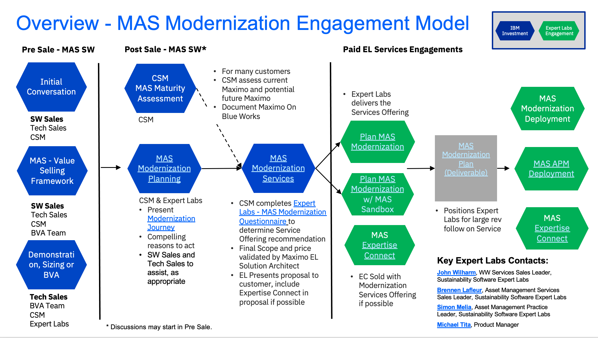

<AnchorLinks small>
<AnchorLink>Maximo EAM Platform Modernization to the Maximo Application Suite (MAS)</AnchorLink>
</AnchorLinks>

import {Link} from 'gatsby'

<Row>

# Maximo EAM Platform Modernization to the Maximo Application Suite (MAS)

</Row>

<Row>
<AnchorLinks small>
<AnchorLink>Why should my customer modernize to MAS?</AnchorLink>
<AnchorLink>How can I help my customer modernize Maximo EAM?</AnchorLink>
<AnchorLink>Where are the Assets that I can use to help my customer migrate?</AnchorLink>
<AnchorLink>What do I need to know to make the Maximo to MAS Transition?</AnchorLink>
</AnchorLinks>
</Row>

<Row>

Over the last couple of years, CSMs have been actively working to get our customers in a position to modernize - also referred to as migrating - to the Maximo Application Suite.  This has involved countless hours working to get customers up to at least 7.6.1.2, teaching the value of the application, and providing that reason to migrate.

</Row>
<Row>

## Why should my customer modernize to MAS?

</Row>

<Row>

- Improved usability with a unified lookand feel
- Single entitlement  across the suite
- Ease of implementation with OpenShift containers
- Provides industry-leading capabilities and functionalities
- Support for Maximo EAM is ending in 2025.

 
 

</Row>

<Row>
<a target='_blank' rel='noreferrer noopener' href="https://ibm.seismic.com/Link/Content/DCVhTFfWHHHq3GMQfdFMVPpghCm3">Six reasons to expand and
get more with IBM Maximo</a>

</Row>

<Row>

## How can I help my customer modernize Maximo EAM?

</Row>

<Row>

There are several resources to help CSMs continue in this migration process that can be found in the sections below.

 

<AnchorLinks small>
  <AnchorLink>IBM Technology Expert Labs</AnchorLink>
  <AnchorLink>Business Partners (Coming Soon)</AnchorLink>
  <AnchorLink>IBM Consulting (Coming Soon)</AnchorLink>
  <AnchorLink>Guide to MAS Migration Assets</AnchorLink>
</AnchorLinks>

</Row>
<Row>

This page will continue to develop with this content over time.

</Row>

<Row>

### IBM Technology Expert Labs

</Row>

<Row>

IBM Technology Expert Labs - Software is a great partner to help your clients successfully plan and migrate to MAS.  Expert Labs experts will help your client overcome their reservations about moving to a Red Hat OpenShift platform, by providing best practices for planning, implementing and Day 2 Operations so clients get the full benefit of MAS that is easier to manage with OpenShift.  Expert Labs has two offerings in this space - the "Maximo Application Suite (MAS) Modernization Plan and Design" and
the "Maximo EAM to MAS Manage Migration Quick Win Offering," and can be engaged through the process below.

 

To learn more about the offerings, you can watch the Replay of the <a target='_blank' rel='noreferrer noopener' href="https://ec.yourlearning.ibm.com/w3/playback/10337975">MAS Modernization Product Launch Sales Enablement</a>.  In this session, the speakers shared how MAS will modernize and revolutionize your clients’ business. They’ll talk about how to have winning conversations around MAS, and why Technology Expert Labs is the insurance policy for MAS.

</Row>

<Row>

You can <a target='_blank' rel='noreferrer noopener' href="https://ibm.box.com/s/0sjrdb4md8bamm3ekhxrf9kc6whtbp43">review the overview presentation</a>

  

TL;DR - The first step is to engage your services sellers early in the opportunity.   Contact <a target='_blank' rel='noreferrer noopener' href="https://w3.ibm.com/#/people/937924897">John Wilharm</a>  or <a target='_blank' rel='noreferrer noopener' href="https://w3.ibm.com/#/people/093087649">Brennen Lafleur</a> if you are unsure of who your services seller is.

</Row>
<Row>

<Column>

</Column>

</Row>

<Row>

We have an <a target='_blank' rel='noreferrer noopener' href="https://ibm.box.com/s/55hthfm3559u6v5vum13wx099ybp2rwl">Interactive Document with Live Links</a> that can be used to get to any of the information on the diagram.

</Row>

<Row>

#### This process has been successful!

</Row>

<Row>
<a target='_blank' rel='noreferrer noopener' href="https://ibm.seismic.com/Link/Content/DCGMFBj42P7DTG7R2H33b9pHfhBV#/?anchorId=a0d4e5b4-08be-4f13-b4a1-7f9ed61f884d">Several success cases</a> can be found in the Technology Expert Labs MAS Modernization Showcase.

- <a target='_blank' rel='noreferrer noopener' href="https://ibm.seismic.com/Link/Content/DCWmqqCcCTdWcGqX6h8MMBbjm2m3">Estée Lauder</a>
- <a target='_blank' rel='noreferrer noopener' href="https://ibm.seismic.com/Link/Content/DC4M97pgCJTBMG9HmWgC8RfVT2fP">US Department of Interior</a>
- <a target='_blank' rel='noreferrer noopener' href="https://ibm.seismic.com/Link/Content/DCm89qGjd9q3m8QT38qdW72FQ8q8">Atlanta DEAM</a>

</Row>

<Row>

#### Notes for CSMs

</Row>

<Row>

- This scenario assumes the Customer has upgraded their licenses to AppPoints, but has not upgraded their technical environment to MAS.  The activity to the left of the line have been completed.
- MAS Modernization Planning occurs between the Technology Expert Labs Seller and the CSM, and will be driven by the material in the <a target='_blank' rel='noreferrer noopener' href="https://ibm.seismic.com/Link/Content/DCGMFBj42P7DTG7R2H33b9pHfhBV9">Technology Expert Labs MAS Modernization Showcase</a>
- The contents of the "Technology Expert Labs - MAS Modernization Questionnaire" has been added to the Maximo Maturity Assessment (MMA) Customer Profile module.  If you have completed the Customer Profile with the Customer after version 1.1.0, you should have the information required.  If not, you do not have to complete the entire MMA, just gather the information required on the questionnaire.

</Row>
<Row>

### Business Partners (Coming Soon)

### IBM Consulting (Coming Soon)

</Row>

<Row>

## Where are the Assets that I can use to help my customer migrate?

</Row>

<Row>

### Overview

</Row>
<Row>
<a target='_blank' rel='noreferrer noopener' href="https://ibm.ent.box.com/folder/210419916929">All assets in this section</a>, in case the link has not yet been established.

</Row>
<Row>

It is recommended you start with the <a target='_blank' rel='noreferrer noopener' href="https://ibm.box.com/s/s1dzufdlr5xuebeqn4wv8rwaqzypseff">CSM Assets Supporting Migration to MAS TechFest presentation</a> to get an overview of why the assets were
created and the current state of what is available.

</Row>
<Row>

### Flows

</Row>
<Row>

 

The migration activities are captured in flows. There is a top level flow (start there), and then diagrams
for the major sub-flows. There are supporting assets for some of the flows.

</Row>
<Row>

| |  |  |
| --- | ---| --- | --- |
| <a target='_blank' rel='noreferrer noopener' href="https://ibm.box.com/s/xr5ufxayizy9gku5rfart9ggczls66dk">Top.drawio.pdf</a>      |  | |
|  |<a target='_blank' rel='noreferrer noopener' href="https://ibm.box.com/s/r57ysvqwlc44l9poqtwoi0twjsbzwxpz">Planning (3).drawio.pdf</a>    |    |
|  |  |<a target='_blank' rel='noreferrer noopener' href="https://ibm.box.com/s/c0hpasgf8xvq4ibwuzodkgd6m1pruey1">ID Customizations.drawio.pdf</a> |
|  |  |   |<a target='_blank' rel='noreferrer noopener' href="https://ibm.box.com/s/00m7xoqyvq1lumi0bu1azno1x81nwfw7">Preparation.docx</a> |
|  |  |<a target='_blank' rel='noreferrer noopener' href="https://ibm.box.com/s/lgqulztz613mkldg1hges5skbljqwgcy">IBM-MAS-MS-Migration-Questionaire-v1.xls</a>   |   |
|  |  |<a target='_blank' rel='noreferrer noopener' href="https://ibm.box.com/s/n9owp9fkuhgq7kls4ccnssi99ahnm9cz">Roles and Responsibilities.xlsx</a>   |   |
|  |<a target='_blank' rel='noreferrer noopener' href="https://ibm.box.com/s/ue3oc3gc5tavtj8qke1mg7ylvt6oopf5">Provisioning.pdf</a> |  |   |
|  |  |<a target='_blank' rel='noreferrer noopener' href="https://ibm.box.com/s/e7uj6uuhl1cr84jwcqjhlf2opmupcjqw">Maximo Suits Migrations Provisioning_V2.pptx</a> |   |
|  |  |<a target='_blank' rel='noreferrer noopener' href="https://ibm.box.com/s/g0m05fdp21w59hul306ryc8rd1ol9eye">IBM Maximo – RHOS On-premises – Overview.pptx</a> |   |
|  |  |<a target='_blank' rel='noreferrer noopener' href="https://ibm.box.com/s/oiwps6gd33scw5hk9dhqrb922r4ccf5w">Installing MAS On Premise.docx</a> |   |
|  |  |<a target='_blank' rel='noreferrer noopener' href="https://ibm.box.com/s/whayr4svmuxnul0q4gx568v66g9m12pa">03-30-22 – CP Support & Escalation.pptx</a> |   |
|  |<a target='_blank' rel='noreferrer noopener' href="https://ibm.box.com/s/nsfa0pjdclhjhls01u8dn2ttrqh5zx0y">Validate.drawio.pdf</a> |  |   |
|  |<a target='_blank' rel='noreferrer noopener' href="https://ibm.box.com/s/y8y9gj8cs0wybbed9xxvjvduxhy4y8md">Migration.drawio.pdf</a> |  |   |

</Row>
<Row>

### Plan

</Row>
<Row>

One of the first activities you will want to start with your client is planning. If they already have a plan,
use that as your starting point. But if not, they will probably ask for a template, because we’ve done this
before. The template below is our starting point. It is meant to include all the possible activities. It is
not expected that any client will need to do all of these. And it is likely that a client will have some
unique activities (approval, etc.) they want to add.

 

The template has been used, and we have a few examples. All the durations are specific to the client,
depend on their skills, access to support staff, and amount of overhead in their processes. The examples
below are just that, examples you can look at to see how others have done it. Please make sure that if
you reuse an example, you first clean all the client references.

</Row>
<Row>

**Template**

</Row>
<Row>

<CardGroup>
  <MiniCard title="MAS Migration Project Plan to Mgd Svcs.xlsx" href="https://ibm.box.com/s/6egq43xj54p8do1koi0965qens829h79">
  </MiniCard>
</CardGroup>

</Row>
<Row>

**Examples**

</Row>
<Row>

<CardGroup>
  <MiniCard title="MAS-Migration-Schedule.mpp" href="https://ibm.box.com/s/tj7j9pqmxadvxr49578ogovc4qpqxfn9">
  </MiniCard>
  <MiniCard title="City of Atlanta – MAS with managed Services deployment notes Oct 10 2022.pptx" href="https://ibm.box.com/s/35x98y3br323vdqw50r8948j989srepk" />
  <MiniCard title="MASMS-82084278-230322-2225-348.pdf" href="https://ibm.box.com/s/2xmof242u0rxa3tqfo196mgpxh5uyb9e" />
  <MiniCard title="IBM MAS Migration Steps – v1.pptx" href="https://ibm.box.com/s/p97342lko79gag9dhbyexqbjni7duet4" />
</CardGroup>

</Row>
<Row>

### MAS Information Presentations

</Row>
<Row>

In preparing these assets, we have gathered a number of presentations on MAS concepts that you may
find useful. However, you should also check Seismic for the latest information.

</Row>
<Row>

**Licensing**

</Row>
<Row>

<CardGroup>
  <MiniCard title="Maximo Application Suite License Overview Guide for Clients-1.PDF" href="https://ibm.box.com/s/3qrhu8f2j8w8edgz31ucpx7shll1gof4">
  </MiniCard>
</CardGroup>

</Row>
<Row>

**Hosting**

</Row>
<Row>

<CardGroup>
  <MiniCard title="IBM Maximo Application Suite hosting options.pptx" href="https://ibm.box.com/shared/static/pg1kmw2fzgg8f0l7j19kmmsqc2vbo4cs.pptx">
  </MiniCard>
  <MiniCard title="Metra SaaS vs MAS – 110200.pptx" href="https://ibm.box.com/s/0g0udk37dgw2b98uk2oiqmf6q7isujjn" />
</CardGroup>

</Row>
<Row>

## What do I need to know to make the Maximo to MAS Transition?

</Row>
<Row>

<Accordion>
<AccordionItem title='What is an AppPoint and how do I determine how many my customer needs or gets?'>

Read through the <a href='https://ibm.seismic.com/Link/Content/DCpMhcBhDGDbH8qB88JVJF2T8G6j' target='_blank' rel='noreferrer noopener'>Maximo Application Suite License Overview Guide for Clients</a> or the
<a href='https://ibm.seismic.com/Link/Content/DC2C7HVB8WDbV87FqqRTX34gm2Jd' target='_blank' rel='noreferrer noopener'>Maximo Manage AppPoints and User Management</a> document for an understanding of MAS AppPoints.  

The <a href='https://ibm.seismic.com/Link/Content/DChB2R4P39Pm38TVX863Mp7bmJDV' target='_blank' rel='noreferrer noopener'>Maximo Application Suite AppPoint Calculator</a> is what is used to convert Maximo licenses to MAS AppPoints. There is a <a href='https://ibm.seismic.com/Link/Content/DCj92HjdDVC2VGTGcbVHTgPjHhjd' target='_blank' rel='noreferrer noopener'>demo on how to Use the AppPoint Calculator</a> 

More information about how Maximo licenses upgrade to MAS AppPoints can be found in the <a href='https://ibm.seismic.com/Link/Content/DCMCJhGqbWBCQ8cPHVR399GDV67G' target='_blank' rel='noreferrer noopener'>Maximo Sales Enablement - Named vs Concurrent MAS App Points</a> 

</AccordionItem>
<AccordionItem title='Is MAS compatible with the OS, database, or other dependancies my customer wants to use?'>
The <a href='https://www.ibm.com/software/reports/compatibility/clarity/prereqsForProduct.html' target='_blank' rel='noreferrer noopener'>Software Product Compatibility Report</a> tool will allow you to see all the relevant compatible software for your customer's specific need.

</AccordionItem>

<AccordionItem title='Where do I go for Demos, POCs, and Trials?'>

You can get an instance of the <a href='https://techzone.ibm.com/collection/MaximoApplicationSuiteForCrossIndustry' target='_blank' rel='noreferrer noopener'>Maximo Application Suite for Cross Industry</a> demo system, and follow the script there.  A more extensive script including Heath and Predict at the <a href='https://mam-hol.eu-gb.mybluemix.net/' target='_blank' rel='noreferrer noopener'>IBM Maximo Labs</a>. 

You can get a demo environment of Visual Inspection only by completing the <a href='https://techzone.ibm.com/collection/ibm-sustainability-software-gtm-product-assets-team#tab-1' target='_blank' rel='noreferrer noopener'>MVI Demo Request</a>. 
</AccordionItem>
<AccordionItem title='What are the options for hosting MAS?'>

Ishan Segal gave a great overview of <a href='https://ibm.box.com/s/lzdn0f5frmwk2xxlbx256dxcopghpcpw' target='_blank' rel='noreferrer noopener'>Maximo Hosting Options</a> at one of our COP meetings.  The options include <a href='https://ibm.seismic.com/Link/Content/DCdm6QqmFXPXRG4JD8BMc7bjTmHV' target='_blank' rel='noreferrer noopener'>MAS SaaS on AWS</a>, <a href='https://ibm.seismic.com/Link/Content/DCBQGjqQQ6QWmG7TJbPdWR6jDDV8' target='_blank' rel='noreferrer noopener'>Customer-Managed MAS (BYOL) listing on Amazon Web Services (AWS)</a>, and the <a href='https://cloud.ibm.com/docs/mas-ms' target='_blank' rel='noreferrer noopener'>Maximo Application Suite Managed Service.</a> 

Productized options for Azure and Google are in progress, although some implementations have been performed in these environments.  Talk to your Practice Lead if you have this situation.

</AccordionItem>
<AccordionItem title='Who is available in the Business Partner ecosystem to help?'>

Three major Maximo focused Business Partners are <a href='https://ibm.box.com/s/sjl7c56re48hdidua77kpkfzionwa28c' target='_blank' rel='noreferrer noopener'>Aquitas</a>, <a href='https://ibm.box.com/s/pt3mjdt2zul1cyd5bw3t5x19g8aypihd' target='_blank' rel='noreferrer noopener'>Cohesive</a>, and <a href='https://ibm.box.com/s/pt3mjdt2zul1cyd5bw3t5x19g8aypihd' target='_blank' rel='noreferrer noopener'>SMS</a> 

<a href='https://ibm.box.com/s/cg7qmby3n2g0n47byj0vir7zuk8m0fk7' target='_blank' rel='noreferrer noopener'>Electra Learning</a> can help with training options and <a href='https://ibm.box.com/s/sp9hiekxpuvg3oglew3aukcvmezm5i4y' target='_blank' rel='noreferrer noopener'>Qellus</a> can help with enterprise content management connections.
</AccordionItem>

<AccordionItem title='How do I connect into the IBM Team for help?'>

The best and fastest way to connect in to the Maximo Product teams is through the <a href='https://w3.ibm.com/w3publisher/customersuccess/community-connections/sustainability-software-community/asset-management-maximo#MaximoAdvisorySlackChannels' target='_blank' rel='noreferrer noopener'>Product Slack Channels</a>.  There are multiple people on those channels that can answer questions or point you in a direction to get the answer. 

The best and fastest way to connect into the Support team is through the Support Escalation process.  This includes when SRE is involved.  Leverage the Maximo Support Escalation channel (ensuring you have followed the process steps prior!) and call for a Managed Escalation when it is approprite.  Err on the side of Support saying we don't need the Managed Escalation.
</AccordionItem>

<AccordionItem title='What help do I have while installing MAS?'>

<a href='https://www.ibm.com/docs/en/mas-cd/continuous-delivery?topic=installing-maximo-application-suite-its-components' target='_blank' rel='noreferrer noopener'>Installing Maximo Application Suite and its components</a> does a good job of documenting where we are with understanding the install process.  PLEASE GIVE SPECIFIC FEEDBACK TO THIS TEAM TO IMPROVE THE DOCUMENTATION. 

You might want to review the <a href='https://www.ibm.com/docs/en/mas-cd/continuous-delivery?topic=installing-planning-install-maximo-application-suite' target='_blank' rel='noreferrer noopener'>Planning to install Maximo Application Suite</a> section as well. 

Vivek S and Jaime Shoemaker gave a great presentation of the <a href='https://ibm.box.com/s/tqun5o1t9j9pyjx9z8kz4p5574uj14d3' target='_blank' rel='noreferrer noopener'>Maximo Mobile Install process.</a> and there is additional information on <a href='https://www.ibm.com/support/pages/node/6408032' target='_blank' rel='noreferrer noopener'>Configuring and customizing IBM® Maximo® Mobile</a>

</AccordionItem>
<AccordionItem title='How do you technically move from Maximo to MAS?'>

The Managed Service team has the most information documented about the process to move from Maximo to MAS in their <a href='https://cloud.ibm.com/docs/mas-ms?topic=mas-ms-migration-from-maximo-saas-flex-or-on-premise' target='_blank' rel='noreferrer noopener'>Maximo Application Suite Managed Service Wiki</a>. 

Migration of Maximo to Managed Service (MAS-MS) general flow
-Planning
-Initial Set Up
-Test 1
-Test 2
-Live on MAS-MS
-Post Live MAS-MS Activities

The page also includes important information on Pre-Conditions, Roles and Responsibilities, Database Backup Image/Export, Doclinks and Attachment Files. 

We will continue to gather technical migration information outside of the Managed Service as they are completed with CSM participation. 

</AccordionItem>
<AccordionItem title='What is the roadmap and vision for MAS and its applications?'>

Product Management shared this <a href='https://ibm.seismic.com/Link/Content/DCFjgb6Dm6b6WGTFVpF8bBgJGdMV' target='_blank' rel='noreferrer noopener'>MAS Roadmap 2022 – Q2 Update</a> for internal consumption. 

We can also review the <a href='https://ibm.box.com/s/9qx4g7iie8atm3k0ee4yr4dlgc0pc5wn' target='_blank' rel='noreferrer noopener'>Maximo North Star Vision</a> to get a sense of where the application is going over the next 3 to 5 years.

</AccordionItem>

<AccordionItem title='How are we positioning the Maximo to MAS upgrade in the market?'>

Product Management has put together the <a href='https://ibm.seismic.com/Link/Content/DC8h7TppgCGDJ8TMDmQ8M9WRjH2j' target='_blank' rel='noreferrer noopener'>Winning Conversation - Upgrade from Maximo EAM to Maximo Application Suite</a>

**The position at a glance**

Reimagine maintenance for ALL your critical assets with easy-to-implement health scoring, at scale and save up to 30% in costs.
It has never been easier to implement asset health scoring to reveal hidden risk conditions before they impact your business.
Accelerate the ROI and realize the maintenance savings in weeks, not months or years. 
Technicians are scarce and unnecessary maintenance has never been more costly. Moving to MAS now gives your employees the intelligence to act. 

<a href='https://ibm.seismic.com/Link/Content/DCd64CX7RWGMcGFFhX77g7cMqXjP' target='_blank' rel='noreferrer noopener'>Embrace Intelligent Asset Management now - Objection Handling</a> gives us further detail on how to handle objections. 

<a href='https://ibm.seismic.com/Link/Content/DCVhTFfWHHHq3GMQfdFMVPpghCm3' target='_blank' rel='noreferrer noopener'>Six reasons to expand and get more with IBM Maximo</a>. 

</AccordionItem>
<AccordionItem title='How do I get to a ROI for the Maximo to MAS upgrade?'>

Our BVA Team has put together a <a href='https://ibm.seismic.com/Link/Content/DC8DqpDDf7FqR8qPX24PBgfXGfXG' target='_blank' rel='noreferrer noopener'>BVA for EAM to MAS upgrade Winning Conversation</a> 

**BVA Goal**
Help customer develop a compelling business case for improving its enterprise asset management capabilities with IBM’s Maximo asset management solutions.
Idenitfy Focus Areas & Scope
-Primary organizational scope - plants, facilities and or business units
-Primary asset classes in scope
-Primary asset management processes in scope
Deliverables
1. What’s at Stake – Strategic objective and rationale for investing in the proposed
solution; assessment of current state key challenges and capability gaps
2. Solution Alignment – Required solution enablers and key new capabilities (“day in the
life”)
3. Financial & Operational Benefits - Key financial and operational benefits (e.g., asset
uptime, productivity increase, operational efficiency, capital preservation, etc.)
4. Implementation Roadmap & Cost - Phased solution roll-out plan (e.g., crawl - walk -
run) and estimated cost
5. ROI Bottom Line – ROI, payback, and cash-flow dynamics; capex/opex requirements
Maximo Asset Management

</AccordionItem>
<AccordionItem title='How will my customer get notified of changes to MAS over time?'>

Customers should <a href='https://www.ibm.com/systems/support/myview/subscription/css.wss' target='_blank' rel='noreferrer noopener'>Subscribe to notifications</a> and customers on the MAS Managed Service should be on the <a href='https://status.suite.maximo.com/' target='_blank' rel='noreferrer noopener'>Client Communications Center</a>.

</AccordionItem>
<AccordionItem title='Where do we have references and case studies?'>

There is a master list of <a href='https://ibm.seismic.com/Link/Content/DCqgjPqQqF6CB89XHQW9MQBMVDP3' target='_blank' rel='noreferrer noopener'>Maximo Application Suite Customer References</a> that is maintained by Product Management.

See Use Case Section below.

</AccordionItem>
<AccordionItem title='How will my customer get notified of changes to MAS over time?'>

Customers should <a href='https://www.ibm.com/systems/support/myview/subscription/css.wss' target='_blank' rel='noreferrer noopener'>Subscribe to notifications</a> and customers on the MAS Managed Service should be on the <a href='https://status.suite.maximo.com/' target='_blank' rel='noreferrer noopener'>Client Communications Center</a>.

</AccordionItem>

 <AccordionItem title='What services are available to help my customer make the move from Maximo to MAS?'>

 <a href='https://ibm.seismic.com/Link/Content/DCQTTV9G93TVV8q2XWWBVmRXRG4G' target='_blank' rel='noreferrer noopener'>Find and Connect with Partners_Upgrade from Maximo EAM to Maximo Application Suite</a>

<a href='https://w3.ibm.com/services/lighthouse/spaces/view/intelligent-connected-operations/asset-optimization' target='_blank' rel='noreferrer noopener'>IBM Asset Optimization by IBM Consulting</a>

<a href='https://ibm.seismic.com/Link/Content/DC4JGd7B4Pg6R8mBgjT6bjfhgfDV' target='_blank' rel='noreferrer noopener'>IBM Technology Expert Labs</a>

 </AccordionItem>
 <AccordionItem title='How does my customer set up SSO in MAS?'>

 <a href='https://www.ibm.com/docs/en/mas83/8.3.0?topic=administration-configuring-authentication' target='_blank' rel='noreferrer noopener'>Configuring MAS Authentication</a>

 </AccordionItem>
 <AccordionItem title='What competative information is there with MAS?'>

 <a href='https://ibm.seismic.com/Link/Content/DCD9H4fTp8f4QGT2B7T3Qj7FHR9P' target='_blank' rel='noreferrer noopener'>EAM to MAS Upgrade - Know your Competition</a>

 <a href='https://ibm.seismic.com/Link/Content/DC97JWqTJ24CQ8qXfj4Rq6HchDjj' target='_blank' rel='noreferrer noopener'>INTERNAL ONLY - Maximo Competitive - IFS</a>

 <a href='https://ibm.seismic.com/Link/Content/DC4b7MQ8HHXXD8C2cBTV7bbCC4FP' target='_blank' rel='noreferrer noopener'>INTERNAL ONLY - Maximo Competitive - SAP Intelligent Asset Management Market player analysis</a>

 <a href='https://ibm.seismic.com/Link/Content/DCq7JDhRX9MM3GfHqBDGXWc4FXXG' target='_blank' rel='noreferrer noopener'>INTERNAL ONLY - Maximo Competitive - Ultimo</a>

 <a href='https://ibm.seismic.com/Link/Content/DCgFdDV7D4CRWGF2HF9WJ7X6hhD3' target='_blank' rel='noreferrer noopener'>Maximo Competitive - Hexagon - formerly Infor</a>

 <a href='https://ibm.seismic.com/Link/Content/DCj8RPMWGMj97GhBMQ6VgC97Pjbd' target='_blank' rel='noreferrer noopener'>Maximo Mobile Competitive Battlecards</a>

 <a href='https://ibm.seismic.com/Link/Content/DCcHhBMCd2W4PGhV42jXgGPD34hV' target='_blank' rel='noreferrer noopener'>Maximo Monitor Competitive Analysis</a>

 <a href='https://ibm.seismic.com/Link/Content/DCDbGbG6cddCT8QTbqj96jdVfJ2B' target='_blank' rel='noreferrer noopener'>Maximo Visual Inspection - Battlecard with Cognex</a>

  </AccordionItem>
  <AccordionItem title='How does MAS integrate with other systems?'>

  <a href='https://www.ibm.com/docs/en/maximo-eam-saas?topic=integrating-data-external-applications' target='_blank' rel='noreferrer noopener'>Integrating data with external applications</a>

  </AccordionItem>

<AccordionItem title='How should a customer approach this migration?'>

<a href='https://ibm.seismic.com/Link/Content/DCT4JbW7MT97FGqGfDqqT2qfRbj3' target='_blank' rel='noreferrer noopener'>EAM to MAS upgrade Customer Presentation</a>

</AccordionItem>

</Accordion>

</Row>
