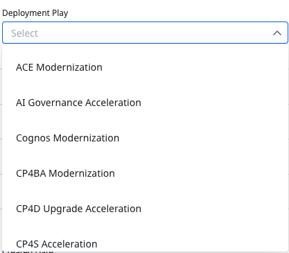
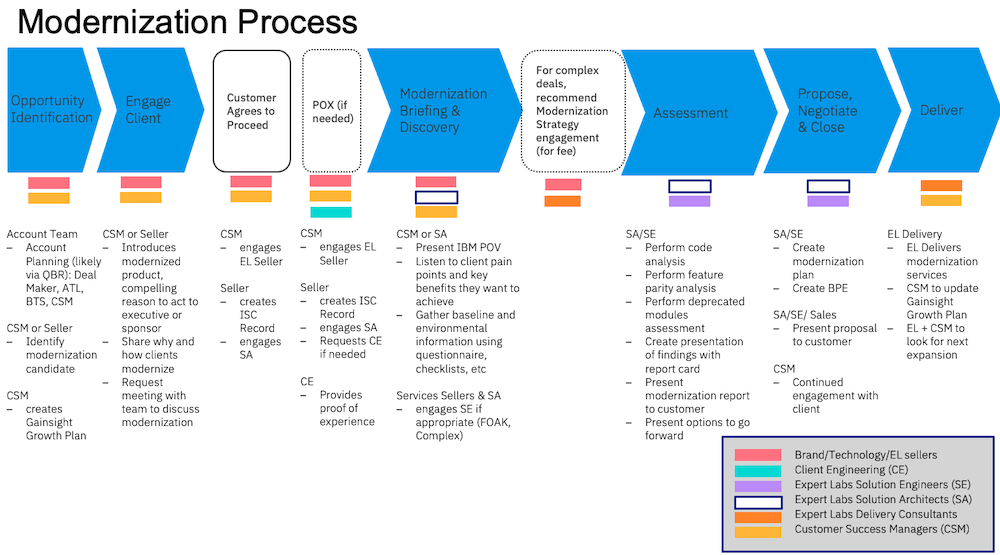

import {Link} from 'gatsby';
import FileLink from '../../../components/FileLink';

A journey map for a software offering provides you with a framework and set of assets to help identify opportunities, gain sponsorship, and ultimately drive a software deployment. 

<Row>

<Column colMd={3} colLg={3}>

</Column>

<Column colMd={6} colLg={6}>

### As a team, identify opportunities, gain sponsorship, and drive deployments.

</Column>

</Row>

---------

<AnchorLinks small>
  <AnchorLink>Journey maps overview</AnchorLink>
  <AnchorLink>General modernization</AnchorLink>
  <AnchorLink>Modernization Guide</AnchorLink>
</AnchorLinks>

----------

<Row>

<Column colMd={9} colLg={9}>

 

## Journey maps overview

These journeys were co-created by product management, Technology Expert Labs (TEL), Client Engineering, and Customer Success.
There are two types of journeys:

| Journey type | Description |
| --- | --- |
| **Modernization** | A framework provided to help a customer modernize an existing workload.|
| **Acceleration** | A framework focused on driving net new workloads for a particular software product. |

For each journey, the following assets are provided to aid you in working with your customer.
* Curated, focused "compelling reason to act" pages that can be used with customers 
* Briefing decks that highlight the key capabilities and value of our software 
* Comparisons of existing point products and the version that runs on OpenShift 
* Modernization workshop materials 
* Assessment questionnaires and processes 
* Technology Expert Labs offerings and approaches 
This diagram is customized within each of the journey maps. It outlines a typical modernization journey from opportunity identification to delivery and deployment.

</Column>
</Row>

<Row>

<Column colMd={5} colLg={5}>

In Gainsight, when you create a <Link to='/onboard/gainsight-create-growth-plan'>Growth Plan</Link> for a modernization or acceleration play, select the appropriate play by using the Deployment Play drop-down list in the Details section of the Success Plan. This will tie the growth plan to the play and will enable leadership to track the activities being done and the effectiveness of the play. There are also new templates available that you can add to success plans that are associated with these deployment plays.

</Column>

<Column colMd={4} colLg={4}>

</Column>
</Row>

<Row>

<Column colMd={9} colLg={9}>

## General modernization

Technology modernization refers to the migration, rewriting, or porting of a legacy system to modern architecture, updated software version, or modern programming language. The goals of modernization will depend on the technology and the customer’s desired outcomes. Some clients are focused on application modernization, some are focused on data modernization, and some are focused on both.

</Column>
</Row>

<Row>

<Column colMd={9} colLg={9}>

### Infrastructure considerations

A key component of your IBM SW journey with your client will be the infrastructure the client selects to deploy it on.  This decision could impact their decision on how they acquire IBM SW as well.  Infrastructure strategy needs to be a key component for both the sales and deployment strategies.  

</Column>

<Column colMd={3} colLg={3}>

**Infrastructure strategy**

<Link to='/common/infrastructure/infra-overview'>Infrastructure choices</Link>

</Column>
</Row>

<Row>
<Column>

## Types of modernization

| Modernization type | Description |
| --- | --- |
| <Link to='/onboard/understand-modernization' target='_blank' rel='noreferrer noopener'>Application modernization</Link> | A necessary part of cloud-centric business transformation. Business pressures demand faster time to market. The success of a digital transformation depends on the ability of developers to build applications with innovative capabilities and deliver them quickly and accelerate developer productivity and the adoption of new cloud-native technologies. Containers, Kubernetes, and microservices deliver speed and simplicity and are being adopted rapidly. But, your customer's current estate determines your modernization strategy. Rewriting an entire application estate isn’t feasible, so modernization is inevitable. |
| Data modernization | The goal of data modernization is to make data more accessible, secure, and scalable, and to leverage it to drive innovation, gain insights, and improve business outcomes. The process of updating and transforming legacy or outdated data infrastructure and technologies to a more efficient and flexible modern data architecture that can support new business requirements and enable better decision-making. The modernization process typically involves migrating data from older software to newer ones, adopting cloud-based data storage and processing, incorporating big data technologies such as machine learning, artificial intelligence, and data analytics, and implementing data governance and security policies to ensure data privacy and compliance with regulatory requirements. |

</Column>
</Row>

<Row>
<Column colMd={9} colLg={9}>

Here are general assets that can be used to help you in your client discussions. The journey maps can be used to supplement these assets.

</Column>
</Row>

<Row>
<Column>

| Asset | Description |
| --- | --- |
| <a href='https://ibm.box.com/s/tpgos9imxhn0a0g5say10h6e6dg1sbnn' target='_blank' rel='noreferrer noopener'>Why modernize?</a> | A general modernization deck that can be used in C-level discussions to outline the benefits of modernization for organizations |
| <a target='_blank' rel='noreferrer noopener' href="https://ibm.box.com/s/5i0je2aujpitcungutwnmc8it94h9jlo">Modernization POV</a> | Guidance that is useful when starting the modernization conversation with your customer |
| <Link to='/common/redhat/objections'>Why modernize on OpenShift</Link>| This video and deck are available for use when customers need convincing to adopt OpenShift |

</Column>
</Row>

