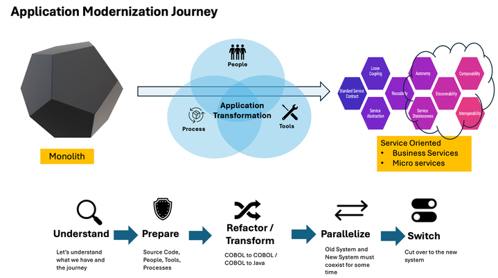
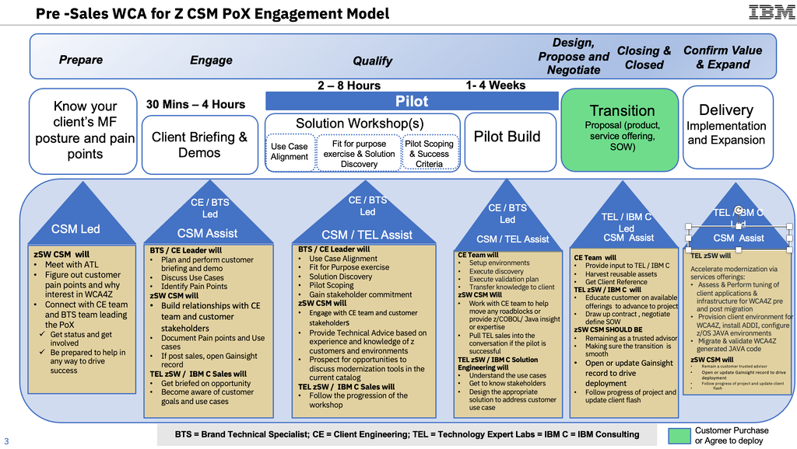
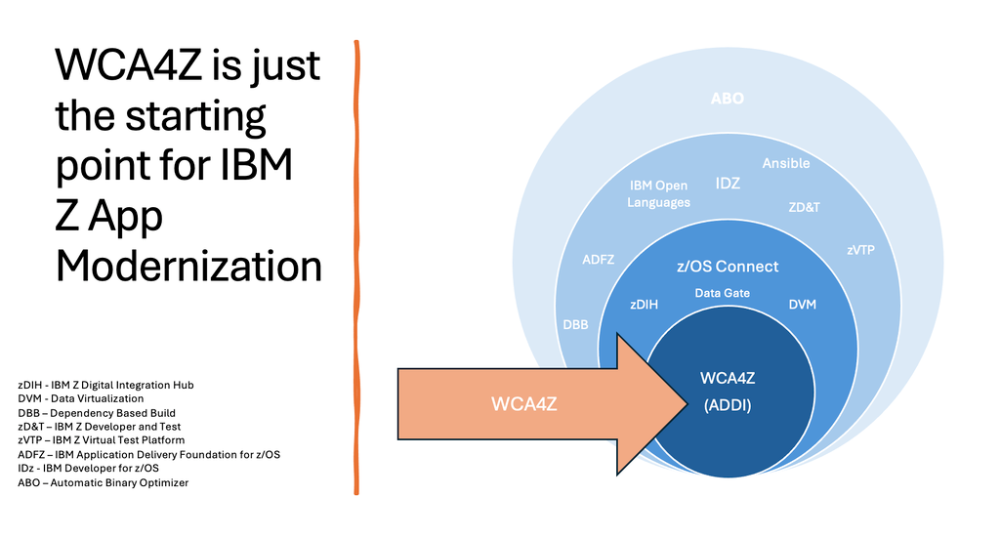
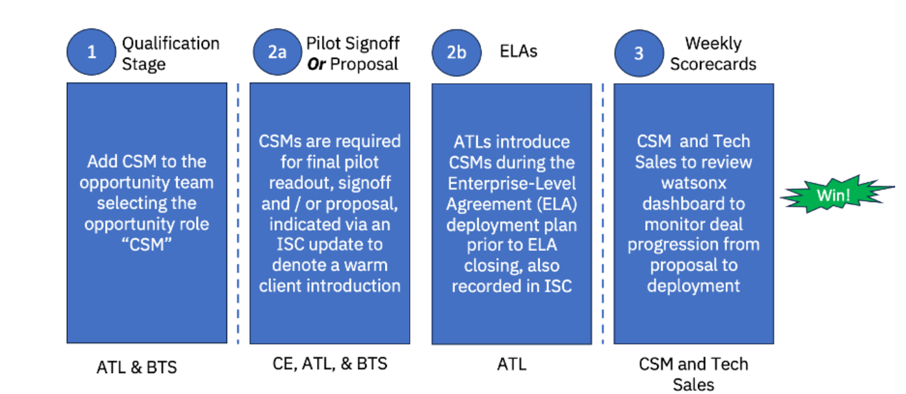
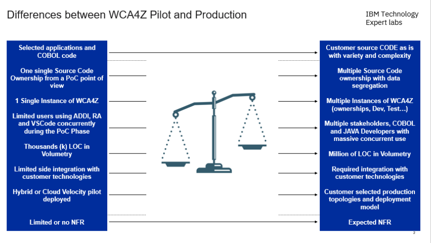
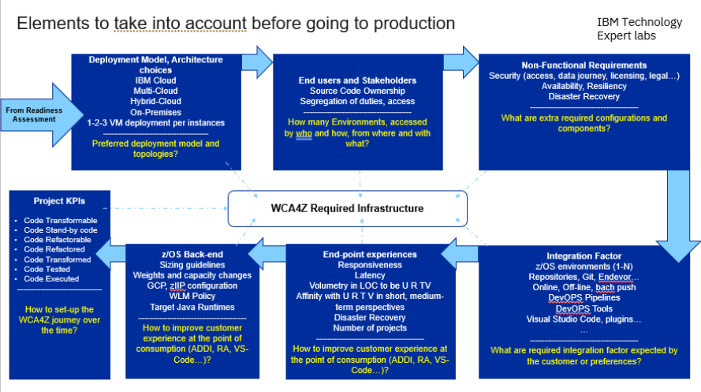
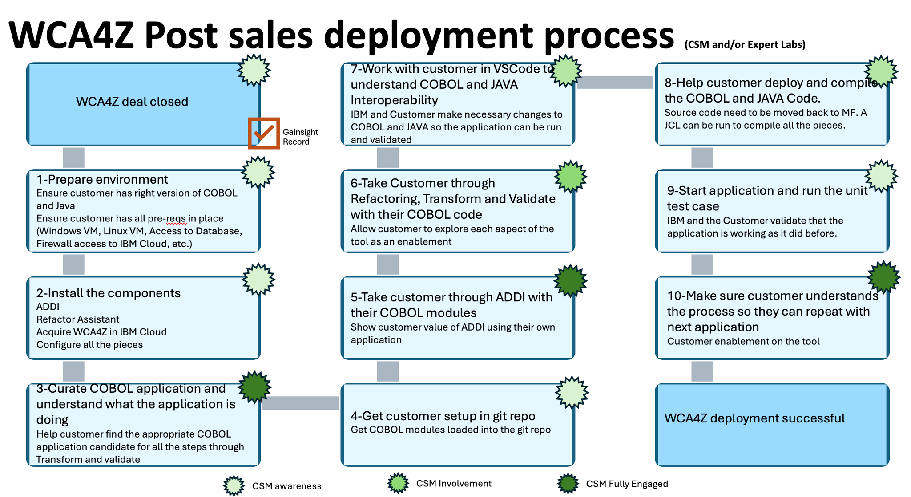
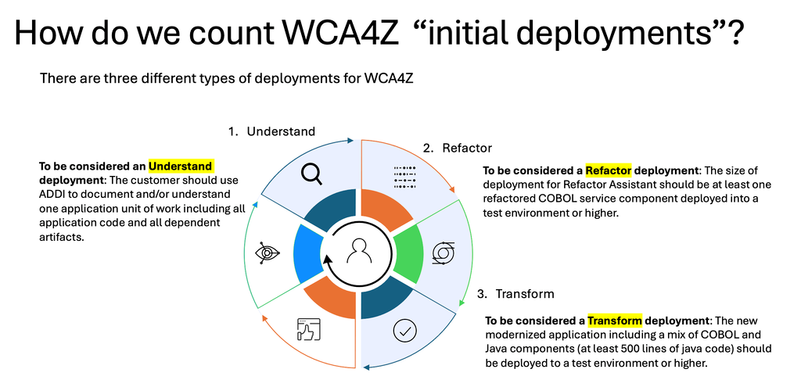
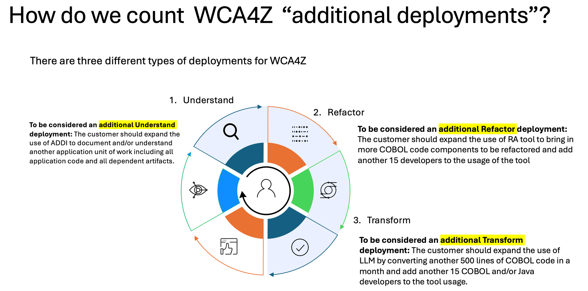

import {Link} from 'gatsby';
import FileLink from '../../../components/FileLink';

## Contacts

| WW contact | Name |
| --- | --- |
| **Customer Success Practice Leaders:** | John Senegal, Craig Bender |
| **Technology Expert Labs (TEL) Solution Engineering:** | Brian Ricker, Stu Cunliffe |
| **Technology Expert Labs (TEL) Product Management:** | Lilian Schnaider |
| **Technology Expert Labs (TEL) Delivery:**  | Lilian Schnaider(standing in) |
| **Client Engineering Practice Leader:** | Vijay Bhadriraju |

<Row>
<Column colMd={9} colLg={9} noGutterMdLeft>

## What is IBM watsonx Code Assistant for Z and what does it do?

IBM watsonx Code Assistant for Z is an AI-assisted mainframe application modernization solution that makes it easier for developers to incrementally modernize and refactor COBOL business services and selectively transform to high-quality Java code optimized for IBM Z. With watsonx Code Assistant for Z, clients can leverage generative AI and the automated tooling to accelerate their mainframe application modernization journey - while addressing key challenges around developer skills and time to value.

## Why should a customer modernize? 

IBM watsonx Code Assistant for Z helps businesses accelerate mainframe application modernization with lower overall cost and less risk than alternative approaches and includes the following benefits:

* Accelerate code development and increase developer productivity throughout the application life cycle
* Lower total cost and complexity of application modernization initiatives through incremental modernization based on business needs
* Expand talent pool by accelerating developer onboarding, making software development more accessible and agile
* Reduce time to value for application development leveraging generative AI
* Deliver a z/OS optimized outcome maintaining data and transactional model, with language interoperability for IBM z qualities of service

## What are the customer pain points?

Most IBM Z customers experience one or more of the following pain points. These drive great interest in this product. 

**Skills:** Most mainframe customers have skills issues. Skills around mainframe development are becoming more scarce and it is very difficult to find new workers with the appropriate skills to develop on the mainframe. Skills in COBOL, VSAM, IMS, CICS, IMS DB are difficult to find and can be expensive. 

**Agility:** Customers need to move at a different pace to keep up with innovations and new ideas. The old mainframe code is brittle and not conducive to the pace of change that happens with cloud-native applications. So, they remain stuck in the old waterfall paradigm that enables them to deliver many changes on a fixed schedule (i.e. quarterly) as opposed to an agile approach where you might have 20 or more commits in a day. 

**Risk Management:** Mainframe customers have critical systems at the core of their business but might have very few or even no people who understand the system. This impacts the ability to change the system as well as the pace of change. They need a way to help new people get a clear understanding of what the application is doing to mitigate the risk of slow system repair should there be a major software failure and to facilitate application modernization.

## How complex is modernization?

Modernization can be complex, but watsonx Code Assistant for Z helps to reduce some of the complexity.

In the mainframe landscape, there are millions of lines of COBOL code that have been running for ten, twenty maybe even forty years. The dilemma customers face is knowing what to do with all this code. This code carries many years of institutional knowledge and proprietary information that often is considered a critical business differentiator.

Now add two other critical issues customers face. First, over many years this code has been patched repeatedly. In some cases, by people who didn't write the code and didn't have the full context of why the code was written the way it was. They simply had an abend and knew it had to be fixed in the next hour to get the system back up and running. As you can imagine, over many years this can create some very messy code. To add to this issue, customers face a brain drain of COBOL developers who are capable enough to look at the code and understand how to either add new features as needed or fix a problem when it occurs. This brain drain is frightening for most customers and is driving them to consider cloud-native technologies. However, by moving to the cloud, IBM loses our strongest customer base and customers lose the scaling, security, and reliability they rely on.

It is difficult for most customers to solve these issues. It would require them to first understand their “spaghetti” code. Then, get new programmers who could rewrite it in a new language. It would be difficult for them to correctly capture all the institutional knowledge in the code. Can they understand enough of the application to capture all the proprietary knowledge that has helped the business thrive all these years? Maybe. This is why modernization is hard for this customer segment.

This is where watsonx Code Assistant for Z helps alleviate these concerns in two ways. It helps by analyzing the code and understanding its relationship with other modules. From that, it attempts to understand common service patterns in the applications like multiple modules calling a single module to update a database. By understanding these patterns it can then generate appropriate Java classes to capture those services. What this means to customers is they get an automated way to create understandable structured code that is easier to maintain and is written in a language that today's developers understand.

## watsonx Code Assistant for Z modernization journey 

watsonx Code Assistant for Z is only the starting point of the customer application modernization journey.  Like any digital transformation, this journey is about people, the process, and tools. WCA4Z is only one of the tools in this application modernization journey.

**Understand:** Customers must have a complete understanding of their application estate. This is the time the customer looks in the dark corners of their SCM (Source Code Management) System to find all the systems that are critical to their business and determine the direction for the system. Is it a rewrite? Is the application not changing but there is still a need to understand it? Is it a modernization target for refactoring? Is it a modernization candidate for transformation?  

**Prepare:** After you understand the landscape, then you have to determine what it means to modernize this application. What’s the impact on the development team? What resources are needed to embark on this modernization? What’s the new process to support these modernized applications? 

**Refactor/Transform:** Next, modernize the selected application. Determine if it’s COBOL to COBOL or COBOL to Java. Then, start the iterative process of moving the application from one state into a set of callable services. 

**Parallelize:** After the changes are made, the application has to be unit tested and it has to run in a production-like (staging) environment where it can be evaluated for stability and performance impacts. It should run in a parallel system while the original system remains in production. 

**Switch:** After the new application provides the same stability and quality of service as the original application, you can turn off the old system. It is recommended that you keep the old system available on standby for some amount of time to ensure the new system has the same business continuity.

## Pre-Sales Engagement 

CSMs must engage the client from the very beginning to enable IBM to accelerate deployments. As stated in the <a href='https://w3.ibm.com/w3publisher/customer-success-and-tech-expert-labs/communications/janine-s-blog/83a92810-e075-11ed-9bd9-332d61794967' target='_blank' rel='noreferrer noopener'>Time Kills Deployments</a> blog, if there is a delay between the sale and conversations about deployments then the momentum created during the POX is lost and you will have to jump-start the conversation again. Below, is the pre-sales engagement model as well as how the model should be executed. 

### Pre-Sales Engagement Model

On this journey, customers start with understanding the current software landscape. That understanding comes from using the ADDI tool that is part of WCA4Z. In the case of WCA4Z, that journey starts with a POX generated by the account team and led by Client Engineering (CE). Below is the engagement model used by Client Engineering and the role that CSMs play during the POX.

CSMs are rarely engaged at the pre-sales level. However, WCA4Z drives a different paradigm and engagement model for several reasons. 

This product gives CSMs access to actual product development teams and owners. Most CSMs in the past have been with the infrastructure teams. This new product will bring us in to meet the product owners which could lead to broader modernization conversations beyond just WCA4Z. 

This is a new product (GA 3Q 2023) that has a lot of focus and interest from IBM Corporate and mainframe customers. As a result of being new, it is not in current ELA catalogs. So, CSMs need to engage early to build relationships.

Implementation of this product can be complicated, so CSMs need to be in early as part of POCs to understand what roadblocks exist so they can avoid them during deployment.

**Prepare phase:** *Know your client's mainframe posture* 

**Led by:** CSM, BTS (Brand Technical Seller)  
**Audience:** Application Teams; Managers and Architects (Executive Level meeting) 

This phase helps to discover the customer's pain points and provides an opportunity for a high-level discussion about the tool. This discussion is about how tooling can promote an understanding of the application and can help jumpstart any modernization effort. This is the time to focus on reminding customers that this is not a magic button but is a tool to help as part of an AI AI-assisted modernization.
 

**Engage phase:** *Client briefing and demo* 

**Led by:** CE  
**Assisted by:** BTS (Brand Technical Seller), CSM  
**Audience:** Application Teams; Managers and Architects (Executive Level meeting) 

This is a full client briefing of the tool done by client engineering along with a full demo. The Client Engineer introduces their solution workshop, describes their process, and establishes a relationship with the customer. The CSM helps to organize and give recommendations about who should participate in the demo. CSMs participate in the briefing and help with the demo in any way possible. Customers help translate the conversation between the customer and CE team. 

**Qualify phase:** *Solution workshop* 

**Led by:** CE  
**Assisted by:** BTS, CSM, TEL  
**Audience:** Application Teams (Managers and Architects) 

This phase is designed as a PoX to help prove the value of the solution. The CE team helps the customer curate the application inventory to identify the right application for the PoX. They identify customer pain points and map those pain points to the right application. This part of the process is the most important for the CSM to participate in because here is where the customer concerns are surfaced, the customer application inventory is discussed, and new opportunities for ABO, z/OS Connect, IDz, zVTP and the rest of the application modernization toolset are identified.  This is also a great time to bring in TEL. At this point, the customer has seen the demo and sees the value, so the potential for purchase and deployment is increased. TEL can engage to come and meet the customer and learn about their environment and pain points.

CSM should be looking for other deployment opportunities such as these.

**Qualify phase:** *Pilot build* 

**Led by:**  CE  
**Assisted by:** BTS,  CSM, TEL  
**Audience:** Application Teams (Architects and Developers), IT Infrastructure team  

This phase is designed to continue the 2nd phase of the PoX to help prove the value of the solution. The CE team helps the customer identify the right application for the PoX as part of the Solution workshop. Then, the CE team sets up a Velocity environment and loads the customer's application into the environment. They take the customer through the Understand, Refactor and Transform phases. The CSM should participate in all aspects of this process to make sure things are flowing well and to become aware of the customer application landscape and prospecting for the post-sale MVP.  

**Design, Propose, Negotiate, Closing, Closed phase:** *Transition*  

**Led by:** TEL or IBM C  
**Assisted by:** CSM  
**Audience:** Application Managers, Procurement and Legal  

There are key elements to take into account before going to production (slide below).  In this phase TEL will design a solution proposal to the customer in the form of an SOW based on the activities defined in the Quick Reference Guide bwlow. CSM should review the SOW with interest of the customer and making sure the success criteria meets the goals of the customer.  Then, TEL will work with all parties to get the SOW agreed to and signed.

## How do we realize the pre-sales engagement model? Who does what?

</Column>

</Row>

<Row>

<Column>

-----

## Post-Sales deployment stages

The post-sales deployment model is similar to the pre-sales engagement model except we are preparing the customer for the full modernization through an iterative approach. We are also ensuring the customer has deployed a hardened production-ready environment that can scale for the entire modernization journey.

-----
### Identify phase

#### Common practices

Before you start to work with the customer, you will need to learn about the customer, their industry, what was sold, and who you might work with.

| Practice | Description |
| --- | --- |
| <Link to='/onboard/understand-client-it-landscape/'>Learn about the customer</Link> | Before you get started, you need to learn about your customer and their business. |
| <Link to='/onboard/learn-partner/'>Learn about the partner</Link> | If your customer is working with a partner, you need to learn about the partner and their relationship with IBM and the customer. |
| <Link to='/onboard/understand-deal/'>Understand the deal</Link> | Learn where to find information related to how the product was sold to the customer. |
| <Link to='/deploy/identify/'>Identify</Link> | Understand what the customer will need to be successful. |

#### Product-specific practices

Get started with the Gainsight watsonx Dashboard

It is critical to act with utmost speed and care with our customers who have entitlements for WCA4Z. There are a couple of different places in Gainsight to assign the appropriate CSM and drive the appropriate Growth Plan with a use case. The expectation is that the Gainsight entries will be entered in a relatively short timeframe. This section will map you to the hot spots in Gainsight to act with clock speed for our newest product offerings around watsonx AI.

To view all R360s related to watsonx Code Assistant for z, it is necessary to search for the R360 related to the C360 in Gainsight via the Search All Customers by Name dashboard.

In the Link to R360 field, search on ‘watsonx Code Assistant’ to sort all relationships for all customers with a Code Assistant offering. If you are assigning only the watsonx Code Assistant for z, select only the R360s associated with that product. Assign the Specialty Architect directly to the R360 relationship. NOTE: New R360s for watsonx products are shown on the All Customers view (explained here) and not on the watsonx dashboard until after a CSM is assigned and a Growth Plan is created.

Secondly, view the IBM Cloud usage associated with watsonx products via the watsonx dashboard in Gainsight. In the dashboard, scroll down to find the watsonx Service Usage on the IBM Cloud chart:

To see and choose the watsonx Code Assistant Z on the watsonx Service Usage on IBM Cloud chart, scroll down in the list of products below the chart, and select watsonx Code Assistant Z. Then, select the bar chart on the right to see the list of customers associated with IBM Cloud usage of watsonx Code Assistant.

New watsonx entitlements and relationships are expected to be assigned to a CSM within 48 hours, so it’s critical to manage via these systems. By assigning a CSM early in the lifecycle of customers’ deployments of watsonx, you have the opportunity to document a Growth Plan for each relationship AND to enter Client Flash updates EACH WEEK as needed for tracking purposes.

| Led by | Outcome | Assets & Activities |
| --- | --- | --- |
| CSM | Prioritized use case | **If the customer has already done a PoC?** The CE team has already, through the workshop, identified use cases that customers might be interested in. One of them or parts of them were excited during the PoC. The CSM should have a Transition meeting with the CE team. Before the meeting study all of the documents that were produced during the workshops to get a clear understanding of the use cases.    **If the customer has NOT done a POC?** Meet with the account ATL (Account Technical Leader) and BTS (Brand Technical Seller) to understand customer pain points around the solution and to get customer contacts.  Reach out to those contacts through the ATL or Seller. Those contacts should include a manager of an application team. Begin to gather this information and propose a briefing and demo of WCA4Z. Through this exercise, you should be able to identify one or more use cases to pursue. |

| Led by | Modernization use case | Assets & Activities |
| --- | --- | --- |
| CSM | Customer needs to better understand the applications within the portfolio to relieve the current burden on the application SMEs. | **If the customer has already done the PoX?**   - Perform a Transition meeting with the CE team   - Work with the customer to identify the application that requires the most frequent changes. This is the application that will be loaded into ADDI to gain understanding. It will also be used by the explanation feature to gather detailed documentation about the application. By gaining knowledge of this application, we can alleviate the burden on application SMEs.   - This application will be used as the primary use case for the MVP.    **If the customer has NOT done a PoX?**   - Perform a briefing and demo of WCA4Z   - During the demo be sure to focus on ADDI reports. You must show more reports than the standard call graph reports. Because customer pain points can be addressed by deeper ADDI reports. If the reports are not sufficient to address the pain point, be sure to open an aha idea and mark it as a candidate for product scout so it can be addressed with product management. |
| CSM | Customer has huge monolithic applications in the portfolio that prevent them from being agile in their ability to act on new requirements. | **If the customer has already done the PoX?**  - Perform a Transition meeting with the CE team.   - Work with the customer to identify the application that might be fairly difficult to make changes to because of its brittle nature. Be sure to use curation techniques to make sure it’s not the most difficult of the application but it’s still a meaningful application.  - This is the application that will be refactored into COBOL services. Plan to use ADDI and explanation to help understand the application and produce the services.   - This application will be used as a candidate for the primary use case for the MVP.    **If the customer has NOT done a PoX?**   - Perform a briefing and demo of WCA4Z.   - During the demo be sure to demonstrate the full value of ADDI.   Move on to show how COBOL applications can be refactored into COBOL Services. |
| CSM | Customer has a COBOL skill problem and needs to open up the application portfolio to new hire developers by having some of the applications written in Java. | **If the customer has already done the POX?**   - Perform a Transition meeting with the CE team.   - Work with the customer to identify the application that might be fairly difficult to make changes to because of its brittle nature. Be sure to use curation techniques to make sure it’s not the most difficult of the applications but it’s still a meaningful application. Be sure to look at the No Fly Zone to familiarize yourself with the model maturity. As part of using ADDI, plan to create Complexity report to evaluate whether or not the model can support transforming this application.   - This is the application that will be refactored into COBOL services and transformed into Java. Plan to use ADDI and explanation to help understand the application, produce the services, and transform to Java.   - This application will be used as the primary candidate for the use case in the MVP.    **If the customer has NOT done a POX?**  - Perform a briefing and demo of WCA4Z.  During the demo be sure to demonstrate the full value of ADDI   - Move on to show how COBOL applications can be refactored into COBOL Services.  Take COBOL services and convert them to Java.   (Be sure to explain to the customer that the Java produced by this assistant will not always be perfect and will need modification, which differentiates us from the JOBOL generators)

</Column>
</Row>

<Row>

<Column>

------

### Propose phase

#### Common practices

| Practice | Description |
| --- | --- |
| <Link to='/deploy/propose-solution/'>Propose the solution</Link> | Understand what the customer will need to be successful. |

#### Product-specific practices

| Led by | Outcome | Assets & Activities |
| --- | --- | --- |
| CSM | An agreement and plan for TEL WCA4Z Production Readiness Assessment Workshop. | - Based on the customer's knowledge of WCA4Z, you might need to perform another briefing or demo for this customer.   - Propose to the customer the <a href='https://ibm.box.com/s/fzi0wkf1pgs3g2gos76j3wr1ogtffykt'  target='_blank' rel='noreferrer noopener'>TEL WCA4Z Production Readiness Assesment Workshop</a> by presenting this deck or getting the TEL rep to present it. |

</Column>
</Row>

<Row>

<Column>

------

### Sponsored phase

#### Common practices

| Practice | Description |
| --- | --- |
| <Link to='/deploy/get-sponsorship/'>Get Sponsorship</Link> | Identify the people in the organization who will help you establish the value of the solution. |

#### Product-specific practices

| Led by | Outcome | Assets & Activities |
| --- | --- | --- |
| CSM | Find an application area and application owner who is prepared to begin the WCA4Z workshop. |  **If the customer has already done a PoX ?**   - The CE team has probably identified, through the set of use cases, who the product owners are and the potential sponsors. As part of the Transition from CE, the CSM should familiarize themselves with key application owners and get introductions from the CE team if hasn’t already been done.   - Work with the application owner to plan the <a href='https://ibm.box.com/s/fzi0wkf1pgs3g2gos76j3wr1ogtffykt'  target='_blank' rel='noreferrer noopener'>TEL WCA4Z Production Readiness Assessment Workshop</a>. Help them to identify the right people to engage in the workshop. This should be System Programmers who understand the IBM Z environment and application architects who have a depth of understanding of the application landscape.    **If the customer has NOT done a PoX or if this Application Owner was not involved in the PoX?**   - Based on this individual’s knowledge of WCA4Z, you may need to perform another briefing a demo for this individual.   - Work with the Application Owner to plan the <a href='https://ibm.box.com/s/fzi0wkf1pgs3g2gos76j3wr1ogtffykt'  target='_blank' rel='noreferrer noopener'>TEL WCA4Z Production Readiness Assessment Workshop</a>. Help them to identify the right people to engage in the workshop. This should be System Programmers who understand the IBM Z environment and application architects who have a depth of understanding of the application landscape.    **After a sponsor is identified:**  - Submit a request for the Workshop to Expert Labs through the <a href='https://survey.alchemer.com/s3/7197619/Solution-Engineering-Request-Form' target='_blank' rel='noreferrer noopener'>Request an Expert Labs Solution Engineer</a> form.  - Work with the customer and Expert Lab to schedule the workshop  - Be sure to brief Expert Labs regarding customer pain points and priorities.

</Column>

</Row>

<Row>

<Column>

------

### Planning phase

#### Common practices

| Practice | Description |
| --- | --- |
| <Link to='/deploy/plan-deployment/'>Plan deployment</Link> | Plan the deployment, create the architecture, and set a target date. |

#### Product-specific practices

| Led by | Outcome | Assets & Activities |
| --- | --- | --- |
| CSM | A plan for deploying the product and exploring its capabilities. | - Organize the Expert Labs workshop   - Identify specific customer use cases  - Pay special attention to other deployment opportunities post-WCA4Z deployment |
| TEL | - Customer use cases identified and detailed.   - Plan for MVP deployment   - SOW for MVP implementation  | - Execute on the <a href='https://ibm.box.com/s/fzi0wkf1pgs3g2gos76j3wr1ogtffykt'  target='_blank' rel='noreferrer noopener'>TEL WCA4Z Production Readiness Assessment Workshop</a>.   - Work with the customer to identify use cases and assess their environmental Production Readiness for deployment   - Share with the customer the pre-req requirements for installation. |

</Column>
</Row>

<Row>

<Column>

------

### Deploying phase

**Deployment Options:** 
* On-Prem (Windows & Linux) & SaaS (IBM Cloud) 
* On-Prem(Windows & Linux) & OCP On-Prem (Cloudpak for Data plus WCA4Z backend and LLM)

#### Common practices

| Practice | Description |
| --- | --- |
| <Link to='/deploy/install-provision/'>Deploying</Link> | Get the right resources in place. Install and build. |

#### Product-specific practices

| Led by | Outcome | Assets & Activities |
| --- | --- | --- |
| CSM and TEL | An infrastructure in place with the right ports open and the right users created and with correct access. | Prepare the Environment |
| CSM and TEL | Products installed and configured. | ADDI, RA and Transform installed and connected to the LLM in the IBM Cloud or on-premises. Use the <a href='https://ibm.box.com/s/y5qqudi9tuobogtk5vfdj5sw61g59qhz' target='_blank' rel='noreferrer noopener'>TEL WCA4Z Implementation runbook</a> as the guide to direct this installation. |
| CSM and TEL | A curated list of applications that are candidates for the desired use case. | Curate COBOL applications in two phases:  1. Understand customer application inventory and architecture. Evaluate applications at the component level looking for API candidates. 2. Happens below: Use ADDI and the Complexity reports and the No FLY Zone documentation to evaluate the application against the maturity of the model. | 
| CSM and TEL | Customer applications migrated to a GitHub repo. | - Create a git repo for the applications that are candidates for modernization.   - Load applications into ADDI. |
| CSM and TEL | - Set of ADDI reports that help the customer understand the application better.   - Code Explanation documentation for the application. | - Work with the customer and explain all the ADDI reports and help them generate reports for the application.   - Use Code Explanation to document the core models of the application that will be used in the next steps. |
| CSM and TEL | - A new workable service is created in either COBOL or Java.   New service tested with the validation unit test | If customer requires refactoring or transformation?    - Use the reports and documented code generated above to identify a service module that can be used for refactoring or transformation.   - Work with the customer through refactoring and creating the new COBOL service  - Generate the Validation unit test  - Work with the customer to compile and deploy the new COBOL service and validation test   If the customer requires transformation?   - Use WCA4Z transformation service to generate a java service that matches the COBOL service.  - Instruct customer on the recommended way to call Java from COBOL using the JAVA SHARABLE COBOL directives  - Generate the Validation unit test  - Work with customer to compile and deploy the new COBOL service and validation test.   Iterate until you have a new workable service. |
| CSM and TEL | Customer educated and able to build the next service with minimal help. | Make sure the customer is clear on the process and start the discussion about the new service. |

</Column>
</Row>

<Row>

<Column>

------

### Deployed / Confirm value phase

#### Common practices

| Practice | Description |
| --- | --- |
| <Link to='/deploy/measure-success/'>Confirm value</Link> | Measure success. |

#### Product-specific practices

| Led by | Outcome | Assets & Activities |
| --- | --- | --- |
| CSM and TEL | Tool can be used by the customer in an iterative way to modernize their application portfolio. | - Review with the customer the success criteria to make sure all the goals were met.   - Gather feedback from the customer and open up an aha idea with their suggested improvements. |

</Column>

</Row>

<Row>

<Column>

-----

### Expand

Use Case and Sponsors will ensure a successful first project deployment.  From there the positioning of additional services driven by new use cases will validate the need for additional WCA4Z RUs for the LLM as well as new product deployments.

| Practice | Description |
| --- | --- |
| <Link to='deploy/measure-success/'>Confirm value</Link> |  Show the customer the value they are achieving with their investment. |
| <Link to='/expand-renew/expand-offerings/'>Expand</Link> | Grow customer's use of the offerings. |

#### Product-specific practices

| Led by | Outcome | Assets & Activities |
| --- | --- | --- |
| CSM | Set of New applications additional deployments. | - Work with the customer to identify new applications and new teams.   - Help the customer vet those applications for success.   - Help the customer onboard those new applications. |
| CSM | New use cases. | - Expand the conversation to now modernize the whole DevOps process to include an automated CI/CD pipeline.   - Pull in new tooling like IBM z Virtual Test Platform (zVTP) for automating the unit testing.   - Introduce Dependency Based Build (DBB) to be part of the automated build for mainframe components. | 

</Column>
</Row>

-----

<Row>

<Column>

## Resources

</Column>
</Row>

<Row className="resource-card-group">

<Column colMd={4} colLg={4} noGutterSm>

<ResourceCard
      subTitle='WCA4Z'
      title="Implementation Run Book"
      href="https://ibm-my.sharepoint.com/:w:/p/jsenegal/EXz1PGuoO2lGo6thtAhcYscB6wEiz2TlVpx_1N9DyC8uuA?e=z5wk4D">

</ResourceCard>
</Column>

<Column colMd={4} colLg={4} noGutterSm>

<ResourceCard
      subTitle='WCA4Z'
      title="Reference architecture"
      href="https://ibm-my.sharepoint.com/:u:/p/jsenegal/EUnj2r94mQFLhyFTIEMwOtIBVTjTKhlJojCJaL3hztyJuw?e=Y3N58G">

</ResourceCard>

</Column>

</Row>

<Row>

<Column colMd={4} colLg={4} noGutterMdLeft>
 

<Aside>

**zSW Slack Channels:** 

**zSW CSM WW Slack Channel:** <a href='https://ibm.enterprise.slack.com/archives/C04JASBPMN0' target='_blank' rel='noreferrer noopener'>cs-am-z-k</a> 
**zSW CSM Americas Slack Channel:** <a href='https://ibm.enterprise.slack.com/archives/C03KE1X94F4' target='_blank' rel='noreferrer noopener'>cs-am-z-k-team</a> 
**zSW CSM Product Scout Slack Channel:** <a href='https://ibm.enterprise.slack.com/archives/C057BD8GU90' target='_blank' rel='noreferrer noopener'>zaps-geo-product-scouts</a> 
**Kyndryl CSM Slack Channel:** <a href='https://ibm.enterprise.slack.com/archives/C06R5EWN4LX' target='_blank' rel='noreferrer noopener'>cs-kyndryl-team</a> 

**WCA4Z Slack Channels:** 

**WCA4Z General Slack Channel:** #wca4z-discussion 
**WCA4Z Technical Slack Channel:** #watsonx-code-assistant-for-z-technical 
**WCA4Z Pilot Boot Camp Slack Channel:** #wca4z-pilot-bootcamp 

</Aside>

<Aside>

**WCA4Z Roadmap:** <a href='https://ibm.ent.box.com/s/gl2qpgee0ffqfv7m149n0nvwbigawwbq' target='_blank' rel='noreferrer noopener'>WCA4Z Pilot Scoping Guide and Roadmap</a> 
**WCA4Z Sales Kit:** <a href='https://ibm.seismic.com/Link/Content/DCB7bfMg79QhPG2Fpg4WBdgRP79V' target='_blank' rel='noreferrer noopener'>Go here for new WCA4Z discussions.</a> with additional information 

**Demo:** Tech Zone Briefings and Demos [Link](https://techzone.ibm.com/collection/watsonx-code-assistant-for-z/journey-step-1-briefings-and-demos) 
**Tech Zone Collection:**  [Link](https://techzone.ibm.com/collection/watsonx-code-assistant-for-z) 

</Aside>

<Aside>

**Sizing the project:** <a href="https://ibm.seismic.com/Link/Content/DC2qP2HRRT84g8hDVRqJBMCJTbGB"> Sizing </a> 

</Aside>

</Column>

<Column colMd={4} colLg={4} noGutterMdLeft>

 

<Aside>

**Technology Expert Labs offerings:**

[TEL WCA4Z Offering](https://ibm-my.sharepoint.com/:i:/p/jsenegal/EcpbMIpAOK1MqS71iVYwh_IBZxIzG60X_MtyTBcR64KGpg?e=xX378v)

</Aside>

<Aside>

**Customer presentation:** [Customer Facing Presention](https://ibm.seismic.com/Link/Content/DCdPVH4D9p4RCGTHbVdTfhFC7bHd) 

</Aside>

 

<Aside>

**Customer Case Studies:** 
<a href='https://w3.ibm.com/services/lighthouse/spaces/view/stars/all-content?q=watsonx%20code%20assistant%20for%20z&taxonomy=&modified_last_days=06%2F05%2F2022-06%2F05%2F2024&tags=&meta_tags=&useQuickFilters=true' target='_blank' rel='noreferrer noopener'>STARS Use Case Repository</a>  
<a href='https://ibm.seismic.com/Link/Content/DCmc24WT7qc7m8cDfT2VVp4MjppB' target='_blank' rel='noreferrer noopener'>Public Reference</a>  

**Deployment Plan Examples:** 
 
<a href='https://ibm-my.sharepoint.com/:p:/p/jsenegal/Eaw-gjqwdzFEvgdEcvhvMYsBqa0H5DMymkLIRXHb-pSOPQ?e=bBQvph' target='_blank' rel='noreferrer noopener'>Fidelity</a>  
<a href='https://ibm-my.sharepoint.com/:p:/p/jsenegal/EcO9bX81zRJOiv5dakbT3YQB9KI5PhTVXMi4j-pMk9SEIQ?e=WUavMC' target='_blank' rel='noreferrer noopener'>Maybank</a>  

</Aside>

</Column>

<Column colMd={4} colLg={4} noGutterMdLeft>

 

<Aside>

**Build Your Skills:** 
**Learn:** Pre-recorded zSW CSM Community Practice calls  
**Calls:** <a href='https://ibm.box.com/s/e51ruf717avthpccomsmmyerr5fengci' target='_blank' rel='noreferrer noopener'>CSM  enablement</a> materials 
 
 **Learn:** Execute the learning plan  
 [See the Level 1 through Level 4 training plan](https://ibm-my.sharepoint.com/:b:/p/jsenegal/EU5Yy0WLnY9Ps7r1MAXX7YIBNGVeJbjGNUn1dWxNH-F_VA?e=abzcrV)

</Aside>

</Column>

</Row>
