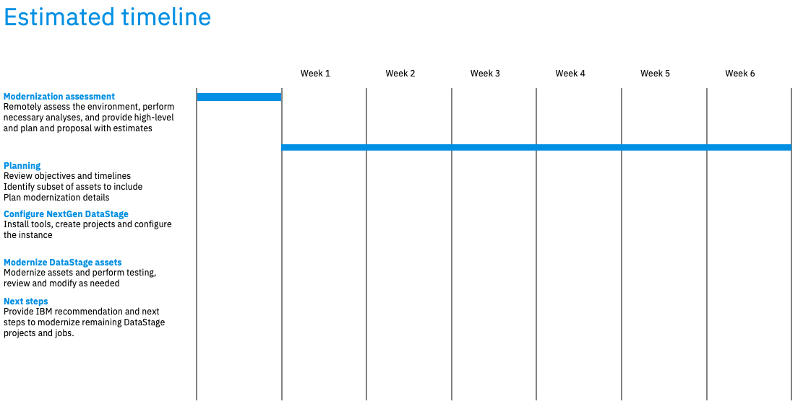

import {Link} from 'gatsby';
import FileLink from '../../../components/FileLink';

## Contacts

| WW contact | Name |
| --- | --- |
| **Customer Success Practice Leaders:** | Campbell Robertson, Dave Mulley |
| **Technology Expert Labs Solution Engineering:** | Akram Abdouch |
| **Technology Expert Labs Product Management:** | Jennifer Wales |

## Scope
DataStage modernization is the process of taking customers from IBM Infosphere DataStage, IBM Infosphere QualityStage or IBM Information Server and moving them to DataStage “NextGen” running on Cloud Pak for Data on OpenShift. To run DataStage NextGen, the customer needs to have licenses to either DataStage Cartridge or Information Server Cartridge. You can learn more about DataStage on our <Link to='/common/data-ai/csm-data-ai-data-stage-data'>playbook page</Link>

### Why should a customer modernize?
DataStage NextGen on Cloud Pak for Data provides customers with the next generation of DataStage and includes the following benefits:
- Redesigned GUI using modern, web-based canvases that do not require re-training of client developers.
- Additional data integrations to help virtualize, replicate, stream, and prepare data before or after the ETL job is completed in DataStage.
- Micro-services-based architecture & containerized, optimized for hybrid cloud workloads
- Dynamic scalability & high resiliency
- Databand (licenses sold separately) can provide data observability to ensure data quality, security, and performance levels of the ETL jobs
Metrics based on research and client experiences:
- 30% throughput execution improvement over legacy DataStage
- 87% savings in development cost when using GUI compared to hand-coding ETL jobs
- 60% increased efficiency (minimal upgrade efforts)

For client-facing material, see the Compelling Reason to Act in the [Engage Client Phase](#engage-client-phase) section.

### How complex is modernization?
Modernization ranges from fully automated to manual. The purpose of the Technology Expert Labs Assessment is to analyze the existing environment and create a customized modernization plan. You can find a graphical view of the modernization and an example report from Technology Expert Labs starting on slide 44 of the <a target='_blank' rel='noreferrer noopener' href="https://ibm.box.com/s/5uxv3r7htt6vus6ljn1uypt3jxrz30zz">IBMs DataStage Modernization PoV Deck</a>

Read DataStage Product Management's views and thoughts on having a Modernization Discussion with your client: [DataStage NextGen Review](https://github.ibm.com/Stephanie-Valarezo1/ds-nextgen-review)

In summary, assets can be modernized from DataStage Standalone to DataStage NextGen on Cloud Pak for Data using one of the three paths (and only one path is manual):
- Automated (ISX Import Service) - Parallel Jobs, Parallel Shared Containers, Parameter Sets, Parallel Routines
- Semi-Automated Migration Tool (MettleCI) - Server Jobs
- Manual Rewrite - Server Routines

IBM has confidence that DataStage NextGen is ready for customers to modernize from IBM Infosphere DataStage, IBM Infosphere QualityStage or IBM Information Server and that a repeatable process exists with our DataStage modernization journey. 
**Review:** <a target='_blank' rel='noreferrer noopener' href="https://ibm.box.com/s/2kb0scdqsweu3t2vers7hcyz01g32b63">
Technology Expert Labs DataStage Modernization Project at Standard Bank of South Africa</a> 
**Listen:** <a target='_blank' rel='noreferrer noopener' href="https://ibm.biz/Bdy5QH">Technology Expert Labs DataStage Modernization Journey at Standard Bank of South Africa Recording</a>

## DataStage Modernization journey
This diagram shows the DataStage Modernization journey at a high level. Each section is broken down in detail with links to assets below.

## Engage Client phase
**Led by:** Customer Success and/or Brand Technical Seller 
**Audience:** Executive/Sponsor

Before entering this phase it is necessary to discuss the topic of DataStage modernization with the account team and Account Technical Leader to ensure that it is part of the overall account plan.

This phase covers the steps necessary to have the first conversation with the customer about DataStage modernization (**Executive level meeting**). We've provided a sample *Compelling Reason to Act* which is generic and applicable to most DataStage customers as well as a deck from Product Management that goes into more depth on the value of modernization from legacy DataStage runtimes to the OpenShift- based *NextGen* version.

The **outcome** of this phase is that a sponsor is interested in a **Modernization Briefing** and workshop where IBM and the customer will work together to scope and plan the modernization project.

<Row>
<Column colMd={12} colLg={12}>

**Process and assets:**

| Task | Role |
| --- | --- |
| Perform account planning to identify target personas and related metrics related to DataStage modernization | CSM |
| Create a Success/Growth Plan in Gainsight to track the progress of this potential project. <a target='_blank' rel='noreferrer noopener' href="https://ibm.box.com/s/u0d2z0ia2z5uhvb81577l36gkvspucud" > Sample Growth Plan</a> | CSM |
| Review the <a target='_blank' rel='noreferrer noopener' href="https://ibm.box.com/s/uewlcphgn5tl1fd7tsi6l0un7n5bcbql">Modernization Conversation one-pager</a> | CSM |
| Enhance one of the provided <a target='_blank' rel='noreferrer noopener' href="https://ibm.box.com/s/k9pmeensue05z7pn6sfhipvq0kutbdiy">compelling reasons to act</a> to reflect specific personas and metrics | CSM |
| Insert a customized Compelling Reason to Act into the <a target='_blank' rel='noreferrer noopener' href="https://ibm.box.com/s/3nkb97281xv3i7mqmg8rqtfj5bt58b04">Executive DataStage Modernization Overview Deck</a> | CSM |
| Listen the Product Management walk through the DataStage POV material: [PM DataStage POV Walkthrough](https://ibm.box.com/s/vie9ubgg0ggm83hx0esna4fxoz7ywn1d) | CSM |
| Present the Executive DataStage modernization overview deck including customized Compelling Reason to Act to **customer executives or sponsors** | CSM |
| Refer to the <a target='_blank' rel='noreferrer noopener' href="https://ibm.biz/BdPpQY">recording</a> of the DataStage modernization approach from the Community of Practice call for reference on how to present the overview deck | CSM |
| Review and understand parity issues (if SaaS is an option) and how that may impact the rollout of the DataStage Modernization Project: [DataStage Parity Assessment for DS to DSaaS](https://github.ibm.com/Stephanie-Valarezo1/ds-nextgen-review)| CSM |
| Review and understand the **DataStage Modernization BVA** process to further enhance the "Compelling Reason to Act"  **Material to be provided Q3/Q4 2023**  | CSM |

</Column>
</Row>

## Modernization briefing phase
**Led by:** Customer Success and/or Technology Expert Labs Solution Architect 
** Audience:** Customer architect, developer, operations team

This phase will typically be an in-person meeting with the following participants:
- IBM CSM, Technology Expert Labs Solution Architect, Account Team, ATL
- Customer architect, developer, operations team

The modernization briefing is used to articulate the capabilities and benefits of DataStage NextGen and to complete the assessment questionnaire required by Technology Expert Labs to be able to complete an assessment. We have provided a set of assets that should be used in the briefing below. They include an agenda, the DataStage Modernization PoV deck and the assessment questionnaire. In addition, we've provided a set of links to Demos and Lab exercises that you may choose to show to the customer in the briefing.

You can engage the Technology Expert Labs Solution Architect for assistance with the questionnaire.

In some situations, you might need to engage Client Engineering to complete a Proof of Experience (PoX) to convince the technical DataStage team of the viability of the modernization to DataStage NextGen. In this case, we have provided detailed instructions in the *Optional Client Engineering PoX Phase* section below.

The outcome of this phase is that the technical DataStage team at the customer understands the capabilities and benefits of DataStage NextGen and the assessment questionnaire has been completed.

**Process and assets:**

<Row>
<Column colMd={12} colLg={12}>

| Task | Role |
| --- | --- |
|Engage the Technology Expert Labs Seller (if you don't know your Technology Expert Labs Seller they <a target='_blank' rel='noreferrer noopener' href="https://clientresourcelocator.wdc1a.cirrus.ibm.com/">can be found here</a>) | CSM |
| Create an ISC record and engage the Technology Expert Labs Solution Architect (if necessary) | Technology Expert Labs Seller |
| Review the <a target='_blank' rel='noreferrer noopener' href="https://ibm.box.com/s/xsjn12c8d5iztye14tmryz7ur70gh551">CSM Modernization Briefing Instruction Deck</a> for an overview of how to plan and execute the briefing | CSM |
| Review the <a target='_blank' rel='noreferrer noopener' href="https://ibm.box.com/s/e6oyg4qb4spxv1xgqpgt2p1xwmgim6y0">DataStage Modernization Licensing considerations</a> | CSM |
| Modify <a target='_blank' rel='noreferrer noopener' href="https://ibm.box.com/s/ieugmcnn3uffarke8php0mnbafuzknhe">Briefing Agenda</a> to insert demonstrations or hand on labs if necessary. | CSM |
| Conduct the briefing using the <a target='_blank' rel='noreferrer noopener' href="https://ibm.box.com/s/5uxv3r7htt6vus6ljn1uypt3jxrz30zz">IBMs DataStage Modernization PoV Deck</a> | CSM |
| Refer to the <a target='_blank' rel='noreferrer noopener' href="https://ibm.biz/BdPpQY">recording</a> of the DataStage modernization approach from the Community of Practice call for reference on how to present the PoV deck | CSM |
| Complete the <a target='_blank' rel='noreferrer noopener' href="https://ibm.ent.box.com/s/rpx9y7z48yzteho273g6gwmto496zxng">DataStage Modernization questionnaire</a>. This includes instructions showing how to export the DataStage assets required for assessment. | CSM/Technology Expert Labs Solution Architect and customer team |

</Column>
</Row>

**Demo and Lab assets:**
- <a target='_blank' rel='noreferrer noopener' href="https://ibm.seismic.com/Link/Content/DCXHq3VJ8mV4G8FCBQ83bQBhcJJ8">Demo: Migrate DataStage Workloads to Cloud Pak with MettleCI</a>
- <a target='_blank' rel='noreferrer noopener' href="https://ibm.seismic.com/Link/Content/DCgHQbm3BhG6HG9Q9QRhfCqBdb7j">Demo: DataStage and Databand</a>
- <a target='_blank' rel='noreferrer noopener' href="https://ibm.seismic.com/Link/Content/DCBBTB49FgpBM8hTcWXpdbhX7fm8">Demo: DataStage Cartridge on CPD</a>
- <a target='_blank' rel='noreferrer noopener' href="https://cp4d-outcomes.techzone.ibm.com/data-fabric/data-integration">Data Integration Lab Exercise</a>

**Review:** <a target='_blank' rel='noreferrer noopener' href="https://ibm.box.com/s/2kb0scdqsweu3t2vers7hcyz01g32b63">Technology Expert Labs DataStage Modernization Project at Standard Bank of South Africa</a>.

## Optional Client Engineering PoX Phase
**Led by:** Client Engineering

The customer might want to see a demonstration of the process of moving flows from their current environment to DataStage NextGen. Client Engineering can engage in a Proof of Experience (PoX) to demonstrate the process and the new platform.

To request a Client Engineering resource to run a DataStage modernization PoX, a resource request is done through <a href='https://ibmsc.lightning.force.com/lightning/page/home' target='_blank' rel='noreferrer noopener'>IBM Sales Cloud (ISC)</a>. See the <a href='https://w3.ibm.com/w3publisher/client-engineering/engage/engagement-instructions' target='_blank' rel='noreferrer noopener'>Client Engineering engagement instructions</a> on how to fill in the request in ISC. 

When filling in the information, have the relevant information ready:

- Engagement Details (”Technology Patter” + pattern + description)
- Pattern: Data Integration (i.e Technology Pattern Data Integration "Description")
- Business Problem: DataStage Modernization
- Scope: PoX
- Use Case
- Success Criteria
- Skills: DataStage Skills needed.

**Assets:**
<a target='_blank' rel='noreferrer noopener' href="https://ibm.box.com/s/qozwqitsk0dh2c9u4dsmnk65x3kg2k8b">Short presentation</a>  describing this process, along with a sample workshop agenda from Client Engineering.

## Assessment and Strategy Phase
**Led by:** Technology Expert Labs Solution Architect/Solution Engineer 

Required inputs by CSM (from Modernization Briefing/Discovery):
- Project objectives and requirements
- Completed DataStage questionnaire including DataStage project export(s) preferably from the Production Environment (instructions provided in the questionnaire).

Assessment is performed by Technology Expert Labs after the Modernization Briefing where the CSM has gathered the required information about the Customer's DataStage environment (questionnaire and export of environment). 

The purpose of the Assessment Phase is to take the questionnaire and export and determine the level of effort to modernize a customer. Technology Expert Labs (Solution Architect/Solution Engineer) will use an in-house automation tool to analyze the customer's DataStage assessment information and provide a findings report card complete with feature parity and deprecated module analysis and one or more service options to align with the customer's requirements.

You can find an example report from Technology Expert Labs starting on slide 45 of the <a target='_blank' rel='noreferrer noopener' href="https://ibm.box.com/s/5uxv3r7htt6vus6ljn1uypt3jxrz30zz">IBMs DataStage Modernization PoV Deck</a>.

## Propose, Negotiate, and Close phase
**Led by:** Technology Expert Labs Seller

**Technology Expert Labs Offerings:** 

- <a target='_blank' rel='noreferrer noopener' href="https://ibm.seismic.com/Link/Content/DC6VXhfBm8WJhGmQ4j6b24DBC2Wj">Build DataStage Modernization</a>

- <a target='_blank' rel='noreferrer noopener' href="https://ibm.seismic.com/Link/Content/DChTBdhh2f8jg8mHCbCTB8FfD683">Expertise Connect</a>

The purpose of the Propose, Negotiate, and Close phase is to close a services deal. The IBM Sales team: Digital/Services Seller, Solution Architect/Solution Engineer presents the customer with a Services proposal for DataStage Modernization based on their budget and requirements.   

IBM Technology Expert Lab Services’ team recommended implementation methodology is built on a premise of phase-based implementations for DataStage modernization, which enable quick “wins” in terms of go-live dates and milestones. This approach allows organizations to better manage the overall roll-out approach, while simultaneously building enthusiasm and confidence in the program. IBM Technology Expert Labs team leverages best practices and a proven methodology to support your modernization journey success with backing from IBM Software Labs. In IBM’s experience, roll-outs can be segmented by a variety of business and technical areas, including product lines, geographies and business units, source and destination systems, and business processes. IBM Technology Expert Lab is highly skilled at working with customers to develop optimal roll-out plans to match individual client requirements based on the current usage of DataStage, complexity of the environment, modernization assessment results, key dependencies between DataStage Projects and critical milestones for the program

Required inputs by CSM: None; however CSM will want to maintain awareness for continued engagement with the client.

## Implement Phase
**Led by:** Technology Expert Labs Solution Engineer

**Technology Expert Labs Offering:** <a target='_blank' rel='noreferrer noopener' href="https://ibm.seismic.com/Link/Content/DC6VXhfBm8WJhGmQ4j6b24DBC2Wj">Build DataStage Modernization</a>

**Technology Expert Labs Offering:** <a target='_blank' rel='noreferrer noopener' href="https://ibm.seismic.com/Link/Content/DChTBdhh2f8jg8mHCbCTB8FfD683">Expertise Connect</a>

During the delivery phase, the Technology Expert Labs Delivery team will perform the services as agreed upon in the Propose Negotiate and Close Phase.

An example overall project plan for a DataStage Modernization is shown below for illustration.

Required inputs by CSM: None; however CSM may want to shadow/maintain awareness for continued engagement with the client.
