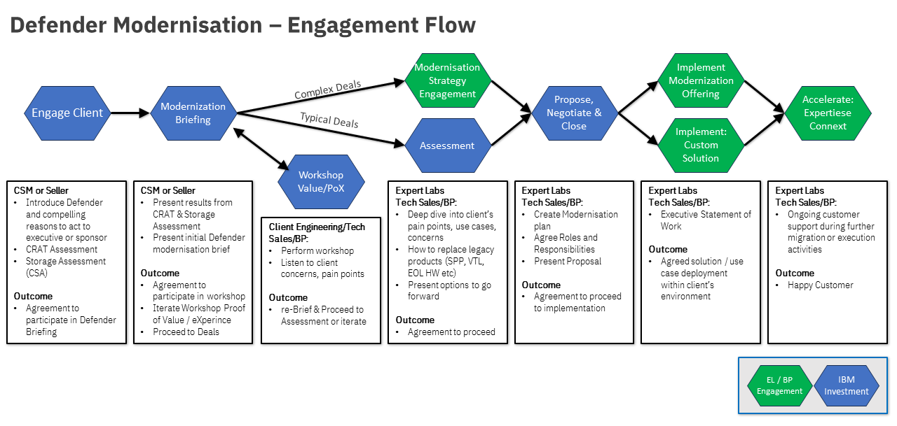

import {Link} from 'gatsby';
import FileLink from '../../../components/FileLink';

## Scope

**Defender** is a flexible suite of products sold as "pay as you go" entitlements which modernise data resilience - assuring a customer that their data is as it was written,
and can be recovered quickly and flexibly no matter if it is in a Hybrid Cloud environment, or a dedicated datacentres.
**Defender modernisation** is about moving customers to a system which allows them to enable requirements they previously hadn't considered, quickly and easily. 
When a customer has Defender entitlements, they can implement new features for primary and secondary storage as they are added to Defender or move their entitlement from
products which no longer fit their needs to different elements within their entitlement.

Any customer who has any of the packages installed should be considered within scope for this modernisation play.

**Product: ** IBM Storage Protect Suite (Protect, Protect Plus, CDM, Snapshot and all TDPs)  
**Capabilities:** Provides recovery, replication, retention and reuse for Physical, VMs, Applications and filesystems in on-prem to hybrid cloud environments.
Automation of creation and use of copy data, vaults, clones and replicas on existing storage infrastructure and hybrid cloud environments.

**Product: ** IBM Storage Virtualize  
**Capabilities:** Create and secure immutable snapshots of data which can't be changed or deleted. Provide unified block storage features from server to cloud. 
Real time ransomware detction through write anomaly detection.

**Product: ** IBM Copy Services Manager  
**Capabilities:** Manages block storage data replication and disaster recovery.

**Product: ** IBM Storage Sentinel  
**Capabilities:** Application specific ransomware detection and incident recovery through anomaly deteection orchestration and copy management.

**Product: ** IBM Storage Protect for Containers  
**Capabilities:** Provide backup services for Fusion, RHOS, K8s.

**Product: ** IBM Storage Archive  
**Capabilities:** Direct, intuitive, graphical access to data stored in tape drives and libraries.

**Product: ** IBM Storage Defender Data Protect / Replica  
**Capabilities:** Protection of VMs and other worklaods, copy and store data in multiple locations to improve data availability.

---

## Contacts:
**Customer Success Practice Leader:** Fraser MacIntosh  
**Technology Expert Labs Solution Engineering:**  
**Technology Expert Labs Product Management:**  
**Defender Product Management Contact:** Juan Carlos Jimenez / Kim Ballard / Si McAleer  
**Worldwide Sales Leads:** Chris Vollmar / Christian Burns  
**WorldWide Tech Sales Leads:** Shelly Howrigan / Ian Shave  

---

## Why should a customer modernize?

If a customer has any concerns that they **can't get their data back in a timely manner**
in the event of a Ransomware attack, accidental or deliberate deletion, failed hardawre, or physical disaster, they should consider Defender.

If a customer is operating on older versions of Protect, Protect for Virtual Environments for the VM data protection, or if they're using Protect Plus,
they should seek to modernise.

If a customer is using a data protection package as a de-facto Archive, they should seek to modernise. Moving from a system where backup and archive are treated as
synonomous to one where Operational Recovery and Archival data are properly separated for robust recovery is a key feature of Defender.

If a customer can't identify their minimum viable business or the safe recovery points that would allow them to recover quickly, they should consider Defender.

- 83% of organizations have experienced more than one data breach
- 60% of organizations had to raise their product or services prices due to a breach, impacting competitiveness
- 17% of Cyber Attacks are Ransomware
- 26% of Clients who paid the ransom still could not recover the data
- 23 days = average recovery time needed after a ransomware attack
- $5M = Est. average annual cost of a Cyber Attack in 2023

With insurers and re-insurers pulling out of the Cyber Insurance market or putting significant limitations on policies and payouts it is more critical than ever that 
a customer uses their primary and secondary storage systems to detect and prevent, rather than relying on insurance for what is increasingly a day-to-day business eventuality.

You can't simply "just pay the ransome" there are no gaurantees data will be returned or recoverable. There are many nation-state attacks where paying the ransom would violate
international financial sanctions. 

---

## Defender Modernization Journey
This diagram shows the Defender Modernization Journey at a high level. Each section is broken down in detail with links to assets below.

---

## Engage Client Phase  
**Led by:** CSM or Seller

Identify executive or Sponsor. Introduce Defender and compelling reasons to act.

Propose CRAT and CSA report.

Cyber Resilience Assessment Tool (CRAT)
https://ibm.seismic.com/Link/Content/DCDG9PJ92CDQg87H8CPFQBh2qVMV

Storage Assessment (CSA)
email:IBM.Client.Storage.Assessment@uk.ibm.com

---

## Modernization Briefing Phase
**Led by:** CSM or Seller
Present results from CRAT & Storage Assesment (CSA) Reports, present initial modernisation brief.

Seek agreement to participate in workshop to demonstrate Proof of Value, Proof of Experience in view to proceeding to

---

## Optional Client Engineering PoX Phase
**Led by:** Client Engineering or Tech Sales/BP

Perform workshop, listen to cliet's concenrs, pain points. Demonstrate you've heard the pain points and include them in workshop,
it may be needed to iterate and re-Brief or proceed to assessment phase.

---

## Assessment and Strategy Phase
**Led by:** Expert Labs / Tech Sales/BP

Deep dive into client's pain points, use cases and concerns. Discuss how to replace ageing out of support hardware and software.
Present options to go forward. Seek agreement to proceed.

---

## Propose, Negotiate and Close Phase
**Led by:** Expert Labs / Tech Sales/BP

Create a modernisation plan, acree roles and responsibilities. Present proposal to customer. Seek agreement to proceed to implementation.

---

## Deliver Phase
**Led by:** Expert Labs / Tech Sales/BP

Ongoing customer support during further migration or execution activities.

Implement phase - https://ibm.seismic.com/Link/Content/DCPVQPMJG7qc78qV6f7pPTCT7CFV

---