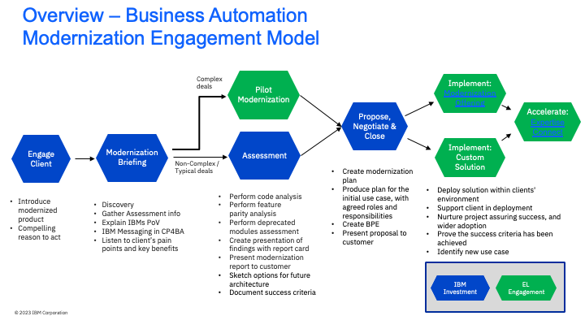

import {Link} from 'gatsby';
import FileLink from '../../../components/FileLink';

## Scope
IBM FileNet Content Manager modernization is the process of taking customers running workloads on traditional point products and moving them to FileNet Content Manager running as part of IBM Cloud Pak for Business Automation on OpenShift. 
Most clients running FileNet in a traditional manner as a point product will have resistance to change to a new form factor. Most enterprises have been running mission-critical workloads for a long time and are quite happy with the way things are running. You will face this challenge not just with FileNet but with any capability in the Business Automation portfolio. Hence the discussions should be moved away from a Middleware vs. Platform discussion to more of a discussion around the current pain points of the customer.

-	ONLY targeting the clients who have done CP4BA license trade-up, AND
-	Currently using CP4BA licenses for FileNet standalone deployments

If the client’s deployments still using one or more following standalone licenses (inside or outside catalog). It will be BA sales and tech sales led trade up conversation. 
- IBM FileNet Content Manager
- IBM Records Manager
- IBM Case Foundation
- IBM Content Foundation
- IBM Image Services
- IBM Content Manager
- IBM Case Manager

You can learn more about FileNet in <a target='_blank' rel='noreferrer noopener' href="https://ibm.seismic.com/Link/Content/DC3JJb28G6b4m8TGqRJ3hP87ccDd">Seismic</a>.

**For the Americas team, please contact one of the sales leaders before Engage Client Phase.** 
**Sales Leaders:** Michael Nishiki, Paul McKnerney 
**Tech Sales Leader:** Jeff Goodhue 

**WW CSM Practice Leader:** Di Lang 

**Why should a customer modernize?**

Deploying products in a container environment can be faster and easier than a standard on-premises installation. Additionally, updating software in a container environment can be simpler and less disruptive. 
If the client has the following requirements for the content services environment, container deployment is a good option:
-	Dynamic scalability to adjust to workload
-	Zero downtime support for patching
-	Ability to not only quickly patch or upgrade but quickly rollback to previous versions
-	Better resource usage and management
-	Better resiliency for your applications

In addition, the client gets more from CP4BA than what they could get in a stand-alone implementation of FileNet,
-	Orchestrate and automate all types of business processes
-	Gain enterprise-grade container security and simplified administration 
-	Automatically classify and enrich document metadata
-	Gain low-code app development tooling for citizen developers
-	Auto-collect, archive and govern sensitive or regulated content
-	Monitor content actions in real-time using dashboards

For client-facing material, see the Compelling Reason to Act in the **Engage Client Phase** section goes into more depth on the advantages of moving to CP4BA.

**How complex is a modernization?**
Modernization ranges from fully automated to manual. In most cases, Technology Expert Labs modernization engagement is needed. TEL will conduct Assessment to analyze the existing environment and create a customized modernization plan. 
In summary, assets can be modernized from FileNet Standalone to Cloud Pak for Business Automation. IBM has confidence that FileNet on Cloud Pak for Business Automation is ready for most customers. However in some situations, there are <a target='_blank' rel='noreferrer noopener' href="https://www.ibm.com/support/pages/node/6620801">known limitations.</a>

## FileNet Modernization Journey

This diagram shows the FileNet Modernization Journey at a high level. Each section is broken down in detail with links to assets below. 

## Engage Client Phase
**Led by: Customer Success and/or Brand Technical Seller**
**audience: Executive/Sponsor**

Before entering this phase it is necessary to have discussed the topic of FileNet Modernization with the account team and Account Technical Leader to ensure that it is part of the overall account plan.

This phase covers the steps necessary to have the first conversation with the customer about FileNet modernization (**Executive level meeting**). We’ve provided a sample Compelling Reason to Act which is generic and applicable to most FileNet customers as well as a deck from Product Management that goes into more depth on the value of modernization.

The **outcome** of this phase is that a sponsor is interested in a **Modernization Briefing** and workshop where IBM and the customer will work together to scope and plan the modernization project.

Process and Assets:
- Account planning should be performed to identify target personas and related metrics related to FileNet modernization 
- CSM should create a Success/Growth Plan in Gainsight to track the progress of this potential project <a target='_blank' rel='noreferrer noopener' href="https://ibm.box.com/s/785pq44ynhgiyrw7kktjeu34lix9ox9h">Sample Growth Plan</a>
- CSM should review the Modernization Conversation one-pager of <a target='_blank' rel='noreferrer noopener' href="https://ibm.box.com/s/3q3mux6u9i7wqzfdktll4er0dmtopfxz">Six reasons to expand your content investments with CP4BA</a>
- CSM should enhance one of the provided <a target='_blank' rel='noreferrer noopener' href="https://ibm.box.com/s/17ob2akpjbu0izqk5pjnxlju0xamdyz4">compelling reasons to act</a> to reflect specific personas and metrics
- CSM will present the Executive <a target='_blank' rel='noreferrer noopener' href="https://ibm.box.com/s/g0va2nvtys0eh9b6njhj4ho6eveddnrw">Business Automation (FileNet) overview deck</a> including customized Compelling Reason to Act to customer executives or sponsors

## Modernization Briefing Phase
**Led by: Customer Success and/or Technology Expert Labs Solution Architect**
**audience: Customer architect, developer, operations team**

This 2-4 hour informal and customized workshop will help clients consider what is needed to provide an industry-leading messaging capability suitable to address their business challenges and pain points. The aim of this workshop is to propose potential high-level plans and roadmaps using interactive whiteboard sessions with IBM consultants and specialists with experience in integration.

This phase will typically be an in-person meeting with the following participants:
-	IBM CSM, Technology Expert Labs Solution Architect, Account Team, ATL 
-	Customer architect, developer, operations team, system designers and managers who are looking for solutions to better satisfy their messaging requirements.

The modernization briefing is used to articulate the capabilities and benefits of FileNet Modernization and to explain our methodology and the questionnaire required by Technology Expert Labs to be able to complete an assessment. We have provided a set of assets that should be used in the briefing below. They include an agenda, the FileNet Modernization PoV deck and the assessment questionnaire. In addition, we’ve provided a set of links to Demos and Lab exercises that you may choose to show to the customer in the briefing.

You may engage the Technology Expert Labs Solution Architect for assistance with the questionnaire.

The outcome of this phase is that the technical team at the customer understands the capabilities and benefits of Modernizing their FileNet workloads and how to complete and return the assessment questionnaire. 

Process and Assets:

- CSM engages their Technology Expert Labs Seller (if you don't know your Technology Expert Labs Seller they <a target='_blank' rel='noreferrer noopener' href="https://clientresourcelocator.wdc1a.cirrus.ibm.com/">can be found here</a>)
- Technology Expert Labs Seller creates an ISC record and engages the Technology Expert Labs Solution Architect (if necessary)
- CSM reviews the <a target='_blank' rel='noreferrer noopener' href="https://ibm.box.com/s/46x930wlf5jdxqh19ecpw4ezkj7zy4go">CSM Modernization Briefing Instruction</a> for an overview of how to plan and execute the briefing
- CSM modifies <a target='_blank' rel='noreferrer noopener' href="https://ibm.box.com/s/qpov0h5a8hljfbbsx22o8guc3d7tg685">Briefing Agenda</a> to insert demonstrations or hand on labs if necessary
- CSM conducts the briefing using the <a target='_blank' rel='noreferrer noopener' href="https://ibm.box.com/s/g0va2nvtys0eh9b6njhj4ho6eveddnrw">FileNet Modernization Overview</a> 

CSM/Technology Expert Labs Solution Architect and customer team complete <a target='_blank' rel='noreferrer noopener' href="https://ibm.box.com/s/14c3uyfa8lbrnpldbkh1qkzowxmg91b3">the questionnaire</a> to prepare the workshop. It has to be,
-	Tailored towards to customer's situation by removing irrelevant product-specific sections
-	Sent to the customer by the IBM Architect (at least a week before the workshop)
-	Completed and returned by the customer before the workshop.

Demo and Lab Assets:

It is preferable to have a live demo and the instructions from the following POTs should help you with building a demo on your own environment.
- <a target='_blank' rel='noreferrer noopener' href="https://ibm-cloud-architecture.github.io/refarch-dba/use-cases/hr-onboard-app/">Lab Exercise: IBM Cloud Pak for Business Automation use case (Techzone)</a>
- <a target='_blank' rel='noreferrer noopener' href="http://ibm.biz/Jam-in-a-Box">Jam-in-a-Box for Business Automation</a>

Additional Asset you can use;
- <a target='_blank' rel='noreferrer noopener' href="https://ibm.box.com/s/1rpp43vvck9kgykfw1nz0wib6zvigwq2">Benefits of CP4BA</a>
- <a target='_blank' rel='noreferrer noopener' href="https://ibm.box.com/s/4dnudtj8tpqjwg57sc2bimazejmel8mm">SPGI FileNet Modernization to containers deck</a>

## Assessment and Strategy Phase
**Led by: Technology Expert Labs Solution Architect/Solution Engineer**

Assessment is performed by Technology Expert Labs after the Modernization Briefing where the CSM has gathered the required information about the Customer’s FileNet Content environment and client has completed the Modernization Questionnaire. 

The purpose of the Assessment Phase is to take the Assessment information and determine the level of effort to modernize a customer. Technology Expert Labs (Solution Architect/Solution Engineer) will use inhouse automation to analyze the customer’s FileNet assessment information, provide findings report card complete with feature parity and deprecated module analysis and one or more services options to align with their requirements:
-	IBM led quick assessment to get insights for existing workloads
-	Identify the best modernization approach that will protect existing investment
-	Actionable plan that will provide immediate value for the business

Required inputs by CSM (from Modernization Briefing/Discovery):
-	Project Objectives and requirements
-	Assist the client in completing the Modernization Questionnaire
-	Any architecture diagrams or other details preferably from Production Environment

## Propose, Negotiate and Close Phase 
**Led by: Technology Expert Labs Seller**

The purpose of the Propose, Negotiate and Close is to close a services deal. The IBM Sales team: Digital/Services Seller, Solution Architect/Solution Engineer will present the customer with a Services proposal for FileNet Modernization based on their budget and requirements.   

Required inputs by CSM: None; however CSM will want to maintain awareness for continued engagement with the client.

## Deliver Phase
**Led by: Technology Expert Labs**

During the delivery phase, the Technology Expert Labs Delivery team will perform the services as agreed upon in the Propose Negotiate and Close Phase.

Required inputs by CSM: None; however CSM may want to shadow/maintain awareness for continued engagement with the client.
