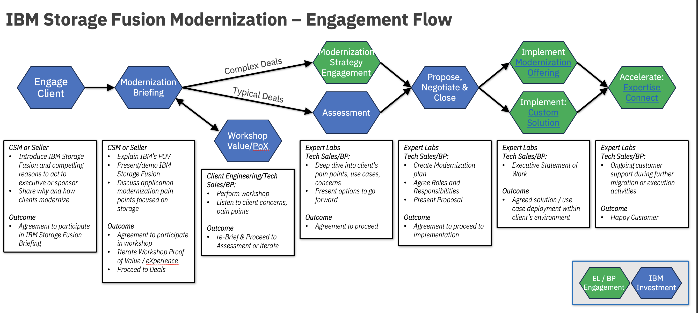

import {Link} from 'gatsby';
import FileLink from '../../../components/FileLink';

## Scope
IBM Storage Fusion brings an agile, secure, resilient and highly performant data service foundation for container-based application workloads.  It eases the "Cloud Native" journey with Red Hat OpenShift by bringing enterprise-grade functionality and qualities of service to any hybrid multi-cloud environment.
It provides a consistent experience across all deployment platforms from HCI (hyper converged infrastructure), bare-metal, virtualized and public Cloud.

## Contacts:
**Customer Success Practice Leader:** Fraser MacIntosh  
**Technology Expert Labs WW Storage Delivery Leader:** Par Hettinga  
**Fusion Product Management Contact:** Matt Kelm 
**Worldwide Sales Leads:** Bob Kampe / Rob Coventry  
**WorldWide Tech Sales Leads:** Josh Blumert / Madhav Poonamgi  

## Why should a customer modernize?
Clients have likely already started thinking about or already in the process of modernizing their application workload to be cloud-native.  Traditional storage infrastructure cannot keep pace with the rapid innovation and there is a need for a container-enabled enterprise storage platform that deploys seamlessly across hybrid infrastructure, provides a consistent user experience and delivers a performant and reliable platform with enterprise readiness.

IBM Storage Fusion is a software defined infrastructure for OpenShift.  It provides:
- Elastic infrastructure
  - Scales up and down with workload
  - Runs on any hardware on/off cloud (bare-metal)
  - Abstraction of infrastructure as code for DevOps 

- Cloud Native Storage Services
    - File, Block and Object
    - Data Mobility / Isolation
    - Better performance at Scale

- Automated Backup and Restore
    - Consumed as policies with application consistency
    - Open Source compliant

- High Availability and Disaster Recovery

- Unstructured Data Analytics

It supports any OpenShift application and a Fusion Starter is included with all Cloud Paks.

---

## Fusion Modernization Journey
This diagram shows the Fusion Modernization Journey at a high level. Each section is broken down in detail with links to assets below.

---

## Engage Client Phase
**Led by:** CSM or Seller

Introduce IBM Storage Fusion and compelling reasons to act to executive or sponsor.  Share why and how clients modernize.

The outcome should be an agreement to participate in an IBM Storage Fusion modernization briefing.

---

## Modernization Briefing Phase
**Led by:** CSM or Seller
Explain IBM’s POV, present/demo IBM Storage Fusion, and discuss application modernization pain points focused on storage.

The outcome is the customer's understanding of IBM Storage Fusion's capabilities and benefits, and how it will help them in their application modernization jorney.
They should agree to participate in a workshop, Proof of Value / eXperience.

---

## Optional Client Engineering PoX Phase
**Led by:** Client Engineering or Tech Sales/BP

Perform workshop, listen to client's concerns, pain points. Demonstrate you've heard the pain points and include them in workshop,
it may be needed to iterate and re-Brief or proceed to assessment phase.

---

## Assessment and Strategy Phase
**Led by:** Expert Labs / Tech Sales/BP

Deep dive into client's pain points, use cases and concerns. Discuss how to replace ageing out of support hardware and software.
Present options to go forward. Seek agreement to proceed.

---

## Propose, Negotiate and Close Phase
**Led by:** Expert Labs / Tech Sales/BP

Create a modernization plan, agree roles and responsibilities. Present proposal to customer. Seek agreement to proceed to implementation.

---

## Deliver Phase
**Led by:** Expert Labs / Tech Sales/BP

Ongoing customer support during further migration or execution activities.

Technology Expert Labs Offering: <a href="https://ibm.seismic.com/Link/Content/DCPVQPMJG7qc78qV6f7pPTCT7CFV#/?anchorId=249e179b-cc33-4646-9f23-e641155627f6" target='_blank' rel='noreferrer noopener'>Build IBM Storage Fusion Hyperconverged Infrastructure (HCI)</a>
Technology Expert Labs Custom SOW: <a href="https://ibm.seismic.com/Link/Content/DCPVQPMJG7qc78qV6f7pPTCT7CFV#/?anchorId=0fa51ddd-6788-4d39-80db-c87c9f673790" target='_blank' rel='noreferrer noopener'>Custom SOW</a>
Technology Expert Labs Expertise Connect: <a href="https://ibm.seismic.com/Link/Content/DCPVQPMJG7qc78qV6f7pPTCT7CFV#/?anchorId=b319339a-a8dc-4fcd-8ec1-5d0257125bad" target='_blank' rel='noreferrer noopener'>Expertise Connect / Expert Care</a>

---