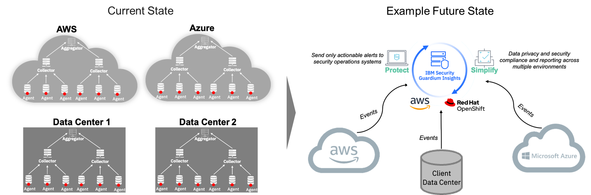
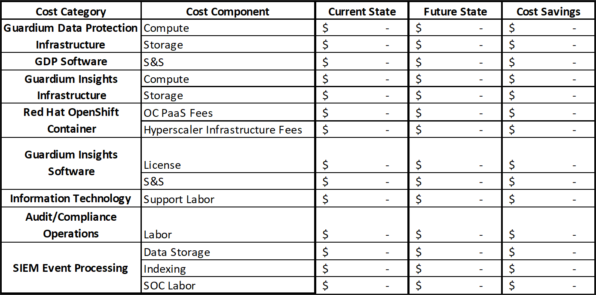
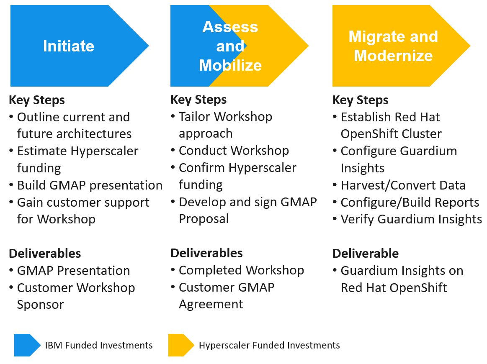
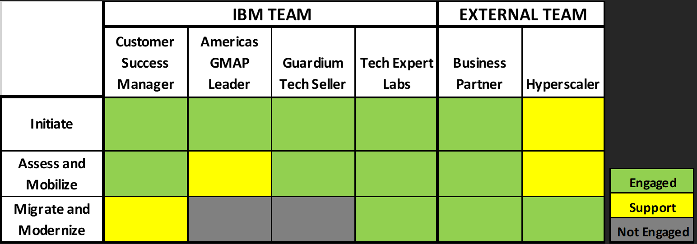
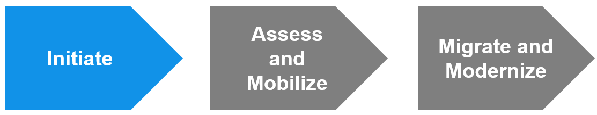
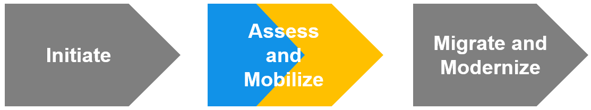
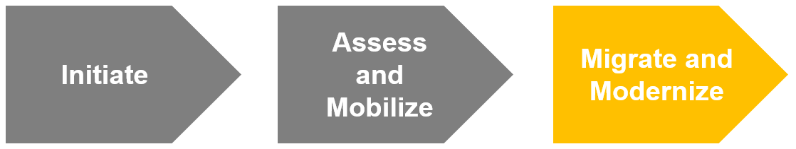

import {Link} from 'gatsby';

## Contacts

| WW contact | Name |
| --- | --- |
| **Customer Success Practice Leaders:** | Greg Sabatini, Jonathan Pechta |
| **WW ELA LifeCycle Management Principal:** | David Kinsey |
| **GMAP Team Leader:** | Todd Stulgis |
| **Guardium Data Protection Tech Sales:** | Sally Fabian |
| **Technology Expert Labs:** | Boaz Barkai |
| **Product Marketing (AWS):** | Meghan Grohman |
| **Azure Product Marketing (Azure):** | Adriana German |

## Scope

The Guardium Migration Acceleration Program (GMAP) play is for clients with Guardium Insights entitlements to adopt the OpenShift platform (modernize) within 45 days with minimal customer involvement and access to funding to minimize migration costs.

## Use cases

The following use cases are covered by this play. A customer:

* Has Guardium Insights entitlement but has no OpenShift expertise and needs a managed OpenShift platform.
* Prefers working with a Hyperscaler (e.g., AWS or Azure) and wants to expand that relationship by deploying Guardium Insights on a Hyperscaler’s cloud.
* Needs to comply with the corporate strategy to move a workload to a Hyperscaler with minimal effort, cost, and operational impact.
* Is under pressure to reduce the total cost of ownership for Guardium Data Protection.

## The Guardium Migration Acceleration Program (GMAP) – overview, objective, and scope
GMAP is a solution to fast-track data security and compliance modernization for current Guardium Data Protection customers with ELAs and Guardium Insights available for deployment from their catalogs. GMAP uses available Hyperscaler funding and credits to minimize and potentially fully absorb IBM Technology Expert Labs fees, Business Partner consulting service fees, or hyperscaler infrastructure fees a customer might incur during a migration. IBM’s templated approach enables customers to modernize their legacy Guardium Data Protection environment typically within 45 days, with minimal customer involvement. 

The primary objective of GMAP is to establish the foundation necessary for a legacy Guardium Data Protection customer to benefit from the software advances IBM has released for enterprise data security and compliance operations. The GMAP foundation begins by simplifying the customer’s architecture (see the figure below) to eliminate Aggregators and consolidate Collectors. The remaining Collectors stream events directly to Guardium Insights running on a Hyperscaler using Red Hat OpenShift. Guardium Insights provides centralized reporting for the entire hybrid-cloud environment, as well as consolidation of comprehensive management capabilities, such as Access Management, patching, and a metadata repository.

<Caption>Example consolidation and simplification using GMAP for entitled Guardium Insights customers</Caption>
 

### Customer benefits of GMAP
GMAP provides customers with strategic, operational, and financial benefits.

*Supports enterprise “Cloud-First” initiatives*  
GMAP enables Customer Data Protection/Compliance teams to better support their enterprise clients as they migrate existing applications to the Cloud and build new Cloud-native applications. GMAP supports Data Protection/Compliance toolset migration to the Cloud, enabling Security team compliance with enterprise “Cloud-First” mandates.

*Simplifies and modernizes data security and compliance architecture*
GMAP eliminates Guardium Data Protection Aggregators, consolidates Collectors, and enables direct Collector streaming to a single instance of Guardium Insights running on a Hyperscalers cloud and Red Hat OpenShift. Soon, agentless Guardium Data Protection capabilities will minimize the need for Collectors as well.

*Streamlines IT and business processes*  
GMAP provides auditors and compliance officers with a consolidated source for compliance information, helping streamline audit, compliance, and reporting processes. GMAP enables an enterprise to begin using contextual analytics that significantly reduces event volume sent to the SIEM. As a result, more actionable event data is delivered to Security Operations Center personnel helping decrease their workload. Finally, the simplified architecture GMAP delivers reduces the IT workload required to operate and maintain security appliances and related software.

*Reduces Guardium Data protection total cost of ownership*  
GMAP significantly improves key elements of an enterprise’s Data Security and Compliance cost structure, including IT infrastructure, software, IT labor, and business operations labor. GMAP provides the CSM with the tools, support, and insight necessary to help customers quantify, understand, and communicate GMAP’s business value.

<Caption>GMAP business case</Caption>

*Eliminates customer deployment barriers*  
GMAP uses the combined resources of IBM, TEL, IBM Business Partners and Hyperscaler to remove barriers (Figure 3) that may be preventing customers from realizing the full value of Guardium Data Protection.

<Caption>Resolution of customer deployment barriers by GMAP team</Caption>

 

### Benefits of GMAP for the CSM
GMAP helps the CSM achieve their business objectives by driving customer value. By using GMAP, CSMs:

* Increase the customer’s ELA return on investment by enabling the use of Guardium Insights from their current catalog.
* Improve the breadth and depth of their customer relationships by collaborating with the Hyperscalers and IBM Business Partners and connecting to their customer networks.
* Position additional customer value to drive future growth opportunities.
* Help customers identify Red Hat OpenShift options and realize the value of OpenShift as an integral component of Guardium Insights operating on a Hyperscaler’s cloud.

<Caption>Options for Red Hat Openshift</Caption>

*Red Hat OpenShift on AWS (“ROSA”)*  
A turnkey OpenShift Container Platform as a Service (PaaS), providing a fully managed implementation of OpenShift clusters on demand, that is deployed and operated on AWS and jointly managed and supported by both Red Hat and AWS.

*Red Hat OpenShift dedicated (AWS)*  
A turnkey container platform as a service (PaaS), providing fully managed OpenShift clusters on demand, monitored and operated jointly by AWS and Red Hat that is installed and managed in the customer’s AWS account. There are no virtual machines (VMs) to operate, and no patching is required. The "Highly Available" PaaS includes a 99.95% availability SLA and 24x7 Premium support.

*Azure Red Hat OpenShift (Microsoft)*  
A turnkey OpenShift Container Platform as a Service (PaaS), providing a fully managed implementation of OpenShift clusters on demand, that is deployed and operated on Azure and jointly managed and supported by both Red Hat and Microsoft.
  

### GMAP Engagement Model and team
The following diagrams summarize the GMAP Engagement Model and Engagement Team (see figures below). Details for each Phase of the Engagement Model and Team are provided below, including process steps, roles, outcomes, and links to assets.

<Caption>Overview of GMAP milestones and deliverables</Caption>

The GMAP Engagement Team can include both IBM and external team members, based on the needs of the customer. The CSM is the engagement leader and customer interface during the Initiate and Assess/Mobilize Phases. If a CSM is not assigned to an account, the Security Software Sales Specialist will take on the CSM’s role. Customer interaction for the technical team begins to increase during the Assess/Mobilize Phase, with full technical leadership during the Phase Migrate/Modernize Phase.

<Caption>GMAP engagement team</Caption>

CSMs receive dedicated support during the first two Phases of the engagement from the Americas GMAP Leader, who helps organize the Engagement team, tailor the GMAP Proposal, and address details related to Hyperscaler funding and Hyperscaler Account Team involvement. Finally, a CSM fine-tunes the technical team’s composition based on their knowledge of the customer, as well as input from the customer, IBM Account team, and GMAP Leader. Either Technology Expert Labs, a Business Partner such as Converge, or a combination of the two will provide Guardium expertise for both the planning and execution of GMAP. 
  

## GMAP Phases

### Phase 1: Initiate Phase

<Caption>GMAP Initiate Phase and Customer Success</Caption>

**Led by**  
Customer Success

**Overview**   
Before beginning this Phase, it is necessary to meet with the IBM Account Team and Account Technical Leader to confirm the alignment of GMAP with the client’s strategy and IBM’s overall account plan. 

The initiate phase prepares the CSM to discuss and position GMAP with the customer.  The CSM begins by reviewing the generic GMAP presentation that is tailored to the customer’s specific situation and requirements.  A presentation from Product Management is also available addressing details on the overall value of Guardium Insights.

The outcome of this phase is the creation of a tailored GMAP presentation and confirmation of a customer sponsor supporting a GMAP Workshop. The Workshop allows IBM and the customer to work together to confirm the scope and plan for the modernization project.

<Row>
<Column colMd={12} colLg={12}>

**Process and assets:**

| Task | Role |
| --- | --- |
| Review generic GMAP customer presentation to be tailored to the customer’s situation | CSM |
| Engage the GMAP Team Lead for support on customizing the GMAP customer presentation | CSM |
| Outline “outside-in” current state and future state architectures based on information IBM has on the current Guardium Data Protection implementation | Guardium Technical Seller |
| Estimate the Hyperscaler’s Migration funding based on the target Guardium Insights future state and Hyperscaler “Annual Recurring Revenue” | GMAP Team Lead |
| Confidentially meet with Hyperscaler Account Manager to gain additional insight on the customer’s cloud modernization strategy and customer relationships | CSM and GMAP Team Lead |
| Build the preliminary customer business case, addressing both the Migration and Ongoing Operation of Guardium Insights | GMAP Team Lead |
| Tailor the GMAP presentation based on customer situation | CSM and GMAP Team Lead |
| Meet with high-potential customer sponsor(s) to review the tailored GMAP presentation and gain GMAP Workshop support | CSM |

**Assets** 
* Generic GMAP Customer Presentation 
* Guardium Insights Overview Deck
* Business Case Template

</Column>
</Row>

 

### Phase 2: Assess and Mobilize Phase

<Caption>Assessment & Mobilize Phase for Customer Success, Tech Sellers, & Architects</Caption>

**Led by**  
Customer Success along with Technical Sellers and Architects

**Overview**  
The assessment and mobilization phase’s primary focus is a half-day to full-day customer-tailored Workshop that refines IBM’s initial outside-in analysis and builds the customer’s understanding of the value of modernizing their Guardium Data Protection environment.

The Workshop is typically an in-person meeting and includes the following participants:
* IBM: CSM, Technology Expert Labs Solution Architect, Guardium Technical Seller, GMAP Team Lead
* Business Partner (Optional): Guardium Technical Seller and Architect
* Hyperscaler (Optional): Account Team Architect
* Customer: Data Security and Compliance Director, Data Security and Compliance Support Team Member(s), Data Security Architect

The outcome of this phase is to collect sufficient information to finalize the GMAP proposal and gain customer GMAP support.

**Process and assets:**

| Task | Role |
| --- | --- |
| Engage Guardium Technical Seller, Technology Expert Labs Seller, or Business Partner Guardium Technical Seller | CSM and GMAP Team Leader |
| Tailor workshop approach and agenda | Technical Sellers |
| Conduct the Workshop, addressing the future state architecture, data migration requirements, high-level Guardium Insights configuration requirements, and the business case for change | Technical Sellers |
| Finalize GMAP scope and approach | CSM and Technical Sellers |
| Apply for and gain confirmation on Hyperscaler Migration funding and Hyperscaler credits | GMAP Team Leader and Technical Sellers |
| Finalize and deliver GMAP proposal and gain customer GMAP proposal approval | CSM and Technical Sellers | 

**Assets** 
* Workshop agenda and approach
* GMAP Proposal Template

 

### Phase 3: Migrate and modernize

<Caption>Figure 9: GMAP Migrate and Modernize for Expert Labs or IBM Business Partners</Caption>

**Led by**  
Technology Expert Labs or IBM Business Partner

**CSM Support**  
Maintain awareness of the Phase’s successful completion for continued client relationship building.

This Phase modernizes the customer Guardium Data protection environment and includes the following participants:
* IBM: Technology Expert Labs, Guardium Technical Team
* Business Partner (Optional): Guardium Deployment Services Team
* Hyperscaler (Optional): Account Team Architect and Technical Team
* Customer: Data Security and Compliance Director, Data Security and Compliance Support Team Member(s), Data Security Architect

The outcome of this Phase is the removal of the customer’s Aggregators, reduction of Collectors, and implementation of Guardium Insights on a Hyperscaler’s Cloud with Red Hat OpenShift, and connection of Collectors into Guardium Insights, as well as updated reports and business operations processes.

**Process and assets:**

| Task | Role |
| --- | --- |
| Establish OpenShift Cluster | Technical team |
| Standup Guardium Insights in the OpenShift Cluster | Technical team |
| Design Future State Audit and Compliance Process and Reporting | Technical team |
| Configure Guardium Insights  | Technical team |
| Harvest and Convert Data | Technical team |
| Configure and Build Reports | Technical team |
| Point Collectors at Guardium Insights | Technical team |
| Verify Traffic in Guardium Insights | Technical team |

**Assets**   

Technical Team Guardium Insights Implementation Approach and Tools

