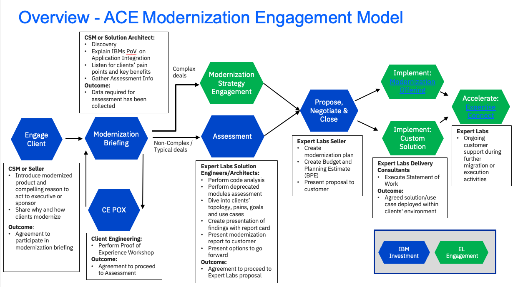

import {Link} from 'gatsby';
import FileLink from '../../../components/FileLink';

## Scope
IIB/ACE modernization is the process of taking an existing integration estate and modernizing the infrastructure, development
practices, and/or deployment topologies, to transition to an agile integration architecture. This includes a
range of activities, such as moving from IIB v10 (or earlier) to ACE v12, improving the velocity of new feature delivery through
the use of agile methods together with continuous integration and continuous delivery pipelines (CI/CD), increasing operational
agility through the use of containers, and increased deployment flexibility through the adoption of hybrid cloud architectures.

## Contacts
**Customer Success Practice Leader:** Venkata V Gadepalli (Vishy) 
**Technology Expert Labs Contact:** Richard Trickey 
**Technology Expert Labs Solution Engineering:** Mark Barnard 
**Technology Expert Labs Product Management:** Shruthi Savla 
**CP4I Product Management Contact:** Kim Clark 

## Why should a customer modernize?
The Application Integration(ACE V12) capability of Cloud Pak for Integration provides customers with the following benefits:
- Adoption of hybrid and multi-cloud topologies
- Embracing container technology
- Improved operational efficiency and productivity
- Micro-services-based architecture & containerized, optimized for hybrid cloud workloads
- Dynamic scalability & high resiliency
- Unified platform experience
- Application Lifecycle Services based on Operators: Installation services, packaging, servicing and updates
- Common diagnostic services: Logging, monitoring, and metering
- Multiple award-winning low code, no code tooling
- Leverage AI/ML and NLI-based accelerators to integrate faster and reduce skills barrier
- Adopt test-driven development practices for your integrations and accelerate your shift left strategy
- Single development user experience to define, create, deploy, version, test, debug and socialize APIs
- Discover, consume and orchestrate stream of events and related schema directly into your integrations
- Build, store and share APIs, integrations and assets for re-use across the organization
- Fully integrated with Tekton-based OpenShift pipelines
- Cross-component monitoring and tracing with IBM Instana
- Included entitlement to RPA and process mining technologies to extend capabilities beyond traditional integration
- Mix and match integration workload deployment to meet your current and future requirements on demand

To see an example of what a modernization project looks like, look at the following examples:
- Customer Success Story:<a target='_blank' rel='noreferrer noopener' href="https://ibm.biz/bank-of-england-success ">Bank of England</a>
- Customer Use Case: <a target='_blank' rel='noreferrer noopener' href="https://ibm.box.com/s/z06g7j4ywb240ymrh5m2fjjw8b2ckw6z">IIB to ACE Modernization at Hapag Lloyd</a> Expert Labs engagement experience sharing

## How complex is a modernization?

**Customer journeys differ depending on the starting point.**
Both the starting point and the destination may vary, as may the level of technical detail needed in any modernization
workshop. In general, the trajectory should start from modernizing software and go through developer experience to 
containers and CP4I. Different customer teams may have different priorities, and involving many different groups will
help build support for a modernization journey: simply focusing on the operations staff will not enable better 
development agility, for example.

#### Journey 1: IIB customers using v10

Focus areas: **modern software version, modern developer experience**

For IIB customers, one of the key drivers is moving to a current release: extended support is still available, but moving 
off is required if the organization is going to continue to use IIB/ACE. For these customers, it is usually best 
to move to ACE v12 integration nodes as a transitional phase instead of trying to move directly to containers, but they
could still take advantage of CI/CD pipeline and test improvements in ACE v12 to gain benefits from modernization quickly.

#### Journey 2a: Existing ACE customers using integration nodes

Focus areas: **modern developer experience, modern deployment topologies**

For ACE customers (v11 or v12) using integration nodes, the next moves would be to containers (ideally CP4i but not always)
and modern development practices (testing and CI/CD). These could be done in either order (or in parallel), with the key
drivers being feature delivery velocity and deployment/operational agility.

#### Journey 2b: Existing ACE customers using integration nodes who have no plans to move to containers

Focus areas: **modern developer experience**

For ACE customers (v11 or v12) using integration nodes with no plans to move to containers, the best route is to 
modernize development practices (testing and CI/CD) to increase feature delivery velocity. 

#### Journey 3: Existing CP4i customers with ACE v11

Focus areas: **modern software version, modern developer experience**

For existing CP4i customers (using containers) who started with ACE v11, modernizing development practices (which
requires moving to ACE v12) could provide significant value: unit testing, shifting testing left, implementing CI/CD to
automate builds, etc are all helpful in decreasing delivery time while increasing quality. Feature delivery velocity 
is a key driver in this case, with the goal being to lower the total cost of using ACE for solutions in an 
organization (helping increase ACE footprint).

## Other points to note in ACE modernization

- ACE is one part of the larger <a target='_blank' rel='noreferrer noopener' href="https://www.ibm.com/cloud/architecture/architectures/evolution-to-agile-integration/">agile integration architecture (AIA)</a>, and for some customers the larger picture may be the best starting point. Modernizing ACE development practices (testing and CI/CD) is ACE-specific and would apply regardless of AIA implementation.
- ACE v12 provides a lot of new capabilities as well as enabling modern DevOps and containerization. Even if customers do
  nothing more than move to ACE v12 from IIB v10, they will still gain in areas ranging from better toolkit UI experience
  to cloud connectors and faster deployment times; this should not be viewed as simply an update with a later EOS date.
- IIB/ACE is not the same as MQ, and the modernization approach is likely to be different. ACE is best seen as an application
  platform that can fit into the standard transient container world (with the usual scaling and management characteristics),
  relying on MQ, databases, etc to handle state storage and not storing state itself. The development and deployment pipelines
  are also very different, as IIB/ACE estates often have large amounts of code (ESQL, Java, etc) that need to be validated. 
  The products meet in CP4I with the operators enabling product usage and allowing <a target='_blank' rel='noreferrer noopener' href="https://www.redhat.com/en/topics/devops/what-is-gitops">GitOps</a> and other management techniques for
  both products, but the pipelines before that are usually different (as is the developer experience). This has been summed 
  up as "BAR files are not the same as MQSC files" to illustrate the point.
- App Connect Designer can be part of a modernization effort but does not share the ACE v12 runtime: new Designer flows would
  need to be created. This would be a rewrite rather than a migration from the perspective of an IIB v10 customer, and as 
  such might not be the best starting point for such customers. Many of the connectors from the Designer product are now 
  available in ACE v12, but much of the "AI mapping" capability is still restricted to Designer.
- Unit testing is not just for developer laptops. One of the key benefits of building unit tests in ACE v12 is that they can
  be automated in a pipeline to ensure the code does not regress. This is a change from existing IIB v10 thinking, where the
  "unit test" concept often meant deploying flows and then manually running some tests with Postman.
- Demonstrating CP4i by exporting a BAR from the toolkit and then uploading it to the dashboard is fine, but not sufficient
  for customers who are looking at CI/CD: the dashboard has no API for programmatic upload of BAR files, and a CI/CD 
  pipeline should not involve manual steps. There are pipeline demos that show how to build container images, and that is
  often the best place to start the second stage of explaining CP4i.

## IIB/ACE Modernization Journey
This diagram shows the ACE Modernization Journey at a high level. Each section is broken down in detail with links to assets below. 

## Engage Client Phase
**Led by: Customer Success and/or Brand Technical Seller**
Before entering this phase it is necessary to have discussed the topic of IIB/ACE Modernization with the account team and Account Technical Leader to ensure that it is part of the overall account plan. 

This phase covers the steps necessary to have the first conversation with the customer about ACE modernization. We've provided a deck, which is generic and applicable to most ACE customers as well as a deck from Product Management that goes in to more depth on the value of modernization from legacy IIB/ACE to the OpenShift based version.

The outcome of this phase is that a sponsor is interested in a **Modernization Briefing** and workshop where IBM and the customer will work together to scope and plan the modernization project. 

Process:
- Account planning should be performed to identify target personas and related metrics related to IIB/ACE modernization 
- CSM should create a Success/Growth Plan in Gainsight to track the progress of this potential project
- CSM should review the <a target='_blank' rel='noreferrer noopener' href="https://ibm.box.com/s/g5ahj3ey2x8s9nt0xywyqut71u57n3mu">Modernization Conversation Deck.</a> You can use this deck to introduce the modernization workshop to the client executives or sponsors.
- CSM should use the <a target='_blank' rel='noreferrer noopener' href="https://ibm.seismic.com/Link/Content/DC3M7FPRqJ3hf8QRTH9cPHQhhd28">High Level AppConnect overview deck</a> if you have more time with the client executive. 
- A <a target='_blank' rel='noreferrer noopener' href="https://ibm.seismic.com/Link/Content/DCXH6qJcW6V4hGQWq8MG6dbcfPhP">recording</a> of how CSMs can present this deck to customers has been provided by product management.

Assets:
- <a target='_blank' rel='noreferrer noopener' href="https://ibm.seismic.com/Link/Content/DC3M7FPRqJ3hf8QRTH9cPHQhhd28">High Level AppConnect overview deck</a>
- <a target='_blank' rel='noreferrer noopener' href="https://ibm.seismic.com/Link/Content/DCXH6qJcW6V4hGQWq8MG6dbcfPhP"> Recording of how CSMs would present the High level AppConnect overview deck during the Engage Client Phase</a>
- <a target='_blank' rel='noreferrer noopener' href="https://ibm.box.com/s/spx7kh2hg9ew1kn8se4o76z14gw3ibub">Cloud Pak for Integration Intro Deck</a>

## Modernization Briefing Phase
**Led by: Customer Success and/or Technology Expert Labs Solution Architect**
This one-day informal and customized workshop will help clients consider what is needed to provide an industry-leading messaging capability suitable to address their business challenges and pain points. The aim of this workshop is to propose potential high level plans and roadmaps using interactive whiteboard sessions with IBM consultants and specialists with experience in integration.

This phase will typically be an in-person meeting with the following participants:
- IBM CSM, Technology Expert Labs Solution Architect, Account Team, ATL 
- Customer architects, developers, operations teams, system designers and managers who are looking for solutions to
better satisfy their messaging requirements.

The modernization briefing is used to articulate the capabilities and benefits of IIB/ACE Modernization and to complete the questionnaire required by Technology Expert Labs to be able to complete an assessment. We have provided a set of assets that should be used in the briefing below. They include an agenda, the ACE Modernization PoV deck and the assessment questionnaire. In addition, we’ve provided a set of links to Demos and Lab exercises that you may choose to show to the customer in the briefing.

You may engage the Technology Expert Labs Solution Architect for assistance with the questionnaire.

In some situations, you might need to engage Client Engineering to complete a Proof of Experience to convince the technical team at the customer of the viability of the modernization to MQ on OCP. In this case, we have provided detailed instructions in the Optional Client Engineering PoX Phase section below.

The outcome of this phase is that the technical team at the customer understands the capabilities and benefits of Modernizing their IIB/ACE workloads and the assessment questionnaire has been completed. 

Process:

- CSM engages their Technology Expert Labs Seller (if you don't know your Technology Expert Labs Seller they <a target='_blank' rel='noreferrer noopener' href="https://clientresourcelocator.wdc1a.cirrus.ibm.com/">can be found here</a>)
- Technology Expert Labs Seller creates an ISC record and engages the Technology Expert Labs Solution Architect (if necessary)
- CSM modifies <a target='_blank' rel='noreferrer noopener' href="https://ibm.box.com/s/wxk5lxeoarzklfyizr83b5xe4uhv54el">Briefing Agenda</a> to insert demonstrations or hands-on labs if necessary.
- CSM conducts the briefing using the <a target='_blank' rel='noreferrer noopener' href="https://ibm.box.com/s/tz5np7ghulytjps0zjnxnjzssqhfb12v">ACE Modernization PoV Deck</a>
- A <a target='_blank' rel='noreferrer noopener' href="https://ibm.box.com/s/4ctlml7xyrf6h2qb0jpsng23wxi3mo7t">recording</a> of how CSMs can present this deck to customers has been provided by Trevor Dolby.
- CSM/Technology Expert Labs Solution Architect and customer team complete the <a target='_blank' rel='noreferrer noopener' href="https://ibm.box.com/s/2rncy7rudiamnfd71shnx4iu0s2xdtr7">ACE Modernization questionnaire</a> 

Assets:
- <a target='_blank' rel='noreferrer noopener' href="https://ibm.box.com/s/wxk5lxeoarzklfyizr83b5xe4uhv54el">Sample Briefing Agenda </a>
- <a target='_blank' rel='noreferrer noopener' href="https://ibm.box.com/s/tz5np7ghulytjps0zjnxnjzssqhfb12v">ACE Modernization POV Deck</a> 
- <a target='_blank' rel='noreferrer noopener' href="https://ibm.box.com/s/4ctlml7xyrf6h2qb0jpsng23wxi3mo7t"> Recording of how CSMs would present the ACE Modernization POV during the Modernization Briefing Phase</a>
- <a target='_blank' rel='noreferrer noopener' href="https://ibm.ent.box.com/file/1069039421107?s=zi7894igroc6vzchl03x200bwfo7jlgt">ACE Container Deployment Patterns - Use these slides if you have a very technical audience who might want to get into details</a>
- <a target='_blank' rel='noreferrer noopener' href="https://ibm.ent.box.com/file/1068987788375?s=flrchdw2isrbmsux1sfl5bhialwh5bx5"> ACE Container Deployment Patterns Recording</a>
- <a target='_blank' rel='noreferrer noopener' href="https://ibm.box.com/s/2rncy7rudiamnfd71shnx4iu0s2xdtr7">ACE Modernization Questionnaire</a>

Demo and Lab Assets:   
It is preferable to have a live demo and the instructions from the following POTs should help you with building a demo on your own environment.
- <a target='_blank' rel='noreferrer noopener' href="https://pages.github.ibm.com/americas-integration/cp4i-pot-v3/Integration/">Lab Exercise: ACE POTs page</a>
- Tutorial: <a target='_blank' rel='noreferrer noopener' href="https://www.ibm.com/docs/en/app-connect/containers_cd?topic=dtiir-scenario-1-deploying-toolkit-integration-from-red-hat-openshift-cli">Deploying an IBM App Connect Enterprise Toolkit integration on Red Hat OpenShift by using the command-line interface (CLI)</a>
- Tutorial: <a target='_blank' rel='noreferrer noopener' href="https://www.ibm.com/docs/en/app-connect/containers_cd?topic=dtiir-scenario-2-deploying-toolkit-integration-from-app-connect-dashboard">Deploying an IBM App Connect Enterprise Toolkit integration on Red Hat OpenShift by using the App Connect Dashboard</a>
- Tutorial: <a target='_blank' rel='noreferrer noopener' href="https://production-gitops.dev/guides/cp4i/ace/overview/overview/">ACE Deployment using Gitops</a>
- Demos:<a target='_blank' rel='noreferrer noopener' href="https://www.youtube.com/watch?v=6sj2FR31PQM&list=PL_4RxtD-BL5tKxx9GiR2BH146ZUC21cOp">YouTube playlist of ACE Demos</a>
- Demos:<a target='_blank' rel='noreferrer noopener' hreaf="https://techzone.ibm.com/collection/platinum-demos-cloud-pak-for-integration/resources#">Platinum Demos on TechZone</a> which highlight **Application Integration**.

**Additional Assets you can use:**
Depending on the knowledge level of the attendees, you might be able to incorporate one or more of the following assets into your briefing or use it for your own personal learning.
- <a target='_blank' rel='noreferrer noopener' href="https://community.ibm.com/community/user/integration/blogs/kim-clark1/2021/11/23/iib-ace-series ">Community blog series: Moving from IIB to ACE in containers(Very useful to bookmark)</a>
- <a target='_blank' rel='noreferrer noopener' href="https://www.youtube.com/watch?v=f4PJj4-UxI4">Benefits of containerization for application integration webinar</a>
- <a target='_blank' rel='noreferrer noopener' href="https://ibm.box.com/s/dlhijhooirl5gzg5si2erxh1n1l5jm97">Benefits of containerization for application integration presentation</a>
- <a target='_blank' rel='noreferrer noopener' href="https://developer.ibm.com/series/benefits-of-containers/">Benefits of containerization for application integration blog</a>
- Getting Practical with Operators in App Connect Enterprise: <a target='_blank' rel='noreferrer noopener' href="https://ibm.box.com/s/kc1lbezopeb6iv7trfq07loj7asq9uo9">mp4</a>
- Getting Practical with Operators in App Connect Enterprise:<a target='_blank' rel='noreferrer noopener' href="https://ibm.box.com/skc1lbezopeb6iv7trfq07loj7asq9uo9">ppt</a>
- <a target='_blank' rel='noreferrer noopener' href="https://ibm.seismic.com/Link/Content/DCVP4cXDfjXg384XbjQ29Rmf46M8">App Connect - Extending Application Integration to ICP4i</a>
- <a target='_blank' rel='noreferrer noopener' href="https://ibm.seismic.com/Link/Content/DC6FV7FDH9W7DGfDFjC6m9TgjPj3">App Connect - Best practices and guidance for ACE on CP4I</a>
- <a target='_blank' rel='noreferrer noopener' href="https://ibm.seismic.com/Link/Content/DCMBFTh4R2fhC8CD2QWCm4R9QqpP">AppConnect Flyer</a>
- <a target='_blank' rel='noreferrer noopener' href="https://ibm.box.com/s/xc586fvztpg4axndkre1xpr1c392107y">Benefits of CP4I</a>

## Optional Client Engineering PoX Phase
**Led by: Client Engineering** 

The customer may want to see a demonstration of the process of moving IIB/ACE from their current environment to ACE running on top of OCP. Client Engineering can engage in a Proof of Experience to demonstrate the process and the new platform.

To request a Client Engineering resource to run a PoX (Proof of Experience) on IIB/ACE Modernization a resource request is done via [IBM Sales Cloud (ISC)](https://ibmsc.lightning.force.com/lightning/page/home).  

Here is the link that details how to fill in the request in ISC: [https://w3.ibm.com/w3publisher/client-engineering/engage/engagement-instructions](https://w3.ibm.com/w3publisher/client-engineering/engage/engagement-instructions)

When filling in the information have the relevant information ready:

- Engagement Details (”Technology Pattern” + pattern + description)
- Pattern: ACE Modernization (i.e Technology Pattern IIB/ACE Integration "Description")
- Business Problem: IIB/ACE Modernization
- Scope: PoX
- Use Case
- Success Criteria
- Skills: ACE Skills needed

IIB/ACE
## Assessment and Strategy Phase
**Led by: Technology Expert Labs Solution Architect/Solution Engineer**

Assessment is performed by Technology Expert Labs after the Modernization Briefing where the CSM has gathered the required information about the Customer's IIB/ACE environment (Questionnaire, export). 

The purpose of the Assessment Phase is to take the Assessment information and determine the level of effort to modernize a customer. Technology Expert Labs (Solution Architect/Solution Engineer) will use inhouse automation to analyze the customer's IIB/ACE assessment information, provide a findings reportcard complete with feature parity and deprecated module analysis and one or more services options to align with their requirements.

Required inputs by CSM (from Modernization Briefing/Discovery):
- Project Objectives and requirements
- Completed IIIB/ACE Questionnaire
- Any architecture diagrams or other details preferably from Production Environment.

## Propose, Negotiate and Close Phase 
**Led by: Technology Expert Labs Seller**

**Technology Expert Labs Offering:** <a target='_blank' rel='noreferrer noopener' href="ibm.biz/ExpertLabs_ACEMod">Build ACE Modernization</a>

**Technology Expert Labs Offering:** <a target='_blank' rel='noreferrer noopener' href="https://ibm.seismic.com/Link/Content/DChTBdhh2f8jg8mHCbCTB8FfD683">Expertise Connect</a>

The purpose of the Propose, Negotiate and Close is to close a services deal. The IBM Sales team: Digital/Services Seller, Solution Architect/Solution Engineer will present the customer with a Services proposal for IIB/ACE Modernization based on their budget and requirements.   

Required inputs by CSM: None; however CSM will want to maintain awareness for continued engagement with the client.

## Deliver Phase
**Led by: Technology Expert Labs Solution Engineer**

**Technology Expert Labs Offering:** <a target='_blank' rel='noreferrer noopener' href="ibm.biz/ExpertLabs_ACEMod">Build ACE Modernization</a>

**Technology Expert Labs Offering:** <a target='_blank' rel='noreferrer noopener' href="https://ibm.seismic.com/Link/Content/DChTBdhh2f8jg8mHCbCTB8FfD683">Expertise Connect</a>

During the delivery phase, the Technology Expert Labs Delivery team will perform the services as agreed upon in the Propose Negotiate and Close Phase.

Required inputs by CSM: None; however CSM may want to shadow/maintain awareness for continued engagement with the client.
