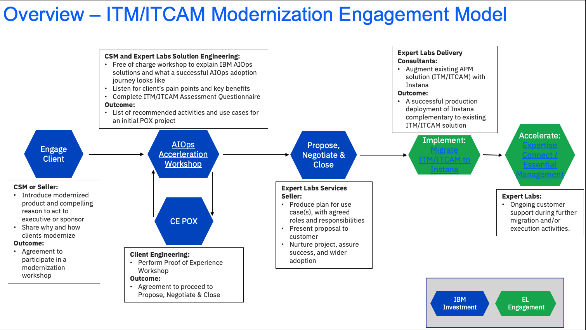

import {Link} from 'gatsby';
import FileLink from '../../../components/FileLink';

## Scope
There are no active plans to End of Market or End of Support ITM – IBM will continue to release Service Packs, FixPacks, bug fixes, security patches, etc. as needed by customers.

The recommended path is to stay on ITM and ITCAM, while adding Instana APM to accept inputs from ITM and ITCAM. This adds observability and performance management value to customers' environments.

The Instana team has delivered many product enhancements so it is now a more viable transition option from IBM's legacy monitoring tools.  Aside from the improved product parity to IBM's legacy monitoring tools, Instana also offers additional capabilities that help clients as they modernize to containers.

**Contacts:** 
**Customer Success Practice Leaders:** Hollis Chui 
**Technology Expert Labs Solution Engineering:** Luca Floris, Ricardo Olivieri 
**Technology Expert Labs Practice Leaders:** Saumil (Sam) Patel 

## IBM Tivoli Monitoring (ITM) / IBM Tivoli Composite Application Manager (ITCAM) Modernization Journey
This diagram shows the IBM Tivoli Monitoring (ITM) / IBM Tivoli Composite Application Manager (ITCAM) Modernization Engagement Model at a high level. Each section is broken down in detail with links to assets below.

## Engage Client Phase
**Led by: Customer Success and/or Brand Technical Seller**
**Audience: Executive/Sponsor**

Before entering this phase it is necessary to have discussed the ITM/ITCAM modernization with the account team and Account Technical Leader to ensure that it is part of the overall account plan.

This phase covers the steps necessary to have the first conversation with the customer about ITM/ITCAM modernization.

The outcome of this phase is that a sponsor is interested in an AIOps Acceleration workshop where IBM and the customer will work together to scope and plan the modernization project.

Process and Assets:

- CSM should create a Success/Growth Plan in Gainsight to track the progress of this potential project. <a target='_blank' rel='noreferrer noopener' href="https://ibm.box.com/s/u0d2z0ia2z5uhvb81577l36gkvspucud">Sample Growth Plan</a>
- CSM should review the <a href="https://ibm.seismic.com/Link/Content/DCd3qdDpJdpBF8HQTpj7BBRMGf68" target='_blank' rel='noreferrer noopener'>Instana Transition for IBM Monitoring Customers</a> Sales Motion.
- CSM should review the AIOps Acceleration Workshop: [Client deck](https://ibm.ent.box.com/s/fi398uj6jtk5dyu3ymk1sesn8f5oqy45)
- CSM should review the AIOps Acceleration Workshop: [One-pager](https://ibm.ent.box.com/s/bcvoy1oid55oiemiw1jblhp6pdjy97al)
- CSM should review the AIOps Acceleration Workshop: [Sample Outcome Report](https://ibm.ent.box.com/s/m3183pc8pxely6nldgil8x84hequaqlj)
- CSM should review the AIOps Acceleration Workshop: [Confidential Customer Deliverables](https://ibm.ent.box.com/s/pw7axq3mpftqjkmxouz8gh1ooubfj9v1)

## AIOps Acceleration Workshop
**Led by: Customer Success and Technology Expert Labs Solution Engineers**
The AIOps Acceleration Workshop, performed by Technology Expert Labs, is a 2-3 day free workshop to help the client understand their IT operations capabilities, areas of potential improvement and a recommended list of activities to address their most urgent pain points.

Technology Expert Labs has the best practices and methodology to help our clients understand the key elements of what a successful AIOps adoption journey entails across organizational culture, processes, tools, and data. Help your client set out to adopt IBM AIOps solutions by helping build a baseline of their organization and visioning a new approach to IT that will save costs by avoiding service outages, reduce MTTD/MTTR (Mean Time To Detect/Repair), and free up resources to handle more complex IT issues.

Successful workshops have been conducted with ADS, Banco Do Brasil, Bank of America-DCRS, Natwest, Santander, Vodaphone and more.  Refer to the [Customer Deliverables](https://ibm.box.com/s/pw7axq3mpftqjkmxouz8gh1ooubfj9v1) for example of customer readouts.  This includes IBM Confidential and Client Confidential information.

## Optional Client Engineering PoX Phase
**Led by: Client Engineering**

The customer may want to see a demonstration of the process of modernizing ITM/ITCAM from their current environment to Instana. Client Engineering can engage in a Proof of Experience to demonstrate the process and the new platform.

To request a Client Engineering resource to run a PoX (Proof of Experience) a resource request is done via [IBM Sales Cloud (ISC)](https://ibmsc.lightning.force.com/lightning/page/home).

Here is the link that details how to fill in the request in ISC: [https://w3.ibm.com/w3publisher/client-engineering/engage/engagement-instructions](https://w3.ibm.com/w3publisher/client-engineering/engage/engagement-instructions)

When filling in the information have relevant information ready:

- Engagement Details (”Technology Pattern” + pattern + description)
- Pattern: IT Automation Modernization (i.e Technology Pattern MQ Integration "Description")
- Business Problem: IBM Tivoli Monitoring (ITM) / IBM Tivoli Composite Application Manager (ITCAM) Modernization
- Scope: PoX
- Use Case
- Success Criteria
- Skills: Netcool Operations Insight (NOI) Skills needed.

## Propose, Negotiate and Close Phase
**Led by: Technology Expert Labs Seller**

The purpose of the Propose, Negotiate and Close is to close a services deal. The IBM Sales team: Digital/Services Seller, Solution Architect/Solution Engineer will present the customer with a Services proposal for ITM/ITCAM Modernization based on their budget and requirements.   

Required inputs by CSM: None; however CSM will want to maintain awareness for continued engagement with the client.

## Implement and Accelerate Phases
** Led by: Technology Expert Labs Delivery**

**Technology Expert Labs Offering:** <a target='_blank' rel='noreferrer noopener' href="https://ibm.seismic.com/Link/Content/DCT2qCm8jV4C484FB7W8WV778h4j">Plan AIOps Acceleration Workshop</a>

**Technology Expert Labs Offering:** <a target='_blank' rel='noreferrer noopener' href="https://ibm.seismic.com/Link/Content/DCq83jhm8cBBjGQPR67dFbFd9RW8">Migrate ITM to Instana</a>

**Technology Expert Labs Offering:** <a target='_blank' rel='noreferrer noopener' href="https://ibm.seismic.com/Link/Content/DChTBdhh2f8jg8mHCbCTB8FfD683">Expertise Connect/Essential Management</a>

During the delivery phase, the IBM Technology Expert Labs Delivery team will perform the services as agreed upon in the Propose Negotiate and Close Phase.

Required inputs by CSM: None; however CSM may want to shadow/maintain awareness for continued engagement with the client.
