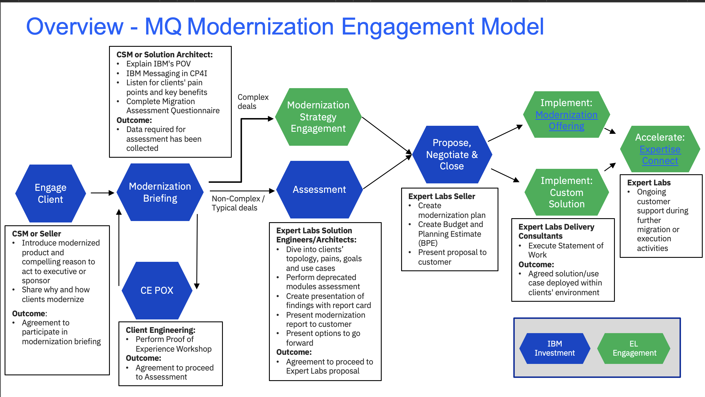

import {Link} from 'gatsby';
import FileLink from '../../../components/FileLink';

## Scope
IBM MQ is the proven messaging for hybrid and multi-cloud that’s high performance and security-rich. Modernization is not about just moving to containers. Clients are not fully taking advantage of latest features and functions or full value potential of MQ. MQ Modernization is to assist the client along the path of getting the best use of their investment and to help clients lagging in their adoption of modern architecture

## Contacts:
**Customer Success Practice Leader:** Venkata V Gadepalli (Vishy) 
**Technology Expert Labs Solution Engineering:** Mark Barnard 
**Technology Expert Labs Product Management:** Shruthi Savla 
**CP4I Product Management Contact:** Callum Jackson 

## Why should a customer modernize?

IBM MQ has enabled secure, reliable and scalable communication across and between enterprises for over 25 years. As organizations embrace this transformation, their messaging landscape needs to transform to assure it continues to meet the needs of the business. Common challenges include:
- Many existing customers are re-evaluating their connectivity solutions due to public cloud adoption.
- Existing deployments no longer fit for purpose as design decades ago when the landscape and requirements differed. 
- Achieve faster and more flexible solutions by using OpenShift Container Platform 
- Drive to lower the total cost of ownership, by automating the day-to-day operations. 

These, and other, IT and business needs are creating increased and changing demand for messaging and most IT departments need to plan for these challenges.

To see an example of what a modernization project looks like, look at the following examples:
- Customer Use Case:<a target='_blank' rel='noreferrer noopener' href="https://ibm.box.com/s/9k0evrvb6tqwoq9x9ip82r9dnmpthqla">Marks & Spencer</a>
- Customer Success Story:<a target='_blank' rel='noreferrer noopener' href="https://ibm.biz/modusbox-success">ModusBox</a>

## How complex is a modernization?
Most clients running MQ in a traditional manner as a point product will have resistance to change to a new form factor.  Most enterprises have been running mission critical MQ workloads for a long time and are quite happy with the way things are running. You will face this challenge not just with MQ but any capability in the Integration portfolio. Hence the discussions should be moved away from a Middleware Vs. Platform discussion. 

Architecture modernization is a necessary part of cloud-centric business transformation to better position the client's business to meet current and future demands. These are the typical client trends & outcomes we see and many clients will have at least one of these as an objective.

- Developer Agility
  - Self Service
  - Non-functional based t-shirt sizes
  - Instant provisioning
  - DevOps Integration
  - Isolated environments

- Adopt Multi-Cloud
  - Automate & configure  deployments across clouds
  - Embracing Containers - changing runtime platforms

- Operational Agility
  - Evergreening – assure supported and compliant environment
  - Consolidate to a hub, to simplify operations.
  - Self service to allow interaction with MQ team only by exception

- Organic Growth
  - Improved high availability of solution
  - Improved security
  - Improved scalability of messaging and/or application
  - Improved access to or increased value of data

## Other points to note in MQ modernization
- MQ is one part of the larger <a target='_blank' rel='noreferrer noopener' href="https://www.ibm.com/cloud/architecture/architectures/evolution-to-agile-integration/">agile integration architecture (AIA)</a>, and for some customers the larger picture may be the best starting point
- Consider the current distribution of non-production and production workloads. If the customer is using more than 25% of their MQ entitlements for non-production workloads then the trade-up will convert these to CP4I unfavorably for IBM. Work closely with the account team and brand technical seller to understand this before beginning the **Engage Client** phase

  
## MQ Modernization Journey
This diagram shows the MQ Modernization Journey at a high level. Each section is broken down in detail with links to assets below. 

## Engage Client Phase
**Led by: Customer Success and/or Brand Technical Seller**
Before entering this phase it is necessary to have discussed the topic of MQ Modernization with the account team and Account Technical Leader to ensure that it is part of the overall account plan. 

This phase covers the steps necessary to have the first conversation with the customer about MQ modernization. We've provided a deck, which is generic and applicable to most MQ customers as well as a deck from Product Management that goes in to more depth on the value of modernization from legacy MQ runtimes to the OpenShift based version.

The outcome of this phase is that a sponsor is interested in a **Modernization Briefing** and workshop where IBM and the customer will work together to scope and plan the modernization project. 

Process:
- Account planning should be performed to identify target personas and related metrics related to MQ modernization 
- CSM should create a Success/Growth Plan in Gainsight to track the progress of this potential project
- CSM should review the <a target='_blank' rel='noreferrer noopener' href="https://ibm.box.com/s/wknahjl7ybu1j96pttikrmjpmprkrhsi">Modernization Conversation one-pager</a>
- CSM should use the <a target='_blank' rel='noreferrer noopener' href="https://ibm.box.com/s/m2pp95zovnno83faox1bzlbjwc3p3liq">Executive MQ modernization overview deck</a> to discuss the compelling reason to act. 
- A <a target='_blank' rel='noreferrer noopener' href="https://ibm.ent.box.com/s/5dlaxmjl90s24kuvpi9wrwikg9d5n24a">recording</a> of how CSMs can present this deck to customers has been provided by Callum Jackson.
- CSM will present MQ modernization deck to customer executives or sponsors

Assets:
- <a target='_blank' rel='noreferrer noopener' href="https://ibm.box.com/s/m2pp95zovnno83faox1bzlbjwc3p3liq">Executive MQ modernization overview deck</a>
- <a target='_blank' rel='noreferrer noopener' href="https://ibm.ent.box.com/s/5dlaxmjl90s24kuvpi9wrwikg9d5n24a"> Recording of how CSMs would present the Executive MQ Modernization during the Engage Client Phase</a>
- <a target='_blank' rel='noreferrer noopener' href="https://ibm.box.com/s/spx7kh2hg9ew1kn8se4o76z14gw3ibub">Cloud Pak for Integration Intro Deck</a>

## Modernization Briefing Phase
**Led by: Customer Success and/or Technology Expert Labs Solution Architect**
This one day informal and customized workshop will help clients consider what is needed to provide an industry leading messaging capability suitable to address their business challenges and pain points. The aim of this workshop is to propose potential high level plans and roadmaps using interactive whiteboard sessions with IBM consultants and specialists with experience in integration.

This phase will typically be an in-person meeting with the following participants:
- IBM CSM, Technology Expert Labs Solution Architect, Account Team, ATL 
- Customer architect, developer, operations team, system designers and managers who are looking for solutions to
better satisfy their messaging requirements.

The modernization briefing is used to articulate the capabilities and benefits of MQ Modernization and to complete the questionnaire required by Technology Expert Labs to be able to complete an assessment. We have provided a set of assets that should be used in the briefing below. They include an agenda, the MQ Modernization PoV deck and the assessment questionnaire. In addition, we’ve provided a set of links to Demos and Lab exercises that you may choose to show to the customer in the briefing.

You may engage the Technology Expert Labs Solution Architect for assistance with the questionnaire.

In some situations you may need to engage Client Engineering to complete a Proof of Experience to convince the technical team at the customer of the viability of the modernization to MQ on OCP. In this case, we have provided detailed instructions in the Optional Client Engineering PoX Phase section below.

The outcome of this phase is that the technical team at the customer understands the capabilities and benefits of Modernizing their MQ workloads and the assessment questionnaire has been completed. 

Process:

- CSM engages their Technology Expert Labs Seller (if you don't know your Technology Expert Labs Seller they <a target='_blank' rel='noreferrer noopener' href="https://clientresourcelocator.wdc1a.cirrus.ibm.com/">can be found here</a>)
- Technology Expert Labs Seller creates an ISC record and engages the Technology Expert Labs Solution Architect (if necessary)
- CSM modifies <a target='_blank' rel='noreferrer noopener' href="https://ibm.box.com/s/bq37pvuf1jvf9i7xmnf9g0pegoldwgqn">Briefing Agenda</a> to insert demonstrations or hand on labs if necessary.
- CSM conducts the briefing using the <a target='_blank' rel='noreferrer noopener' href="https://ibm.box.com/s/tx40w77bzzwwlll8szlj54s14onsj4c2">MQ Modernization PoV Deck</a>
- A <a target='_blank' rel='noreferrer noopener' href="https://ibm.ent.box.com/s/nj307o45nx1wo1d4e25vpby6yhsnimzp/file/1204794881194">recording</a> of how CSMs can present this deck to customers has been provided by Callum Jackson.
- CSM/Technology Expert Labs Solution Architect and customer team complete the <a target='_blank' rel='noreferrer noopener' href="https://ibm.box.com/s/7qpa5zyggnb0crbwvfvje5rl33fmvrhf">MQ Modernization questionnaire</a> 

Assets:
- <a target='_blank' rel='noreferrer noopener' href="https://ibm.box.com/s/bq37pvuf1jvf9i7xmnf9g0pegoldwgqn">Sample Briefing Agenda </a>
- <a target='_blank' rel='noreferrer noopener' href="https://ibm.box.com/s/tx40w77bzzwwlll8szlj54s14onsj4c2">MQ Modernization POV Deck</a> 
- <a target='_blank' rel='noreferrer noopener' href="https://ibm.ent.box.com/s/nj307o45nx1wo1d4e25vpby6yhsnimzp/file/1204794881194"> Recording of how CSMs would present the MQ Modernization POV during the Modernization Briefing Phase</a>
- <a target='_blank' rel='noreferrer noopener' href="https://ibm.box.com/s/7qpa5zyggnb0crbwvfvje5rl33fmvrhf">MQ Modernization Questionnaire</a>

Demo and Lab Assets:   
It is preferable to have a live demo and the instructions from the following POTs should help you with building a demo on your own environment.
- Lab Exercise: <a target='_blank' rel='noreferrer noopener' href="https://pages.github.ibm.com/americas-integration/cp4i-pot-v3/MQ/">MQ POTs page</a>
- Lab Exercise: <a target='_blank' rel='noreferrer noopener' href="https://techzone.ibm.com/collection/mq-on-cp4i-pot/resources">IBM MQ on Cloud Pak for Integration Proof of Technology (Techzone)</a>
- Tutorial: <a target='_blank' rel='noreferrer noopener' href="https://production-gitops.dev/guides/cp4i/mq/using/this-guide/#introduction">MQ Deployment using Gitops</a>
- Demo: <a target='_blank' rel='noreferrer noopener' href="https://ibm.box.com/s/wa8ph5jv0nb3r41hpqbjzftgoo7nkgy7">MQ In Containers</a>
- Demo: <a target='_blank' rel='noreferrer noopener' href="https://ibm.box.com/s/5uylusc5sctu8fby62nyxw6irr4dc7wv">MQ NativeHA</a>

Additional Assets you can use;
- <a target='_blank' rel='noreferrer noopener' href="https://ibm.box.com/s/icenvkk3ed5ztixhqlmcsjk1k1ih4cdo">Why Modernize your MQ Estate</a>
- <a target='_blank' rel='noreferrer noopener' href="https://ibm.box.com/s/xc586fvztpg4axndkre1xpr1c392107y">Benefits of CP4I</a>
- <a target='_blank' rel='noreferrer noopener' href="https://github.ibm.com/CALLUMJ/MQonCP4I">A number of demonstrations/labs for IBM MQ in the Cloud Pak for Integration</a>

## Optional Client Engineering PoX Phase
**Led by: Client Engineering** 

The customer may want to see a demonstration of the process of moving MQ from their current environment to MQ running on top of OCP. Client Engineering can engage in a Proof of Experience to demonstrate the process and the new platform.

To request a Client Engineering resource to run a PoX (Proof of Experience) on MQ Modernization a resource request is done via [IBM Sales Cloud (ISC)](https://ibmsc.lightning.force.com/lightning/page/home).  

Here is the link that details how to fill in the request in ISC: [https://w3.ibm.com/w3publisher/client-engineering/engage/engagement-instructions](https://w3.ibm.com/w3publisher/client-engineering/engage/engagement-instructions)

When filling in the information have relevant information ready:

- Engagement Details (”Technology Pattern” + pattern + description)
- Pattern: MQ Modernization (i.e Technology Pattern MQ Integration "Description")
- Business Problem: MQ Modernization
- Scope: PoX
- Use Case
- Success Criteria
- Skills: MQ Skills needed.

## Assessment and Strategy Phase
**Led by: Technology Expert Labs Solution Architect/Solution Engineer**

Assessment is performed by Technology Expert Labs after the Modernization Briefing where the CSM has gathered the required information about the Customer's MQ environment (Questionnaire, export). 

Purpose of the Assessment Phase is to take the Assessment information and determine the level of effort to modernize a customer. Technology Expert Labs (Solution Architect/Solution Engineer) will use inhouse automation to analyze the customer's MQ assessment information, provide a findings reportcard complete with feature parity and deprecated module analysis and one or more services options to align with their requirements.

Required inputs by CSM (from Modernization Briefing/Discovery):
- Project Objectives and requirements
- Completed MQ Questionnaire
- Any architecture diagrams or other details preferably from Production Environment.

## Propose, Negotiate and Close Phase 
**Led by: Technology Expert Labs Seller**

**Technology Expert Labs Offering:** <a target='_blank' rel='noreferrer noopener' href="ibm.biz/ExpertLabs_MQMod">Build MQ Modernization</a>

**Technology Expert Labs Offering:** <a target='_blank' rel='noreferrer noopener' href="https://ibm.seismic.com/Link/Content/DChTBdhh2f8jg8mHCbCTB8FfD683">Expertise Connect</a>

The purpose of the Propose, Negotiate and Close is to close a services deal. The IBM Sales team: Digital/Services Seller, Solution Architect/Solution Engineer will present the customer with a Services proposal for MQ Modernization based on their budget and requirements.   

Required inputs by CSM: None; however CSM will want to maintain awareness for continued engagement with the client.

## Deliver Phase
**Led by: Technology Expert Labs Solution Engineer**

**Technology Expert Labs Offering:** <a target='_blank' rel='noreferrer noopener' href="ibm.biz/ExpertLabs_MQMod">Build MQ Modernization</a>

**Technology Expert Labs Offering:** <a target='_blank' rel='noreferrer noopener' href="https://ibm.seismic.com/Link/Content/DChTBdhh2f8jg8mHCbCTB8FfD683">Expertise Connect</a>

During the delivery phase, the Technology Expert Labs Delivery team will perform the services as agreed upon in the Propose Negotiate and Close Phase.

Required inputs by CSM: None; however CSM may want to shadow/maintain awareness for continued engagement with the client.
