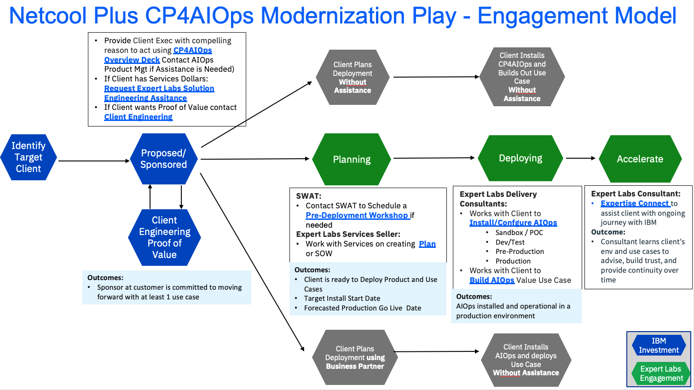

import {Link} from 'gatsby';
import FileLink from '../../../components/FileLink';

## Contacts

| WW contact | Name |
| --- | --- |
| **Customer Success Practice Leaders:** | Hollis Chui |
| **Technology Expert Labs Delivery:** | Saumil Patel |
| **Technology Expert Labs Solution Engineering:** | Ricardo Olivieri, Luca Floris |

## Scope
AI Operations tools such as Cloud Pak for AI Ops (CP4AIOPS) reveals new insights faster and offers them in a concise, engaging way that transforms user experiences and improves business outcomes. Cloud Pak for AIOps uses explainable AI to help CIOs and IT Ops teams detect and diagnose complex issues by connecting the dots between structured and unstructured data in real time to give users a wholistic understanding of IT incidents.

### Why should a customer modernize?
Cloud Pak for AIOps can leverage a customer's existing Netcool deployment and complement it with additional capabilities for incident management.

#### Leverage your current ONMIbus (and Impact) deployment and investment
- Included as core components in broader Cloud Pak for AIOps solution
- No disruption to your existing deployment
- Run complementary cloud-native workload in a hybrid deployment

#### Cloud Pak for AIOps Complementary Capabilities
- Leverage OMNIbus event consolidation, correlation, suppression and Impact enrichment as part of broader event processing engine
- Automated event analytics, grouping (temporal, scope, seasonal)
- Dynamic views and dashboards + ChatOps
- Dynamic topological dependency mapping (real-time & historical)
- Performance metric trends and variance detection
- AI-based log anomaly detection, natural language processing and entity linking
- Built-in runbook automation, AI-driven next best action

#### Cloud Pak for AIOps licensing and pricing model = more value
- Enables customers to adopt 10x additional modern value-add capabilities at 20% - 50% less than licensing stand alone components
- Price reduction (average 20% vs NOI and 50% vs NOM or TNC-A) 
- Cloud Pak for AIOPs includes Topology (”ASM”) for free vs paying for the stand alone ASM option with old model

### Netcool Trade-Up to Cloud Pak for AIOps
IBM’s strategic direction for our portfolio is to promote a consolidated AIOps platform through the IBM Cloud Pak for AIOps solution. This solution includes the core capabilities, previously offered through Netcool Operation Insight since 2014, as the next generation of the standalone Netcool products. Significant investment has been and will continue to be made in the Cloud Pak for AIOps solution, delivering greater value than the stand-alone products. To eliminate client confusion and consolidate focus on creating competitive differentiating capabilities, there is no longer a strategic need to continue offering the standalone products.

To unlock the full potential of AIOps for our clients, IBM has consolidated individual offerings into a unified AIOps platform to continue investing in differentiating AIOps capabilities with an enhanced focus.

Entitlement to Netcool OMNIbus and Netcool Impact functionality has been available as part of the Cloud Pak for AIOps event processing and analytics entitlement. Predictive Insights function lives on and is available with the metric processing and analytics entitlement. Cloud Pak for AIOps should be considered the natural destination for Netcool clients as it contains the next generation of event processing, correlation, and analytics in addition to many value-add AIOps capabilities.

#### How Cloud Pak for AIOps solves this problem
For organizations using our Netcool suite of products, your Netcool deployment can be a spring board into AIOps.  Think of Netcool as the foundation of AIOps.  It is empowering you to cast a wide net to ingest relevant data from any source, process it in an intelligent, automated way, analyze the data, see which applications or parts of the infrastructure are impacted, share it and even suggest guided steps to mitigate or resolve issues.

All these functions are critical and imperative elements for AIOps.  The Netcool suite has ingested and processed primarily the “structured” data from monitors, management tools and resources across the environment.  With the addition of new AI capabilities, you can also ingest, correlate and process “unstructured” and “semi-structured” data that tend to come from logs, service tickets and collaboration tools – such as natural language that can add significant insight to the incident resolution process.

Many are successfully monitoring and gathering relevant data to better understand how well their operations are performing - but establishing and maintaining a single source of truth has often proven to be elusive.  Using Cloud Pak for AIOps you can consolidate and automatically track multiple sets of data, from different tools and resources, to empower your teams to react faster with more knowledge and deeper understanding.

By using Cloud Pak for AIOps, Baader Bank was able to reduce 2 million events per day by over 99% to only a few dozen relevant actionable ones. This type of ticket reduction has seen millions of dollars of savings and a 3 month time to payback, by using log anomaly and topological AI on top of Netcool, Naggios and BMC TrueSight alerting systems.

We’ve seen this regular pattern in companies around the world and across industries – in financial organizations like Deutsche Bank, BNP, in telecom companies like DT, T-Mobile, Saudi Telekom, Telfonica, and others.

Cloud Pak for AIOps advances Netcool reducing noise in false positive alerts by a factor of 10, reducing mean time to repair from hours to seconds, and reducing tickets. Ultimately this enables IT Ops teams to operate with more focus, intelligence, and agility.

## Netcool Plus CP4AIOPS Modernization Engagement model
This diagram shows the Netcool Plus CP4AIOPS Modernization Engagement Model at a high level. Each section is broken down in detail with links to assets below.

## Engage Client Phase
**Led by: CSM**
**Audience: Executive/Sponsor**

Before entering this phase it is necessary to have discussed the Netcool Operations Insight (NOI) modernization with the account team and Account Technical Leader to ensure that it is part of the overall account plan.

This phase covers the steps necessary to have the first conversation with the customer and introduce CP4AIOPS product and explain the compelling reasons to act.

For assistance, reach out to the product management team: James Moore (jdmoore@us.ibm.com) and CC Kim O'Connor (kimoconnor@ie.ibm.com).

The outcome of this phase is that a sponsor is interested in modernizing and the next step is to identify the use case(s) to scope and plan the modernization project.

Process and Assets:
- Account planning should be performed to identify target personas and related metrics to the modernization.
- CSM should create a Success/Growth Plan in Gainsight to track the progress of this potential project. <a target='_blank' rel='noreferrer noopener' href="https://ibm.box.com/s/u0d2z0ia2z5uhvb81577l36gkvspucud">Sample Growth Plan</a> and select the **Netcool Plus CP4AIOPS Modernization** Deployment Play. 
- CSM should review the [Incident Management with CP4AIOPS](https://mediacenter.ibm.com/media/t/1_cifk5wwo)
- CSM should review the <a href="https://ibm.seismic.com/Link/Content/DCBMMRG6cVVWR8MFMHPB6773RfdB" target='_blank' rel='noreferrer noopener'>CP4AIOPS Overview deck</a>

## Identify Use Case Phase
**Led by: Customer Success and Technology Expert Labs**

The CSM will work with a client to identify target use case(s) that will address their pain points and where they will see the most value.  Leverage the [SWAT Best Practices document](https://www.ibm.com/docs/en/cloud-paks/cloud-pak-aiops/4.3.0?topic=pdf-documentation) to assist in this activity.

If the client has purchased Technology Expert Labs services, request help from the TEL Solution Engineering team using their [intake form](https://forms.monday.com/forms/c64bacb40df8b2d13a498a4d3223011f?r=use1).

Contact the CP4AIOPS SWAT team to schedule a [Pre-Deployment Workshop](http://ibm.biz/automation-swat).  Note, requests will start to be accepted in March 2024.

If the client has not purchased Technology Expert Labs services, and a proof of value is required, engage the [Client Engineering team](https://pages.github.ibm.com/csm-playbook/playbook/common/modernization/modernization-noi#optional-client-engineering-proof-of-value-phase).

## Optional Client Engineering Proof of Value Phase
**Led by: Client Engineering**

The customer may want to see a demonstration of the Netcool plus CP4AIOPS modernization running on top of OCP. Client Engineering can engage in a Proof of Value to demonstrate the process and the new platform.

To request a Client Engineering resource to run a PoV (Proof of Value) a resource request is done via [IBM Sales Cloud (ISC)](https://ibmsc.lightning.force.com/lightning/page/home).

Here is the link that details how to fill in the request in ISC: [https://w3.ibm.com/w3publisher/client-engineering/engage/engagement-instructions](https://w3.ibm.com/w3publisher/client-engineering/engage/engagement-instructions)

When filling in the information have relevant information ready:

- Engagement Details (”Technology Pattern” + pattern + description)
- Pattern: IT Automation Modernization (i.e Technology Pattern MQ Integration "Description")
- Business Problem: Netcool Operations Insight (NOI) modernization
- Scope: PoV
- Use Case
- Success Criteria
- Skills: Netcool Operations Insight (NOI) Skills needed.

## Propose, Negotiate and Close Phase
**Led by: Technology Expert Labs Seller**

The purpose of the Propose, Negotiate and Close is to close a services deal. The IBM Sales team: Digital/Services Seller, Solution Architect/Solution Engineer will present the customer with a Services proposal for NOI Modernization based on their budget and requirements.   

**Technology Expert Labs Offering:** <a target='_blank' rel='noreferrer noopener' href="https://ibm.seismic.com/Link/Content/DChJfpc8G8Q4hGmV6q9PQDP7dPRP">Plan AIOPS Services Offering</a>

Required inputs by CSM: None; however CSM will want to maintain awareness for continued engagement with the client.

## Implement and Accelerate Phases
** Led by: Technology Expert Labs**

**Technology Expert Labs Offering:** <a target='_blank' rel='noreferrer noopener' href="https://ibm.seismic.com/Link/Content/DCJmbFTCcDbmpGhQHhhGgcGJfC83">Install/Configure AIOPS Services Offering</a>

**Technology Expert Labs Offering:** <a target='_blank' rel='noreferrer noopener' href="https://ibm.seismic.com/Link/Content/DCMDX3WhCGdgBGf26VHfJgR2VQhP">Build AIOps Services Offering</a>

**Technology Expert Labs Offering:** <a target='_blank' rel='noreferrer noopener' href="https://ibm.seismic.com/Link/Content/DChTBdhh2f8jg8mHCbCTB8FfD683">Expertise Connect</a>

During the delivery phase, the IBM Technology Expert Labs Delivery team will perform the services as agreed upon in the Propose Negotiate and Close Phase.

Required inputs by CSM: None; however CSM may want to shadow/maintain awareness for continued engagement with the client.
