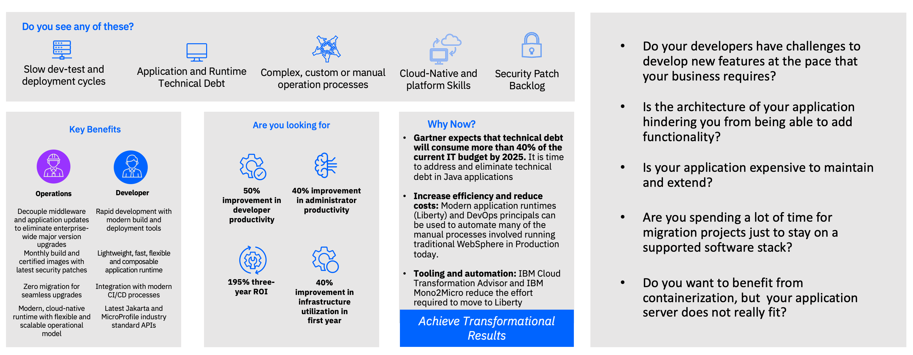
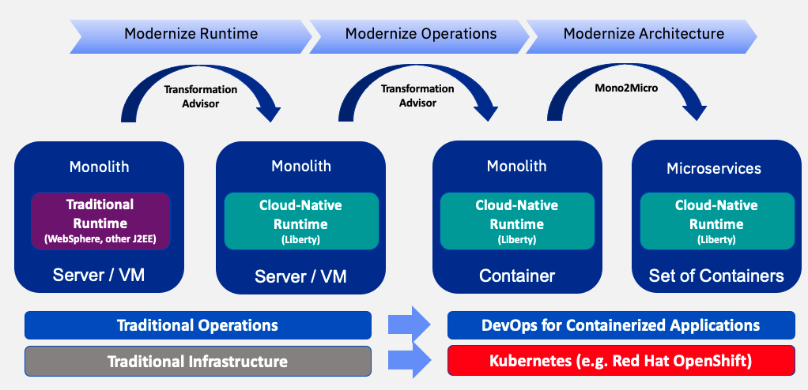
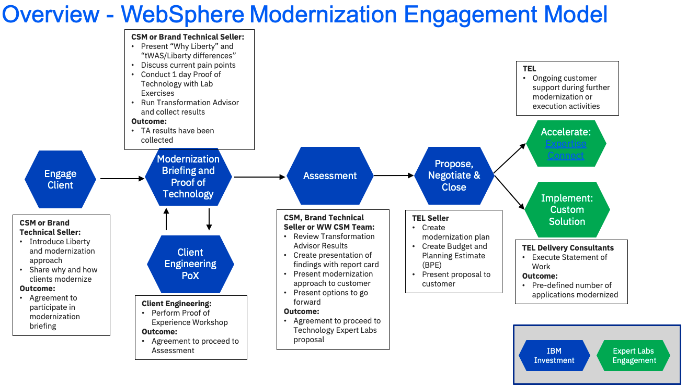

import {Link} from 'gatsby';
import FileLink from '../../../components/FileLink';

## Scope
WebSphere modernization is the process of moving applications from *traditional* WebSphere to (WebSphere) Liberty.    
Traditional WebSphere is a monolithic application server that was designed for large applications that are deployed and updated infrequently. Modern, agile businesses need to develop, deploy, manage and scale smaller applications that are frequently updated, which is one of the reasons why IBM created Liberty. Liberty is part of <Link to="/common/automation/csm-automation-websphere-hybrid-edition/"><strong>WebSphere Hybrid Edition</strong></Link> and <Link to='/common/automation/csm-automation-cloud-pak-for-applications/'><strong>Cloud Pak for Applications</strong></Link>, key entitlements CSMs are responsible for.   
Modernizing from traditional WebSphere to Liberty can also include modernization of operational practices towards DevOps and modernization of the application code and architecture towards smaller, micro-services like applications. The level of investment required to modernize application code is high, so it is necessary to analyze and prioritize applications to receive the best return on investment.  
**IMPORTANT:** Customers can use <Link to="/common/automation/csm-automation-websphere-hybrid-edition/"><strong>WebSphere Hybrid Edition</strong></Link> OR <Link to='/common/automation/csm-automation-cloud-pak-for-applications/'><strong>Cloud Pak for Applications</strong></Link> for their modernization. Both include WebSphere entitlements that can be used for traditional WebSphere Network Deployment, traditional WebSphere "base" and WebSphere Liberty and allow deployment in non-containerized or containerized environments. WebSphere modernization **does not** "require" OpenShift, some applications may stay on WebSphere ND, some may run on non-containerized Liberty and some may run in containers. The primary objective is to remove technical debt and keep our customers on WebSphere in general.

## Why should a customer modernize?
<FileLink to="/files/app-mod-one-pagers.pptx" target='_blank' rel='noreferrer noopener'>Link to deck</FileLink>

### Modern business goals 
Technical Debt is consuming more and more of the IT budget each year. Gartner suggest that by 2025, technical debt will consume more than 40% of the current IT budget. Applications running on traditional WebSphere often have the following types of technical debt:
- difficult to upgrade runtimes due to time and effort required to apply and test upgrades in environments with large numbers of servers and applications
- difficult to enhance applications due to monolithic application packaging
- weak security posture due to lack of automatic/complex runtime patching and complexity of application build/test/deploy cycles
- inefficient manual/custom administration processes 
- inefficient use of compute resources due to complex runtime scalability and elasticity

The goal of WebSphere modernization is to align with the business objectives of the modern business: 
- improve sustainability and lower infrastructure costs by using "just enough runtime" for the application and increasing application density.
- improve security and lower administrative costs by adopting continuous delivery for applications and utilizing the "zero migration" capability of Liberty which elimiates the need for version to version and fixpack migration activities.
- increase developer and digitial productivity with a developer optimized set of tooling and Kubernetes optimized runtime. 

These objectives can be achieved by modernizing applications to run on WebSphere Liberty and adopting modern automation and CI/CD practices. 

For example, <a target='_blank' rel='noreferrer noopener' href="https://www.ibm.com/cloud/blog/proving-the-websphere-modernization-path-to-liberty-on-openshift-at-discover">Discover</a> wanted to modernize their WebSphere operational model to introduce dynamic scalability while reducing time and resources required to configure and maintain hundreds of applications deployed on-prem across multiple data centers. Using IBM Transformation Advisor, they were able to identify common code and streamline their modernization to Liberty on OpenShift, reducing the time to modernize each application from months to 3-10 days.

Another example is **Lloyds Banking Group**(should not be used outside IBM), where they have been using traditional WebSphere for a long time are now in the process of modernizing usinng CP4Apps.  Some of the value Lloyds is finding from CP4Apps is the following:
 - They came from IBM Cloud Private(ICP) so shared migration of licenses was helpful 
 - Runtimes: They are a big WAS shop & and they also have RH OpenShift used in there(one stop shop).
 - Support: Having a single support team to contact helps a lot when you are running IBM software on your OCP. L2 support being together in the same process helps given any issue can be tracked thru a single ticket, rather than 2 companies trading off against two portals.
 - One other advantage for Lloyds is Z, CP4Apps allows them licenses for Z platform & X86 which they are using.

### Client Zero
To see how we've used this approach at IBM CIO Organization, check out these blog posts outlining the process and tools used.
- <a href="https://www.ibm.com/cloud/blog/ibm-cio-a-client-zero-to-application-modernization" target="_blank">IBM CIO Organization's Application Modernization Journey</a>
- <a href="https://www.ibm.com/cloud/blog/ibm-cio-organizations-application-modernization-journey-tools-to-simplify-and-accelerate" target="_blank">IBM CIO Organization’s Application Modernization Journey: Tools to Simplify and Accelerate</a>
- <a href="https://www.ibm.com/blog/ibm-cio-organizations-application-modernization-journey-mono2micro/" target="_blank">IBM CIO Organization's Application Modernization Journey: Mono2Micro</a>

## Contacts
**Customer Success Practice Leader:** Venkata Gadepalli 
**Technology Expert Labs Contact:** Hendrik van Run 
**Technology Expert Labs Product Management:** Shruthi Savia 
**Application Modernization Product Management Contact:** John Buckley 

## Background information for CSMs
Here are some assets that CSMs can use to gain a level of understanding around Liberty, the differences with traditional WebSphere and the approaches to "modernization": 
- Cloud Pak for Applications Level 1 Training: <a target='_blank' rel='noreferrer noopener' href="https://yourlearning.ibm.com/activity/PLAN-6EB0D134FE89">Learning Plan</a>

- What is Liberty?: <a target='_blank' rel='noreferrer noopener' href="https://ibm.box.com/s/3eh3omeba4x822rkr0xqjibtknrxvnq1">deck</a> and <a target='_blank' rel='noreferrer noopener' href="https://ibm.box.com/s/vwjyjiwrv07e8uh7dhvioee385oqnuyj">recording</a>

- Liberty is part of <Link to="/common/automation/csm-automation-websphere-hybrid-edition/"><strong>WebSphere Hybrid Edition</strong></Link> and <Link to='/common/automation/csm-automation-cloud-pak-for-applications/'><strong>Cloud Pak for Applications</strong></Link>, key entitlements CSMs are responsible for.

- Liberty/tradtional WebSphere differences <a target='_blank' rel='noreferrer noopener' href="https://ibm.box.com/s/pjd105wg1nx85q4rvrc5cd94yx9ed5o8">deck</a> and <a target='_blank' rel='noreferrer noopener' href="https://ibm.box.com/s/wpdo6nr0wlr1jbsqhya3ayvciztdtdq9">recording</a>

- Customer facing WebSphere Modernization <a target='_blank' rel='noreferrer noopener' href="https://ibm.box.com/s/lax02fjkwkizl3wpgr0mrj5ffiqcu087">deck</a> 

- Modernization Tools 101: <a target='_blank' rel='noreferrer noopener' href="https://ibm.seismic.com/Link/Content/DC7X2JC4mm2P382MbggWqXDdp2bP">deck</a> and <a target='_blank' rel='noreferrer noopener' href="https://ibm.seismic.com/Link/Content/DCgFHQ3Pbbj7FGFCVb3h83HCj6fd">recording</a>

- What is Transformation Advisor? <a target='_blank' rel='noreferrer noopener' href="https://mediacenter.ibm.com/media/IBM+Transformation+Advisor+Introduction/1_9qu3sval">video</a>

- What do CSMs need to know about Transformation Advisor? <a target='_blank' rel='noreferrer noopener' href="https://ibm.box.com/v/TAforTechSales">deck by Dave Mulley</a>

- Blogs about Transformation Advisor including what's new in each release can be found on the <a target='_blank' rel='noreferrer noopener' href="https://community.ibm.com/community/user/wasdevops/search?s=tags%3A%22TransformationAdvisor%22&executesearch=true">IBM Community</a>

- The IBM <a target='_blank' rel='noreferrer noopener' href="https://www.ibm.com/topics/application-modernization">Application Modernization Architecture</a> covers the architectural reasons to modernize and the high-level patterns that are applicable.  

The diagram below shows the main types of WebSphere modernization:

- **Modernize Runtime**: move the applicaton with the smallest amount of code change to Liberty but do not containerize. This gives the benefits of a modern runtime without the investment in moving to containers. However, this requires a traditional type of administration model and management. Some applications may end their modernization journey here. **This is the general focus of this modernization play. Making the jump to containers and microservices is a longer term objective**
- **Modernize Operations**: move the application and Liberty in to a container and get the benefits of a cloud-native operational model by adopting a DevOps methodology. An alternative to this step is to run traditional WebSphere in a container, which is a valid approach and and is used for applications that are too complex or costly to move to Liberty. Some applications may end their modernization journey here.
- **Modernize Architecture**: break the application in to smaller pieces and develop and manage them like other cloud-native applications. This is a significant investment and many customers may choose to rewrite their applications instead of breaking the older application up.

It is not a "one-size fits all" approach to modernization. Each application should be evaluated and have it's own modernization journey.

Please reach out to Venkata Gadepalli (vgadepal@us.ibm.com) if you have any questions on WebSphere modernization or how to get started.

## How complex is a modernization?
The process to modernize Java applications is to use IBM Cloud Transformation Advisor to triage applications and identify candidates for low-touch modernization of the application server runtime (WebSphere Liberty). 
IBM Cloud Transformation Advisor can evaluate the effort to modernize existing Java applications, determine the best path for modernization and provide code and configuration accelerators to scale the modernization process across many applications. Several factors determine an application's path through the modernization phases and where it eventually finishes. Among those factors is the number of code changes that are required to move an application to a modern, containerized, cloud-ready application server and the business need for future investment in the application. 

## WebSphere Modernization Journey
This diagram shows the WebSphere Modernization Journey at a high level. Each section is broken down in detail with links to assets below. 

## Engage Client Phase
**Led by: Customer Success and/or Brand Technical Seller**
Before entering this phase it is necessary to have discussed the topic of WebSphere Modernization with the account team and Account Technical Leader to ensure that it is part of the overall account plan. 

This phase covers the steps necessary to have the first conversation with the customer about WebSphere modernization. We've provided a deck, which is generic and applicable to most WebSphere customers as well as a deck from Product Management that goes in to more depth on the value of modernization from WebSphere to Liberty.

The outcome of this phase is that a sponsor is interested in a **Modernization Briefing** and workshop where IBM and the customer will work together to scope and plan the modernization project. 

Process:
- Account planning should be performed to identify target personas and related metrics related to WebSphere modernization 
- CSM should create a Success/Growth Plan in Gainsight to track the progress of this potential project
- CSM should review the <a target='_blank' rel='noreferrer noopener' href="https://ibm.seismic.com/Link/Content/DCM2XQj4T66Mp8q2XGVcPPq9gRQd">WebSphere and Liberty positioning recording</a>
- CSM should review the <a target='_blank' rel='noreferrer noopener' href="https://ibm.seismic.com/Link/Content/DCBX24WbdXDjV8HRm7qGpcj2f9MG">Modernization Tooling recording</a>
- CSM should review the <a target='_blank' rel='noreferrer noopener' href="https://ibm.seismic.com/Link/Content/DCj6G3dfB8CXXG2WD84JHbpRfq3B">Modernization Pain Points</a> deck
- CSM should review the <a target='_blank' rel='noreferrer noopener' href="https://ibm.box.com/s/ghbipdv35tx05lpwa00u670uj4tyv60w">Modernization Conversation one-pager</a>
- CSM should present the <a target='_blank' rel='noreferrer noopener' href="https://ibm.box.com/s/lax02fjkwkizl3wpgr0mrj5ffiqcu087">Modernization Executive Overview</a> Deck to the client executive
- CSM can engage Venkata Gadepalli for guidance if necessary during this phase.

## Modernization Briefing Phase
**Led by: Customer Success and/or Brand Technical Seller**
This one day information briefing combines a presentation from IBM that covers the modernization options for traditional WebSphere in depth with a chance for the developers and administrators to get hands-on with Liberty and the modernization tooling as part of a Proof of Technology. 

This phase will typically be an in-person meeting with the following participants:
- IBM CSM, Technology Expert Labs Solution Architect, Account Team, ATL 
- Customer architect, developer, operations team, system designers and managers who are looking to learn more about WebSphere modernization.

At the end of the modernization briefing, Transformation Advisor should be used to analyze the existing WebSphere environment and applications which provides the input required to assess and plan the next steps.  

In some situations you may need to engage Client Engineering to complete a Proof of Experience to convince the technical team at the customer of the viability WebSphere modernization. In this case, we have provided detailed instructions in the Optional Client Engineering PoX Phase section below.

The outcome of this phase is that the technical team at the customer understands the capabilities and benefits of Modernizing their WebSphere workloads and Transformation Advisor has been used to collect data about the current environment. 

Process:

- CSM engages their Technology Expert Labs Seller (if you don't know your Technology Expert Labs Seller they <a target='_blank' rel='noreferrer noopener' href="https://clientresourcelocator.wdc1a.cirrus.ibm.com/">can be found here</a>)
- Technology Expert Labs Seller creates an ISC record and engages the Technology Expert Labs Solution Architect (if necessary)
- CSM should present the <a target='_blank' rel='noreferrer noopener' href="https://ibm.seismic.com/Link/Content/DC7X2JC4mm2P382MbggWqXDdp2bP">Modernization Overview</a> Deck to start the briefing and level set on IBMs approach
- CSM should conduct the <a target='_blank' rel='noreferrer noopener' href="https://techzone.ibm.com/collection/liberty-workshop/">WebSphere Liberty PoT</a>
- CSM and customer team should execute Transformation Advisor against a WebSphere ND environment, replicating the steps from the PoT lab exercise.

Assets:
- <a target='_blank' rel='noreferrer noopener' href="https://ibm.ent.box.com/v/LibertyWorkshop-agenda">PoT Agenda </a>
- <a target='_blank' rel='noreferrer noopener' href="https://ibm.seismic.com/Link/Content/DC7X2JC4mm2P382MbggWqXDdp2bP">WebSphere Modernization POV Deck</a> 
- <a target='_blank' rel='noreferrer noopener' href="https://techzone.ibm.com/collection/liberty-workshop/">WebSphere Liberty PoT</a>

Learn about Transformation Advisor and Liberty
- Liberty and traditional WebSphere differences <a target='_blank' rel='noreferrer noopener' href="https://ibm.box.com/s/pjd105wg1nx85q4rvrc5cd94yx9ed5o8">deck</a>
- Liberty and traditional WebSphere differences <a target='_blank' rel='noreferrer noopener' href="https://ibm.box.com/s/wpdo6nr0wlr1jbsqhya3ayvciztdtdq9">recording</a>
- What is Transformation Advisor? <a target='_blank' rel='noreferrer noopener' href="https://mediacenter.ibm.com/media/IBM+Transformation+Advisor+Introduction/1_9qu3sval">video</a>
- What do CSMs need to know about Transformation Advisor? <a target='_blank' rel='noreferrer noopener' href="https://ibm.box.com/v/TAforTechSales">deck by Dave Mulley</a>

Demo and Lab Assets:   
CSMs should practice and build skills using the demos and labs in the Proof of Technology.
- <a target='_blank' rel='noreferrer noopener' href="https://techzone.ibm.com/collection/liberty-workshop/">WebSphere POT Labs and Demos</a>

## Optional Client Engineering PoX Phase
**Led by: Client Engineering** 

The customer may want to see a demonstration of the process of modernizing WebSphere applications. Client Engineering can engage in a Proof of Experience to demonstrate the process and the new platform.

To request a Client Engineering resource to run a PoX (Proof of Experience) on WebSphere Modernization a resource request is done via [IBM Sales Cloud (ISC)](https://ibmsc.lightning.force.com/lightning/page/home).  

Here is the link that details how to fill in the request in ISC: [https://w3.ibm.com/w3publisher/client-engineering/engage/engagement-instructions](https://w3.ibm.com/w3publisher/client-engineering/engage/engagement-instructions)

When filling in the information have relevant information ready:

- Engagement Details (”Technology Pattern” + pattern + description)
- Pattern: WebSphere Modernization (i.e Technology Pattern WebSphere Modernization "Description")
- Business Problem: WebSphere Modernization
- Scope: PoX
- Use Case
- Success Criteria
- Skills: WebSphere Skills needed.

## Assessment and Strategy Phase
**Led by: CSM, Brand Technical Specialist or WW CSM Team**

Assessment is performed by CSM, Brand Technical Specialist or WW CSM Team after the Modernization Briefing where the CSM has executed Transformation Advisor against the customer's WebSpehre environment and has the results available. 

Purpose of the Assessment Phase is to take the Transformation Advistor information and determine the level of effort to modernize a customer. CSM, Brand Technical Specialist or WW CSM Team will use the customer's Transformation Advisor results to determine the options for modernization and estimates of effort required.

Required inputs by CSM (from Modernization Briefing/Discovery):
- Project Objectives and requirements
- Transformation Advisor results zip file
- Any architecture diagrams or other details preferably from Production Environment.

## Propose, Negotiate and Close Phase 
**Led by: Technology Expert Labs Seller**

**Technology Expert Labs Offering:** <a target='_blank' rel='noreferrer noopener' href="https://ibm.seismic.com/Link/Content/DChTBdhh2f8jg8mHCbCTB8FfD683">Expertise Connect</a>

The purpose of the Propose, Negotiate and Close is to close a services deal. The IBM Sales team: Digital/Services Seller, Solution Architect/Solution Engineer will present the customer with a Services proposal for WebSphere Modernization based on their budget and requirements.   

Required inputs by CSM: None; however CSM will want to maintain awareness for continued engagement with the client.

## Deliver Phase
**Led by: Technology Expert Labs Solution Engineer**

**Technology Expert Labs Offering:** <a target='_blank' rel='noreferrer noopener' href="https://ibm.seismic.com/Link/Content/DChTBdhh2f8jg8mHCbCTB8FfD683">Expertise Connect</a>

During the delivery phase, the Technology Expert Labs Delivery team will perform the services as agreed upon in the Propose Negotiate and Close Phase.

Required inputs by CSM: None; however CSM may want to shadow/maintain awareness for continued engagement with the client.
