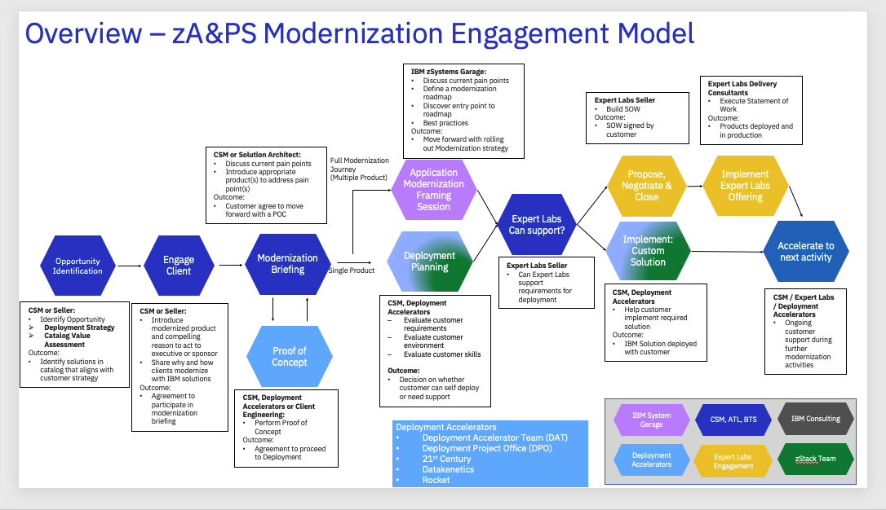

import {Link} from 'gatsby';
import FileLink from '../../../components/FileLink';

<Row className="resource-card-group">

<Column colMd={4} colLg={4} noGutterSm>
<ResourceCard
      subTitle="Guide the customer from provisioning to onboarding through to expansion"
      title="watsonx Code Assistant - Z SaaS"
      href="/common/data-ai/csm-data-ai-code-assistant-Z-saas">

</ResourceCard>

</Column>

<Column colMd={4} colLg={4} noGutterSm>
<ResourceCard
      subTitle="Incrementally modernize and refactor"
      title="watsonx Code Assistant for Z"
      href="/common/modernization/modernization-WCA-Z">

</ResourceCard>

</Column>

</Row>

## Scope
Modernization with zSW is the process of making IBM Z applications and platform first rate within our customers' IT organizations and technology landscapes. Today, both the application and platform layers are generally outdated. Many customers are treating the mainframe as a system to just 'keep the lights on'. There are new Chief Information Officers who have little to no experience with the mainframe and are choosing to move away from the platform. **However, IBM remains bullish on the mainframe.**  We have invested a lot of capital over the past 5 to 10 years to modernize the platform. The role of the CSM is to help customers see IBM's vision of making IBM Z applications and platform the pièce de résistance to their hybrid infrastructure. We have invested in tools and accelerators to help make IBM Z the centerpiece of the Diamond Account's IT environment. You can access the tools and accelerators on our <a href="../zAPS/csm-zaps-zaiops" >playbook page</a> .

**Contacts** 
**Customer Success Practice Leaders:** John Senegal, Craig Bender 
**Expert Labs Solution Engineering:** Lillian Schnaider 

### Why should customers modernize?

Modernization with zSW helps to address customer concerns with the mainframe:

**Many customers have a 'cloud first' strategy**

First, work with your customer to understand (and help them fully recognize) their application inventory along with their unified strategy. Often customers believe that a 'cloud first' strategy means that all apps must move to the cloud, but that could not be further from the truth. A true hybrid environment includes the security of mainframe, the flexibility of cloud, on-prem, off-prem or any combination thereof. 

Customers with a 'cloud first' strategy should be keenly aware that there is no need to go through the risk and expense of migrating applications (and often their critical applications). Demonstrate the security of maintaining critical apps on the mainframe while building complementary cloud native apps.

**Many customers claim that the mainframe is too expensive**

The mainframe can be a big line item expense in a typical Diamond Account IT budget. CIOs see the numbers and automatically assume that they can gain efficiencies in a cloud environment. However, we should demonstrate ways to optimize the current environment instead of automatically jumping to cloud only. There are tools like Automatic Binary Optimizer (ABO) that can help optimize the current environment. Customers can also move some workloads to zIIPs or IFLs to help mitigate costs.

Customers are often concerned about not having the right skills or up-to-date skilled talent to maintain support for their IBM Z application portfolio or platform. Although it is true that most applications on the mainframe are written in COBOL, PL/I and/or Assembler, we now have new, modern languages running natively on the mainframe. In addition, we have the ability to make the mainframe a cloud native infrastructure to support cloud native applications. Finally, we can use current Continuous Integration/Continuous Delivery (CI/CD) pipeline tooling and pricing to assist with the mainframe skills gap.

For client-facing material, see the Compelling Reason to Act in the Engage Client Phase section.

### How complex is a modernization?

There are several aspects to a mainframe modernization strategy. Depending on the goal of the modernization strategy, it could involve different levels of complexity. Optimization, which often the first steps in modernization, could be fairly straightforward. Optimization involves applying the right tools at the right time that can address the current environment, and it requires customer IBM Z system skills (or IBM Consulting or another IBM partner to augment customer skills). 

The next form of modernization, application modernization, can be more complicated and requires application knowledge along with some programming skills. This application layer can be somewhat more involved because figuring out which parts of the application need to be rewritten or just exposed requires support from Expert Labs and/or IBM Consulting. DevOps, by far, is the most complicated modernization aspect because it requires some migrations, new tools and new processes.

### zSW Modernization Journey

The diagram below shows the zSW Modernization Journey at a high level.

**In order to assist in identifying roles and responsibilities in the Modernization Journey, reference and customize the RACI (Responsible, Accountable, Consult, Inform) matrix here: <a href="https://ibm.box.com/s/cy7xg7x2rskjue2czuxbv31kwhtln16r">RACI workbook</a> .**

Use this template RACI for each of your accounts and customize the matrix based on the roles and engagement model for your account.  Reference the <a href="https://ibm.box.com/s/cy7xg7x2rskjue2czuxbv31kwhtln16r">Client Engagement Model</a> for typical roles in an engagement (from Seismic) but recognize that roles may vary from account to account. For example, if your modernization play is borne out of an IBM Consulting services engagement, then IBM Consulting would have activities higher up in the RACI list (and you would mark the RACI matrix as such). Conversely, if IBM Consulting is not engaged at your account then you would delete reference to IBM Consulting in your RACI.

Start with the READ ME tab, work through the RACI matrix and fill in the Roles Worksheet tab with names for each of the roles for your account to help your account team navigate successfully through the Modernization Journey.  Note: there may be multiple names for a role from the RACI, e.g. Account Team.

## Engage Client Phase

**Led by:** Customer Success Manager and/or Brand Technical Seller

**Audience:** Executive/Sponsor

Before entering this phase it is necessary to have discussed the topic of zSW Modernization with the account team and Account Technical Leader (ATL) to ensure that modernization is part of the overall account plan.

This phase covers the steps necessary to lead the first conversations with the customer about zSW modernization (Executive level meetings). We’ve provided a sample Compelling Reason to Act which is generic and applicable to most zSW customers as well as a deck from Product Management that goes in more depth on the value of modernizing with IBM z Systems. 

The desired outcome of this phase is that a sponsor is interested in a Modernization Briefing and workshop where IBM and the customer collaborate to scope and plan the modernization project(s).

## Modernization Briefing Phase

**Led by:** Customer Success Manager and/or Account Team

**Audience:** Customer Architect, developer, operations team

This phase will typically be a face-to-face meeting with the following participants: IBM CSM,  Account Team, ATL, Customer Architect, Customer Developer, customer operations team

This session is designed to be a high level exchange between IBM and the customer. We want to know what are the customer's pain points, concerns and issues. As a followup to the Briefing, the CSM and team share with the customer the IBM Mainframe modernization Point of View focusing on which tools can help address the specific customer pain points. 

## Optional: Proof of Concept (POC) Phase (optional)

**Led by:** Client Engineering, CSM or a Deployment Acceleration team

The customer may want to see and really understand the value of one or more of the modernization tools in in our portfolio. In this case, engage with the Client Engineering team since they have a well defined process for Proofs of Concept for specific products in our portfolio. We also can engage with the Deployment Project Office for specific products such as ADDI and IDz.

The outcome of this phase is a customer-ready environment for full product deployment. For some POCs, the customer will not want to draw down from the catalog, so they may opt to use a trial license for the POC until value can be proven and the outcome being a drawdown from the catalog for deployment.

Client Engineering will lead the customer through the following steps:

- Education on prerequisites such as system requirements, network access, security requirements
- Installation of the product
- Definition of use cases 
- Definition of POC success criteria
- Enablement on how to use the tool
- Helping the customer through product issues
- Closing out the POC

## Deployment Planning Phase

**Led by:** CSM and/or one of the Deployment Acceleration team

**Required inputs by CSM (from Modernization Briefing/Discovery):** Project Objectives and Requirements

**Product sizings**

Even though the customer may have gone through a POC, the process of officially deploying the tool in their formal environments could be slightly more involved. There may be requirements for a larger footprint or more users or different deployment model for their formal environments (e.g Test/Dev and Prod). In this phase, the CSM and a Deployment Acceleration team will work with the customer to understand the final requirements and make sure all prerequisites are in place. Finally, the CSM will change the Success Plan status to deploying.

The outcome of this step is a decision: Can the customer self deploy or do they need assistance. If the deployment is simple and straightforward, then the Deployment Acceleration team should be able to assist with the next deployment step. However, some customers may require customizations to install or integrate with other tools in order for the product to be useful. If customizations are required, then the CSM should reach out to Expert Labs, IBM Consulting or another IBM partner to assist with the customizations.

## Application Modernization Framing Session

**Led by:** CSM and IBM Garage for Systems (aka <a href="https://ibm.seismic.com/Link/Content/DCQDVpFgPRbBF8mM42FPDFT3bm6j">Client Engineering</a>)

**Required inputs by CSM (from Modernization Briefing/Discovery):** Project Objectives and Requirements

**Completed IBM Garage Assessment form**

After the Modernization Briefing, customers may need a broader modernization solution beyond just a single product. They may need a modernization plan to rewrite some applications or to append applications with new components, etc. In this case, the customer will need an application Modernization Framing Session with the IBM Garage team. During this framing session, the IBM Garage team will work with the customer to understand their requirements and goals. 

The outcome of this session is a comprehensive modernization plan for the customer that will provide them with the appropriate approach such as which application(s) to start with, which IBM tools and solutions are needed, and how to proceed with guidance. 

## Can Expert Labs provide support?

**Led by:** CSM

**Required inputs by CSM (from Modernization Briefing/Discovery):** Project Objectives and Requirements

**Output from:** Application Modernization Framing Session

**Output from:** Deployment Planning

In this phase, the CSM will assess wether or not Expert Labs, IBM Consulting or another IBM partner is needed to help complete the customer's modernization vision. The CSM will determine what help is needed and will reach out to the appropriate team for assistance. For many of our solutions that are product focused, the Deployment Acceleration teams should be able to help execute on these deployments. 

The outcome of this step is determination and identification of appropriate help needed to execute on the deployment.

## Implement Customer Solution

**Led by:** CSM and Deployment Acceleration team

**Required inputs by CSM (from Deployment Planning Session):** Project Objectives and Requirements

**Plan defined** during Deployment Planning Session

In this phase, the CSM works with one of the Deployment Acceleration teams to execute on the deployment plan. During this phase, the CSM will ensure the process goes as smoothly as possible working with the customer. The CSM is responsible for removing any roadblocks that interfere with deployment working with Level 2 if there are any product issues during the deployment. If there are any new requirements uncovered during the deployment, the CSM should work through the Product Scout program to escalate the requirement and ensure the deployment is successful. 

The outcome of this phase is a deployed product and a happy customer. Upon completion, the CSM should update the Growth Plan to deployed status. 

## Propose, Negotiate and Close Phase

**Led by:** Technology Expert Labs Seller or IBM Consulting

If the customer solution requires Expert Labs or IBM Consulting then this phase is needed. The purpose of the Propose, Negotiate and Close phase is to close a services deal. The IBM Sales team (Digital/Services Seller, Solution Architect/Solution Engineer) will present the customer with a Services proposal for Application Modernization based on the customer's budget and requirements.   

IBM Technology Expert Lab Services teams' recommended implementation methodology is to built on a premise of phase-based implementations for Application Modernization which enables quick “wins” in terms of go-live dates and milestones. This approach allows organizations to better manage the overall roll-out approach while simultaneously building enthusiasm and confidence in this phased approach. IBM Technology Expert Labs team leverages best practices and proven methodology to support your modernization journey success with a backing from IBM Software Labs. In IBM’s experience, roll-outs can be segmented by a variety of business and technical areas including product lines, geographies and business units, source and destination systems, as well as by business processes. IBM Technology Expert Lab is highly skilled at working with customers to develop optimized roll-out plans to match individual client requirements based on current application architecture, complexity of the environment, modernization assessment results, key dependencies between application modernization projects and critical milestones for the program.

**Required inputs by CSM:** None; however, the CSM will want to maintain awareness for continued engagement with the customer.

## Implement Expert Labs Offering Phase

**Led by:** Technology Expert Labs Solution Engineer or IBM Consulting

During the delivery phase, the Technology Expert Labs delivery team performs the services as agreed in the Propose, Negotiate, and Close Phase.

Required inputs by CSM: None; however, the CSM may want to shadow progress and/or maintain awareness for continued engagement with the customer.

## Accelerate to next activity phase

**Led by:** CSM / Technology Expert Labs / Deployment Accelerator

Once the project is completed and the solution is deployed, the CSM ensures that the customer is satisfied with the solution and no further assistance is needed. During this phase, the CSM should be looking for the next moderization opportunity. For example, if the customer deployed ADDI, then talk to the customer about z/OS Connect to expose the services discovered with ADDI. If the customer deployed z/OS Connect, then there may be an opportunity to talk to them about IDz and the other development tools that are available for taking advantage of the API’s created with z/OS Connect. 

The outcome of this phase is to ensure a successful customer outcome and to uncover new opportunities for deployments. 

**In summary, customers present many potential roadblocks to modernizing on and with the mainframe. We have compelling reasons and the products to back why customers should include the mainframe as part of their modernization journey to a hybrid infrastructure environment. Please reference the zSW section of the playbook for additional material to support your customer's journey on the mainframe - whether it be in AIOps, product conversions, DevOps or other optimizations with our strategic products.** 

## Let's WIN on Mainframe!

## APPENDIX A

This Appendix provides categories of patterns with the associated offerings to be used as a guide for discussions with your customers since modernization is a broad concept and has different meanings to different customers. Use these patterns to strategically plan zSystems with the ATL and account teams; to lead meaninful discussions with your customers; and to drive deployments via growth plans that feed qualified pipeline. 

## Application Analysis
**Discovery**   
* **ADDI**: Use when moving a portions of the mainframe - ADDI shows all the application pieces and determines dependencies

**Optimization**
* **ABO**: Improve app performance for COBOL - no code changes needed

* **Application Performance Analyzer**; Improve app performance for COBOL - suggests where code should be changed

* **IZTA**: Optimize short DB2 and VSAM queries but requires app changes to use

## Application Extensions
**Discovery**
* **ADDI**: Discover application interfaces, flows and dependencies

**Extend**
* **zOS Connect**: Layer microservices in front of app services so developers do not need zOS skills to Extend

## AIOps
**Intergrate with Single View**
* ** System Management Unite (SMU)**: Integrate different monitors into a single pane of glass

* **ChatOps**: Collaborate with tool integrated with SMU

* **zAPM Connect**: Extend transaction flows to include z Systems. Works with Instana and other competitive products such as DynaTrace and AppDynamics

**Analytics**
* **z Anomaly Analytics**: Sets thresholds and alerts for anomalies - use for predicting future outages

* **zWIN/zWIC**: Analyze cause of previous outages

* **zPCA (see Partner link for 21st Century)**: Predict future capacity requirements

**Resiliency**
* **IzBR (see Partner link for 21st Century)**: Organize and understand backups

## DevOps
**Developer Platform**
* **IDzEE**: Develop distributed environment for z developers

* **ADFz**: Debug tools for CI/CD pipeline, includes IDzEE plus other tools

* **z Cloud and Modernization Stack**: Create public cloud native development environments for z Developers (Azure, AWS, IBM Cloud)

* **DBB**: Tool for z CI/CD pipelines with Git

**Language Support**
* **Open Enterprise Languages for zOS**: Go, Python, nodeJS for zOS

**Automation**
* **Ansible Collections for Z**: Automate CI/CD pipeline

**Prepare for watsonx Code Assist**
* **ADDI**: Discover where client may need to migrate to COBOL

* **COBOL 6**: Upgrade to current version of COBOL

