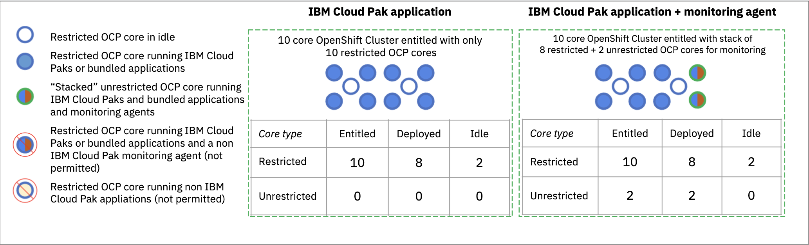
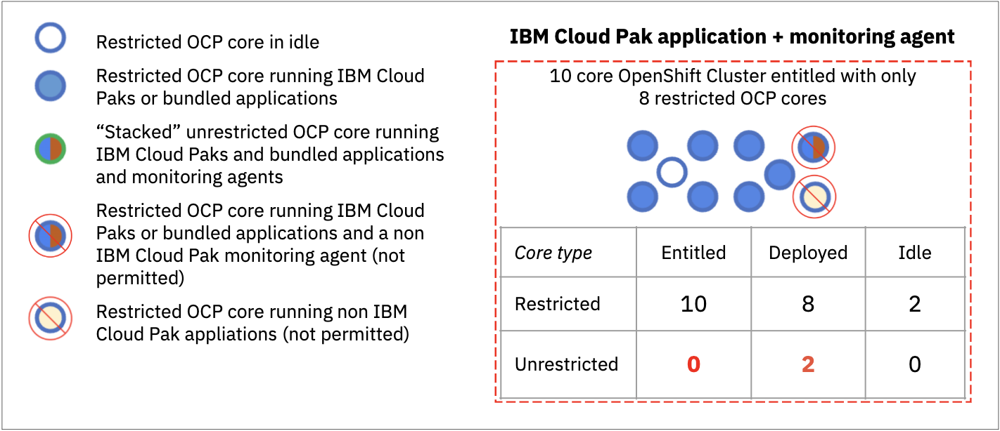
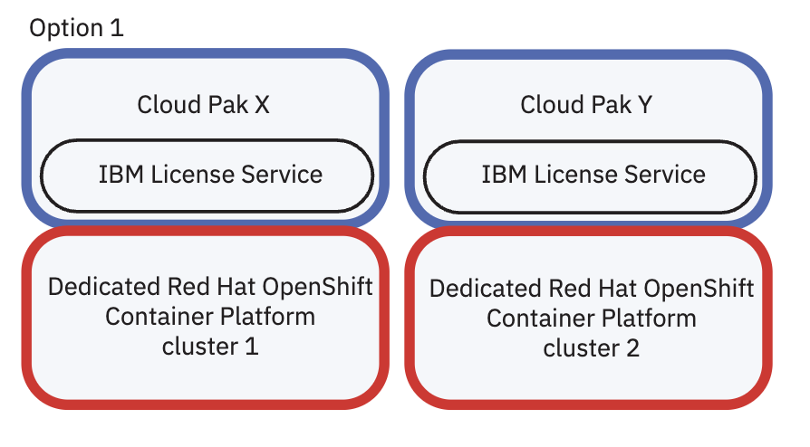
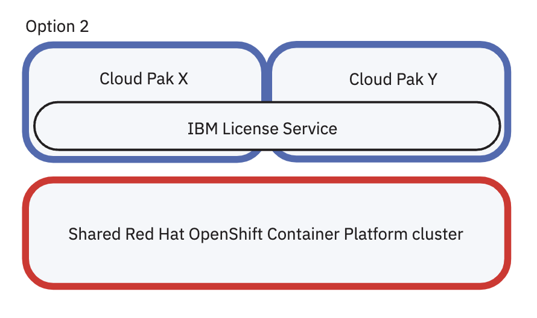
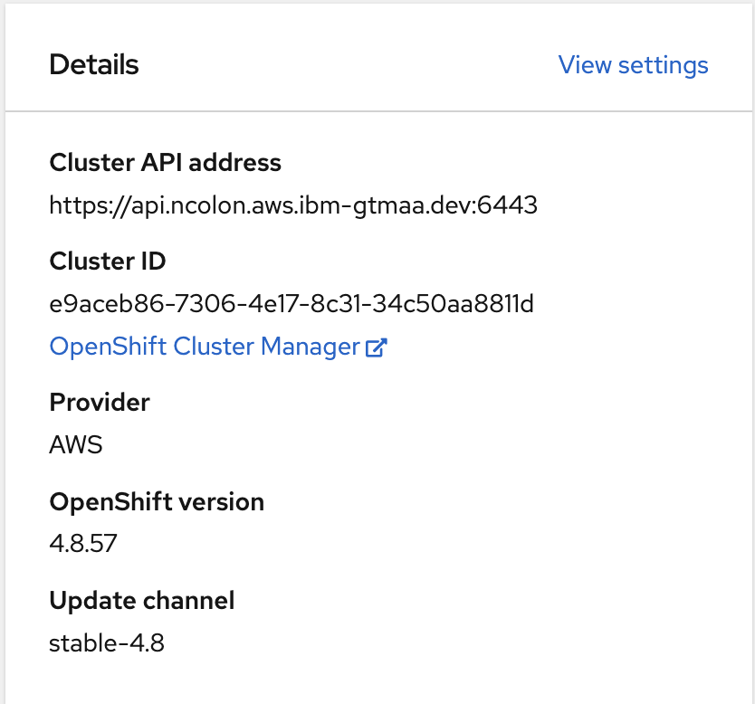
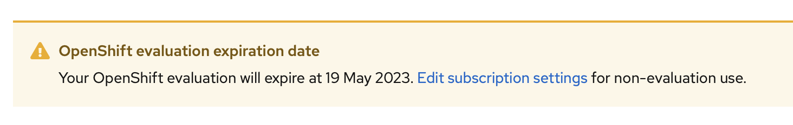
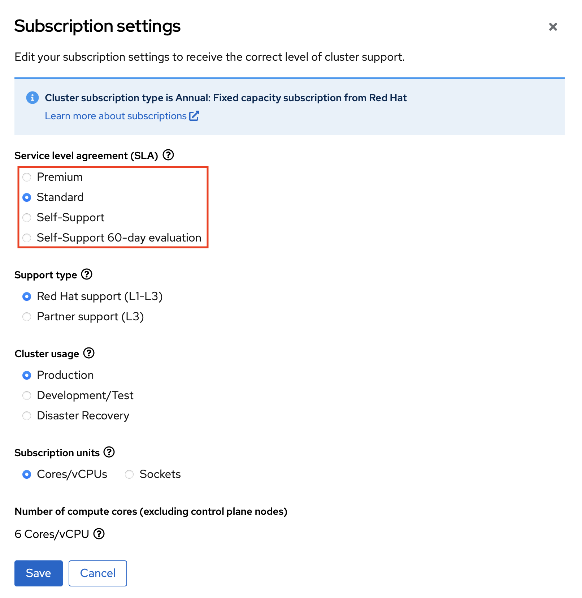
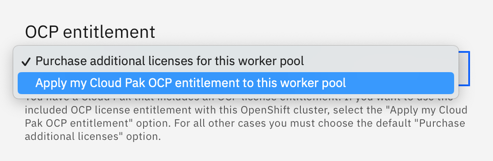

import { Link } from "gatsby";

<AnchorLinks small>
  <AnchorLink>Restricted Entitlements for IBM CloudPaks</AnchorLink>
  <AnchorLink>Unrestricted Entitlements</AnchorLink>
  <AnchorLink>Mixing Restricted and Unrestricted Entitlements</AnchorLink>
  <AnchorLink>Managing Red Hat Subscriptions</AnchorLink>
  <AnchorLink>ROSA Entitlements</AnchorLink>
  <AnchorLink>ROKS Entitlements</AnchorLink>
  <AnchorLink>Infrastructure Nodes and Entitlements</AnchorLink>
</AnchorLinks>

Licenses for Red Hat OpenShift are provided via two entitlement methods: restricted and unrestricted entitlements.

Depending on where you obtain Red Hat® OpenShift® Container Platform from, it can have implications on what you can deploy on it.[<a href="#references">1</a>]

Red Hat® OpenShift® Container Platform clusters **are entitled by cores, not by individual nodes**[<a href="#references">1</a>]. You can stack entitlements of different types together to ensure that all of the cores in a cluster have a valid entitlement according to the terms and conditions for that entitlement.

## Restricted Entitlements for IBM CloudPaks

If you obtain Red Hat OpenShift Container Platform as part of a bundle with your IBM Cloud Pak®, your Red Hat® OpenShift® Container Platform cores are restricted cores. They can only be used in support of your IBM Cloud® Paks.[<a href="#references">1</a>]

**Important**: Whether or not your Red Hat OpenShift Container Platform cores are restricted or not, you can still take full advantage of all of the features that are included in Red Hat OpenShift Container Platform, for example, but not limited to, OpenShift Pipelines.[<a href="#references">1</a>]

All Cloud Paks, with the exception of the Cloud Pak for Applications, provide a restricted use license of OpenShift in support of the services provided by the software in the Pak. These use cases are defined in the terms you agreed to upon the purchase of your Cloud Pak from IBM.[<a href="#references">2</a>]

### Permitted deployment

You can run IBM Cloud Paks and bundled applications on restricted cores. Any application that is not bundled with your IBM Cloud Paks (for example Dynatrace monitor) requires additional unrestricted cores. Any applications that do not run on Red Hat OpenShift Container Platform are not affected.

### Not Permitted Deployment

You cannot run any non IBM Cloud Pak or non IBM Cloud Pak bundled application or monitoring agent on restricted cores that are bundled with IBM Cloud Paks.

## Unrestricted Entitlements

If you obtain Red Hat OpenShift Container Platform independent of your IBM Cloud Pak, such as purchasing it directly through Red Hat®, your Red Hat® OpenShift® Container Platform cores are unrestricted cores. They can be used to support your IBM Cloud Paks and any other application (such as, but not limited to monitoring agents).

<InlineNotification>
  CloudPak for Applications provides unrestricted entitelems for the OpenShift
  cluster its deployed on.
   [<a href="#references">2</a>], [<a href="#references">3</a>]
</InlineNotification>

## Mixing Restricted and Unrestricted Entitlements

### Option 1: Separate Clusters

IBM Cloud Pak solutions with restricted Red Hat OpenShift Container Platform entitlements can be deployed and run in separate clusters. If this approach meets your needs, there is no further action required to manage compliance scenarios associated with mixed IBM Cloud Pak restricted license OpenShift Container Platform environments.[<a href="#references">3</a>]

### Option 2: Shared Restricted and Unrestricted Cluster

Multiple IBM Cloud Pak restricted and unrestricted OpenShift Container Platform configurations in a mixed environment. The IBM License Service can be leveraged to manage these environments. For more details about how to manage this scenario, continue reading <a href="https://www.ibm.com/docs/en/cloud-paks/1.0?topic=clusters-red-hat-mixed-entitlement-faq" target='_blank' rel='noreferrer noopener'>this FAQ</a>[<a href="#references">3</a>].

<InlineNotification>
  To keep track of your restricted and unrestricted license entitlements, you
  can leverage Red Hat's{" "}
  <a
    href="https://access.redhat.com/articles/ocp-subscription-watch"
    target='_blank' rel='noreferrer noopener'
  >
    Subscription Watch for OpenShift Container Platform
  </a>{" "}
  [<a href="#references">6</a>]
</InlineNotification>

## Managing Red Hat Subscriptions

Reference the <a href="images/entitlement_linking.pdf" target='_blank' rel='noreferrer noopener'>following guide</a> for instructions on how Cloud Pak customers can access the entitlements to the Red Hat products that come with their Cloud Paks.

### Updating to a support entitled license.

You can update your entitlements from a Self-Support 60-day evaluation trial license to a fully supported cluster. First locate your Cluster ID on your cluster console; its located on the main landing page

Next, log on to <a href="https://cloud.redhat.com/openshift" target='_blank' rel='noreferrer noopener'>Red Hat Hybrid Cloud Console</a> and search for your cluster. Once inside, you will see a banner on top reminding you that you're using a trial license.

Clicking on "Edit subscription settings" will allow you to move from a trial to a supported entitlement.

<InlineNotification kind="warning">
  For clusters with restricted entitlements, the subscription settings should be
  set to  
  <strong>SLA: Self-Supported</strong> and <strong>
    Support type: Partner support (L3)
  </strong>.[<a href="#references">2</a>]
</InlineNotification>

## ROSA Entitlements

Red Hat OpenShift Service on AWS (ROSA) provides a managed OpenShift experience integrated with AWS. The total cost of ROSA consists of two components: ROSA service fees and AWS infrastructure fees.

<InlineNotification>
  ROSA Clusters provide <strong>unrestricted</strong> OpenShift entitlements
</InlineNotification>

**ROSA service fees** accrue on demand, at an hourly rate of $0.171 per 4 vCPU used by worker nodes, plus a $0.03 per hour cluster fee.\* Service fees are not charged for the control plane or required infrastructure nodes. 1-year and 3-year\*\* ROSA service contracts offer savings between 33% and 55% off the on-demand service fees for worker nodes. ROSA service fees are uniform across all supported AWS Regions.

**AWS infrastructure fees** include fees for the underlying worker nodes, infrastructure nodes, control plane nodes, storage, and network. The minimal Amazon EC2 footprint for a multi-Availability Zone (AZ) ROSA deployment consists of 3 worker nodes, 3 infrastructure nodes, and 3 control plane nodes. For a deployment to a single-AZ, the minimal footprint shrinks to 2 worker nodes, 2 infrastructure nodes, and 3 control plane nodes. Control plane and infrastructure node sizing depends on the number of worker nodes in a cluster. See discussion on Limits and Scalability in the ROSA documentation. In addition to fees for the cluster components mentioned above, multi-AZ ROSA clusters incur fees for data transferred between nodes. Data transfer fees increase as nodes are added to the cluster. Information on fees for in-region data transfer is documented here. AWS infrastructure fees vary by Region. Use the AWS Pricing Calculator to estimate the cost of planned infrastructure in your preferred Region.

### Discounts for existing Red Hat OpenShift and IBM Cloud Pak customers[<a href="#references">4</a>]

Customers migrating non-ROSA OpenShift workloads to ROSA are eligible for a 75% discount off the ROSA service fee 1-year contract rate over the remaining term of their non-ROSA OpenShift subscriptions. IBM Cloud Pak customers migrating their Cloud Pak workloads to ROSA are eligible for a 50% discount off the ROSA service fee 1-year contract rate over the remaining term of their Cloud Pak licenses. These discounts can be obtained by contacting aws-redhat-partnerteam@amazon.com. The discounts apply only to ROSA service fees associated with the worker nodes running the migrated workloads.

## ROKS Entitlements

When you deploy Red Hat OpenShift on IBM Cloud (ROKS) Clusters, you can choose to apply your Cloud Pak entitlements to cover the costs of the OpenShift licenses at deployment time[<a href="#references">5</a>].

For any scenario where you will deploy additional workloads not entitled by IBM CloudPaks, you must choose to purchase additional licenses for your worker pools.

## Infrastructure Nodes and Entitlements

Infrastructure nodes allow customers to isolate infrastructure workloads for to prevent incurring billing costs against Red Hat OpenShift entitlement counts, regardless of using restricted or unrestricted OpenShift entitlements[<a href="#references">1</a>].

Red Hat subscription vCPU counts omit any vCPU reported by a node labeled `node-role.kubernetes.io/infra: ""` and you will not be charged for these resources from Red Hat[<a href="#references">7</a>].

<InlineNotification kind="warning">
  <strong>Important</strong>: You are still responsible for the costs associated
  with compute, storage and networking of these infrastructure nodes.
</InlineNotification>

The following infrastructure workloads do not incur OpenShift Container Platform worker subscriptions[<a href="#references">8</a>]:

- Kubernetes and OpenShift Container Platform control plane services that run on masters
- The default router
- The integrated container image registry
- The HAProxy-based Ingress Controller
- The cluster metrics collection, or monitoring service, including components for monitoring user-defined projects
- Cluster aggregated logging
- Service brokers
- Red Hat Quay
- Red Hat OpenShift Data Foundation
- Red Hat Advanced Cluster Manager
- Red Hat Advanced Cluster Security for Kubernetes
- Red Hat OpenShift GitOps
- Red Hat OpenShift Pipelines
- OpenShift Service Mesh[<a href="#references">9</a>]:

You may deploy and run custom and third-party agents and tools for monitoring, log data collection and forwarding, hardware drivers, infrastructure integration such as virtualization agents, etc., to infrastructure nodes without disqualifying the node for infrastructure licensing. However, this is limited only to agents and related components, including controller pods for operators and does not include the custom or third-party software suite. Examples of non-Red Hat software that qualify as infrastructure workload include[<a href="#references">10</a>]:

- Custom and third-party monitoring agents.
- Container network interface (CNI) and container storage interface (CSI) drivers and controllers (plug-ins).
- Hardware or virtualization enablement accelerators.
- Controller pods used for Kubernetes CRD or Operators (custom or third-party software).

## References

1. <a href="https://www.ibm.com/docs/en/cloud-paks/1.0?topic=clusters-restricted-openshift-entitlement">
     IBM's CloudPak Documentation
   </a>
2. <a href="https://access.redhat.com/articles/5024951" target='_blank' rel='noreferrer noopener'>
     Support for IBM Cloud Paks - Frequently Asked Questions
   </a>
3. <a
     href="https://www.ibm.com/docs/en/cloud-paks/1.0?topic=clusters-red-hat-mixed-entitlement-faq"
     target='_blank' rel='noreferrer noopener'
   >
     Red Hat OpenShift Container Platform mixed entitlement FAQ
   </a>
4. <a href="https://aws.amazon.com/rosa/pricing/" target='_blank' rel='noreferrer noopener'>
     ROSA Pricing
   </a>
5. <a
     href="https://cloud.ibm.com/docs/openshift?topic=openshift-costs#licenses-cloud-pak"
     target='_blank' rel='noreferrer noopener'
   >
     ROKS Entitlements
   </a>
6. <a
     href="https://access.redhat.com/articles/ocp-subscription-watch"
     target='_blank' rel='noreferrer noopener'
   >
     Subscription Watch for OpenShift Container Platform
   </a>
7. <a href="https://access.redhat.com/solutions/5034771" target='_blank' rel='noreferrer noopener'>
     KB: Infrastructure Nodes in OpenShift 4
   </a>
8. <a
     href="https://docs.openshift.com/container-platform/latest/nodes/nodes/nodes-nodes-creating-infrastructure-nodes.html#infrastructure-components_creating-infrastructure-nodes"
     target='_blank' rel='noreferrer noopener'
   >
     OpenShift Container Platform infrastructure components
   </a>
9. <a
     href="https://docs.openshift.com/container-platform/4.12/service_mesh/v2x/ossm-create-smcp.html#ossm-about-control-plane-components-and-infrastructure-nodes_ossm-create-smcp"
     target='_blank' rel='noreferrer noopener'
   >
     About [Service Mesh] control plane components and infrastructure nodes
   </a>
10. <a
      href="https://www.redhat.com/en/resources/self-managed-openshift-sizing-subscription-guide"
      target='_blank' rel='noreferrer noopener'
    >
      Self-managed Red Hat OpenShift sizing and subscription guide
    </a>
