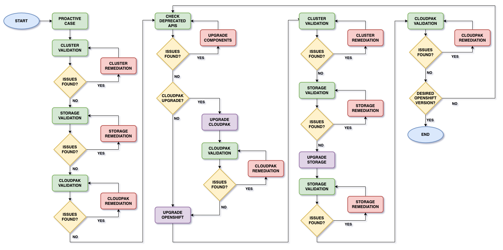
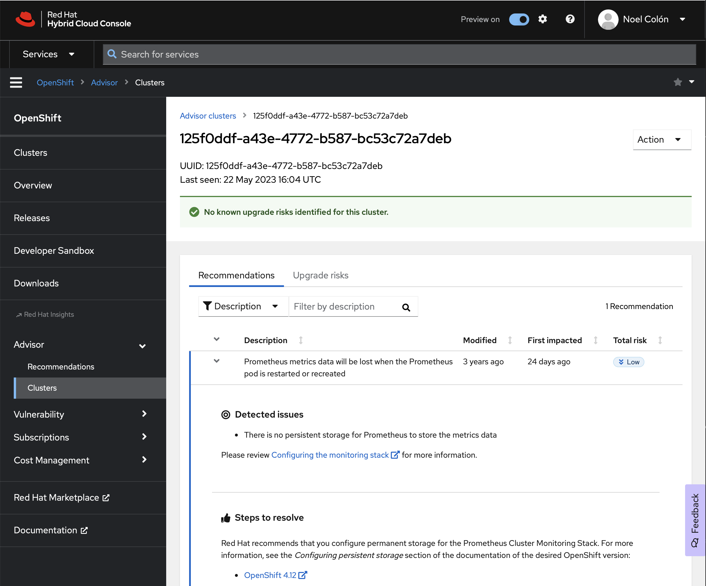
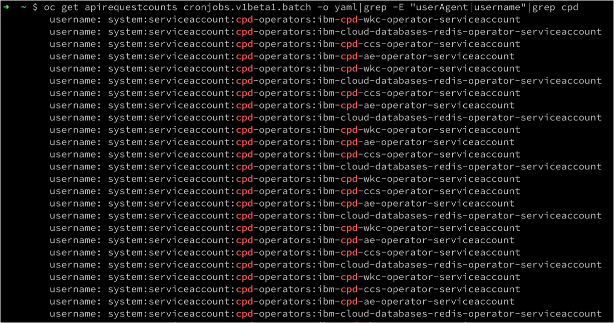
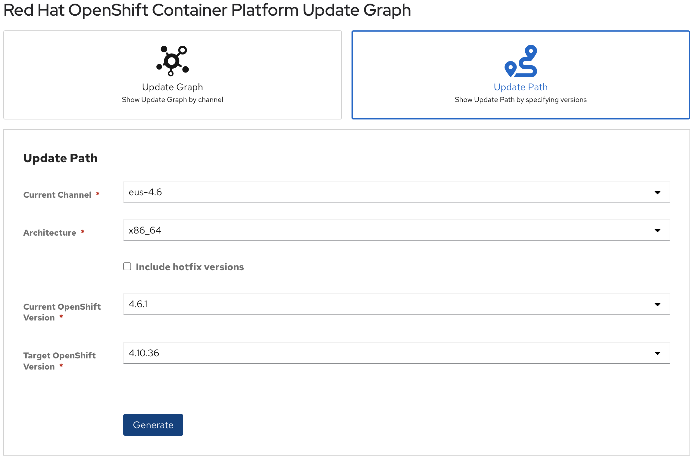
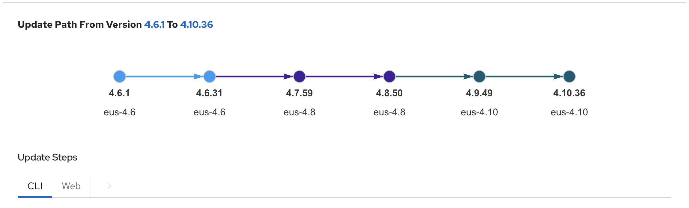

import { Link } from "gatsby";
import FileLink from "../../../components/FileLink";

OpenShift upgrades come in two different forms, minor or z-stream upgrades, and major upgrades. The general upgrade process is highlighted on <Link to="https://docs.openshift.com/container-platform/latest/updating/index.html
" target='_blank' rel='noreferrer noopener'>Red Hat's Documentation Site</Link>.

### Minor Upgrades

In a minor upgrades, the cluster is updated to a newer version within the same <Link to="https://docs.openshift.com/container-platform/latest/updating/understanding-upgrade-channels-release.html" target='_blank' rel='noreferrer noopener'>channel</Link>.
When doing minor upgrades, no added functionality is provided, the underlying Kubernetes major version stays the same, and no APIs are deprecated. It is generally a safe upgrade to perform. The latest z-stream is always recommneded to maintain CVE compliance.

### Major Upgrades

In a major upgrade, you're updating the channel and moving to a newer <Link to="/common/redhat/releasenotes" target='_blank' rel='noreferrer noopener'>release</Link>.
In this upgrade, new functionality may or may not be added to the OpenShift cluster, the Kubernetes version is updated, and APIs can be deprecated, updated or removed completely.

## Upgrade Flow



When upgrading OpenShift, special considerations must be taken into account with regards to the overall cluster health, storage and any CloudPak deployed prior to upgrading each component. The flow above provides a high level overview of what this process looks like. **The key to sucecss is validation and remediation prior to any upgrade action.** Let's break down each of the steps shown in the flow above.

### Proactive Case

Before upgrading your cluster, you can open a <Link to="/common/support/proactive-upgrade-support">proactive upgrade case</Link> with IBM Support, and request that a corresponding ticket be created with Red Hat Support.
Open the case as a Sev3, include dates and planned activities, and provide at least 2 weeks notice prior to your upgrade, and be prepared to provide any must-gather information that IBM Support requests. These must-gathers will be used to diagnose any potential issues prior to the upgrade date.
If at any point during the upgrade process you need assistance, request that the IBM Support ticket be raised to Sev1, and if needed, request that IBM Support engage Red Hat Support for additional help.

### Cluster Validation

Ensure there are no issues with your cluster prior to starting any upgrade activities.

- Check Current Status: `oc get clusterversion`

```bash
$ oc get clusterversion
NAME      VERSION   AVAILABLE   PROGRESSING   SINCE   STATUS
version   4.12.13   True        False         14d     Cluster version is 4.12.13
```

- Check Cluster Operators: `oc get co`

```bash
$ oc get co
NAME                      VERSION   AVAILABLE   PROGRESSING   DEGRADED   SINCE   MESSAGE
authentication            4.12.13   True        False         False      46h
baremetal                 4.12.13   True        False         False      18d
cloud-controller-manager  4.12.13   True        False         False      16d
cloud-credential          4.12.13   True        False         False      18d
```

In a healthy cluster, the `VERSION` field must match for all operators, and all operators must be `Avaialble=True`, `Progressing=False`, `Degrared=False`. In OpenShift 4.9 and later, the message field will provide additinoal information on any issues the cluster operator may be experiencing.

- List MachineHealthCheck: `oc get machinehealthcheck -n openshift-machine-api`

```bash
$ oc get machinehealthcheck -n openshift-machine-api
NAME                              MAXUNHEALTHY   EXPECTEDMACHINES   CURRENTHEALTHY
machine-api-termination-handler   100%           0                  0
```

- Check Node Health: `oc get nodes`

```bash
$ oc get nodes
NAME                                         STATUS   ROLES            AGE   VERSION
ip-10-0-143-84.us-east-2.compute.internal    Ready    master           18d   v1.25.8+27e744f
ip-10-0-148-158.us-east-2.compute.internal   Ready    worker           18d   v1.25.8+27e744f
ip-10-0-160-252.us-east-2.compute.internal   Ready    worker           18d   v1.25.8+27e744f
ip-10-0-191-148.us-east-2.compute.internal   Ready    master           18d   v1.25.8+27e744f
ip-10-0-194-222.us-east-2.compute.internal   Ready    worker           18d   v1.25.8+27e744f
ip-10-0-208-33.us-east-2.compute.internal    Ready    master           18d   v1.25.8+27e744f
```

All nodes should be in `STATUS=Ready`, and the `VERSION` field should be the same for all nodes.

- Visit your cluster [Insights Advisor](https://console.redhat.com/preview/openshift/insights/advisor)
  

<InlineNotification kind="error">
  If you find any issue during these validation steps,{" "}
  <strong>DO NOT CONTINUE</strong> until any and all issues are remediated. If
  you need assitance from IBM or Red Hat, increase severity of the proactive
  case opened above and provide any relevant details.
</InlineNotification>

### Storage Validation

Before upgrading any component, ensure there are no issues with your cluster storage. If you're using OpenShift Data Foundation, make sure the health of your ceph cluster is reporting as `HEALTH_OK`.

```bash
$ oc patch OCSInitialization ocsinit -n openshift-storage --type json \
  --patch  '[{ "op": "replace", "path": "/spec/enableCephTools", "value": true }]'
$ TOOLS_POD=$(oc get pods -n openshift-storage -l app=rook-ceph-tools -o name)
$ oc rsh -n openshift-storage $TOOLS_POD ceph status
  cluster:
    id:     255c4a87-8260-48c2-8f11-9cf31866fbc6
    health: HEALTH_OK

  services:
    mon: 3 daemons, quorum a,b,c (age 5m)
    mgr: a(active, since 5m)
    mds: 1/1 daemons up, 1 hot standby
    osd: 3 osds: 3 up (since 3m), 3 in (since 2w)

  data:
    volumes: 1/1 healthy
    pools:   4 pools, 97 pgs
    objects: 46.75k objects, 63 GiB
    usage:   184 GiB used, 5.8 TiB / 6 TiB avail
    pgs:     97 active+clean

  io:
    client:   65 MiB/s rd, 6.6 MiB/s wr, 494 op/s rd, 699 op/s wr
```

The cluster health status should be `HEALTH_OK`. It is normal during the upgrade processs for this status to change to `HEALTH_WARN` as cluster components are upgraded. If after a reasonable time the status of your storage cluster hasn't changed back to `HEALTH_OK`, increase severity of the proactive case opened in the first step and provide any relevant details.

<InlineNotification kind="error">
  If you find any issue during this validation process,{" "}
  <strong>DO NOT CONTINUE</strong> until any and all issues are remediated.
</InlineNotification>

### CloudPak Validation

- Ensure all pods are running, and youre able to log on to the CloudPak administration console
- Validate status of all CloudPak `CustomResources`
- If you're running CloudPak for Data, you can leverage `cpd-cli manage get-cr-status` to validate all CRs have a status of `Completed`.

```bash
$ cpd-cli manage get-cr-status --cpd_instance_ns=${PROJECT_CPD_INSTANCE}
. . .
ws_runtimes,NotebookRuntime,ibm-cpd-ws-runtime-222-py,Completed,6.4.0,2023-04-29T19:04:19Z,6.4.0,6.4.0011
dv,DvService,dv-service,Completed,2.0.4,2023-04-29T00:56:45Z,--,--
wkc,WKC,wkc-cr,Completed,4.6.4,2023-04-28T22:51:47Z,--,--
wml,WmlBase,wml-cr,Completed,4.6.4,2023-04-28T22:02:55Z,4.6.4,4.6.4-4559
ws,WS,ws-cr,Completed,6.4.0,2023-04-28T21:01:26Z,6.4.0,19
db2aaservice,Db2aaserviceService,db2aaservice-cr,Completed,4.6.4,2023-04-28T22:53:59Z,4.6.4+11.5.8.0-cn2+2039,4.6.4+11.5.8.0-cn2+2039
dmc,Dmcaddon,data-management-console-addon,Completed,4.6.4,2023-04-29T00:59:26Z,--,--
datarefinery,DataRefinery,datarefinery-sample,Completed,6.4.0,2023-04-28T21:39:14Z,--,--
analyticsengine,AnalyticsEngine,analyticsengine-sample,Completed,4.6.4,2023-04-29T20:33:18Z,4.6.4,1343
ccs,CCS,ccs-cr,Completed,6.4.0,2023-04-28T21:03:28Z,6.4.0,110
cpd_platform,Ibmcpd,ibmcpd-cr,Completed,4.6.4,2023-04-28T19:19:19Z,--,--
scheduler,Scheduling,ibm-cpd-scheduler,Completed,1.10.0,2023-04-29T18:06:37Z,1.10.0,1.10.0+20230307.002712.c334806
zen,ZenService,lite-cr,Completed,4.8.2,2023-04-28T19:21:50Z,4.8.2,zen operator 1.8.2 build 46
[SUCCESS] 2023-05-17T14:42:39.138020Z You may find output and logs in the /home/ncolon/cpd-cli-workspace/olm-utils-workspace/work directory.
[SUCCESS] 2023-05-17T14:42:39.138413Z The get-cr-status command ran successfully.
```

<InlineNotification kind="error">
  If you find any issue during this validation process,{" "}
  <strong>DO NOT CONTINUE</strong> until any and all issues are remediated.
</InlineNotification>

### Check for Deprecated APIs

OpenShift is built on top of Kubernetes, with its fast-evolving technological landscape. As such, API versions get deprecated, and eventually removed, in favor of the newest and more stable API versions. The <Link to="https://kubernetes.io/docs/reference/using-api/deprecation-guide/
">Kubernetes deprecation guide</Link> describes this process, as well as target Kubernetes versions where APIs will be deprecated and removed.

#### Pre OCP 4.9 check

- Validate that none of the API resources removed in <Link to="https://access.redhat.com/articles/6329921">OpenShift 4.9</Link> are being used.

  ```bash
  $ oc get CustomResourceDefinition |grep ^apiVersion | grep v1beta1
  $ oc get MutatingWebhookConfiguration | grep ^apiVersion | grep v1beta1
  $ oc get ValidatingWebhookConfiguration | grep ^apiVersion | grep v1beta1
  ```

#### Pre OCP 4.12 check

- Validate that none of the API resources removed in <Link to="https://access.redhat.com/articles/6955381">OpenShift 4.12</Link> are being used. OpenShift 4.11 introduced a new CustomResource `ApiRequestCounts` that provides information on usage of API versions. You can look at the `userAgent` and `username` fields to determine what OpenShift component is making use of deprecated APIs

  ```bash
  $ oc get apirequestcounts cronjobs.v1beta1.batch -o yaml|grep -E "userAgent|username"
  ```

Here's an example of a CloudPak for Data cluster using deprecated APIs in the `cpd-operators` namespace.


If any deprecated APIs are in use, you must upgrade the components that are using those APIs to prevent outages post-upgrade.

The `ApiRequestCounts` object includes the status.currentHour and status.last24hr to help you determine what has been accessed recently.

After upgrading your components, make sure to provide the admin acknowledgement documented in each of the Knowledge Articels above.

<InlineNotification kind="warning">

Prior to upgrading, make sure that cluster workloads do not rely on API objects unavailable in a next release version.
OpenShift provides alerts that you can <Link to="https://docs.openshift.com/container-platform/4.9/updating/updating-cluster-prepare.html#evaluating-cluster-removed-apis" target='_blank' rel='noreferrer noopener'>review</Link> as part of the upgrade planning session to determine the proper course of action. For example, you may need to upgrade a CloudPak component before upgrading OpenShift releases.

</InlineNotification>

### Determine if a CloudPak Upgrade is needed

Deprecated APIs are a big driver in determining if a CloudPak upgrade is required. The following resources can help you determine when a CloudPak needs to be upgraded

#### Software Product Compatibility Reports (SPCR)

The official product compatibility reports can be obtained from <Link to="https://www.ibm.com/software/reports/compatibility/clarity/index.html">SPCR</Link>. On the website, select "Detailed system requirements" from the left side menu, then search for your product name. Select the appropriate product from the Search results, and then the version. It will produce a report that will include compatible versions of OpenShift and other platforms where the product may run.

| CloudPak Scpecific Documentation     |                                                                                                                                             |
| ------------------------------------ | ------------------------------------------------------------------------------------------------------------------------------------------- |
| **CloudPak for Data**                | https://w3.ibm.com/w3publisher/cpd_om/cloud-pak-for-data/lifecycle<br/>https://www.ibm.com/docs/en/cloud-paks/cp-data/4.6.x?topic=upgrading |
| **CloudPak for Integration**         | https://www.ibm.com/docs/en/cloud-paks/cp-integration/2022.4?topic=upgrading-overview                                                       |
| **CloudPak for AIOps**        | https://www.ibm.com/docs/en/cloud-paks/cloud-pak-watson-aiops/3.7.0?topic=requirements-supported-openshift-versions                         |
| **CloudPak for Business Automation** | https://www.ibm.com/docs/en/cloud-paks/cp-biz-automation/22.0.2?topic=upgrading-cp4ba-multi-pattern-clusters-from-2201                      |
| **CloudPak for Security**            | https://www.ibm.com/docs/en/cloud-paks/cp-security/1.10?topic=installing-upgrading-cloud-pak-security                                       |
| **CloudPak for Network Automation**  | https://www.ibm.com/docs/en/cloud-paks/cp-network-auto/2.3.x?topic=upgrading                                                                |

### General CloudPak upgrade process

- Mirror new images (if needed)
- Update CatalogSource
- Update Subscriptions
- Update Component channels
- Update or Migrate Services and CustomResources

Consult the CloudPak documentation above for detailed information on each product.

#### Common Issues and Best Practices

- Pods in `ImagePullBackOff`: mirroring process did not complete successfully. Determine the pod image in use, and use skopeo inspect/list-tags/copy to copy the image over to the private image registry
- Pods stuck in `Terminating`, `Pending` state: This usually indicates a capacity issue. When a node is upgraded, the Kubernetes scheduler will signal the node to evict all running pods (Terminating state), and a new one will be created (Pending state). If theres not enough capacity to fit the new pod in any node, the process will hang. To work around this, you can create a temporary node to add capacity. The best way to achieve this is by scaling a worker MachineSet.
- `restrictedSCCs`: When you authenticate to an OpenShift cluster using the default KUBECONFIG file generated by the OpenShift installer, you're logged in as `system:admin`. This user may not have access to all restrictedSCCs in a cluster. Instead, log on with `oc login` as either kubeadmin or with a cluster-admin account.
- `PodDisruptionBudgets`: If an application with a single replica is using PodDisruptionBudgert with `minAvailable: 1`, the PDB will prevent it from being migrated to a new node during the node eviction process. To work around this, temporarily set `minAvailable: 0` on the PDB.
- OLM issues with CatalogSources, Subscriptions, CatalogSourceVersions and InstallPlans: If you're running your operator Subscriptions with `installPlanApproval: Manual`, consider switching them temporarily to Automatic to allow for a smoother upgrade experience. You may also expereince version mismatch between Subscription and CSVs. To work around this issue, you can delete the affected CSV, Subscription and InstallPlan, and then recreate the Subscription. \*\*Do not delete the `CustomResourceDefinitions` creataed by the InstallPlans. OLM will reconcile the cluster state in its next reconciliation loop.
- CommonServices and Zen: You may experience issues with user management migrations from CommonServices to Zen. There are updated scipts referenced in the product documentation to help you recover from this issue.
- **If you require assistance to recover from any issue, update the proactive case to a Sev1 and ask for CloudPak support to be involved.**

<InlineNotification kind="warning">
  Repeat the CloudPak validation process and remediate any issues before
  proceeding.
</InlineNotification>

### OpenShift Upgrades

Skipping OpenShift major versions is not supported. If you're doing multiple upgrades to reach a desired OpenShift version, ensure the proper upgrade path is followed to minimize downtime and disruption. This <Link to="https://access.redhat.com/labs/ocpupgradegraph/update_path" target='_blank' rel='noreferrer noopener'>OCP Upgrade Graph</Link> application will guide the cluster administrator thru the proper upgrade path.




#### OpenShift upgrade procedure

The OpenShift upgrade process consists of updating the desired cluster channel and versions. To do so:

- Mirror the platform images and apply the release signature (if needed for AirGapped installations)
- If you're doing EUS to EUS upgrades, pause the MachineConfigPools so that worker nodes are updated only after the EUS upgrade path is finished.

  ```bash
  $ oc patch mcp/worker --type merge --patch '{"spec":{"paused":true}}'
  ```

  <br />

- Switch the cluster to the next desired channel

  ```bash
  $ oc adm upgrade channel eus-4.x
  ```

  <br />

- Upgrade the cluster to the next version specified in the OCP Upgrade Graph above.

  ```bash
  $ oc adm upgrade --to='4.x.y'
  ```

  <br />

- If you're finished an EUS to EUS upgrades, resume the MachineConfigPools so that the worker node Kubernetes version can be updated.

  ```bash
  $ oc patch mcp/worker --type merge --patch '{"spec":{"paused":false}}'
  ```

<InlineNotification>
  The above steps can be performed from the OpenShift Console by navigating to
  <strong> Administration > Cluster Settings</strong>
</InlineNotification>

#### Common Issues and Best Practices

- Nodes may not upgrade correctly after resuming MachineConfigPools. If this happens, you can force the Machine Config daemon to re-run:

  ```bash
  $ oc debug node/<nodename> -- chroot /host \
       touch /run/machine-config-daemon-force
  ```

<br />

- If you'd like to monitor the upgrade process as it unfolds, you can run
  the following command. It will give you the state of all your nodes, cluster operators, as well as a list of pods that are not running.

  ```bash
  $ watch "oc get nodes;
          oc get clusteroperators;
          oc get pods -A | grep -Ev \"(\w)/\1|Completed\""
  ```

<br />

- **If you require assistance to recover from any issue, update the proactive case to a Sev1 and ask for Red Hat support to be involved.**

<InlineNotification kind="warning">
  Repeat the OpenShift, Storage and CloudPak validation process and remediate
  any issues before proceeding.
</InlineNotification>

#### Special considerations for ROKS on IBM Cloud

Follow the IBM Cloud documentation for <Link to="https://cloud.ibm.com/docs/openshift?topic=openshift-update">ROKS updates</Link>. Be aware that prior to upgrading a ROKS cluster to 4.11, <Link to="https://cloud.ibm.com/docs/openshift?topic=openshift-rhel_migrate">worker node pools needs to be replaced</Link>, as OpenShift 4.11 requires that nodes run RHEL8 or later.

### Storage Upgrade

The OpenShift Container Storage/Data Foundation upgrade process consists of updating the Subscription to the latest channel available.

- If you've just upgraded OpenShift to a version under 4.9, you need to update the OpenShift Container Storage subscription to the latest version

  ```bash
  $ oc patch sub -n openshift-storage ocs-operator --type json --patch '[{ "op": "replace", "path": "/spec/channel", "value": "stable-4.x" }]'​
  ```

<br />

- If you're already running OpenShift Data Foundation

  ```bash
  $ oc patch sub -n openshift-storage odf-operator --type json --patch '[{ "op": "replace", "path": "/spec/channel", "value": "stable-4.x" }]'​
  ```

<br />

#### Common Issues and Best Practices

- OLM issues with CatalogSources, Subscriptions, CatalogSourceVersions and InstallPlans: If you're running your operator Subscriptions with `installPlanApproval: Manual`, consider switching them temporarily to Automatic to allow for a smoother upgrade experience. You may also expereince version mismatch between Subscription and CSVs. To work around this issue, you can delete the affected CSV, Subscription and InstallPlan, and then recreate the Subscription. \*\*Do not delete the `CustomResourceDefinitions` creataed by the InstallPlans. OLM will reconcile the cluster state in its next reconciliation loop.
- After upgrading to OpenShift 4.8, the OCS Subscription will no longer show as installed in the OperatorHub UI. To remediate, deploy the ODF operator manually from OperatorHub. There's no need to create a `StorageSystem`, the ODF operator will automatically create one and map it to the existing OCS `StorageCluster`.
- Upgrade OCS/ODF Subscriptions after each OCP upgrade. The redhat-marketplace CatalogSource does not include n-2 versions of the OCS/ODF operator. Should you run into this issue, you can delete the current Subscription and CSV, and deploy the desired version of ODF. OLM will reconcile the cluster state in its next reconciliation loop.
- **If you require assistance to recover from any issue, update the proactive case to a Sev1 and ask for IBM Storage support to be involved.**

<InlineNotification kind="warning">
  Repeat the Storage and CloudPak validation process and remediate any issues
  before proceeding.
</InlineNotification>

### Target OpenShift Version?

If you still need to upgrade your cluster to reach your target cluster version, repeat the process above until you've reached it.
