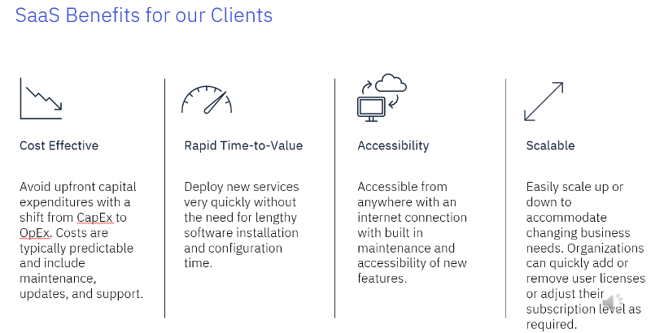

import {Link} from 'gatsby';
import FileLink from '../../components/FileLink';

<Row>
<Column colMd={9} colLg={9}>

## What is SaaS?

Software as a Services (SaaS) is application software hosted on the cloud and used over the internet by way of a web browser, mobile app or thin client. SaaS solutions include the application/software, management, and infrastructure in one cost-effective way.  A SaaS solution can be hosted by the client or a service provider like IBM, AWS, or Azure. With a non-SaaS solution, the client needs to address all aspects of the software, management and infrastructure separately. 

</Column>
<Column colMd={3} colLg={3}>

 

<Aside>

**Recommended read about SaaS in IBM**

<a href='https://www.ibm.com/topics/saas' target='_blank' rel='noreferrer noopener'>What is Software as a service (SaaS)?</a>

</Aside>

<Aside>

**Watch this 5-min video**

<a href='https://youtu.be/20QUNgFIrK0?si=bMu_1viX8zwLOtzq' target='_blank' rel='noreferrer noopener'>Software as a Service (SaaS) explained</a>

</Aside>

<Aside>

**Learning plan**

<a href='https://yourlearning.ibm.com/activity/PLAN-3F659A4C3BAC' target='_blank' rel='noreferrer noopener'>SaaS Principles learning plan</a>

</Aside>

</Column>
</Row>

<Row>
<Column colMd={9} colLg={9}>

## Benefits of SaaS

The benefits of SaaS might be best understood when compared to non-SaaS software. SaaS is cost-effective, has lower overhead, is more current, and provides fast adoption and time-to-benefit.

</Column>

<Column colMd={3} colLg={3}>

 

<Aside>

**All CS-covered products**

<a href='https://w3.ibm.com/w3publisher/customersuccess/the-practice/csm-covered-offerings' target='_blank' rel='noreferrer noopener'>CS-covered products</a>

</Aside>

<Aside>

**How are my targets set?**

<a href='https://w3.ibm.com/w3publisher/customersuccess/the-practice/success-metrics/understanding-saas-growth' target='_blank' rel='noreferrer noopener'>How does the metric work?</a>

</Aside>

</Column>
</Row>

<Row>
<Column colMd={9} colLg={9}>

## Strategies to drive SaaS revenue

When building a plan to drive revenue growth, the first step is to understand the levers to impact the revenue.

SaaS products are licensed as consumption-based or ratable. To form your strategy, you will need to know how the product is licensed.

| License type | Definition | Products | When is revenue impacted? |
| --- | --- | --- | --- |
| Consumption or Metered | Pay-per-use revenue that is recognized monthly based on usage. | SaaS products that are consumption-based include all wastonx products. | - Direct, monthly impact on IBM’s revenue when the client usage increases.   - Monthly Recurring Revenue (MRR)   - Impact revenue immediately by driving more usage. |
| Ratable | Revenue is recognized in a consistent way over the term of the contract. It is a fixed amount of usage that is billed based on the contract term i.e. monthly/quarterly. | SaaS products that are ratable include SaaS products that are not watsonx. | - Revenue increase happens at the time of renewal and expansion to the next tier of usage. |

### Strategies for building SaaS with your customers

Cost savings, feature access, and on-demand scalability are all critical to how a CSM can help customers realize the benefits of SaaS. Your customer may be already using SaaS. It is important to connect SaaS benefits with your customer's business objectives.

<Tabs>

<Tab label='1. Research the client'>

First, research your client by looking at the entitlements. This includes: 
* New sales opportunities in ISC
* Standalone, SaaS licenses in Gainsight. See the <Link to='/onboard/gainsight-csm-dash/'>Gainsight dashboard.</Link>
* IBM Cloud subscription licenses, If you're not familiar with IBM Cloud Subscription entitlements start by looking at your entitlement list for IBM Cloud and dive deeper into usage and burn-down reporting in Gainsight. (link to learn more about IBM Cloud SaaS)

</Tab>

<Tab label='2. Review client industry'>

Second, review the latest about your client's business points and industry. See <Link to='/onboard/understand-client-it-landscape/'>Learn about your customer</Link> for ideas on researching your client.

</Tab>

<Tab label='3. Explore expansion opportunities'>

After you understand the client's pipeline and entitlements, explore opportunities for building your growth plans.

Recommendations include: 
* Review the <Link to='/onboard/strategic-account-planning'>Account planning</Link> in ISC.
* Explore <a href='https://ibm.biz/IBM_STARS'  target='_blank' rel='noreferrer noopener'>STAR</a> for assets of implementations that address similar challenges or obstacles your client might have.
* Hold a <Link to="/use-case-discovery/" target='_blank'>use case discovery session to find the right opportunity</Link> as part of the QBR.
* Define the <Link to='/onboard/business-outcomes-framework'>business value of the solution</Link> as a lunch and learn.
* Check out the <a href='https://ibm.seismic.com/Link/Content/DCQjf8FMD4jpb89XB624MmTQ9h48' target='_blank' rel='noreferrer noopener'>Relationship Barometer in ISC to understand the political influence of your contacts.</a>
* Implement ICEM <a href='https://ibm.seismic.com/Link/Content/DCWfXdJpMBd338cQh6XQHQPHQ8m8' target='_blank' rel='noreferrer noopener'>prospecting strategies</a> to drive rich pipeline and growth.

</Tab>

</Tabs>

</Column>
<Column colMd={3} colLg={3}>

 

<Aside>

**Renewals are key to growth**

<Link to='/expand-renew/renew-offerings'>Renew offerings</Link>

</Aside>

</Column>

</Row>

<Row>
<Column colMd={9} colLg={9}>

### Leveraging IBM Cloud catalog subscriptions to grow SaaS 

The IBM Cloud catalog includes many SaaS growth offerings including wastonx. Using the IBM cloud subscription, a client doesn’t need to worry about the management and infrastructure. The customer can provision and onboard the SaaS solution quickly.

CSMs can see the IBM Cloud subscriptions in Gainsight under the IBM Cloud relationship in Gainsight. This consumption subscription or metered revenue is recognized based on the usage a client has in the current month and will immediately improve revenue to IBM. To achieve SaaS growth for these clients, drive more usage and it will immediately drive revenue growth.

</Column>
<Column colMd={3} colLg={3}>

 

<Aside>

**IBM Cloud**

Understand IBM Cloud's <a href='http://localhost:8000/common/public-cloud/csm-cloud-overview/#ibms-shift-from-subscription-to-enterprise-savings-plans-for-the-ibm-cloud-catalog'>shift to ESP</a>

See the full <a href='https://cloud.ibm.com/catalog'>IBM Cloud Catalog.</a> 

</Aside>

<Aside>

**Start a new IBM Cloud account**

<a href='https://cloud.ibm.com/docs/overview?topic=overview-get-started-checklist'>Get started checklist</a>

</Aside>

</Column>
</Row>

<Row>
<Column colMd={9} colLg={9}>

### Subscription burndown

A Watson Subscription is a purchase of Entitlement Credits that can be used to pay for services and resources used 
on the IBM Cloud Platform. When your client places an order for a Watson Subscription, they receive a subscription code. They need to create an IBM Cloud account and apply the subscription code to the account. This loads the purchased entitlement credits into 
the account.

Subscription codes are managed by authorized users on the IBM Cloud account. The customer designates users who can apply the codes and ‘order’ or use credits for new deployments. If the client fails to enter the code, the revenue is not recognized.

</Column>

<Column colMd={3} colLg={3}>

 

<Aside>

**Subscription resources**

<a href='https://cloud.ibm.com/docs/billing-usage?topic=billing-usage-subscription_code&interface=ui' target='_blank' rel='noreferrer noopener'>Applying subscription codes</a> 

 

<a href='https://cloud.ibm.com/docs/billing-usage?topic=billing-usage-subscriptions&interface=ui' target='_blank' rel='noreferrer noopener'>Managing subscriptions</a>
</Aside>

<Aside>

**Meet the RSET team**

<a href='https://w3.ibm.com/w3publisher/cloudrset/faqs' target='_blank' rel='noreferrer noopener'>Questions about billing</a>

</Aside>

</Column>
</Row>

<Row>
<Column colMd={9} colLg={9}>

## SaaS target deployment metrics

Each SaaS product has specific target metrics to determine the CS deployment metric.  CSMs should create and manage their growth plans following our best <Link to='/onboard/gainsight-create-growth-plan/'>practices</Link>. After your growth plan reaches the deployed stage, usage will be reported until the client reaches the deployment milestones defined by the product. The initial deployment, expansion criteria for additional deployments, and churn are defined at the product level.

</Column>

<Column colMd={3} colLg={3}>

 

<Aside>

**SaaS Growth Plan**

<Link to='/onboard/gainsight-create-growth-plan/#build-a-saas-growth-plan'>Build a SaaS Growth Plan</Link>

</Aside>

</Column>
</Row>

<Row>
<Column>

## SaaS products and CSM Scorecard Milestones based on usage

Usage milestones are determined by either the success plan stage or usage. Read more details about <Link to='/onboard/gainsight-milestones/#usage-milestones'>Usage Milestones.</Link>

Read about how the <Link to='/onboard/gainsight-milestones/#how-is-the-not-started-milestone-set-for-saas-offerings-with-milestones-based-on-usage-data/'>Not Started Milestone</Link> is set for these products.

-----
### Data and AI SaaS Milestones based on usage

<InlineNotification kind="warning">

**Note:**

<ul>
<li>All watsonx <strong>PLATFORM SaaS</strong> deployment threshold automation is under evaluation.
<ul>
<li>CSMs mark customers deployed in a Growth Plan with manager sign-off.</li>
<li>Submit <a href='https://ibm.biz/watsonxdeploymentrequest' target='_blank' rel='noreferrer noopener'>the approval form</a> for WW reviews and validation. The status of approval will be communicated through email.</li>
</ul>

</li>
<li><strong>AI Assistants and APIs</strong>(NON-PLATFORM) watsonx <strong>SaaS</strong> products the automated thresholds remain in place. If you are a CSM or market leader who believes your NON-PLATFORM product is deployed but is not reaching the threshold you can ask for an override through the approval process as described below. A Growth Plan with manager sign-off must be in place before sending an override request.
<ul>
<li>For override and additional deployment, CSM or market leader should submit <a href='https://ibm.biz/watsonxdeploymentrequest' target='_blank' rel='noreferrer noopener'>the approval form</a>. The status of approval will be communicated through email.</li>
</ul>  
</li>

<li>Only 2024 new SaaS deployments with a success plan will be approved.</li>

<li>Each watsonx product deployed will be counted. i.e. A RAG use case with watsonx Assistant and watsonx.ai count as two deployments.</li>
</ul>

</InlineNotification>

| Product | Deploying | 
Deployed
 | Additional deployment | Churn | Automated in Gainsight? |
| --- | --- | --- | --- | --- | --- |
| <Link to='/common/data-ai/csm-data-ai-planning-analytics-saas/'>Planning Analytics SaaS</Link> | At least 10% of user license seats have been deployed or more than 5 license seats across any license parts have been deployed. | At least 70% of user license seats have been deployed across any of the license parts. | SaaS in evaluation, see temporary guidance above in yellow box | SaaS in evaluation, see temporary guidance above in yellow box| Yes.   Based on usage. |
| <Link to='/common/data-ai/csm-data-ai-watson-api-saas/'>Watson APIs STT SaaS</Link>| &gt;0 Rating for one month | 2 consecutive months of ratings over:   Plus : &ge; 20   Premium: &ge; 5,001   Standard: &ge; 20   Premium Speech: &ge; 5,001|  Additional deployment based on unique use cases deployed.  There must be incremental usage and a growth plan that has been reviewed and approved by Robin. | Fall below the deployed threshold per plan for three consecutive months | Yes.   Based on usage. |
| <Link to='/common/data-ai/csm-data-ai-watson-api-saas/'>Watson APIs TTS SaaS</Link>| &gt;0 Rating for one month | 2 consecutive months of ratings over:   Premium: &ge; 5,001   Standard: &ge; 20 |  Additional deployment based on unique use cases deployed.  There must be incremental usage and a growth plan that has been reviewed and approved by Robin.| Fall below the deployed threshold per plan for three consecutive months | Yes.   Based on usage. |
| <Link to='/common/data-ai/csm-data-ai-watson-api-saas/'>Watson APIs NLU SaaS</Link>| &gt;0 Rating for one month | 2 consecutive months of ratings over:   Standard: &ge; 400 |  Additional deployment based on unique use cases deployed.  There must be incremental usage and a growth plan that has been reviewed and approved by Robin. | Fall below the deployed threshold per plan for three consecutive months | Yes.   Based on usage. |
| <Link to='/common/data-ai/csm-data-ai-watson-discovery-saas/'>Watson Discovery SaaS</Link> | &gt;0 Rating for one month | 2 consecutive months of ratings over:   Plus : &ge; 501   Enterprise: &ge; 5,001   Premium: &ge; 10,001 |  Additional deployment based on unique use cases deployed.  There must be incremental usage and a growth plan that has been reviewed and approved by Robin. | Fall below the deployed threshold per plan for three consecutive months | Yes.   Based on usage. |
| <Link to='/common/data-ai/csm-data-ai-wxa-saas/'>watsonx Assistant SaaS</Link> | &gt;0 Rating for one month | 2 consecutive months of ratings over:   Plus : 400   Standard : 240   Enterprise: 7,200   Premium: 17,000   Premium user: 17,200   Enterprise data isolation: 17,200 |  Additional deployment based on unique use cases deployed.  There must be incremental usage and a growth plan that has been reviewed and approved by Robin.| Fall below the deployed threshold per plan for three consecutive months | Yes.   Based on usage. |
| <Link to='/common/data-ai/csm-data-ai-code-assistant-ansible-saas/'>watsonx Code Assistant for Red Hat Ansible Lightspeed SaaS</Link> | SaaS in evaluation, see temporary guidance above in yellow box | SaaS in evaluation, see temporary guidance above in yellow box | SaaS in evaluation, see temporary guidance above in yellow box | SaaS in evaluation, see temporary guidance above in yellow box | No. Use Growth Plan. |
| <Link to='/common/data-ai/csm-data-ai-wxo-saas/'>watsonx Orchestrate SaaS</Link> | Follow Growth Plans guidelines | CSM manager review and approve the deployment | CSM manager review and approve the deployment | CSM manager review the deployment |  No. Use Growth Plan. |
| <Link to='/common/data-ai/csm-data-ai-watsonxai-saas/'>watsonx.ai SaaS</Link> | SaaS in evaluation, see temporary guidance above in yellow box | SaaS in evaluation, see temporary guidance above in yellow box | SaaS in evaluation, see temporary guidance above in yellow box | SaaS in evaluation, see temporary guidance above in yellow box |  No. Use Growth Plan. |
| <Link to='/common/data-ai/csm-data-ai-watsonx-data-saas/'>watsonx.data SaaS</Link> | SaaS in evaluation, see temporary guidance above in yellow box | SaaS in evaluation, see temporary guidance above in yellow box | SaaS in evaluation, see temporary guidance above in yellow box | SaaS in evaluation, see temporary guidance above in yellow box  |  No. Use Growth Plan. |
| <Link to='/common/data-ai/csm-data-ai-watsonx-gov-saas/'>watsonx.gov SaaS</Link> | SaaS in evaluation, see temporary guidance above in yellow box | SaaS in evaluation, see temporary guidance above in yellow box | SaaS in evaluation, see temporary guidance above in yellow box | SaaS in evaluation, see temporary guidance above in yellow box |  No. Use Growth Plan. |

-----

### Automation Milestones based on usage

| Product | Deploying | 
Deployed
 | Additional deployment | Churn | Automated in Gainsight? |
| --- | --- | --- | --- | --- | --- |
| <Link to='/common/automation/csm-automation-apic-stepzen/'>API Connect Essentials SaaS</Link> | TBD | 10K API Calls per month for a time period of a minimum of 1 month would be one deployment   The smallest purchasing package is 100K API calls per year, and the largest is 100M API Calls per year. | Every 10,000 API calls past the initial deployment. | Less than 10,000 APIs for 3 consecutive months |  No. Use Growth Plan. |
| <Link to='/common/automation/csm-automation-instana-saas/'>Instana SaaS</Link> | 2 weeks of > 0 MVS usage | Usage of 10 MVS for one month. | Subsequent deployment (expansion) will be counted in 10 MVS increments past the initial deployment.   Minimum license that can be purchased in MVS is 10. | Less than 10 MVS for 3 consecutive months |  No. Use Growth Plan. |
| <Link to='/common/automation/csm-automation-turbonomic-saas/'>Turbonomic SaaS</Link> | 2 weeks of > 60 MVS usage | **Standard package only:**   - Usage of 120 MVS for one month (For VMs, only powered-on VMs will count)   - Minimum license that can be purchased in MVS is 200     **Essentials package only:** a deployment would count if 1 MVS is utilized over 1 month. | **Standard package only:** Every 120 MVS increments past the initial deployment.   **Essentials package only:**  No additional deployments will count until client upgrades to Standard License.  | **Standard package only:**  Less than 120 MVS for 3 consecutive months   **Essential package only:** Zero usage for 3 consecutive months |  No. Use Growth Plan. |

-----

###  Security Milestones based on usage

| Product | Deploying | 
Deployed
 | Additional deployment | Churn | Automated in Gainsight? |
| --- | --- | --- | --- | --- | --- |
| <Link to='/common/security/csm-security-guardium-insights-saas/'>Guardium Insights SaaS</Link> | TBD | Deployed metric is TBD | TBD | TBD | TBD |
| <Link to='/common/security/csm-security-maas360-saas/'>Maas360 SaaS</Link> | Used licenses greater than 0 but less than the deployed clip level | Based on clip levels for a 1 month period:  **1 – 25** entitled licenses, deployed: &ge;1 used license. **26 – 100** entitled licenses, deployed: &ge;5 used license.  **101 – 1,000** entitled licenses, deployed: &ge;10 used licenses. **1,000+** entitled licenses, deployed: &ge;25 used licenses.   For more information, see the <a href='https://pages.github.ibm.com/csm-playbook/playbook/onboard/gainsight-milestones/' target='_blank' rel='noreferrer noopener'>CSM Scorecard Milestones</a> | Additional deployments:   **1 – 25** entitled licenses deployed, &ge;1 used license. **26 – 100** entitled licenses, deployed &ge;5 used license.  **101 – 1,000** entitled licenses, deployed &ge;10 used license.  **1,000+** entitled licenses, deployed &ge;25 used license.  | Less than the initial deployed threshold for their tier for 3 months. | Yes.   Based on usage. |
| <Link to='/common/security/csm-security-cloudnative-siem-saas/'>QRadar Cloud-Native SIEM</Link> | The service is provisioned | Onboarded checklist completed for QRadar Cloud-Native SIEM | **As instrumentation is pending, CSMs can mark customers deployed, but this will require manager sign-off in Gainsight.**   Customer usage is determined by GB/day where an average threshold must be met during the month to be considered deployed.    - Tier 1:  50-100 GB/day, deployed is >15 GB/day (15GB is an average per day across a month)     - Tier 2: 100-200 GB/day, deployed is >30 GB/day (30GB is an average per day across a month)     - Tier 3: 200+ GB/day, deployed is >60 GB/day. (60 GB is an average per day across a month)    **Note:** Minimum customer purchase is 50GB/day. For more information, see: <a href="https://ibm.seismic.com/Link/Content/DCfpQT3jMHT2WGHFTFc8gcHQJpJG" target='_blank' rel='noreferrer noopener'>Pricing & Packaging</a>. | Every 15 incremental GB   Less than the initially deployed threshold for their tier for 3 months | No. Use Growth Plan. |
| <Link to='/common/security/csm-security-edr-saas/'>QRadar EDR/XDR SaaS</Link> |  Product 'Ready to use' by customer | 30 licensed endpoints for 1 month. |  Every 30 incremental licensed endpoints | Less than the initially deployed threshold for 3 months | No. Use Growth Plan. |
| <Link to='/common/security/csm-security-loginsights-saas/'>QRadar Log Insights SaaS</Link> | Onboarded checklist completed for QRadar Log Insights | Customer usage is determined by GB/day where an average threshold must be met during the month to be considered deployed.    - Tier 1:  50-100 GB/day, deployed is >15 GB/day (15GB is an average per day across a month)     - Tier 2: 100-200 GB/day, deployed is >30 GB/day (30GB is an average per day across a month)     - Tier 3: 200+ GB/day, deployed is >60 GB/day. (60 GB is an average per day across a month)    **Note:** Minimum customer purchase is 50GB/day. For more information, see: <a href="https://ibm.seismic.com/Link/Content/DCfpQT3jMHT2WGHFTFc8gcHQJpJG" target='_blank' rel='noreferrer noopener'>Pricing & Packaging</a>. | Every 15 incremental GB | Less than the initially deployed threshold for their tier for 3 months | No. Use Growth Plan. |
| <Link to='/common/security/csm-security-qradarsiem-saas/'>QRadar SIEM SaaS</Link> | Data sources added | 1x per week, EPS has to be &ge;10% of EPS entitlement for 2 consecutive months. | Every incremental 10% of purchased EPS used for 2 consecutive months | Falls below 10% of purchased EPS for 3 consecutive months | No. Use Growth Plan. |
| <Link to='/common/security/csm-security-soar-saas/'>QRadar SOAR SaaS</Link> | Onboarding completed | Deployed status is determined by user logins.      2 authorized users with at least 10 logins for 2 months.   Minimum license is 2 authorized users   - Maximum license is 100 authorized users | Every 2 authorized users averaging over 10 logins for 2 months.    (for example, 4 authorized users with 20 logins count as 2 projects) | Less than 2 authorized users with 10 logins for 3 consecutive months. | No. Use Growth Plan. |
| <Link to='/common/security/csm-security-randori-saas/'>Randori SaaS</Link> | Onboarding checklist completed  | As the Randori deployed status is binary. Customers are deployed or cancel service. No tiers as Deployed status is binary. The customer is deployed or cancels service. No tiers are instrumented at this time.   Randori has a minimum license based on an employee count of 1000 employees. | | No revenue for 3 consecutive months. | No. Use Growth Plan. |
| <Link to='/common/security/csm-security-trusteer-saas/'>Trusteer SaaS</Link> | In Salesforce as Implementation phases of Setup, Testing, or Readiness | Application has been deployed into Production | || No. Use Growth Plan. |
| <Link to='/common/security/csm-security-verify-saas/'>Verify SaaS</Link> | |  | | |  No. Use Growth Plan. | 

-----

### Sustainability Software SaaS Milestones based on usage

| Product | Deploying | 
Deployed
 | Additional deployment | Churn | Automated in Gainsight? |
| --- | --- | --- | --- | --- | --- |
| <Link to='/common/ai-apps/csm-ai-envizi-saas/'>Envizi</Link> | Org set up and account created | &ge;1 account record| >100 account records loaded into the platform | &gt;50% of open accounts in arrears with no actual data loaded in last 3 consecutive months | No. Use Growth Plan. |
| <Link to='/common/ai-apps/csm-ai-maximo-saas/'>MAS SaaS</Link>| Initial Admin User Created | Closure of an end-to-end work order | Additional Features Being Used   Increasing where Maximo is used: Used in an additional business unit, physical locations    Increasing what Maximo is used for additional work types or asset types. | 3 features turned off within 3 consecutive months | No. Use Growth Plan. |
| <Link to='/common/ai-apps/csm-ai-supply-chain-saas/'>Supply Chain</Link> | Org set up and an account created | > 500 Order Lines | Additional Order lines, Call centers, Stores rollout | 0 usages, 0 order lines, with no actual data loaded in 3 consecutive months | No. Use Growth Plan. |
| <Link to='/common/ai-apps/csm-ai-tas-saas/'>TRIRIGA Application Suite</Link> | TBD | TBD | TBD | TBD |  No. Use Growth Plan |

-----

### zSW Milestones based on usage

| Product | Deploying | 
Deployed
 | Additional deployment | Churn | Automated in Gainsight? |
| --- | --- | --- | --- | --- | --- |
| <Link to='/common/data-ai/csm-data-ai-code-assistant-Z-saas/'>watsonx Code Assistant for Z SaaS</Link> | ADDI is installed and connected to the IBM Cloud | 500 Lines code has been transformed by LLM in a 1 month period | An additional 500+ lines of code has been transformed | Less than 500 lines of code have been transformed | No. Use Growth Plan. |

</Column>
</Row>
