import {Link} from 'gatsby'

<AnchorLinks small>
<AnchorLink>Cloud Pak for Security Gen 1</AnchorLink>
<AnchorLink>Cloud Pak for Security Gen 2</AnchorLink>
<AnchorLink>Cloud Pak for Security Gen 3</AnchorLink>
<AnchorLink>QRadar XDR Package</AnchorLink>
<AnchorLink>Guardium Package</AnchorLink>
<AnchorLink>Verify Package</AnchorLink>
<AnchorLink>Qradar Suite</AnchorLink>
</AnchorLinks>

## IBM Cloud Pak for Security

For latest IBM Security QRadar Suite and Cloud Pak for Security Packaging & Licensing updates, refer to this <a target='_blank' rel='noreferrer noopener' href="https://ibm.ent.box.com/s/v1th2de8xng7iboczywf7xfcqtqcqste">deck</a>.

## License vs Product

One of the most important aspects of Cloud Pak for Security is to understand the distinction between the Cloud Pak for Security license and Cloud Pak for Security the product.  When we refer to Cloud Pak for Security in conversations with clients, with support or amongst the CSM team it is not abundantly clear which is being referred to. This should help to clear up the confusion.

### Cloud Pak for Security Gen 1

When CP4S was originally launched in 2019, there was only CP4S (the product) with a license that could only be used for that set of capabilities.  This is known as CP4S Gen 1.  The license and the product were essentially the same entity.  This offering was built solely on OpenShift and included two capabilities; Data Explorer and SOAR/Breach Response.  The intent was to target QRadar SIEM users with this augmented set of add on capabilities to enhance their SIEM.

IBM Cloud Pak for Security platform capabilities included in Generation 1 are as follows:
- Data Explorer (DE)
- QRadar SOAR & Breach Response (Add-on)

<Row>
<Column colLg='12'>
<GifPlayer color='dark'>

</GifPlayer>
</Column>
</Row>
<Row>
<Column colLg='7'>

<InlineNotification>

**Note:** CP4S Gen 1 is **no longer** offered.

</InlineNotification>

<Accordion>

<AccordionItem title='What can I do with it?'>

You can renew it or trade up to QRadar Suite.

</AccordionItem>

<AccordionItem title='Can it be renewed?'>

Yes, it can be renewed.

</AccordionItem>

<AccordionItem title='Should my customer Trade up ? and if so, what is the upgrade path ?'>

Yes, your customer should trade up. This is the introductory package that only contained initial CP4S Offerings. Additional functions are available through QRadar Package Upgrade.

</AccordionItem>

</Accordion>

Use the information provided here to identify if the parts belong to CP4S Gen 1 license variant. 

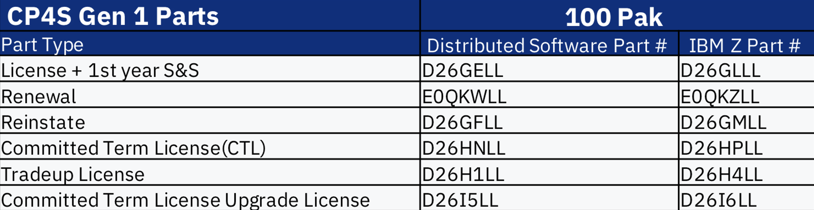

</Column>
<Column colLg='5'>

All these parts are **available** on **OpenShift**. 

 
</Column>
</Row>

### Cloud Pak for Security Gen 2

A few months later, we introduced CP4S Gen 2. This is when the flexible licensing was introduced where a license could be used for products regardless of platform. From Gen 2 onward, we now have to make the distinction between CP4S the license and CP4S the product. In Gen 2, we added new OpenShift platform supported capabilities for Threat Intelligence Insights.

In addition, we introduced the option to apply the Gen 2 license to NON-OPENSHIFT Products. These products are:
- QRadar SIEM
- QRadar Data Store
- QRadar Flow Analytics

None of these products are supported on OpenShift but can be activated with the exact same license as the OpenShift supported products previously mentioned.

IBM Cloud Pak for Security platform capabilities included in Generation 2 are as follows:
<Row>
<Column colLg='7'>

- Data Explorer (DE)
- QRadar SOAR & Breach Response (Add-on)
- Threat Intelligence Insights (TII)

</Column>
<Column colLg='5'>

- QRadar Events Analytics (SIEM)
- QRadar Data Store
- QRadar Flow Analytics (NDR)

</Column>
</Row>

<Row>
<Column colLg='12'>
<GifPlayer color='dark'>

</GifPlayer>
</Column>
</Row>
<Row>
<Column colLg='8'>

<Accordion>

<AccordionItem title='What can I do with it?'>

You can renew it or trade up to QRadar Suite.

</AccordionItem>

<AccordionItem title='Can it be renewed?'>

Yes, it can be renewed.

</AccordionItem>

<AccordionItem title='Should my customer Trade up ? and if so, what is the upgrade path ?'>

Yes, your customer should trade up. This is still a basic package that only contained initial CP4S Offerings.  Additional functions are available through QRadar Package Upgrade.

</AccordionItem>

</Accordion>
 

Use the information provided here to identify if the parts belong to CP4S Gen 2 license variant.  

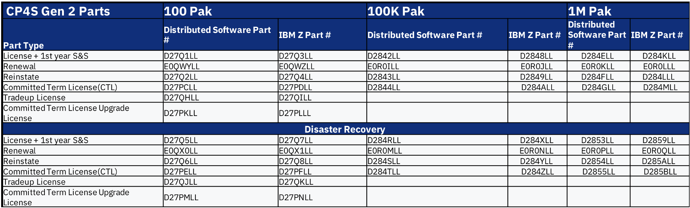

</Column>
<Column colLg='4'>

<InlineNotification>

**Note:** CP4S Gen 2 is **no longer** offered.

</InlineNotification>

Out of all these parts, only Data Explorer, SOAR and Breach Response and Threat Intelligence Insights are **available** on **OpenShift**.

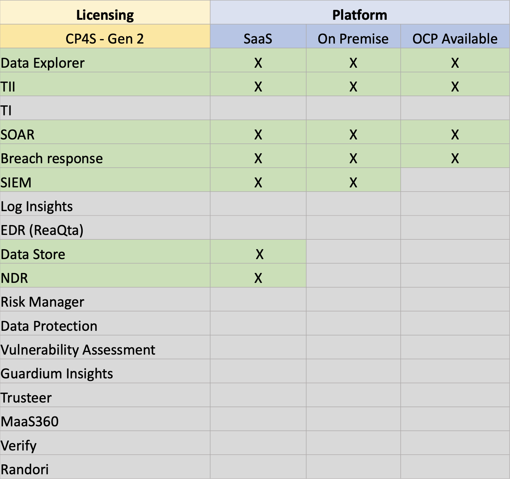

</Column>
</Row>
<Row>
</Row>

### Cloud Pak for Security Gen 3

In Gen 3, we continued to allow clients to apply CP4S licenses to more and more OpenShift Native and NON-OpenShift Native solutions.  In Gen 3, we added additional Native OpenShift Solution, Guardium Insights and Risk Manager.  So, once we get to Gen 3, a client can apply the CP4S license to SOAR/Breach Response, Data Explorer, Threat Intelligence Insights, Threat Investigator, Risk Manager and Guardium Insights, all of which are OpenShift Native Solutions.  In addition, a client could elect to use CP4S Gen 3 licenses for Non OpenShift Native Solutions; QRadar SIEM, QRadar Data Store, QRadar Flow Analytics, Guardium Data Protection or Guardium Vulnerability Assessment. A mixture of license usage across OpenShift and Non OpenShift solutions is reasonable and expected.

IBM Cloud Pak for Security platform capabilities included in Generation 3 are as follows:
<Row>
<Column colLg='7'>

- Data Explorer (DE)
- QRadar SOAR & Breach Response (Add-on)
- Threat Intelligence Insights (TII)
- QRadar Events Analytics (SIEM)
- QRadar Data Store
- QRadar Flow Analytics (NDR)

</Column>
<Column colLg='5'>

- Threat Investigator (TI)
- Guardium Data Protection
- Guardium Vulnerability Assessment
- Guardium Insights
- Risk Manager

</Column>
</Row>

<Row>
<Column colLg='12'>
<GifPlayer color='dark'>

</GifPlayer>
</Column>
</Row>
<Row>
<Column colLg='6'>

<Accordion>

<AccordionItem title='What can I do with it?'>

You can renew it or use existing licenses and expand as needed. If the client wants EDR, they will have to purchase QRadar Suite License. Expansion will require exception approvals.

</AccordionItem>

<AccordionItem title='Can it be renewed?'>

Yes, it can be renewed.

</AccordionItem>

<AccordionItem title='Should my customer Trade up ? and if so, what is the upgrade path ?'>

No upgrade or trade up is needed unless the customer wants EDR or EDR Enterprise. If EDR needed, then trade up to QRadar Suite.

</AccordionItem>

</Accordion>

Use the information provided here to identify if the parts belong to CP4S Gen 3 license variant. 

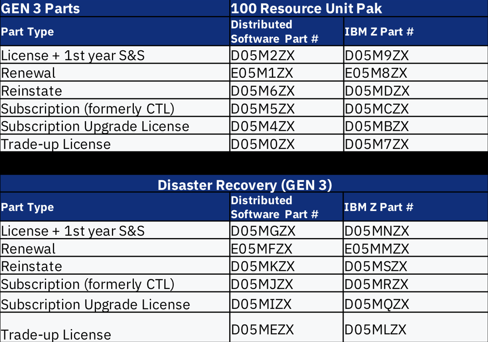

</Column>
<Column colLg='6'>

<InlineNotification>

**Note:** CP4S Gen 3 is **no longer** offered.

</InlineNotification>

Out of all these parts, only Data Explorer, SOAR and Breach Response, Threat Intelligence Insights, Threat Investigator, Guardium Insights and Risk Manager are **available** on **OpenShift**.

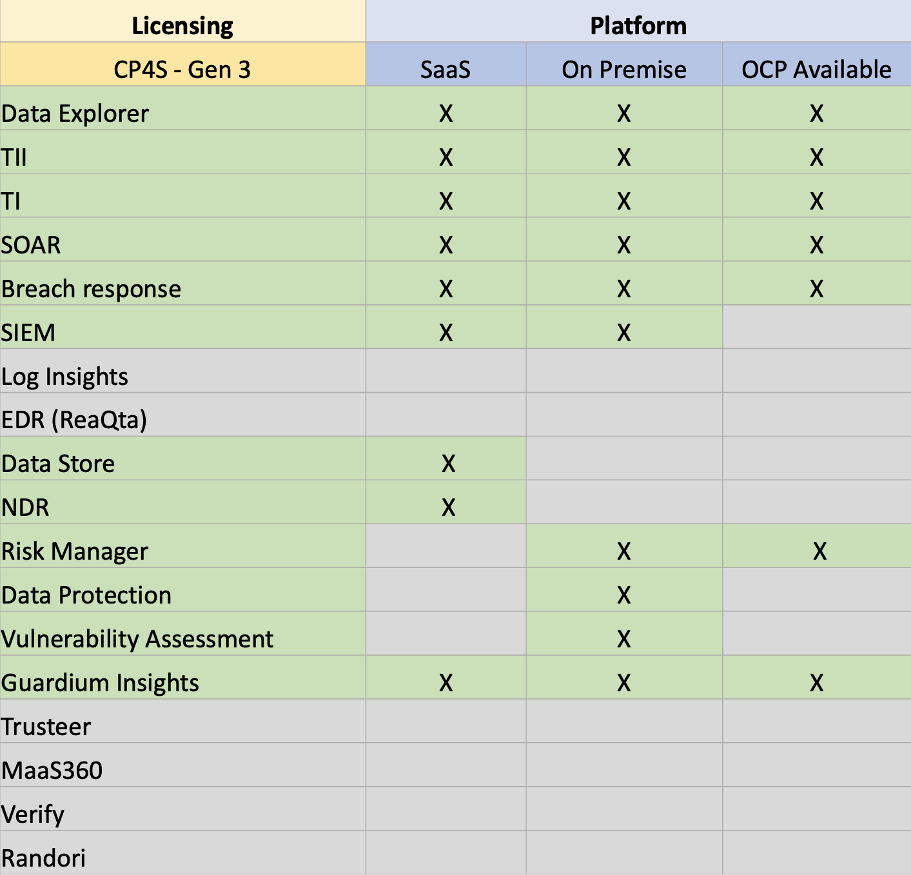

</Column>

<Column>
 
The next major change happened in July 2022 occurred when CP4S Gen 3 was separated into the QRadar XDR Package and the Guardium Package.  At this stage, the Security Brand began to deprecate the term “CP4S”.  We also introduced a short-lived Verify Package which was quickly retired.  In the package examples, we separated components not by platform but by segment and usage.  Whereas Gen 3 allowed a client to use CP4S licenses for products in Threat Management and Digital Trust pillars, the new packages placed limitations on which products the licenses could be used for and limited them to pillars.

</Column>
</Row>

### Guardium Package

The Guardium Package contains Native OpenShift products SOAR/Breach Response, Risk Manager and Guardium Insights. It also allows the client to use the same license for Non-OpenShift products, Guardium Data Protection and Guardium Vulnerability Assessment. Once again, the license can be used to activate both OpenShift and Non-OpenShift solutions.

IBM Cloud Pak for Security platform capabilities included in Guardium Package are as follows:

<Row>
<Column colLg='6'>

- Guardium Data Protection
- Guardium Vulnerability Assessment
- Guardium Insights

</Column>
<Column colLg='6'>

- Risk Manager
- SOAR & Breach Response add-on

</Column>
</Row>

<Row>
<Column colLg='12'>
<GifPlayer color='dark'>

</GifPlayer>
</Column>
</Row>
<Row>
<Column colLg='6'>

<InlineNotification>

**Note:** Guardium Package is offered and is still **available**.

</InlineNotification>

<Accordion>

<AccordionItem title='What can I do with it?'>

You can renew or purchase existing licenses. You can also buy more Resource Units (RU) or use existing RUs for EDR.

</AccordionItem>

<AccordionItem title='Can it be renewed?'>

Yes, it can be renewed.

</AccordionItem>

<AccordionItem title='Should my customer Trade up ? and if so, what is the upgrade path ?'>

No trade up is indicated.

</AccordionItem>

</Accordion>

Use the information provided here to identify if the parts belong to Guardium package license variant.

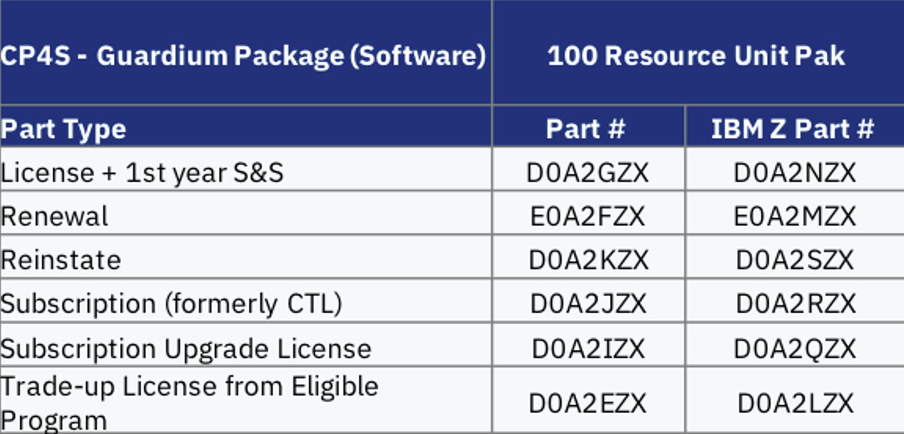

</Column>
<Column colLg='6'>

Out of all these parts, only Guardium Insights, SOAR & Breach Response, Risk Manager are **available** on **OpenShift**.

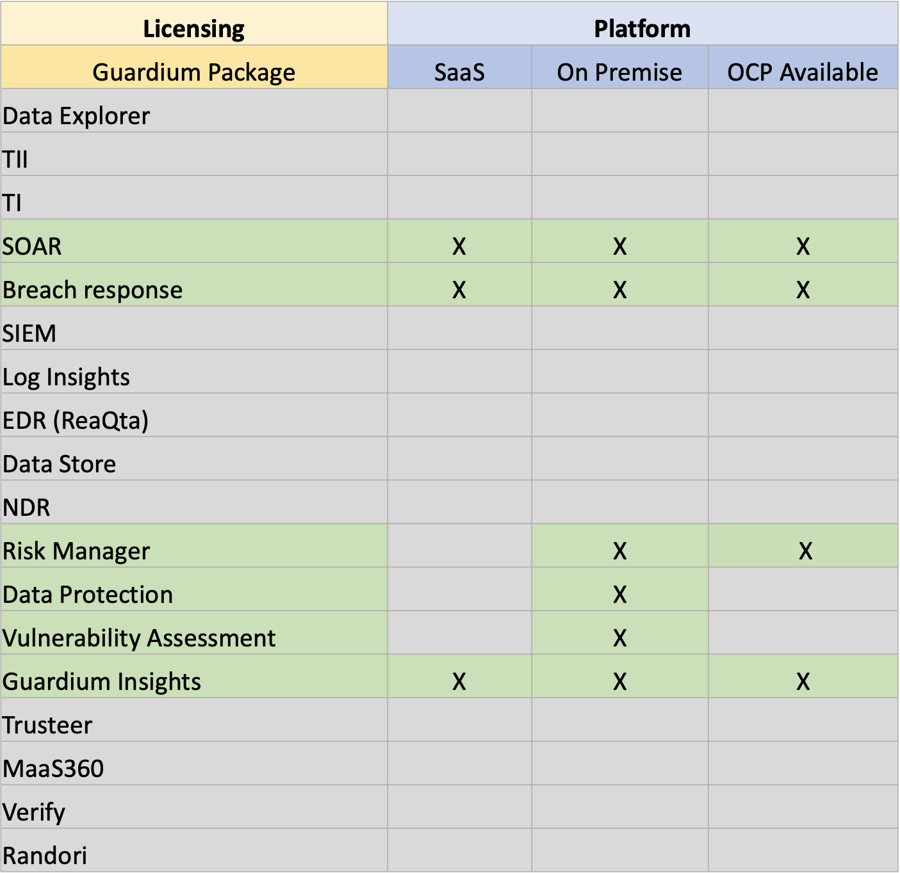

</Column>
</Row>

### QRadar XDR Package

The QRadar XDR solution follows the same model.  QRadar XDR Package license can be used for XDR Connect (formerly Data Explorer), SOAR/Breach Response and Risk Manager, Threat Intelligence Insights and Threat Investigator all of which are Native OpenShift.  In addition, the same license can be used for QRadar SIEM, QRadar Data Store and QRadar Flow Analytics (NDR). All of which are Non-OpenShift solutions.

IBM Cloud Pak for Security platform capabilities included in QRadar XDR Package (Renamed to QRadar Suite) are as follows:

<Row>
<Column colLg='7'>

- QRadar XDR Connect
- QRadar SOAR & Breach Response (Add-on)
- QRadar Events Analytics (SIEM)

</Column>
<Column colLg='5'>

- QRadar Data Store
- QRadar Flow Analytics (NDR)
- Risk Manager

</Column>
</Row>

<Row>
<Column colLg='12'>
<GifPlayer color='dark'>

</GifPlayer>
</Column>
</Row>
<Row>
<Column colLg='6'>

<Accordion>

<AccordionItem title='What can I do with it?'>

You can renew it or use existing licenses and expand as needed.  If the client wants EDR, they will have to purchase QRadar Suite License.

</AccordionItem>

<AccordionItem title='Can it be renewed?'>

Yes, it can be renewed.

</AccordionItem>

<AccordionItem title='Should my customer Trade up ? and if so, what is the upgrade path ?'>

Yes, for the addition of EDR and EDR Enterprise, the customer should acquire QRadar Suite.

</AccordionItem>

</Accordion>

Use the information provided here to identify if the parts belong to QRadarXDR package license variant. 

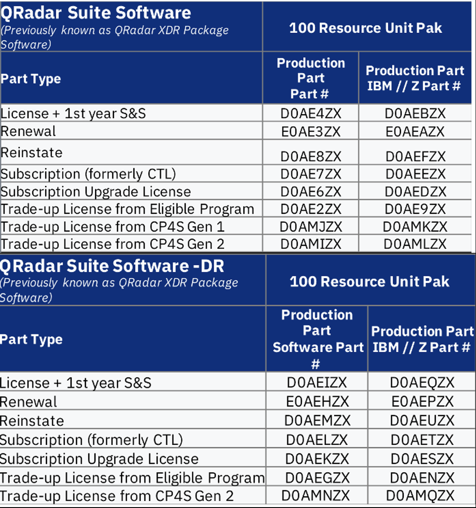

</Column>
<Column colLg='6'>

<InlineNotification>

**Note:** QRadar XDR Package is **not offered as XDR package** any more but **renamed to QRadar Suite** as of May 25, 2023.

</InlineNotification>

  

Out of all these parts, only XDR Connect, SOAR & Breach Response, and Risk Manager are **available** on **OpenShift**.  

</Column>
</Row>

### Verify Package

Verify Package was also introduced. This was a short-lived package which was quickly retired.

IBM Cloud Pak for Security platform capabilities included in Verify Package are as follows:

<Row>
<Column colLg='6'>

- Verify SaaS
- Trusteer Pinpoint
- MaaS 360

</Column>
<Column colLg='6'>

- SOAR
- Risk Manager

</Column>
</Row>

<Row>
<Column colLg='12'>
<GifPlayer color='dark'>

</GifPlayer>
</Column>
</Row>
<Row>
<Column colLg='7'>

<InlineNotification>

**Note:** Verify package is **no longer** offered. Only, point product versions of these products are currently available.

</InlineNotification>

<Accordion>

<AccordionItem title='What can I do with it?'>

Verify Package is no longer available for sale.  Only option is to renew or purchase new stand alone parts.

</AccordionItem>

<AccordionItem title='Can it be renewed?'>

No, it cannot be renewed.

</AccordionItem>

<AccordionItem title='Should my customer Trade up ? and if so, what is the upgrade path ?'>

No trade up is indicated.  Customer growth achieved through additional investment outside of Verify Package License in point products

</AccordionItem>

</Accordion>  

Use the information provided here to identify if the parts belong to Verify package license variant. 

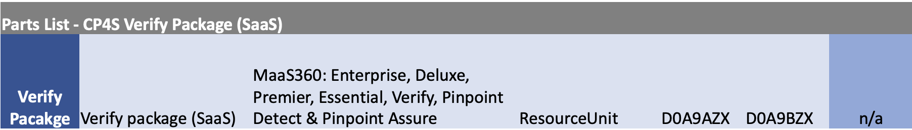

</Column>

<Column colLg='5'>

Out of all these parts, only SOAR, Verify SaaS and Risk Manager are **available** on **OpenShift**.

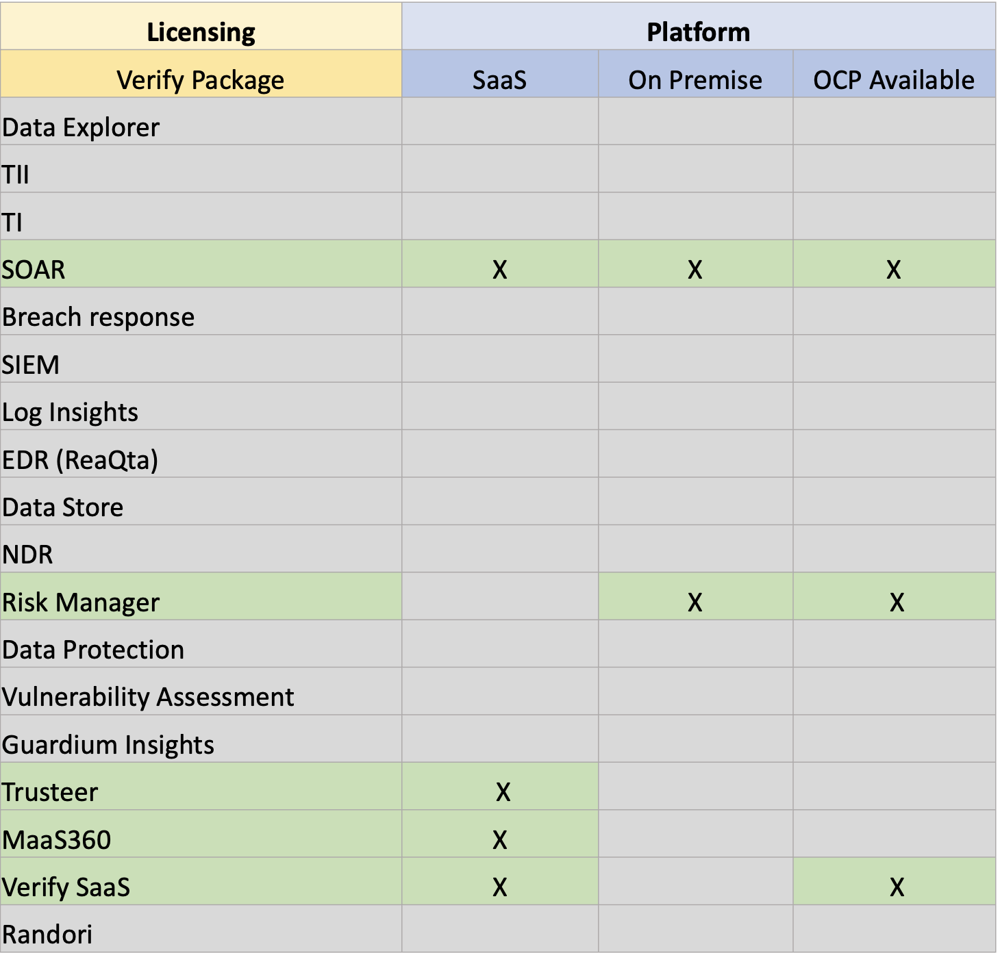

</Column>

</Row>

### QRadar Suite

The most recent announcement for CP4S Licensing is the renaming of the QRadar XDR Package to QRadar Suite in May, 2023.  Licenses for QRadar Suite can be applied identically to the QRadar XDR Package from 2022.  This is primarily a name change.  In addition,  no changes have been made to the Guardium Package so the two “CP4S” solutions currently available to clients are QRadar Suite and Guardium Package.

IBM Cloud Pak for Security platform capabilities included in QRadar Suite are as follows:

<Row>
<Column colLg='6'>

- SOAR & Breach Response add-on
- SIEM
- NDR

</Column>
<Column colLg='6'>

- Data Store
- Risk Manager

</Column>
</Row>

<Row>
<Column colLg='12'>
<GifPlayer color='dark'>

</GifPlayer>
</Column>
</Row>
<Row>
<Column colLg='6'>

<InlineNotification>

**Note:** QRadar Suite is a new offering and is **available**.

</InlineNotification> 

Use the information provided here to identify if the parts belong to QRadar Suite Package. 

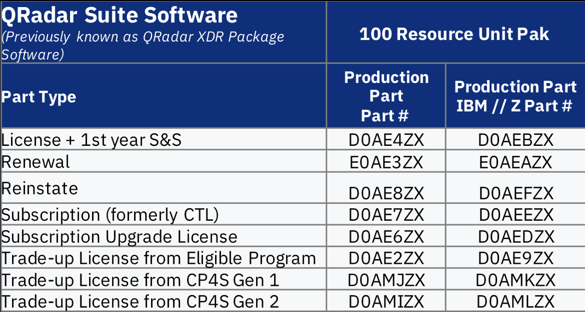

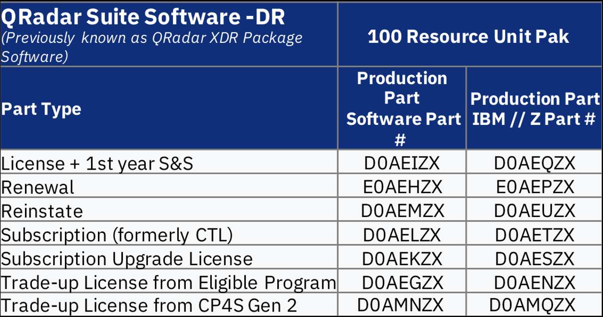

</Column>
<Column colLg='6'>

<Accordion>

<AccordionItem title='What can I do with it?'>

Renewals are available.

</AccordionItem>

<AccordionItem title='Can it be renewed?'>

Yes, it can be renewed.

</AccordionItem>

<AccordionItem title='Should my customer Trade up ? and if so, what is the upgrade path ?'>

Not at the present time.

</AccordionItem>

</Accordion>

Out of all these parts, only EDR, EDR Enterprise, SOAR & Breach Response are **available** on **OpenShift**.

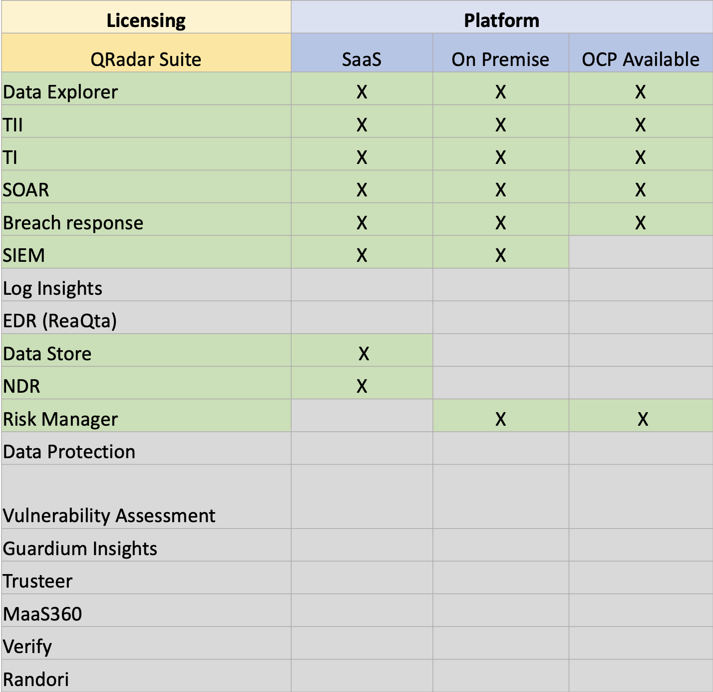

 
</Column>

Going forward the concept of CP4S is being diminished in favor of the product led branding as evidenced by the “package” version releases in 2022 and beyond.  “CP4S” can still be used to describe the Open Shift Native capabilities of the Security Portfolio but we should focus on the capabilities delivered instead.

</Row>
