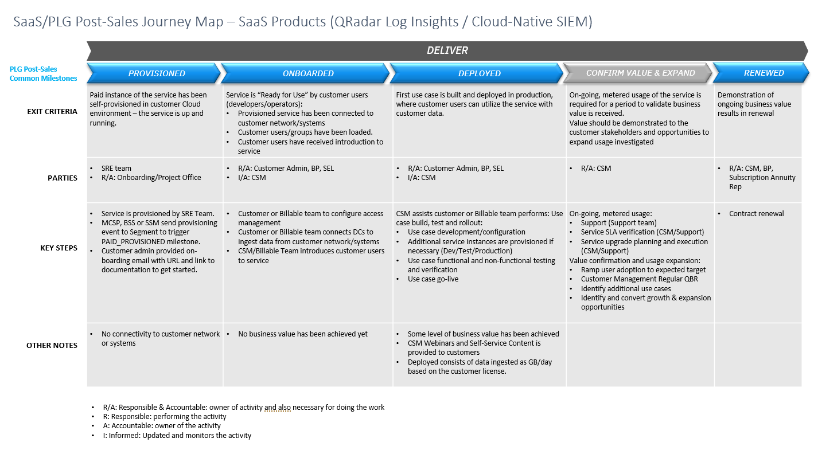

import {Link} from 'gatsby'

<InlineNotification kind="warning">

**Note: The <i>AUTOMATED</i> deployment metrics are pending sign-off and should be considered in progress until this notice is removed.**

The following considerations should be taken when reporting on SaaS deployments:
- All deployments for SaaS should follow the same process as non-SaaS / on-prem deployments
- Create one Growth Plan per use case
- Growth Plan project stages will be used to determine milestone status
- Deployed growth plans require a success plan review by a manager before being counted in the CSM scorecard
- All 3 deployment questions must be answered for the Growth Plan before being counted in the CSM scorecard

</InlineNotification>

## Contacts

| WW contact | Name |
| --- | --- |
| **Customer Success Practice Leaders:** | Greg Sabatini (<gsabatini@us.ibm.com>) &  Jonathan Pechta (<jonathan.pechta1@ibm.com>)  |
| **Digital Customer Success & PLG:** | Kerry Bridges (<kerry.bridges@ibm.com>) |
| **Technology Expert Labs Delivery:** | Pieter Ampe (<pieter.ampe@be.ibm.com>) | 
| **SRE:** | Chris Daigle  (<chris.daigle@ca.ibm.com>) | 

<Row>
<Column colMd={9} colLg={9}>

## Overview
As a CSM, your focus will be to guide and nurture your customers, who have QRadar Cloud-Native SIEM entitlement. You will guide the customer to get onboarded, and help with their first use case (add data collectors, adding users, searches, explaining the user interface) and continue to expand their use case(s).

</Column>
</Row>

<Row>
<Column>

| FAQ | Answer |
| --- | --- |
| What is the relationship name in Gainsight? | QRadar SIEM Cloud Native |
| Which Clouds does this product run on? | AWS |  
| Can I get this through the Amazon Marketplace? | No, this product is sold and provisioned by the SRE team, no direct links available. |
| Is there a demo? | An <a href="https://apps.kaonadn.net/4882011/QRadar/index.html" target='_blank' rel='noreferrer noopener'>interactive click-through demo is available</a>.  |
| How is SaaS usage calculated? | Gigabytes per day. |
| How are licenses sold? | Licenses are sold as GB/day, which covers 90 days of retained data. Customers can buy more data retention, if required. Users who need to look at data outside of their retention need to have both 'Data Archival' and 'Data Restore' added to their license. The archival is how long beyond retention we keep extra data and the 'Data Restore' is an on-demand quote on what data to restore so it is searchable in the user interface. The user receives an estimate and if accepted, the data is restored and the customer is billed (in arrears). This data is kept for search purposes for 7 days, then removed. This process works the same way for QRadar Log Insights too. |
| Is there a calculator to help me quote retention and archival data? | Yes, <a href="https://ibm.seismic.com/Link/Content/DC466c4RjMqRpGfT73mVgF22244Vpart" target='_blank' rel='noreferrer noopener'>Cloud-Native SIEM Calculator</a> is available. |
| How do I convert EPS to GB/day for existing QRadar SIEM (Classic) or QRadar SIEM (SaaS {QRoC})? | A  is available to help convert EPS to GB/day. | 
| Is there a sales kit? | <a href="https://ibm.seismic.com/Link/Content/DCXMDfC4bcMPH8cFfPfBQT94dF8V" target='_blank' rel='noreferrer noopener'>QRadar Cloud-Native SIEM Seller Enablement</a> |
| Where is the documentation? | <a href="https://www.ibm.com/docs/en/security-qradar-siem/saas" target='_blank' rel='noreferrer noopener'>QRadar Cloud-Native SIEM Documentation</a> |
| Feature comparison | <a href="https://ibm.seismic.com/Link/Content/DCpMM2GB8HCBG8qDq9T948QGBHqV" target='_blank' rel='noreferrer noopener'>Comparison sheet</a> 
| Typical subscription | Monthly subscription (minimum 12-month term) with 200 GB/day of data for existing customers. New customers can start with a base license of 50 GB/day. |  
| Does QRadar Cloud-Native SIEM run on OpenShift? | Yes, Red Hat Openshift Service on AWS (ROSA). |
| Is QRadar Cloud-native SIEM consumable or ratable revenue? | Ratable. The unit of consumption is Gigabytes per day. |
| Who triggers deployment? |  Growth Plan and manager assessed (until instrumented) |

</Column>
</Row>

<Row>
<Column colMd={9} colLg={9}>

## CSM Scorecard Milestones based on usage
SaaS milestones for the CSM Scorecard are based on usage. To progress from Planning to Deploying to Deployed, see <Link to='/common/saas-growth/#security-milestones-based-on-usage'>Security milestones based on usage</Link>.

</Column>
</Row>

<Row>
<Column>

<InlineNotification kind="info"> 

** As instrumentation is pending, CSMs can mark customers deployed, but this will require manager sign-off in Gainsight. **

</InlineNotification>

#### How to locate your milestone metric without Instrumentation  
For products that are currently not instrumented in Gainsight, CSMs might need to advise customers how to manually check current usage statistics within the product. 

| 
Product usage visible to customer
 | 
Status
 | 
Description
 |
| --- | --- | --- |
| No | New Feature Required | At this time there is no method for users or CSMs to view current usage consumption from within the product. Customers must contact the SRE team until instrumentation is available. |  

<Accordion>
<AccordionItem title="SaaS Adoption Journey Insights">
SaaS has an additional level of insights that are used to track the adoption journey. These provide an additional level of detail specifically for SaaS adoption.  For QRadar Cloud-Native SIEM, they are shown in the table below:

| 
Insight
 | 
Description
 |
| --- | --- | 
| Paid Provisioned | Customer has purchased the product |
| Paid Onboarded | Completion of the Onboarding Checklist |
| Paid Deployed | Meets utilization tier for GB/day usage across a month | 

</AccordionItem>
</Accordion>

</Column>
</Row>

<Row>
<Column colMd={9} colLg={9}>

### Cloud-Native SIEM Product Feature Adoption and Value Realized Indicators   
QRadar Cloud-Native SIEM includes 'Product Feature Adoption' and 'Value Realized Indicators', which are instrumented in to the product. Instrumentation allows CSM to identify capabilities and features that your customer is using. This information can be used to determine the level of adoption that has taken place and ensure that the customer is receiving full business value from the product. See below for novice, intermediate and advanced level indicators along with an asset listing the value proposition, expected benefits, considerations for implementation and metrics of success.

</Column>
</Row>

<Row>
<Column>

<Accordion>
<AccordionItem title="Novice level indicators">

| Product Feature | Description | 
| --- | --- | 
| TBD | TBD | 
| TBD | TBD | 
| TBD | TBD | 

</AccordionItem>

<AccordionItem title="Intermediate level indicators">

| Product Feature | Description | 
| --- | --- | 
| TBD | TBD | 
| TBD | TBD | 
| TBD | TBD | 

</AccordionItem>

<AccordionItem title="Advance level indicators">

| Product Feature | Description | 
| --- | --- | 
| TBD | TBD | 
| TBD | TBD | 
| TBD | TBD | 

</AccordionItem>

</Accordion>

</Column>
</Row>

<Row>
<Column colMd={9} colLg={9}>

## Post-Sales Journey  
As a CSM with a QRadar Cloud-Native SIEM entitlement, it is your responsibility to help the customer adopt the product, bring use cases into production and renew their subscriptions.   **Notice**: The following image is a preliminary page and waiting on validation: 

</Column>
</Row>

<Row>
<Column>

### Provisioned

| **Led by** | **Outcome** | **Assets & Activities** |
| --- | --- | --- |
| QRadar Cloud-Native SIEM SRE | QRadar Cloud-Native SIEM instance provisioned and the customer has access | The QRadar Cloud-Native SIEM SRE team receives a request from sales to provision the customer and establish a Red Hat on OpenShift Services on AWS for the customer. The sales team sends a form to the SRE team to begin the provisioning process. The customer administrator is provided a welcome email with reference information with the location of their provisioned appliance. |

### Onboarded

| **Led by** | **Outcome** | **Assets & Activities** |
| --- | --- | --- |
| CSM or Technology Expert Labs | Customer has validated access to their QRadar Cloud-Native SIEM instance. | After the QRadar Cloud-Native SIEM instance has been provisioned, a customer can access their instance URL from the AWS console (if provisioned from the AWS Marketplace) or from the email (if the request was submitted by an IBM Technical Seller). By default, the IAM for the instance is configured with IBM Verify and using IBMid. A customer can configure the instance to use a different access management system but will need to work with support.    If no activity has been taken by the client, an Onboarding Nudge Email Template <a href="https://#" target='_blank' rel='noreferrer noopener'>(link TBD)</a> can be sent with instructions to add a target.    After the onboarding process has been completed, an Onboarded Email Template is available to advise the client to take the next step of their journey to take action. | 

### Deployed

| **Led by** | **Outcome** | **Assets & Activities** |
| --- | --- | --- |
| CSM or Technology Expert Labs | The product must be set as 'Deployed' in Gainsight. To meet the deployment criteria, the client has added data sources and consumes 15 GB/day (tier 1), 30 GB/day (tier 2), or 60 GB/day (tier 3) on average across the month of the purchased subscription capacity.   Instrumentation is pending, but the average GB/day over the month is the requirement to be considered 'Deployed'.    As the consumption is not available to customers yet, QRadar Cloud-Native SIEM managers can manually mark a customer as deployed, until instrumentation is provided for these products. | It is the responsibility of the CSM to guide the customer through the deployment phase, utilizing Technology Expert Labs to assist with deployment or data sources that need to be added to the Data Collector.    **Technology Expert Labs Offerings:**   **Advise Offerings/Plan Offerings** - Review of the architecture and topological design of an existing installation of a QRadar Suite product. Validate the appropriate platform for current and future performance requirements.   A series of workshops to document high-level requirements and create a solution design overview to guide a future installation and build.   **Implement Offerings**   &nbsp;&nbsp;&nbsp;**Migrate**: Migrate a product in the QRadar Suite from, On-Prem to SaaS, On-Prem to On-Prem or SaaS to On-Prem or refresh hardware.   &nbsp;&nbsp;&nbsp;**Install/Configure**: Create an accelerated installation and distributed deployment, create custom use cases or patch/upgrade an existing solution to provide a next-generation security intelligence platform.   &nbsp;&nbsp;&nbsp;**Build**: Deploy any QRadar suite solution component for a predefined scope, based on standard practices and a proven deployment approach.  **Accelerate Offerings** - A subscription-based bundle of services, available at a fixed annual fee, that provides flexibility based on the client’s skills, project requirements, and business and technical needs.  **Learn Offerings**   &nbsp;&nbsp;&nbsp;**Learning Subscription Threat Management**: IBM Learning subscriptions offer continuous learning on products, to train individuals or teams, over 12 months, using online digital courses.   &nbsp;&nbsp;&nbsp;**Learning Subscription w/Red Hat**: IBM Learning Subscription with Red Hat provides access to Security training material and content hosted by IBM training and Red Hat Learning platform.     For a full list of Expert Labs offerings with part numbers, see a <a href="https://ibm.seismic.com/Link/Content/DCPDX46QbMgJc87Mb4GBJmpJ4bBd" target='_blank' rel='noreferrer noopener'>Security Threat Management Offerings</a>. |

### Confirm Value & Expand

| **Led by** | **Outcome** | **Assets & Activities** |
| --- | --- | --- |
| CSM | Customer has realized value and expanding usage to new business units | Set up a <a href="https://pages.github.ibm.com/csm-playbook/playbook/onboard/executive-business-review/" target='_blank' rel='noreferrer noopener'>EBR (executive business review)</a> with client sponsor and executives to align and review the adoption, value seen and confirm the customer's strategic goals have been met.  A CSM should continue to drive usage of Technology Expert Labs services and look for opportunities to add more automation of actions and try to expand the adoption with other business units.

### Renewed

| **Led by** | **Outcome** | **Assets & Activities** |
| --- | --- | --- |
| CSM and/or Technical Sales | The client has confirmed that they are using the product and will continue to renew their entitlement. | |

</Column>
</Row>
