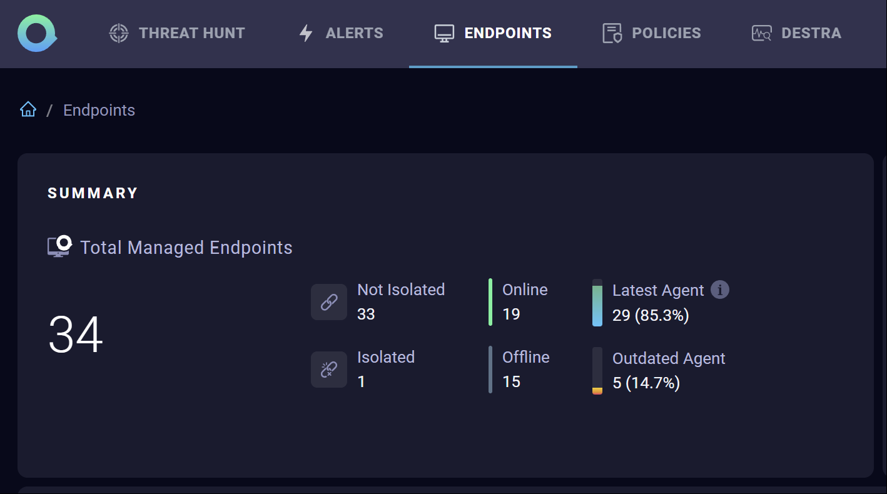
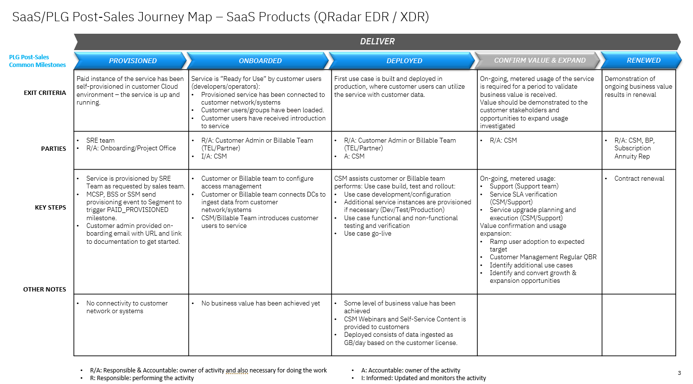

import {Link} from 'gatsby'

<InlineNotification kind="warning">

**Note: The <i>AUTOMATED</i> deployment metrics are pending sign-off and should be considered in progress until this notice is removed.**

The following considerations should be taken when reporting on SaaS deployments:
- All deployments for SaaS should follow the same process as non-SaaS / on-prem deployments
- Create one Growth Plan per use case
- Growth Plan project stages will be used to determine milestone status
- Deployed growth plans require a success plan review by a manager before being counted in the CSM scorecard
- All 3 deployment questions must be answered for the Growth Plan before being counted in the CSM scorecard

</InlineNotification>

## Contacts

| WW contact | Name |
| --- | --- |
| **Customer Success Practice Leaders:** | Greg Sabatini (<gsabatini@us.ibm.com>) &  Jonathan Pechta (<jonathan.pechta1@ibm.com>)  |
| **Digital Customer Success & PLG:** | Kerry Bridges (<kerry.bridges@ibm.com>) |
| **Technology Expert Labs Delivery:** | Pieter Ampe (<pieter.ampe@be.ibm.com>) | 
| **SRE:** | Chris Daigle  (<chris.daigle@ca.ibm.com>) | 

<Row>
<Column colMd={9} colLg={9}>

## Overview
As a CSM, your focus will be to guide and nurture your customers, who have QRadar EDR (SaaS) entitlement. You will guide the customer with provisioning through to onboarding, and help with their first use case (add a target, configure application discovery and grouping, take automated actions) and continue to expand their use case(s).

You can learn more about QRadar EDR (SaaS) (formerly known as ReaQta) on the <a href="https://pages.github.ibm.com/csm-playbook/playbook/common/security/csm-security-reaqta/" target='_blank' rel='noreferrer noopener'>playbook page</a>.

</Column>
</Row>

<Row>
<Column>

| FAQ | Answer |
| --- | --- |
| What is the relationship name in Gainsight? | QRadar EDR SaaS |
| Which Clouds does this product run on? | AWS Cloud |
| Is there an on-prem offering? | Yes, 'QRadar EDR Software' is available On-Premises and can support air-gapped network environments. |
| How is SaaS usage calculated? | Gainsight as authenticated user logins (pending). To understand licenses, see <a href="https://ibm.seismic.com/Link/Content/DC3TcHm3TQMp984GdfcMWD7cRPF3" target='_blank' rel='noreferrer noopener'>QRadar EDR Pricing calculator</a> |
| Is there a sales kit? | <a href="https://ibm.seismic.com/Link/Content/DChjqFpFhV7p38fFMp2WfWJQCW9d" target='_blank' rel='noreferrer noopener'>SaaS Seller Enablement</a> |
| Where is the documentation? | <a href="https://www.ibm.com/docs/en/security-qradar/security-qradar-edr/saas" target='_blank' rel='noreferrer noopener'>QRadar EDR SaaS Documentation</a> |
| Where do I find part numbers? | <a href="https://ibm.seismic.com/Link/Content/DCd33XMWR7X3hGWB73DXGm8W8cp8" target='_blank' rel='noreferrer noopener'>QRadar EDR, MDR, and XDR Parts</a>
| Where can I find feature comparisons? | <a href="https://ibm.seismic.com/Link/Content/DCdjMgBf9gbmpGHBpqMTQbFh6VCj" target='_blank' rel='noreferrer noopener'>Features and Packaging</a> 
| What are the pricing & subscription options? | Monthly subscription by licensed endpoints   (minimum 12-month term)    Minimum endpoints (SaaS/On-prem): 100   Maximum endpoints (SaaS): 5,000  Maximum endpoints (On-prem): 10,000 endpoints as of 7 February 2024.   **Note**: SaaS feature in development to allow a maximum of 10,000 endpoints (date TBD).|  
| Does QRadar EDR/XDR/MDR SaaS run on OpenShift? | Yes |
| Is QRadar EDR/XDR SaaS consumable or ratable revenue? | Ratable. The unit of consumption is Licensed Endpoints. |
| Who triggers deployment? |  Growth Plan and manager assessed (until instrumented) |

</Column>
</Row>

<Row>
<Column colMd={9} colLg={9}>

### CSM Scorecard Milestones based on usage
SaaS milestones for the CSM Scorecard are based on usage. To progress from Planning to Deploying to Deployed, see <Link to='/common/saas-growth/#security-milestones-based-on-usage'>Security milestones based on usage</Link>.
</Column>
</Row>

<Row>
<Column>

<InlineNotification kind="info"> 

** As instrumentation is pending, CSMs can mark customers deployed, but this will require manager sign-off in Gainsight. **

</InlineNotification>
 

#### How to locate your milestone metric without instrumentation  
For products that are currently not instrumented in Gainsight, CSMs might need to advise customers how to manually check current usage statistics within the product. 

| 
Product usage visible to customer
 | 
Status
 | 
Description
 |
| --- | --- | --- |
| Yes | Management endpoints visible | Users can review the Endpoints tab in the user interface. |  

User interface image with an example of managed endpoints:  

   

<Accordion>
<AccordionItem title="SaaS Adoption Journey Insights">
SaaS has an additional level of insights that are used to track the adoption journey. These provide an additional level of detail specifically for SaaS adoption.  For QRadar EDR (SaaS), they are shown in the table below

| 
Insight
 | 
Description
 |
| --- | --- | 
| Paid Provisioned | Customer has purchased the product |
| Paid Onboarded | Completion of the Onboarding Checklist |
| Paid Deployed | 30 licensed endpoints for 1 month |
</AccordionItem>
</Accordion>

</Column>
</Row>

<Row>
<Column colMd={9} colLg={9}>

### QRadar EDR (SaaS) Product Feature Adoption and Value Realized Indicators
QRadar EDR (SaaS) includes 'Product Feature Adoption' and 'Value Realized Indicators', which are instrumented into the product. Instrumentation allows CSM to identify the capabilities and features that your customer is using. This information can be used to determine the level of adoption that has taken place and ensure that the customer is receiving full business value from the product. See below for novice, intermediate and advanced level indicators along with an asset listing the value proposition, expected benefits, considerations for implementation and metrics of success.

</Column>
</Row>

<Row>
<Column>

<Accordion>
<AccordionItem title="Novice level indicators">

| Product Feature | Package level available | Description | 
| --- | --- | 
| TBD | Essentials | TBD |
| TBD | Standard | TBD |

</AccordionItem>

<AccordionItem title="Intermediate level indicators">

| Product Feature | Package level available | Description | 
| --- | --- | 
| TBD | Essentials | TBD |
| TBD | Standard | TBD |

</AccordionItem>

<AccordionItem title="Advance level indicators">

| Product Feature | Package level available | Description | 
| --- | --- | 
| TBD | Essentials | TBD |
| TBD | Standard | TBD |

</AccordionItem>

</Accordion>

</Column>
</Row>

<Row>
<Column colMd={9} colLg={9}>

## Post-Sales Journey 
As a CSM with a QRadar EDR (SaaS) SaaS entitlement, it is your responsibility to help the customer adopt the product, bring use cases into production and renew their subscriptions.

</Column>
</Row>

<Row>
<Column>

### Provisioned

| **Led by** | **Outcome** | **Assets & Activities** |
| --- | --- | --- |
| QRadar EDR (SaaS) SRE | QRadar EDR (SaaS) SaaS instance provisioned and customer has access. | The QRadar EDR (SaaS) SaaS instance is provisioned by request from the sales team. The client will be required to create an <a href="https://www.ibm.com/account/reg/us-en/signup?formid=urx-19776" target='_blank' rel='noreferrer noopener'>IBMid account</a>.    <Link to='/common/security/csm-security-qradar-edr-welcome'>Example welcome email when QRadar EDR is provisioned for customer use</Link>    **Demo information**   Potential customers do not have access to a trial for QRadar EDR at this time. IBM.com offers an <a href="https://www.ibm.com/products/qradar-edr#tour" target='_blank' rel='noreferrer noopener'>interactive click-through tour</a> of the QRadar EDR user interface, which is featured on the product page. Interested customers can complete a form to <a href="https://www.ibm.com/account/reg/us-en/signup?formid=DEMO-securityqradaredr" target='_blank' rel='noreferrer noopener'>book a live demo</a>. |

### Onboarded

| **Led by** | **Outcome** | **Assets & Activities** |
| --- | --- | --- |
| QRadar EDR (SaaS) SRE and CSM | Customer has validated access to their QRadar EDR (SaaS) SaaS instance using their IBMid and added a target. | After the QRadar EDR (SaaS) SaaS instance has been provisioned, a customer can access their instance URL from the welcome letter. By default, the IAM for the instance is configured with IBM Verify and using IBMid. A customer can configure the instance to use a different access management system but will need to work with support.   If no activity has been taken by the client, an Onboarding Nudge Email Template (Link required) can be sent with instructions to add a target.    After the onboarding process has been completed, an Onboarded Email Template (Link required) is available to advise the client to take the next step of their journey to take action. | 

### Deployed

| **Led by** | **Outcome** | **Assets & Activities** |
| --- | --- | --- |
| CSM or Technology Expert Labs | Client has implemented actions that consume at least 30 licensed endpoints for 1 month of the purchased subscription capacity must be in use to be receiving value and considered "deployed". | It is the responsibility of the CSM to guide the customer through the deployment phase, utilizing Technology Expert Labs to perform the configuration and testing required to get to automated actions being performed.    **Technology Expert Labs Offerings:**  **IBM Expert Labs Configure QRadar Suite – EDR** - Options for 2-Day and 4-Day Engagements  For more information on these services, see <a href="https://www.ibm.com/support/customer/csol/terms/?id=i126-9330&lc=en" target='_blank' rel='noreferrer noopener'>IBM Terms for QRadar Suite EDR</a>  **On-Premises** -SEL for On-Premises deployment (encouraged) |

### Confirm Value & Expand

| **Led by** | **Outcome** | **Assets & Activities** |
| --- | --- | --- |
| CSM | Customer has realized value and expanding usage to new business units. | Set up a <a href="https://pages.github.ibm.com/csm-playbook/playbook/onboard/executive-business-review/" target='_blank' rel='noreferrer noopener'>EBR (executive business review)</a> with client sponsor and executives to align and review the adoption, value seen and confirm the customer's strategic goals have been met.   A CSM should continue to drive usage of Technology Expert Labs services, look for opportunities to add more automation of actions and try to expand the adoption with other business units. | 

### Renewed

| **Led by** | **Outcome** | **Assets & Activities** |
| --- | --- | --- |
| CSM or Technical Sales | The client has confirmed that they are using the product and will continue to renew their entitlement. | |

</Column>
</Row>