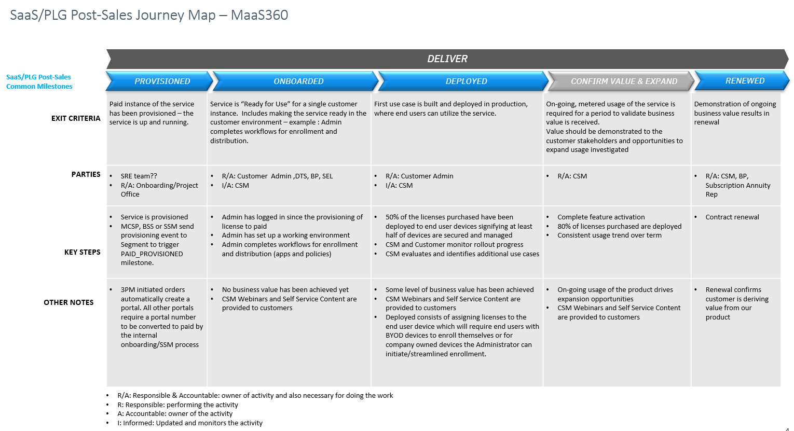
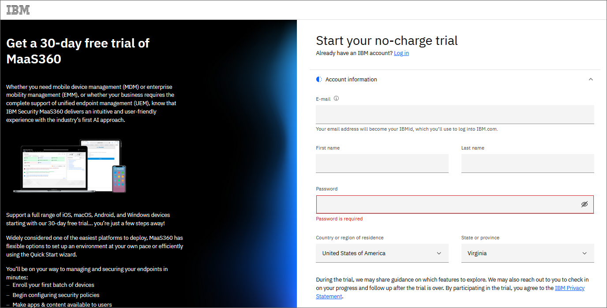
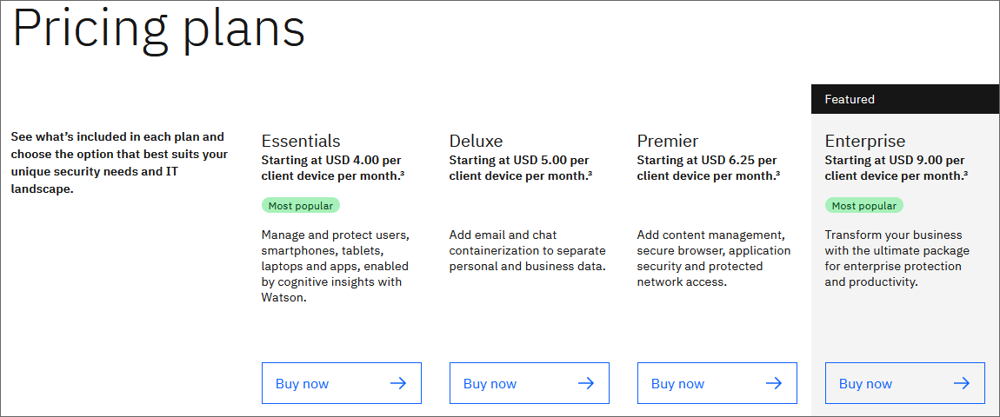
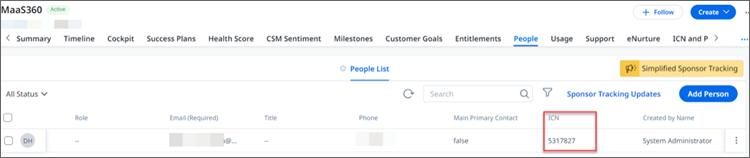

import {Link} from 'gatsby'

<InlineNotification kind="warning">

**Note: The <i>AUTOMATED</i> deployment metrics are pending sign-off and should be considered in progress until this notice is removed.**

The following considerations should be taken when reporting on SaaS deployments:
- All deployments for SaaS should follow the same process as non-SaaS / on-prem deployments
- Create one Growth Plan per use case
- Growth Plan project stages will be used to determine milestone status
- Deployed growth plans require a success plan review by a manager before being counted in the CSM scorecard
- All 3 deployment questions must be answered for the Growth Plan before being counted in the CSM scorecard

</InlineNotification>

## Contacts

| WW contact | Name | 
| --- | --- | 
| **Customer Success Practice Leaders:** | Greg Sabatini (<gsabatini@us.ibm.com>) &  Jonathan Pechta (<jonathan.pechta1@ibm.com>)  |
| **Sales Leader:** | Vacant |
| **Digital Customer Success & PLG:** | Kerry Bridges (<kerry.bridges@ibm.com>) |
| **SRE:** | Jason Kelleher (<jason.kelleher@ibm.com>) |
| **Technology Expert Labs Delivery:** | Rachel Tomas (<Rachel.Tomas@ibm.com>) | 
| **Technology Expert Labs Solution Engineering:** | (<Rachel.Tomas@ibm.com>) |
 
<Row>
<Column colMd={9} colLg={9}>

## Overview
As a CSM, your focus will be to guide and nurture your customers, who have a MaaS360 entitlement. You will guide the customer from provisioning to deployment, develop and monitor a deployment plan that aligns with their initial use case(s), and continue to identify and expand their use case(s).

You can learn more about MaaS360 on the playbook page <a href='https://pages.github.ibm.com/csm-playbook/playbook/common/security/csm-security-maas360/' target='_blank' rel='noreferrer noopener'>playbook page</a>.

</Column>
</Row>

<Row>
<Column>

| FAQ | Answer |
| --- | --- |
| What is the relationship name in Gainsight? | MaaS360 |
| Which Clouds does this product run on? | IBM Cloud and AWS |
| How is SaaS usage calculated? | Gainsight metrics |
| Who can help my customer with billing/invoicing questions? | IBM Business Partners that provide invoicing. Any other queries, CSM should reach out to IBM Subscription Annuity Rep on customer’s behalf or for direct sales, customers can be directed to <a href='mailto:arsupport@es.ibm.com' target='_blank' rel='noreferrer noopener'>arsupport</a>. |
| Where is the documentation? | <a href='https://www.ibm.com/docs/en/maas360' target='_blank' rel='noreferrer noopener'>IBM MaaS360 Documentation</a> |
| Are the SaaS capabilities different from the on-prem offering? | MaaS360 is only available as a SaaS offering |
| Where can I find MaaS360 on the AWS Marketplace? | For direct marketplace links, see: <a href="https://aws.amazon.com/marketplace/pp/prodview-5p7shpo6zhvwu" target='_blank' rel='noreferrer noopener'>US</a>, <a href="https://aws.amazon.com/marketplace/pp/prodview-7dicqu646oxvs" target='_blank' rel='noreferrer noopener'>UK</a>, <a href="https://aws.amazon.com/marketplace/pp/prodview-655fu3uirpfkq" target='_blank' rel='noreferrer noopener'>Germany</a>, <a href="https://aws.amazon.com/marketplace/pp/prodview-zmh37odtri6yk" target='_blank' rel='noreferrer noopener'>Denmark</a> |
| Where can I go to get MaaS360 NA Subscription Annuity Rep coverage? | A Coverage ID spreadsheet is available in Box for CSMs. For details, see <a href="https://ibm.ent.box.com/s/111iac4is76nrm38g2oprdtivdcgmkyd" target='_blank' rel='noreferrer noopener'>Box folder</a>. |
| Does MaaS360 run on OpenShift? | No |
| Is MaaS360 SaaS consumable or ratable revenue? | Ratable. Consumption is based on licenses. |
| Who triggers deployment? |  Automated via Gainsight when deployed criteria are met. |

</Column>
</Row>

<Row>
<Column colMd={9} colLg={9}>

### CSM Scorecard Milestones based on usage
SaaS milestones for the CSM Scorecard are based on usage. To progress from Planning to Deploying to Deployed, see <Link to='/common/saas-growth/#security-milestones-based-on-usage'>Security milestones based on usage</Link>.

</Column>
</Row>

<Row>
<Column>

Examples:
The Administrator has been onboarded and has configured the MaaS360 portal for their initial use case(s) and enrolled devices that align with their use case(s).

<Accordion>
<AccordionItem title="SaaS Adoption Journey Insights">
SaaS has an additional level of insights that are used to track the adoption journey. These provide an additional level of detail specifically for SaaS adoption.  For MaaS360 SaaS, they are shown in the table below

| 
Insight
 | 
Description
 |
| --- | --- | 
| Paid Provisioned | Customer has purchased the product and the MaaS360 portal is provisioned. |
| Paid Onboarding Progress | Administrator has logged into the portal. |
| Paid Onboarded | Portal is ready for the administrator to begin deploying features (licenses) to end-user devices. |
| Paid Deployed | Clip level met for 1 month. |
</AccordionItem>
</Accordion>

</Column>
</Row>

<Row>
<Column colMd={9} colLg={9}>

### MaaS360 Product Feature Adoption and Value Realized Indicators
Adoption Event Milestones will be instrumented into the product to show the capabilities and features that the customer is using. This information will be used to determine the level of adoption that has taken place and ensure that the customer is receiving full business value from the product. See below for novice, intermediate and advanced level events along with an asset listing the value proposition, expected benefits, considerations for implementation and metrics of success.

</Column>
</Row>

<Row>
<Column>

<Accordion>
<AccordionItem title="Novice level indicators">

| Product Feature | Package level available | Description | 
| --- | --- | --- | 
| Apple MDM - APNS Certificate Enabled (Service) | Essentials | APNS Certificate creation indicates that the MaaS360 portal is ready to communicate with and manage iOS/macOS devices. | 
| Android MDM - Android Enterprise Integration (Service) | Essentials | Integration with Android Enterprise indicates MaaS360 is ready to manage Android devices.  | 
| Mobile Expense Management | Essentials | Mobile Expense Management enables MaaS360 administrators to create expense plans to manage and monitor cellular usage on devices| 
| End User Portal | Essentials | End User portal enables device owners to manage their own devices. The MaaS360 portal is only used by Administrators, whereas the end user portal is used by the device owners, for example, Locate and Lock actions can be initiated in the end user portal. |
Integration - Cloud Extender AD/LDAP | Essentials |  - ce_user_visibility: The Cloud Extender has been enabled to import corporate directory groups from AD on-premise to MaaS360 portal.   - ce_user_visibility: The Cloud Extender has been enabled to import corporate directory groups using LDAP on-premise to MaaS360 portal.   - ce_user_auth: The Cloud extender has been enabled to provide authentication with on-premise.   - Active Directory for device enrollments and access to corporate resources. |
| Integration - Cloud Extender Email EI | Essentials | Cloud Extender Exchange ActiveSync module enables the import of device records from Exchange on-premise or Exchange online for devices that have connected to mailboxes. | 
| Content Management (Non-MEG sources) | Premier | Content Management enables MaaS360 administrators to add document sources that can be distributed to or accessed by device users. |
| Business Dashboard for Aps | Premier | Enables Business Dashboard for Apps |

</AccordionItem>

<AccordionItem title="Intermediate level indicators">

| Product Feature | Package level available | Description | 
| --- | --- | --- |
| Identity System Integration - SSO/Conditional Access | Essentials | Enables single sign-on (SSO) and Conditional Access with an IBM Verify tenant integration. |
| User Risk Management | Essentials | User Risk Management allows administrators to address security and compliance issues with devices that are exhibiting risky behaviors and patterns. |
| Integration - Cloud Extender Email Notifications | Essentials | Cloud Extender email notification module enables iOS devices with Secure Mail to access Exchange OnPrem or Exchange Online Email to display email notification badges. | 
| Integration | Intune App Protection | Essentials | Enables Integration with Intune to use Intune policies for app protection. | 
| Secure Mail | Deluxe | Enables MaaS360 Secure Mail for devices to securely access email using the MaaS360 container. | 
| Assistant | Deluxe | Need to check on this. | 
| Team viewer - Attended Access | Third Party Addon | Enables integration with TeamViewer for attended remote access support of devices. | 
| Team viewer - Unattended Access | Third Party Addon | Enables integration with TeamViewer for unattended access support of devices. | 
| Zebra Printer Manager | Essentials | Enables MaaS360 to manage Zebra printers. | 

</AccordionItem>

<AccordionItem title="Advance level indicators">

| Product Feature | Package level available | Description | 
| --- | --- | --- |
| SPS Only | Essentials | Mixed mode enables SPS only and Mobile Device Management. SPS only provides the ability to manage MaaS360 Secure Container and all of its apps. MDM enables management of the device in addition to the MaaS360 Secure Container and apps. |
Laptop and Desktop Management (Windows/macOS) | Essentials | uem_windows: Enables management of Windows 10 and later devices.   uem_mac: Enables management of macOS devices - requires APNS certificate. | 
| Integration - Cloud Extender MEG | Essentials | Enables the Mobile Enterprise Gateway module, which provides access to behind-the-firewall corporate resources. | 
| Integration - Email Access Gateway | Essentials | MaaS36- Email Access Gateway (EAG) is a secure, scalable, and high-performance enterprise-grade reverse proxy solution that controls the ActiveSync traffic flow to a corporate email environment. | 
| Integration - Cloud Extender Certificates | Essentials | Enables Cloud Extender Certificate Integration module that provides integration with CAs to deliver certificates for secure access to Wi-Fi, VPN, and email access. |
| Gateway for Apps | Premier | Enables SDK integration and wrapped apps for improved app security. |
| Gateway for Content | Premier | Enables access to behind-the-firewall content sources using the Mobile Enterprise Gateway. |
| Gateway for Browser | Premier | Enables the Secure Browser for secure internet browsing from devices. |
| OS VPN | Premier | Enables a VPN solution that allows users to access their corporate network from an iOS or Android device. |
| Mobile Doc Editor | Enterprise | Enables the secure editing of documents on the user's device. |
| Mobile Doc Sync | Enterprise | Enables Synchronization of document updates across user devices. |
| Mobile Threat Management | Enterprise | Enables endpoint security for the prevention, detection, monitoring, and remediation of threads on iOS, Android, and Windows devices. Endpoint security protects devices against malware, phishing, data leaks, excessive app permissions, privileges, and advanced user risk management configurations for mobile devices and laptops. |

</AccordionItem>
</Accordion>

</Column>
</Row>

<Row>
<Column colMd={9} colLg={9}>

## Post-Sales Journey 
As a CSM with a MaaS360 SaaS entitlement, it is your responsibility to help the customer adopt the product, bring use cases into production and renew their subscriptions. The
diagram shows the MaaS360 SaaS post-sales journey at a high level. Each section is broken down in detail with links to assets below.

</Column>
</Row>

<Row>
<Column>

### Provisioned

| **Led by** | **Outcome** | **Assets & Activities** |
| --- | --- | --- |
|  MaaS360 Sales Rep, IBM Business Partner | MaaS360 portal is provisioned on a MaaS360 cloud instance and the primary administrator is provided portal access. MaaS360 has multiple cloud instances across geographies. A customer portal is provisioned on one of these <a href='https://status.maas360.com/' target='_blank' rel='noreferrer noopener'>instances</a> based on the customer’s geo. Instances can be found here: <a href='https://status.maas360.com/' target='_blank' rel='noreferrer noopener'>https://status.maas360.com/</a>. The portal is ready for configuration. | There are different paths for a customer to request a MaaS360 trial and/or paid instance. The client is required to create an <a href="https://www.ibm.com/account/reg/us-en/signup?formid=urx-19776" target='_blank' rel='noreferrer noopener'>IBMid account</a> to subscribe to a 30-day trial. Portals created by IBM Business Partners such as Verizon are not required to have an IBMid account, a local MaaS360 administrator is created and the Administrator is prompted on first login to create and link to an IBMid, but this is not required.   **Trial**   Request a 30-day free trial instance from a 3PM or ibm.com: <a href='https://www.ibm.com/products/maas360/pricing' target='_blank' rel='noreferrer noopener'>https://www.ibm.com/products/maas360/pricing</a>.    **Moving from a trial to paid**   There are two ways a portal becomes a Customer (Paid) portal:  1. The portal is provisioned automatically through 3PM/ibm.com/BPQTO process with the placement of the order  2. A Trial portal is created, and the portal number is provided in the provisioning form when the order is placed in SQO and released.   MaaS360 Administrator receives an email from MaaS360 instance with portal login credentials. A <a href='https://ibm.box.com/s/wvpoyq25wg4e3k5pzddvclcz2zmwm20q' target='_blank' rel='noreferrer noopener'>Welcome Email</a> is automatically sent from Gainsight to newly signed North America and EMEA customers once the SSABL entitlement is added to Gainsight. |

</Column>
</Row>

<Row>
<Column colMd={4} colLg={4}>

</Column>

<Column colMd={8} colLg={8}>

 

</Column>
</Row>

<Row>
<Column>

### Onboarded

| **Led by** | **Outcome** | **Assets & Activities** |
| --- | --- | --- |
| MaaS360 DTS, IBM Business Partner, CSM, Technology Expert Labs | US National Customers who purchased &ge;50 licenses through Verizon, T-Mobile, CDW or AWS are entitled to 2 hours of free set-up services. Set-up services are provided by the Deployment Technical Specialist team. | The customer MaaS360 Administrator logged into the portal and completed portal configuration to ready the portal to deploy licenses to end-user devices through device enrollment.    For CSM-assigned accounts, It’s the CSM’s responsibility to work with the customer to ensure Security policies align with an initial use case and a small, controlled deployment to end-user devices is completed, CSMs should jointly develop a Success plan with the customer and engage services as needed.    Automated Email Outreach for non-CSM assigned accounts is sent to North American and EMEA customers to monitor onboarding.  Webinars are provided for ALL onboarding customers. New customer/admin workshops: https://community.ibm.com/community/user/security/blogs/margaret-radford/2020/07/30/sign-up-here-for-maas360-new-customeradmin-worksho |

### Deployed

| **Led by** | **Outcome** | **Assets & Activities** |
| --- | --- | --- |
| CSM, IBM Business Partners | The CSM should monitor the deployment phase and begin exploring additional use cases. The time-to-value goal is to reach 50% license usage in this phase.   Deployment consists of assigning licenses to the end user device which will require end users to bring their own device (BYOD) to enroll the device in MaaS360 or for company-owned devices the Administrator can initiate/streamline the enrollment. | Automated Email Outreach for non-CSM assigned accounts is sent to North American and EMEA customers to monitor onboarding.    North America and CSM-assigned accounts will receive automated outreaches at 180 days.    **From signing**   Webinars are provided for deploying customers: <a href='https://community.ibm.com/community/user/security/blogs/margaret-radford/2020/01/21/introducing-maas360-health-check-webinars' target='_blank' rel='noreferrer noopener'>Deployment Checkpoint Webinar</a>.    **Technology Expert Labs Offerings:**  **IBM Expert Labs Assess MaaS360** - Conducts an assessment of an IBM Security MaaS360 deployment against use cases, future goals, industry best practices and zero-trust IT security approaches.   **IBM Expert Labs Configure MaaS360** - Setup service that provides an IBM professional services consultant's time that can be used for activities related to an IBM MaaS360 product deployment effort.   **IBM MaaS360 Customer Setup per Engagement** - Setup service that provides an IBM professional services consultant's time that can be used for activities related to an IBM MaaS360 product deployment effort.   **IBM MaaS360 Expert Assistance Service 20 Hours** - Provides an IBM professional services consultant's time that can be used for activities related to an IBM MaaS360 product deployment effort.    When the client has successfully taken an action, a <a href="https://ibm.box.com/s/hb6rj3uziesqus03vok5sxil34q65auk" target='_blank' rel='noreferrer noopener'>Deployed Email Template</a> can be sent to guide setting up automation in the environment. |

### Confirm Value & Expand

| **Led by** | **Outcome** | **Assets & Activities** |
| --- | --- | --- |
| CSM | Customer has realized value and is expanding usage to new business units or initiating new use cases. | Set up an <a href="https://pages.github.ibm.com/csm-playbook/playbook/onboard/executive-business-review/"  target='_blank' rel='noreferrer noopener'>EBR (executive business review)</a> with client sponsor and executives to align and review the adoption, value seen and confirm the customer’s strategic goals have been met. A CSM should continue to drive usage of Technology Expert Labs services and look for opportunities to add more Unified Endpoint Management and Security use cases.   Automated outreaches are sent to both North America and EMEA CSM-assigned and non-CSM-assigned accounts. CSM-assigned accounts receive a subset of the outreaches.     - The latest monthly technical touchpoints can be found here on the MaaS360 Customer Success Hub: <a href="https://ibm.biz/maas360csm" target='_blank' rel='noreferrer noopener'>https://ibm.biz/maas360csm</a>.   - All North America and EMEA customers are invited to bimonthly <a href="https://community.ibm.com/community/user/security/blogs/margaret-radford/2023/08/10/join-an-upcoming-bi-monthly-ask-me-anything" target='_blank' rel='noreferrer noopener'>Ask me Anything</a> calls. | 

### Renewed

| **Led by** | **Outcome** | **Assets & Activities** |
| --- | --- | --- |
| CSM, IBM Subscription Annuity Rep, IBM Business Partner | The client has confirmed that they are using the product and will continue to renew their entitlement. | **MaaS360 eNurture program**   MaaS360 has a mature automated outreach program that runs in Gainsight. Email outreach and call-to-actions are sent throughout the customer journey. The following is a guide to the current <a href="https://ibm.box.com/s/mpii65ujozqwy0n90z998qkxrhz1nxde" target='_blank' rel='noreferrer noopener'>eNurture program</a>.   Any North America or EMEA MaaS360 customer who has a contact(s) in the People section of the R360 with an assigned  IBM Customer Number and the OK to Email flag set to True will receive eNurture emails.    **IMPORTANT**:   Ensure any contact you add manually or update has the correct IBM Customer Number (ICN) assigned to it and an accurate first and last name. In some cases, Gainsight creates a MaaS360 Relationship with multiple customers. For example, a conglomerate can have multiple distinct subsidiaries each having their own unique MaaS360 portal deployment. For the eNurture email to display the correct account information you must assign the correct ICN to the contact.    The OK to Email flag is set to True by default. If you want to remove the contact from eNurture set the flag to False. |

</Column>
</Row>

<Row>
<Column colMd={4} colLg={4}>

</Column>

<Column colMd={8} colLg={8}>

</Column>
</Row>