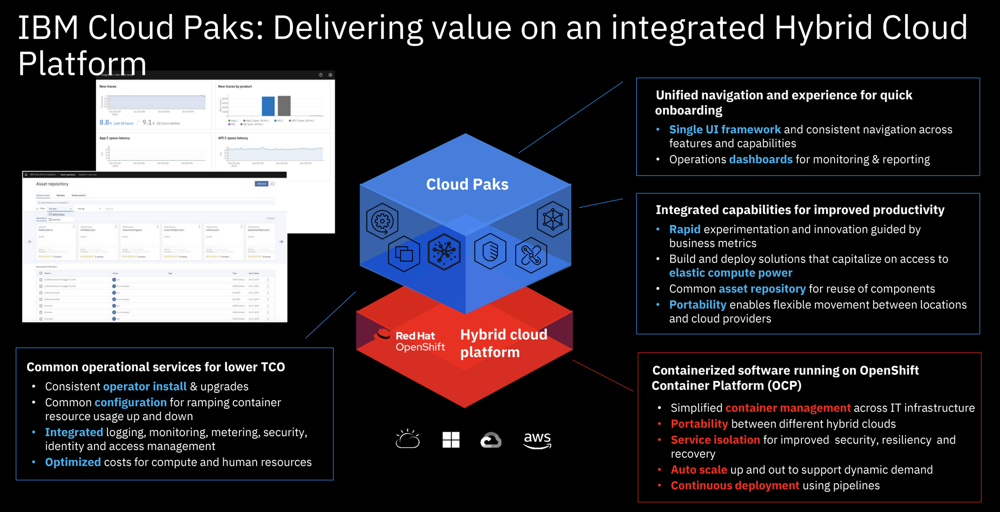

import {Link} from 'gatsby'

<AnchorLinks small>
<AnchorLink>What is the QRadar XDR Package and what does it do?</AnchorLink>
<AnchorLink>What are the pain points that the QRadar XDR Package addresses?</AnchorLink>
<AnchorLink>What do CSM driven deployments look like?</AnchorLink>
<AnchorLink>The steps to deploy and who is responsible for what, when?</AnchorLink>
<AnchorLink>How do I expand and grow the QRadar XDR Package usage?</AnchorLink>
<AnchorLink>There isn't a current use case, where do I start?</AnchorLink>
<AnchorLink>Frequently asked questions</AnchorLink>
</AnchorLinks>

<Row>
<Column colMd={7} colLg={7} noGutterMdLeft>

## What is the QRadar XDR Package and what does it do?  

The **QRadar XDR Package** helps you to predict, prevent, and respond to modern threats. Customers can swap across capabilities in the package.

 
The Software package contains the following capabilities:

XDR Connect 
SOAR 
Breach Response 
Risk Manager

The SaaS package contains the following capabilities:

XDR Connect 
SOAR 
Breach Response 
Risk Manager

## What are the pain points that the QRadar XDR Package addresses?

The goal of the QRadar XDR package is to eliminate ransomware and threats with greater speed and visibily.    

The key pain points that the QRadar XDR Package addresses are related to    
:   
**Pain Point: **   
**Pain Point: **   
**Pain Point: **   
**Pain Point: **   
**Pain Point: **   
**Key:** * *  
  

## The steps to deploy and who is responsible for what, when?

The QRadar XDR Package follows the traditional model of:   
1: **Identifying a pain point, sponsor and use case** 
The IBM team of Sales, Tech Sales and potentially CSM can use the list of pain points above along with the <a href='https://ibm.seismic.com/Link/Content/DC26J44RW4T6M84DmhG62hfT3PhB' target='_blank' rel='noreferrer noopener'>AIOps Acceleration Workshop</a> or a Client Engineering engagement to identify use cases and sponsors  
2: **Demonstrating how a given pain point can be addressed (demo)** 
The <a href='https://play-with.instana.io/#/home' target='_blank' rel='noreferrer noopener'>Click-through demo</a> has a script that can be used to quickly demonstrate the capabilities of Instana to the customer  
3: **Proving value  (proof of experience (PoX)** 
Tech Sales, Client Engineering, Instana TAM and CSM can work together to connect Instana to the customers' systems and prove the capabilities resolve the pain points.  
4: **Implementation project** 
Technology Expert Labs can take ownership of an implementation project using their <a href='https://soda.dal1a.ciocloud.nonprod.intranet.ibm.com/show/3618' target='_blank' rel='noreferrer noopener'>pre-packaged offerings.</a> Instana TAM and CSM can help guide the customer through the implementation project. 

## What do CSM driven deployments look like?

## How do I expand and grow the QRadar XDR Package usage?

The QRadar XDR Package is licensed by .

## There isn't a current use case, where do I start?

Most customers are somewhere on their modernization journey and if you talk to the right people you will find the pain points that are listed above.

If you need to start from scratch with the overall ....  

</Column>

<Column colMd={5} colLg={5} noGutterMdLeft>

 

<Aside>

**Customer Success Practice Leader:** Greg Sabatini (@gsabatini) or  Jonathan Pechta (@jonathan.pechta1) 
**CSM Slack Channels:** <a href='https://ibm-cloud.slack.com/archives/CRBSLC284' target='_blank' rel='noreferrer noopener'>#cp4sec-tech</a>  + <a href='https://ibm-cloud.slack.com/archives/C01L8MBNN6P' target='_blank' rel='noreferrer noopener'>#csm-security</a>  + <a href='https://ibm-security.slack.com/archives/C016DAUCFNC' target='_blank' rel='noreferrer noopener'>#cp4saas</a> 
**Community:** <a href='https://w3.ibm.com/w3publisher/customersuccess/community-connections/security-platform-community' target='_blank' rel='noreferrer noopener'>Security platform community</a> + <a href="https://www.ibm.com/developerworks/rfe/execute?use_case=changeRequestLanding&BRAND_ID=301" target='_blank' rel='noreferrer noopener'>Security RFE Community</a> 
**Learn:** <a href='https://w3.ibm.com/w3publisher/customersuccess/get-learning/csm-university/cloud-pak-platform' target='_blank' rel='noreferrer noopener'>CSM - IBM Security</a> + <a href="https://www.ibm.com/docs/en/cloud-paks/cp-security" target='_blank' rel='noreferrer noopener'>IBM Cloud Pak for Security documentation</a> + <a target='_blank' rel='noreferrer noopener' href="https://www.securitylearningacademy.com/enrol/index.php?id=5465">Cloud Pak for Security 101</a> 
**Support:** <Link to='/common/support/access-ibm-support#help-your-customer-get-issues-resolved' target='_blank' rel='noreferrer noopener'>Get support for IBM Cloud Paks</Link> 
**Demo:** Explore the <a target='_blank' rel='noreferrer noopener' href="https://www.ibm.com/account/reg/us-en/subscribe?formid=urx-46836">interactive demo of IBM Cloud Pak for Security</a>Click-through demo 
**Roadmap:** <a href='https://w3.ibm.com/w3publisher/security-roadmaps' target='_blank' rel='noreferrer noopener'>IBM Security Roadmaps - Roadmap Assets</a> 
**Marketing page:** <a href="https://www.ibm.com/products/cloud-pak-for-security" target='_blank' rel='noreferrer noopener'>IBM Cloud Pak for Security marketing page</a>

**NEED**
**Practice Leader Overiew:** <a href='https://ibm.box.com/s/69qckzae34wjphcq9dad7930sqekg1w3' target='_blank' rel='noreferrer noopener'>Recording of ..... by Greg Sabatini</a> 
**Seismic:** <a href='https://ibm.seismic.com/Link/Content/DC3FqhbFPPcCV87XqWD8hgR7JffP' target='_blank' rel='noreferrer noopener'>Sales Kit</a> with Presentations and Pre-sales assets 
**Tech Zone:** <a href='https://techzone.ibm.com/collection/platinum-demos-observability' target='_blank' rel='noreferrer noopener'>Activation Kit</a> with Demo environments and enablement 
**Deployment options:** SaaS, ....

</Aside>

<Aside>

**Build your skills**

Complete the <a href='https://ibm.seismic.com/Link/Content/DCqJR68b93JQRG7WcMHQ39hBT3p3' target='_blank' rel='noreferrer noopener'>Technical Enablement Series with Recordings</a> 
Work through the <a href='https://yourlearning.ibm.com/activity/PLAN-E8198C905C2C' target='_blank' rel='noreferrer noopener'>Level 2 learning plans</a> 
Work through the <a href='https://ec.yourlearning.ibm.com/w3/series/10164466?layout=grid' target='_blank' rel='noreferrer noopener'>self-paced bootcamp</a>

</Aside>

<Aside>

**Who can help me?**

**Client Engineering** and **Tech Sales** have the skills required to perform Proof of Experience (Pox) engagements. 
**Instana TAMs** have deep skills and experience with Instana.
    Work with your account team to determine if there is already a Instana TAM attached to your customer. If you aren't sure reach out to @Dave Mulley for help. 
**Technology Expert Labs** can deliver solution design, deploy production environments, deliver full stack observability, create outcome SOW and account plans (for a fee)

</Aside>

<Aside>

**Customer facing case studies?**

<a href='https://ibm.seismic.com/Link/Content/DCj4RCCgWRHg88fBCR93cGcF3W9P' target='_blank' rel='noreferrer noopener'>Leaf Group</a> are a great example of a company that went through a modernization process and tried to use their legacy monitoring tools to manage the containerized environment. They managed to reduce latency, error rates and response time with Instana but they also managed to reduce the monitoring costs by replacing their legacy tool.
There are many other case studies in the <a href='https://ibm.seismic.com/Link/Content/DC3FqhbFPPcCV87XqWD8hgR7JffP' target='_blank' rel='noreferrer noopener'>Sales Kit</a>.

</Aside>

<Aside>

**Workshops**

There is an <a href='https://w3.ibm.com/w3publisher/automation-innovation-workshop' target='_blank' rel='noreferrer noopener'>Automation Innovation Workshop</a> (free) that can be used when trying to generate interest, sponsors and use cases that is available to Sales teams and CSMs. This workshop is delivered by senior IBM specialists and is targeted at the Senior Leadership team at your customer.

</Aside>

<Aside>

**Technology Expert Labs offerings**

<a href='https://ibm.seismic.com/Link/Content/DC26J44RW4T6M84DmhG62hfT3PhB' target='_blank' rel='noreferrer noopener'>AIOps Acceleration Workshop</a>
<a href='https://soda.dal1a.ciocloud.nonprod.intranet.ibm.com/show/3618' target='_blank' rel='noreferrer noopener'>Instana Observability with SaaS QuickStart</a>
<a href='https://soda.dal1a.ciocloud.nonprod.intranet.ibm.com/show/3618' target='_blank' rel='noreferrer noopener'>Instana On-premise Observability for Enterprise</a>
<a href='https://soda.dal1a.ciocloud.nonprod.intranet.ibm.com/show/3676' target='_blank' rel='noreferrer noopener'>Modernize APM Solutions with Instana</a>

</Aside>

</Column>

</Row>

<Row>

<Column>

_____________________________

### Special notes

_____________________________

## Frequently asked questions

</Column>
</Row>

------------------------------------
**OLD**

<Row>

<Column colMd={8} colLg={8}>

##  Use Cases

### **CP4S/CP4Saas**

#### **Visibility**

Visibility is a core Cloud Pak for Security use case. A key reason that organizations today are being breached with increasing frequency, and the effects of the breaches continue to escalate, is that they do not have the ability to gain visibility across their entire IT estate, from a single point, without incredibly expensive and complex data movement that does not provide real-time insights into their threat landscape.

Federated search and investigation is the heart of Cloud Pak for Security.

**Components**

<a href="https://www.ibm.com/products/cloud-pak-for-security/data-explorer" target='_blank' rel='noreferrer noopener'>Data Explorer (DE)</a> is a Cloud Pak for Security application that enables federated search on data where it resides--no data movement required

**Assets**

<a href="https://ibm.seismic.com/Link/Content/DC8USb1aWqS06_V7am-SMV3w" target='_blank' rel='noreferrer noopener'>IBM Cloud Pak for Security 301 Data Explorer Presentation</a>

<a href="https://www.ibm.com/products/cloud-pak-for-security/data-explorer" target='_blank' rel='noreferrer noopener'>Data Explorer external product page</a>

<a href="https://www.ibm.com/docs/en/cloud-paks/cp-security/1.8?topic=security-obtaining-insights-data-explorer" target='_blank' rel='noreferrer noopener'>Data Explorer documentation</a>

#### **Detection**

Real-time threat identification by leveraging advanced analytics platforms that can be layered on top of CP4S Visibility capabilities, including IBM QRadar Security Information and Event Manager, QRadar User Behavior Analytics, Guardium Insights, and IBM Security Risk Manager.

**Components**

<a href="https://www.ibm.com/downloads/cas/OP62GKAR" target='_blank' rel='noreferrer noopener'>QRadar SIEM</a> collects, analyzes, and correlates data from a wide variety of sources to detect and prioritize the most critical threats that require investigation

<a href="https://www.ibm.com/products/cloud-pak-for-security/guardium-insights" target='_blank' rel='noreferrer noopener'>Guardium Insights</a> allows clients to collect, analyze and act on data security and audit data, reducing the load on SIEMs and enabling advanced AI-based analytics to hunt for threats and accelerate compliance.

<a href="https://www.ibm.com/products/cloud-pak-for-security/risk-manager" target='_blank' rel='noreferrer noopener'>Risk Manager</a> provides early visibility into potential security risks by correlating insights across risk domains

<a href="https://www.ibm.com/products/qradar-user-behavior-analytics?lnk=STW_US_STESCH&lnk2=learn_QRadarUserBehavior&pexp=DEF&psrc=NONE&mhsrc=ibmsearch_a&mhq=user%20behavior%20analytics" target='_blank' rel='noreferrer noopener'>User Behavior Analytics  (UBA)</a> quickly identifies risky users associated across three vectors (compromised or stolen credentials, careless or malicious insiders, malware takeover of user accounts or devices)

**Assets**

<a href="https://ibm.seismic.com/Link/Content/DCF9KHK-JN90-eQcpD3Os_1Q" target='_blank' rel='noreferrer noopener'>IBM Cloud Pak for Security 301 QRadar UBA Presentation</a>

<a href="https://www.ibm.com/downloads/cas/OP62GKAR" target='_blank' rel='noreferrer noopener'>IBM Security QRadar Solution Brief</a>

<a href="https://www.ibm.com/products/cloud-pak-for-security/guardium-insights" target='_blank' rel='noreferrer noopener'>IBM Security Guardium Insights external product page</a>

<a href="https://www.ibm.com/downloads/cas/QY1RYRLP" target='_blank' rel='noreferrer noopener'>IBM Security Guardium Insights on Cloud Pak for Security data sheet</a>

<a href="https://www.ibm.com/products/cloud-pak-for-security/risk-manager" target='_blank' rel='noreferrer noopener'>IBM Security Risk Manager external product page</a>

<a href="https://www.ibm.com/docs/en/cloud-paks/cp-security/1.8?topic=manager-risk-overview" target='_blank' rel='noreferrer noopener'>IBM Security Risk Manager technical documentation</a>

<a href="https://www.ibm.com/products/qradar-user-behavior-analytics?lnk=STW_US_STESCH&lnk2=learn_QRadarUserBehavior&pexp=DEF&psrc=NONE&mhsrc=ibmsearch_a&mhq=user%20behavior%20analytics" target='_blank' rel='noreferrer noopener'>IBM QRadar User Behavior Analytics external product page</a>

#### **Investigation**

Taking CP4S as a foundation and adding security data sources and investigative tools to it, including IBM Threat Intelligence Insights, Threat Investigator, and other security data sources, can drastically reduce investigative time, and by definition, the elapsed time until the issue is remediated.

**Components**

<a href="https://www.ibm.com/products/cloud-pak-for-security/threat-intelligence-insights" target='_blank' rel='noreferrer noopener'>Threat Intelligence Insights (TII)</a> is a native application that delivers prioritized, relevant threat information and allows you to scan for threats in your environment

<a href="https://ibm.seismic.com/app?ContentId=ab883bfd-02cc-4535-a446-41dfdb97a565#/content/ab883bfd-02cc-4535-a446-41dfdb97a565" target='_blank' rel='noreferrer noopener'>Threat Investigator</a> powered by Watson, automatically investigates CP4S cases, fetching artifacts and generating incident timelines consisting of MITRE ATT&CK tactics, techniques, and incident attack chain graphs.

**Assets**

<a href="https://ibm.seismic.com/Link/Content/DCJlpGIuyBeEiBpMr7g12QSw" target='_blank' rel='noreferrer noopener'>CP4S - Threat Investigator - July 2021</a>

<a href="https://www.ibm.com/docs/en/cloud-paks/cp-security/1.8?topic=investigator-threat-overview" target='_blank' rel='noreferrer noopener'>Threat Investigator overview</a>

<a href="https://ibm.seismic.com/Link/Content/DCMg7LTQs0rkeP7QLs29Lfrg" target='_blank' rel='noreferrer noopener'>IBM Cloud Pak for Security 301 Threat Intelligence Insights Presentation</a>

<a href="https://www.ibm.com/products/cloud-pak-for-security/threat-intelligence-insights" target='_blank' rel='noreferrer noopener'>Threat Intelligence insights external product page</a>

<a href="https://www.ibm.com/docs/en/cloud-paks/cp-security/1.8?topic=security-managing-threats-threat-intelligence-insights" target='_blank' rel='noreferrer noopener'>Threat Intelligence Insights documentation</a>

#### **Response**

After an issue has been identified, many organizations must manually create a response plan “on the fly,” which results in much longer remediation times and a much higher risk of system damage, data loss and even reputational and compliance issues. What is needed is a way to orchestrate and automate the incident response process through a set of pre-defined playbooks that cover major security issues like ransomware, advanced persistent threats, etc. A playbook allows the response team to define and practice the response plan prior to an issue, and when an issue does arise, they simply execute on the plan, or playbook. This is very similar to other emergency response organizations, which practice responding to incidents like earthquakes long before one occurs.

Cloud Pak for Security includes a response capability known as Cases, which provides basic case management and tracking capabilities.

**Component(s)**

<a href="https://www.ibm.com/products/cloud-pak-for-security/soar" target='_blank' rel='noreferrer noopener'>Security Orchestration, Automation, and Response</a>

**Assets**

<a href="https://ibm.seismic.com/Link/Content/DCY-QNRfUcwEyqCViSDLciww" target='_blank' rel='noreferrer noopener'>IBM Cloud Pak for Security 301 SOAR Presentation</a>

<a href="https://www.ibm.com/docs/en/cloud-paks/cp-security/1.8?topic=case-management-orchestration-automation" target='_blank' rel='noreferrer noopener'>Case Management and Orchestration & Automation documentation</a>

</Column>

<Column colMd={4} colLg={4}>

 
 
 

<Aside>

**Storage guidance**

<Link to="/storageforcloudpaks">See storage guidance for all Cloud Paks</Link>

</Aside>

</Column>
</Row>

<Row>
<Column>

## Sales & value resources

### Understand the customer landscape

</Column>

<Column colMd={4} colLg={4}>

###  Learn

Watch the video <a href="https://mediacenter.ibm.com/media/t/1_t2hrdyum" target='_blank' rel='noreferrer noopener'>IBM Cloud Pak for Security as a Service Overview Video - IBM MediaCenter</a>

Cloud Pak for Security <a href="https://ibm.seismic.com/Link/Content/DCwr3J3waFLUSrBH2SGFef_A" target='_blank' rel='noreferrer noopener'>sales kit</a>

Check out the <a target='_blank' rel='noreferrer noopener' href="https://techzone.ibm.com/collection/cloud-pak-for-security-activation-kit">Cloud Pak for Security Activation Kit</a>

</Column>

<Column colMd={4} colLg={4}>

###  Deliver

Help your customers understand <a href="https://ibm.seismic.com/Link/Content/DCzWZigZaAKkyHYD_lH_hiFQ" target='_blank' rel='noreferrer noopener'>the value of IBM Cloud Paks</a>.  This client facing deck makes it really clear what capabilities are unique to the pak and what is available standalone.

</Column>

<Column colMd={4} colLg={4}>

 
 

<Aside>

**Read the CSM lifecycle Practice**

<Link to="/onboard/understand-client-it-landscape">Understand the customer landscape</Link>

</Aside>

</Column>

</Row>

<Row>

<Column>

### Engage the business sponsor

</Column>

<Column colMd={4} colLg={4}>

###  Learn

<a target='_blank' rel='noreferrer noopener' href="https://ibm.seismic.com/Link/Content/DCgtviGYW5xUe3prBew5-B1Q">IBM Cloud Pak for Security Pricing and Licensing FAQ</a>

<a target='_blank' rel='noreferrer noopener' href="https://ibm.seismic.com/Link/Content/DCzmEaLkDkQUWLxR8sycV9bQ">CP4SaaS Enablement</a>

<a href="https://ibm.seismic.com/Link/Content/DCUb2zFPsq6U-ml1BQx59mAA" target='_blank' rel='noreferrer noopener'>IBM Cloud Pak for Security Prospecting and Progression Guide</a>

Review the Fast Start 2021 session - Cloud Pak for Security-Uncovering the sponsor facing a challenge. Watch <a href="https://ibm.ent.box.com/s/6nut310dhxurf00imnqk3ssfu3vylgvx/file/771600297172" target='_blank' rel='noreferrer noopener'>the video</a>. Review <a href="https://ibm.ent.box.com/s/6nut310dhxurf00imnqk3ssfu3vylgvx/file/771598909599" target='_blank' rel='noreferrer noopener'>the deck</a>

</Column>

<Column colMd={4} colLg={4}>

###  Deliver

Use the <a target='_blank' rel='noreferrer noopener' href="https://ibm.seismic.com/Link/Content/DCRRv1mBOYcUSzNuxtcqjafA">Security Demo Central: MODERNIZE</a>

<a target='_blank' rel='noreferrer noopener' href="https://techzone.ibm.com/collection/security-live-demos-collection#tab-1">Security Live Demos Collection (ibm.com)</a>

</Column>

<Column colMd={4} colLg={4}>

 
 

<Aside>

**Read the CSM lifecycle Practice**

<Link to="/onboard/engage-business-sponsor">Engage the business sponsor</Link>

</Aside>

</Column>

</Row>

<Row>

<Column>

### Discover the prioritized use case

</Column>

<Column colMd={4} colLg={4}>

###  Learn

<a href="https://www.ibm.com/downloads/cas/RDQK3Q9N" target='_blank' rel='noreferrer noopener'>Which security platform works best for you?</a>

Review the Fast Start 2021 session - Cloud Pak for Security-Identifying a use case. Watch <a href="https://ibm.ent.box.com/s/6nut310dhxurf00imnqk3ssfu3vylgvx/file/771613521711" target='_blank' rel='noreferrer noopener'>the video</a>. Review <a href="https://ibm.ent.box.com/s/6nut310dhxurf00imnqk3ssfu3vylgvx/file/771593996738" target='_blank' rel='noreferrer noopener'>the deck</a>

Review the Fast Start 2021 session - <a href="https://ibm.ent.box.com/s/75qcgv8lqk62a3855i3vfentibz2sce1/file/772013688972" target='_blank' rel='noreferrer noopener'>Cloud Pak for Security and Garage - Framing and Discovery</a>

Get answers to general questions in the slack channels <a href="https://ibm-cloud.slack.com/archives/CESAJF4PJ" target='_blank' rel='noreferrer noopener'>#cp4sec\_sales\_enable </a> and <a href="https://ibm-security.slack.com/archives/C016DAUCFNC" target='_blank' rel='noreferrer noopener'>#cp4saas</a>.  Note the second Slack channel requires that you have access to the IBM Slack Security workspace
</Column>

<Column colMd={4} colLg={4}>

###  Deliver

Cloud Pak for Security <a href="https://techzone.ibm.com/collection/5f8f092c7903e8001e58ce79" target='_blank' rel='noreferrer noopener'>framing workshop</a>

<a href="https://ibm.seismic.com/Link/Content/DCfSf9T8TzhUqInBTdCxlv4w" target='_blank' rel='noreferrer noopener'>Business Framing One Pager - Security with IBM Garage</a>

</Column>

<Column colMd={4} colLg={4}>

 
 

<Aside>

**Read the CSM lifecycle Practice**

<Link to="/use-case-discovery" target='_blank' rel='noreferrer noopener'>Discover the prioritized use case</Link>

</Aside>

</Column>
</Row>

<Row>

<Column>

## Technical resources

### Modernize

</Column>

<Column colMd={4} colLg={4}>

###  Learn

<a href="https://ibm.seismic.com/Link/Content/DCKwgqggagfkOnk9ehokFIRA" target='_blank' rel='noreferrer noopener'>MODERNIZE: Cloud Pak for Security Home Page</a>

Review the Fast Start 2021 session - Cloud Pak for Security-Voyage to Modernization - Don't let your customer fall behind. Watch <a href="https://ibm.ent.box.com/s/6nut310dhxurf00imnqk3ssfu3vylgvx/file/772752119453" target='_blank' rel='noreferrer noopener'>the video</a>. Review <a href="https://ibm.ent.box.com/s/6nut310dhxurf00imnqk3ssfu3vylgvx/file/772747632629" target='_blank' rel='noreferrer noopener'>the deck</a>

<a target='_blank' rel='noreferrer noopener' href="https://ec.yourlearning.ibm.com/w3/playback/10127421">Modernize Security Sales Talk</a>

</Column>

<Column colMd={4} colLg={4}>

###  Deliver

</Column>

<Column colMd={4} colLg={4}>

 
 

<Aside>

**Read the CSM lifecycle Practice**

<Link to="/deploy/identify">Modernize</Link>

</Aside>

</Column>

</Row>

<Row>
<Column>

### Technical Discovery

</Column>

<Column colMd={4} colLg={4}>

###  Learn

<a href="https://ibm.seismic.com/Link/Content/DCa9acfMJ2PkOH30KC2r3epQ" target='_blank' rel='noreferrer noopener'>Security Learning Center</a>

<a href="https://www.securitylearningacademy.com/course/view.php?id=5191" target='_blank' rel='noreferrer noopener'>Cloud Pak for Security, Sellers</a>

<a href="https://www.securitylearningacademy.com/local/navigator/index.php?level=cps001" target='_blank' rel='noreferrer noopener'>IBM Security Learning Academy</a>

</Column>

<Column colMd={4} colLg={4}>

###  Deliver

</Column>

</Row>

<Row>
<Column>

### Develop a business case

</Column>

<Column colMd={4} colLg={4}>

###  Learn

<a href="https://ibm.seismic.com/Link/Content/DCUb2zFPsq6U-ml1BQx59mAA" target='_blank' rel='noreferrer noopener'>IBM Cloud Pak for Security Prospecting and Progression Guide</a>

</Column>

<Column colMd={4} colLg={4}>

###  Deliver

</Column>

<Column colMd={4} colLg={4}>

 
 

<Aside>

**Read the CSM lifecycle Practice**

<Link to="/technical-discovery" target='_blank' rel='noreferrer noopener'>Develop a business case</Link>

</Aside>

</Column>
</Row>

<Row>
<Column>

### Design a solution

</Column>

<Column colMd={4} colLg={4}>

###  Learn

Review the Fast Start 2021 session - Cloud Pak for Security-Preparing to Launch- Setting your MVP up for Success. Watch <a href="https://ibm.ent.box.com/s/6nut310dhxurf00imnqk3ssfu3vylgvx/file/772733974468" target='_blank' rel='noreferrer noopener'>the video</a>. Review <a href="https://ibm.ent.box.com/s/6nut310dhxurf00imnqk3ssfu3vylgvx/file/772742575725" target='_blank' rel='noreferrer noopener'>the deck</a>

</Column>

<Column colMd={4} colLg={4}>

###  Deliver

</Column>

<Column colMd={4} colLg={4}>

 
 

<Aside>

**Read the CSM lifecycle Practice**

<Link to="/csm-cocreate" target='_blank' rel='noreferrer noopener'>Co-create the solution</Link>

</Aside>

</Column>
</Row>

<Row>
<Column>

### Architect a solution

</Column>

<Column colMd={4} colLg={4}>

###  Learn

Review the Fast Start 2021 session - Cloud Pak for Security-Bring Your Use Case to Life Through Architectural Design. Watch <a href="https://ibm.ent.box.com/s/6nut310dhxurf00imnqk3ssfu3vylgvx/file/771975321140" target='_blank' rel='noreferrer noopener'>the video</a>. Review <a href="https://ibm.ent.box.com/s/6nut310dhxurf00imnqk3ssfu3vylgvx/file/771042058078" target='_blank' rel='noreferrer noopener'>the deck</a>

Learn about the <a href="https://www.ibm.com/cloud/architecture/architectures/securityArchitecture" target='_blank' rel='noreferrer noopener'>Security architecture</a>

Learn about the <a href="https://ibm.seismic.com/Link/Content/DCbHORFsBC_02zBzJ1ievRdw#/?anchorId=28d224c4-eb57-47d1-9eb3-6a9be28c1ee5" target='_blank' rel='noreferrer noopener'>IBM Cloud Pak for Security architecture</a>
</Column>

<Column colMd={4} colLg={4}>

###  Deliver

</Column>

<Column colMd={4} colLg={4}>

 
 

<Aside>

**Read the CSM lifecycle Practice**

<Link to="/architect-the-solution" target='_blank' rel='noreferrer noopener'>Architect a solution</Link>

</Aside>

</Column>
</Row>

<Row>

<Column>

### Install and provision

</Column>

<Column colMd={4} colLg={4}>

###  Learn

Learn <a href="https://ibm.seismic.com/Link/Content/DCbwCuS2cbYk6Kzq3BVob-EA#/?anchorId=eb9ae48f-527a-4d39-b66b-f5c4a300f842" target='_blank' rel='noreferrer noopener'>What you need to run a Cloud Paks PoC</a>

The Cloud Pak for Security <a href="https://www.ibm.com/support/knowledgecenter/en/SSTDPP" target='_blank' rel='noreferrer noopener'>documentation</a> provides information about installing and using the offering

Find answers to technical questions in Slack <a href="https://ibm-cloud.slack.com/archives/CRBSLC284" target='_blank' rel='noreferrer noopener'>#cp4sec-tech </a>

</Column>

<Column colMd={4} colLg={4}>

###  Deliver

</Column>

<Column colMd={4} colLg={4}>

 
 

<Aside>

**Read the CSM lifecycle Practice**

<Link to="/deploy/install-provision" target='_blank' rel='noreferrer noopener'>Install and provision</Link>

</Aside>

</Column>

</Row>

<Row>

<Column>

### Prove the workload

</Column>

<Column colMd={4} colLg={4}>

###  Learn

Learn <a href="https://ibm.seismic.com/Link/Content/DCbHORFsBC_02zBzJ1ievRdw#/?anchorId=08cd8276-409d-4fd9-99f7-d5ac6f867fc6" target='_blank' rel='noreferrer noopener'>Connectors and data sources</a>

</Column>

<Column colMd={4} colLg={4}>

###  Deliver

</Column>

<Column colMd={4} colLg={4}>

 
 

<Aside>

**Read the CSM lifecycle Practice**

<Link to="/deploy/build-deploy">Prove the workload</Link>

</Aside>

</Column>

</Row>

<Row>

<Column>

### Adopt and implement: Scale the solution

</Column>

<Column colMd={4} colLg={4}>

###  Learn

Learn about <a href="https://www.securitylearningacademy.com/course/view.php?id=5353" target='_blank' rel='noreferrer noopener'>Giving QRadar Capabilities with CP4S</a>

Learn about <a href="https://www.securitylearningacademy.com/course/view.php?id=5788" target='_blank' rel='noreferrer noopener'>Integration of IBM Cloud Pak for Security with Guardium Insights</a>

</Column>

<Column colMd={4} colLg={4}>

###  Deliver

</Column>

<Column colMd={4} colLg={4}>

 
 

<Aside>

**Read the CSM lifecycle Practice**

<Link to="/implement/scale-workload">Scale the solution</Link>

</Aside>

</Column>

</Row>
