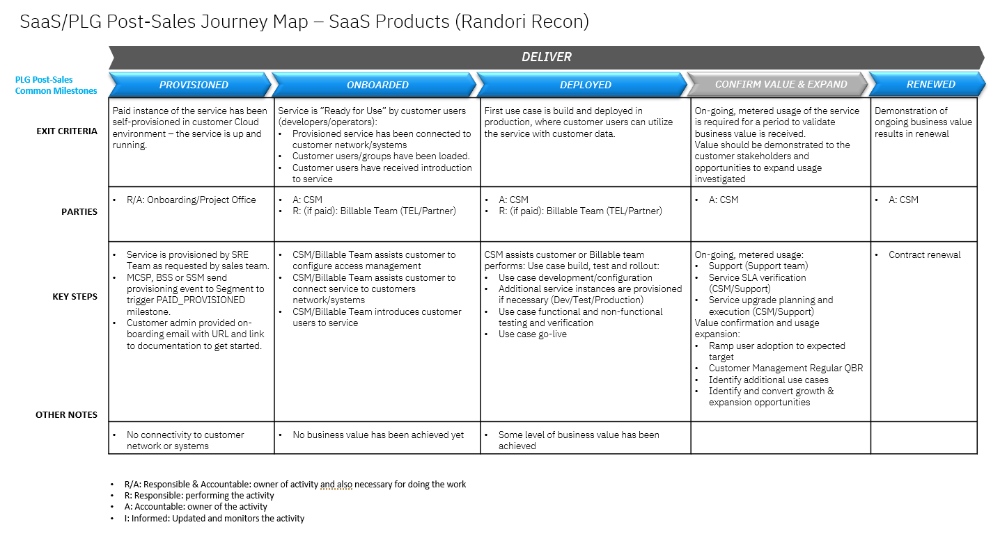
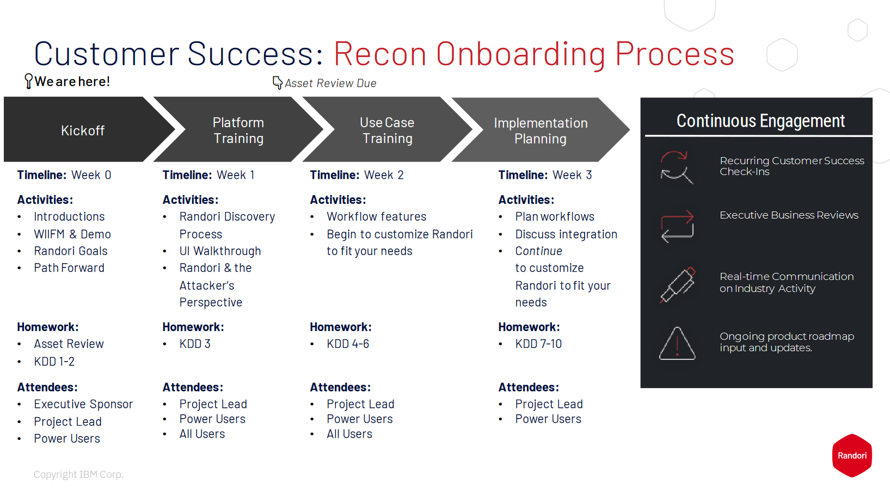

import {Link} from 'gatsby'

<InlineNotification kind="warning">

**Note: The <i>AUTOMATED</i> deployment metrics are pending sign-off and should be considered in progress until this notice is removed.**

The following considerations should be taken when reporting on SaaS deployments:
- All deployments for SaaS should follow the same process as non-SaaS / on-prem deployments
- Create one Growth Plan per use case
- Growth Plan project stages will be used to determine milestone status
- Deployed growth plans require a success plan review by a manager before being counted in the CSM scorecard
- All 3 deployment questions must be answered for the Growth Plan before being counted in the CSM scorecard

</InlineNotification>

## Contacts

| WW contact | Name |
| --- | --- |
| **Customer Success Practice Leaders:** | Greg Sabatini (<gsabatini@us.ibm.com>) &  Jonathan Pechta (<jonathan.pechta1@ibm.com>)  |
| **Digital Customer Success & PLG:** | Kerry Bridges (<kerry.bridges@ibm.com>) |
| **Technology Expert Labs Delivery:** | Pieter Ampe (<pieter.ampe@be.ibm.com>) | 
| **SRE:** | TBD | 
 
<Row>
<Column colMd={9} colLg={9}>

## Overview
As a CSM, your focus will be to guide and nurture your customers, who have a Randori entitlement. You will guide the customer from provisioning to deployment and develop and monitor a deployment plan that aligns with their initial use case(s) continue to identify and expand their use case(s).

You can learn more about Randori on the playbook page <a href='https://pages.github.ibm.com/csm-playbook/playbook/common/security/csm-security-randori/' target='_blank' rel='noreferrer noopener'>playbook page</a>.

</Column>
</Row>

<Row>
<Column>

| FAQ | Answer |
| --- | --- |
| What is the relationship name in Gainsight? | Security Randori |
| Which Clouds does Randori run on? | Amazon AWS and Google Cloud (GCP) |
| How is SaaS usage licensed? | Gainsight metrics by employee count (instrumentation pending) |
| What product tiers are offered for customers? | Essentials, Standard, and Premium. |
| Does Randori have any add-on products? | Yes, Randori Attack |
| Where is the documentation? | <a href='https://www.ibm.com/docs/en/randori?topic=randori-welcome' target='_blank' rel='noreferrer noopener'>IBM Randori Documentation</a> |
| Where do I find terms for Randori SaaS | <a href='https://www.ibm.com/support/customer/csol/terms/?id=i126-9468&lc=en' target='_blank' rel='noreferrer noopener'>IBM Randori Terms</a> | 
| Does Randori Recon SaaS run on OpenShift? | No |
| Is Randori (SaaS) consumable or ratable revenue? | Ratable. The unit of consumption is Employee Count.
| Who triggers deployment? |  Growth Plan and manager assessed (until instrumented) |

</Column>
</Row>

<Row>
<Column colMd={9} colLg={9}>

### CSM Scorecard Milestones based on usage
SaaS milestones for the CSM Scorecard are based on usage. To progress from Planning to Deploying to Deployed, see <Link to='/common/saas-growth/#security-milestones-based-on-usage'>Security milestones based on usage</Link>.

</Column>
</Row>

<Row>
<Column>
<InlineNotification kind="info"> 

** As instrumentation is pending, CSMs can mark customers deployed, but this will require manager sign-off in Gainsight. **

</InlineNotification>
 

The Randori team is currently not using MCSP to send data to Gainsight, but can measure the following today:   

1. Logged into the platform.
2. Configured a policy.
3. Tagged an entity. 
4. Configured a Saved View. 

 

<Accordion>
<AccordionItem title="SaaS Adoption Journey Insights">
SaaS has an additional level of insights that are used to track the adoption journey. These provide an additional level of detail specifically for SaaS adoption.  For Randori SaaS, they are shown in the table below:

| 
Insight
 | 
Description
 |
| --- | --- | 
| Paid Provisioned | Customer has purchased the product. |
| Paid Onboarding Progress | CSM scheduled kick-off with customer. |
| Paid Onboarded | CSM completed onboarding |
| Paid Deployed | Customer onboarding complete and monthly or bi-monthly follow-ups scheduled with CSM or account team. |

</AccordionItem>
</Accordion>

</Column>
</Row>

<Row>
<Column colMd={9} colLg={9}>

### Randori Product Feature Adoption and Value Realized Indicators
Adoption Event Milestones will be instrumented into the product to show the capabilities and features that the customer is using. This information will be used to determine the level of adoption that has taken place and ensure that the customer is receiving full business value from the product. See below for novice, intermediate and advanced level events along with an asset listing the value proposition, expected benefits, considerations for implementation and metrics of success.

</Column>
</Row>

<Row>
<Column>

<Accordion>
<AccordionItem title="Novice level indicators">

| Product Feature | Package level available | Description | 
| --- | --- | --- | 
| TBD | Essentials | TBD |
| TBD | Standard | TBD |
| TBD | Premium | TBD |

</AccordionItem>

<AccordionItem title="Intermediate level indicators">

| Product Feature | Package level available | Description | 
| --- | --- | --- |
| TBD | Essentials | TBD |
| TBD | Standard | TBD |
| TBD | Premium | TBD |

</AccordionItem>

<AccordionItem title="Advance level indicators">

| Product Feature | Package level available | Description | 
| --- | --- | --- |
| TBD | Essentials | TBD |
| TBD | Standard | TBD |
| TBD | Premium | TBD |

</AccordionItem>
</Accordion>

</Column>
</Row>

<Row>
<Column colMd={9} colLg={9}>

## Post-Sales Journey  
As a CSM with a Randori SaaS entitlement, it is your responsibility to help the customer adopt the product, bring use cases into production and renew their subscriptions. The diagram shows the Randori SaaS post-sales journey at a high level. Each section is broken down in detail with links to assets below. Onboarding details for Randori are in Box: <a href='https://ibm.ent.box.com/s/3hw63ynl8hf0ed2t8pkyp60b266ftdgt/file/1367421822381' target='_blank' rel='noreferrer noopener'>Customer Success - Kickoff overview details</a>.

</Column>
</Row>

<Row>
<Column>

 

### Provisioned

| **Led by** | **Outcome** | **Assets & Activities** |
| --- | --- | --- |
| Provisioning team (SRE) | Randori portal is provisioned on a Randori cloud instance and the primary administrator is provided portal access. Randori has multiple cloud instances across geographies. A customer portal is provisioned on one of these <a href='https://status.Randori.com/' target='_blank' rel='noreferrer noopener'>instances</a> based on the customer’s geo. Instances can be found here: <a href='https://status.Randori.com/' target='_blank' rel='noreferrer noopener'>https://status.Randori.com/</a>. The portal is ready for configuration. | There are different paths for a customer to request a Randori trial and/or paid instance. The client is required to create an <a href="https://www.ibm.com/account/reg/us-en/signup?formid=urx-19776" target='_blank' rel='noreferrer noopener'>IBMid account</a> to subscribe to a 30-day trial. Portals created by IBM Business Partners such as Verizon are not required to have an IBMid account, a local Randori administrator is created and the Administrator is prompted on the first login to create and link to an IBMid, but this is not required.   **Trial** Request a free trial instance from a 3PM or ibm.com: <a href='https://www.ibm.com/account/reg/us-en/signup?formid=urx-52370' target='_blank' rel='noreferrer noopener'>7-day trial offer for potential customers</a>. |
 

 

### Onboarded

| **Led by** | **Outcome** | **Assets & Activities** |
| --- | --- | --- |
| CSM or Technology Expert Labs | CSM walks customers through personalized onboarding and initial training. After onboarding is complete, sessions are set up as monthly or bi-monthly success check-ins. |The customer Randori Administrator logged into the portal and completed portal configuration to ready the portal to deploy licenses to end-user devices through device enrollment. For CSM-assigned accounts, It’s the CSM’s responsibility to work with the customer to ensure Security policies align with an initial use case and a small, controlled deployment to end-user devices is completed, CSMs should jointly develop a success plan with the customer and engage services as needed.   **Onboarding process:**  1. Kickoff (week 0) - Introductions, key design decisions, and goals outlined. 2. Platform training (week 1) - Training on the Randori Platform. 3. Use case training (week 2) - Workflows, vulnerability prioritization, automated actions. 4. Implementation planning (week 3 & 4) - Goal review, operational review, integration discussions.  5. Ongoing success (Month 2+) - Ongoing working session with the customer. |

 

### Deployed

| **Led by** | **Outcome** | **Assets & Activities** |
| --- | --- | --- |
| CSM, IBM Business Partners | The CSM should monitor the deployment phase and begin exploring additional use cases. As CSMs successfully complete the onboarding goals, they can confirm the customer is deployed and using the product. As no consumption model exists at this time and Randori licenses are based on license count, users might be required to have a manager mark the customer as deployed. |   CSMs are expected to review and complete the health checklist before marking customers as deployed: <a href='https://ibm.box.com/s/mvd9h89d8ndpjppw44gac0ntlz4sr6ul' target='_blank' rel='noreferrer noopener'>Recon Health Checklist</a>.   **Technology Expert Labs Offerings:**   TBD |

### Confirm Value & Expand

| **Led by** | **Outcome** | **Assets & Activities** |
| --- | --- | --- |
| CSM | Customer has realized value and expanding usage to new business units or initiating new use cases. | Set up an <a href="https://pages.github.ibm.com/csm-playbook/playbook/onboard/executive-business-review/"  target='_blank' rel='noreferrer noopener'>EBR (executive business review)</a> with client sponsor and executives to align and review the adoption, value seen and confirm the customer’s strategic goals have been met. A CSM should continue to drive usage of Technology Expert Labs services and look for opportunities to add more Unified Endpoint Management and Security use cases. Automated outreaches are sent to both North America and EMEA CSM-assigned and non-CSM-assigned accounts. CSM-assigned accounts receive a subset of the outreaches.    Customers <a href="https://ibm.ent.box.com/s/3hw63ynl8hf0ed2t8pkyp60b266ftdgt/file/1367417072594" target='_blank' rel='noreferrer noopener'>are contacted</a> with a template before an EBR and reach out to the customer to discuss the continued partnership. |

### Renewed

| **Led by** | **Outcome** | **Assets & Activities** |
| --- | --- | --- |
| CSM, IBM Subscription Annuity Rep, IBM Business Partner | The client has confirmed that they are using the product and will continue to renew their entitlement. | **Randori eNurture program**  Randori has a robust outreach program with follow-ups from CSMs. Email outreaches and calls-to-action are sent throughout the customer journey. |

</Column>
</Row>

