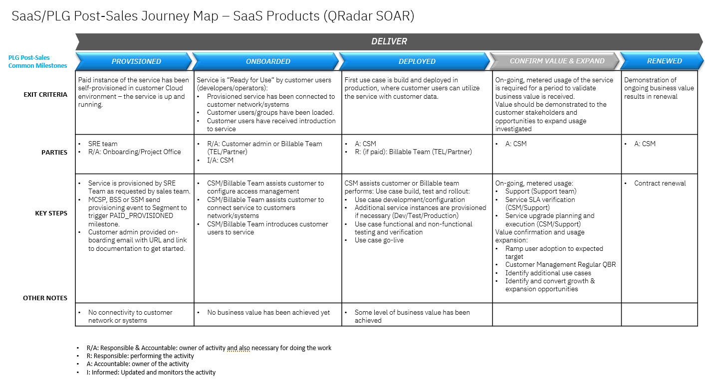

import {Link} from 'gatsby'

<InlineNotification kind="warning">

**Note: The <i>AUTOMATED</i> deployment metrics are pending sign-off and should be considered in progress until this notice is removed.**

The following considerations should be taken when reporting on SaaS deployments:
- All deployments for SaaS should follow the same process as non-SaaS / on-prem deployments
- Create one Growth Plan per use case
- Growth Plan project stages will be used to determine milestone status
- Deployed growth plans require a success plan review by a manager before being counted in the CSM scorecard
- All 3 deployment questions must be answered for the Growth Plan before being counted in the CSM scorecard

</InlineNotification>

## Contacts

| WW contact | Name |
| --- | --- |
| **Customer Success Practice Leaders:** | Greg Sabatini (<gsabatini@us.ibm.com>) &  Jonathan Pechta (<jonathan.pechta1@ibm.com>)  |
| **Digital Customer Success & PLG:** | Kerry Bridges (<kerry.bridges@ibm.com>) |
| **Technology Expert Labs Delivery:** | Pieter Ampe (<pieter.ampe@be.ibm.com>) | 
| **SRE:** | Chris Daigle  (<chris.daigle@ca.ibm.com>) | 

<Row>
<Column colMd={9} colLg={9}>

## Overview
As a CSM, your focus will be to guide and nurture your customers, who have SOAR SaaS entitlement. You will guide the customer with provisioning through to onboarding, and help with their first playbooks (roles assigned, case and analytics dashboard questions, playbook configuration, and questions from Breach Response add-on users) to expand their Incident Response (IR) use cases.

You can learn more about QRadar SOAR on the <a href="https://pages.github.ibm.com/csm-playbook/playbook/common/security/csm-security-resilient" target='_blank' rel='noreferrer noopener'>playbook page</a>.

</Column>
</Row>

<Row>
<Column>

| FAQ | Answer |
| --- | --- |
| What is the relationship name in Gainsight? | QRadar SOAR SaaS |
| Which Clouds does this product run on? | Amazon AWS |  
| Where can I find the product on AWS? | <a href="https://aws.amazon.com/marketplace/pp/prodview-slizjp6fgivxk" target='_blank' rel='noreferrer noopener'>Amazon Marketplace Link</a> |
| Is there an on-prem offering? | On-prem available as QRadar SOAR software installation. |
| How is SaaS usage calculated? | Gainsight as authorized user logins (Instrumentation pending). |
| Is there a sales kit? | <a href="https://ibm.seismic.com/Link/Content/DCCqG9XBR37hT8qBW2Q3pPXgbXBB" target='_blank' rel='noreferrer noopener'>SOAR Seller Enablement</a> |
| Where is the documentation? | <a href="https://www.ibm.com/docs/en/cp-security/saas?topic=organization-soar" target='_blank' rel='noreferrer noopener'>QRadar SOAR Documentation</a> |
| What is the subscription minimum? | QRadar SOAR offers a monthly subscription with a 12-month minimum term. |  
| Add-on available? | Yes, SOAR Breach Response. |  
| Does QRadar SOAR run on OpenShift? | Yes, Red Hat OpenShift Service on AWS (ROSA). |
| Is QRadar Soar (SaaS) consumable or ratable revenue? | Ratable. The unit of consumption is Authorized users (must measure it by logins).
| Who triggers deployment? |  Growth Plan and manager assessed (until instrumented) |

</Column>
</Row>

<Row>
<Column colMd={9} colLg={9}>

## CSM Scorecard Milestones based on Usage
SaaS milestones for the CSM Scorecard are based on usage. To progress from Planning to Deploying to Deployed, see <Link to='/common/saas-growth/#security-milestones-based-on-usage'>Security milestones based on usage</Link>.

</Column>
</Row>

<Row>
<Column>

<InlineNotification kind="info"> 

** As instrumentation is pending, CSMs can mark customers deployed, but this will require manager sign-off in Gainsight. **

</InlineNotification>

 

#### How to locate your milestone metric without Instrumentation  
For products that are currently not instrumented in Gainsight, CSMs might need to advise customers how to manually check current usage statistics within the product. 

| 
Product usage visible to customer
 | 
Status
 | 
Description
 |
| --- | --- | --- |
| No, there is no reporting like this on "user login" in CP4S. It exists in SOAR Software only. | New Feature Required**‡** | You may report on some actions, ownership, or incident itself to find data, but this does not give values between "case user" (unlimited with LI & CN) and SOAR user under license. At this time there is no easy method to report how many times a SOAR-authorized user logs in. | 

**‡** As instrumentation is pending, managers must manually mark the customer as deployed in GainSight.

<Accordion>
<AccordionItem title="SaaS Adoption Journey Insights"> 

SaaS has an additional level of insights that are used to track the adoption journey. These provide an additional level of detail specifically for SaaS adoption.  For QRadar SOAR, they are shown in the table below:

| 
Insight
 | 
Description
 |
| --- | --- | 
| Paid Provisioned | Customer has purchased the product |
| Paid Onboarded | Completion of the Onboarding Checklist |
| Paid Deployed | Authorized users access the system **‡** | 

**‡** As instrumentation is pending, managers must manually mark the customer as deployed in GainSight.

</AccordionItem>
</Accordion>

</Column>
</Row>

<Row>
<Column colMd={9} colLg={9}>

### QRadar SOAR Product Feature Adoption and Value Realized Indicators  
QRadar SOAR includes 'Product Feature Adoption' and 'Value Realized Indicators', which are instrumented into the product. Instrumentation allows CSM to identify capabilities and features that your customer is using. This information can be used to determine the level of adoption that has taken place and ensure that the customer is receiving full business value from the product. See below for novice, intermediate and advanced level indicators along with an asset listing the value proposition, expected benefits, considerations for implementation and metrics of success.

</Column>
</Row>

<Row>
<Column>

<Accordion> 
<AccordionItem title="Novice level indicators"> 

| Product Feature | Package level available | Description | 
| --- | --- | 
| TBD | Essentials | TBD |
| TBD | Standard | TBD |

</AccordionItem> 
<AccordionItem title="Intermediate level indicators"> 

| Product Feature | Package level available | Description | 
| --- | --- | 
| TBD | Essentials | TBD |
| TBD | Standard | TBD |

</AccordionItem> 
<AccordionItem title="Advance level indicators"> 

| Product Feature | Package level available | Description | 
| --- | --- | 
| TBD | Essentials | TBD |
| TBD | Standard | TBD |
 
</AccordionItem> 
</Accordion> 

</Column>
</Row>

<Row>
<Column colMd={9} colLg={9}>

## Post-Sales Journey 

As a CSM with a QRadar SOAR SaaS entitlement, it is your responsibility to help the customer adopt the product, bring use cases into production and renew their subscriptions.

</Column>
</Row>

<Row>
<Column>

### Provisioned

| **Led by** | **Outcome** | **Assets & Activities** |
| --- | --- | --- |
| QRadar SOAR SRE | QRadar SOAR SaaS instance provisioned and the customer has access. | The QRadar SOAR SaaS instance is not multi-tenant and one environment per customer. There are different paths for a customer to request a QRadar SOAR SaaS trial and/or paid instance (running in ROSA). The client will be required to create an <a href="https://www.ibm.com/account/reg/us-en/signup?formid=urx-19776" target='_blank' rel='noreferrer noopener'>IBMid account</a>.   **Demo and guided tour information**  Potential customers do not have access to a trial for QRadar SOAR at this time. Users can review a webinar on "Why SOAR is worth the investment"; otherwise, the customer needs to book a live demo.   **Watch webinar or book a live demo**   1. Log in to the <a href="https://www.ibm.com/products/qradar-soar" target='_blank' rel='noreferrer noopener'>IBM SOAR Product Page</a>.   2. Customers have the option to: <a href="https://ibm.webcasts.com/starthere.jsp?ei=1640551" target='_blank' rel='noreferrer noopener'>watch a webinar</a> or <a href="https://www.ibm.com/account/reg/signup?formid=DEMO-securityqradarsoar" target='_blank' rel='noreferrer noopener'>book a live demo</a>.    A Welcome Email Template (link TBD) is available and can be used to introduce yourself to your client and provide links to the product documentation, how to raise a support ticket, how to join the QRadar SOAR Community and enablement material. |

### Onboarded

| **Led by** | **Outcome** | **Assets & Activities** |
| --- | --- | --- |
| Customer admin and CSM (or billable partner) | Customer has validated access to their QRadar SOAR SaaS instance. | After the QRadar SOAR SaaS instance has been provisioned, a customer can access their instance URL from the AWS console (if provisioned from the AWS Marketplace) or from the email (if the request was submitted by an IBM Technical Seller).     By default, the IAM for the instance is configured with IBM Verify and using IBMid.  A customer can configure the instance to use a different access management system but will need to work with support.     If no activity has been taken by the client, an Onboarding Nudge Email Template (link TBD) can be sent with instructions to add a target.     After the onboarding process has been completed, an Onboarded Email Template is available to advise the client to take the next step of their journey to take action. |

### Deployed

| **Led by** | **Outcome** | **Assets & Activities** |
| --- | --- | --- |
| CSM or Technology Expert Labs | Client has completed onboarding and has access to the system with >2 authorized users logging in. | The image below captures the QRadar SOAR Journey providing the customer with visibility of their on-prem, public Cloud and containerized environments, automated decisions that can be taken manually and ultimately, working towards allowing QRadar SOAR to take automated actions. You can learn more about QRadar SOAR on the <a href="https://pages.github.ibm.com/csm-playbook/playbook/common/security/csm-security-resilient" target='_blank' rel='noreferrer noopener'>playbook page</a>.    It is the responsibility of the CSM to guide the customer through the deployment phase, utilizing Technology Expert Labs to perform the configuration and testing required to get to automated actions being performed.   **Technology Expert Labs Offerings:** **Assess offerings for QRadar SOAR**  &nbsp;&nbsp;&nbsp- **Assess QRadar SOAR Technical Health**   - SOAR environment analysis to scope new requirements, discover existing issues and make recommendations.   - Delivery of a detailed report including an estimate of required effort to implement recommendations.   - &nbsp;&nbsp;&nbsp**Assess QRadar SOAR Playbook Health**   - Playbook analysis to scope new requirements, discover existing issues and make recommendations.   - Delivery of a detailed report including an estimate of required effort to implement recommendations.   When the client has successfully taken an action, a Deployed Email Template (Link TBD) can be sent to guide setting up automation in the environment. |

### Confirm Value & Expand

| **Led by** | **Outcome** | **Assets & Activities** |
| --- | --- | --- |
| CSM | Customer has realized value and expanding usage to new business units. | Set up a <a href="https://pages.github.ibm.com/csm-playbook/playbook/onboard/executive-business-review/" target='_blank' rel='noreferrer noopener'>EBR (executive business review)</a> with client sponsor and executives to align and review the adoption, value seen and confirm the customer's strategic goals have been met.  A CSM should continue to drive usage of Technology Expert Labs services, look for opportunities to add more automation of actions and try to expand the adoption with other business units. |

### Renewed

| **Led by** | **Outcome** | **Assets & Activities** |
| --- | --- | --- |
| CSM and/or Technical Sales | The client has confirmed that they are using the product and will continue to renew their entitlement. | | 

</Column>
</Row>
