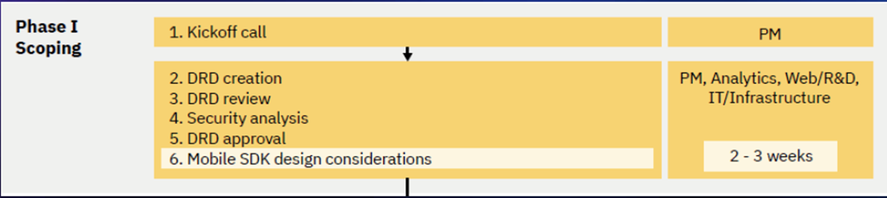
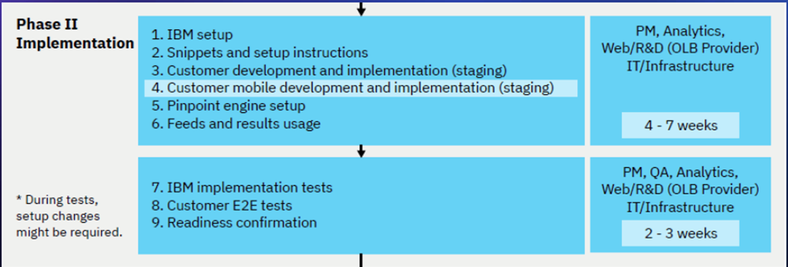
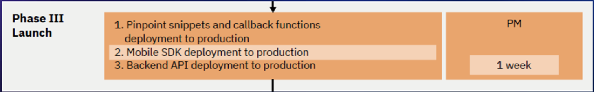
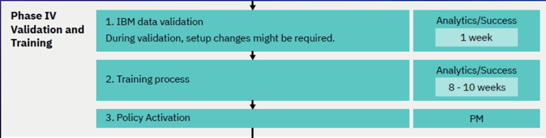
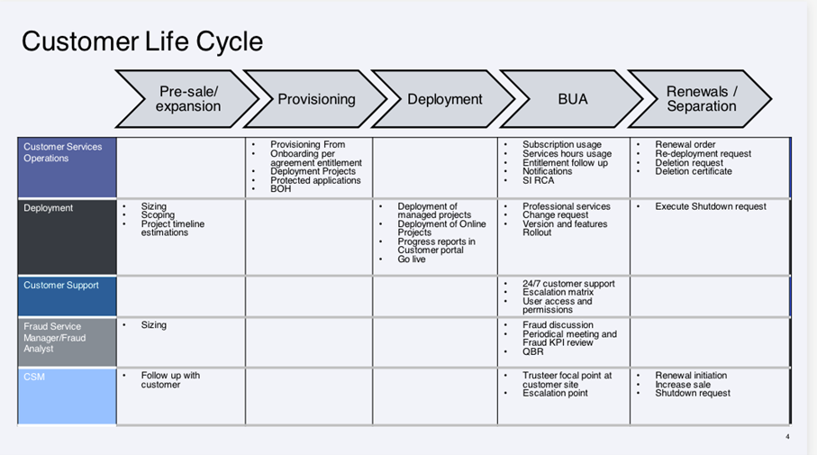
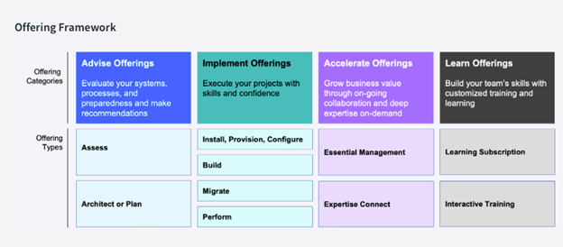
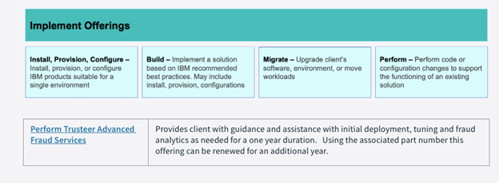
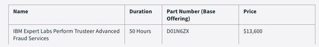

import {Link} from 'gatsby'

<InlineNotification kind="warning">

**Note: The <i>AUTOMATED</i> deployment metrics are pending sign-off and should be considered in progress until this notice is removed.**

The following considerations should be taken when reporting on SaaS deployments:
- All deployments for SaaS should follow the same process as non-SaaS / on-prem deployments
- Create one Growth Plan per use case
- Growth Plan project stages will be used to determine milestone status
- Deployed growth plans require a success plan review by a manager before being counted in the CSM scorecard
- All 3 deployment questions must be answered for the Growth Plan before being counted in the CSM scorecard

</InlineNotification>

## Contacts

| WW contact | Name |
| --- | --- |
| **Customer Success Practice Leaders:** | Greg Sabatini (<gsabatini@us.ibm.com>) &  Jonathan Pechta (<jonathan.pechta1@ibm.com>)  |
| **Sales Leader:** | Ian Wight (<Ianw@ibm.com>) |
| **SRE:** | Jason Kelleher (<jason.kelleher@ibm.com>) |
| **Digital Customer Success & PLG:** | Kerry Bridges (<kerry.bridges@ibm.com>) |
| **Technology Expert Labs Delivery:** | (<GILPER@il.ibm.com>) | 
| **Technology Expert Labs Solution Engineering:** | (<GILPER@il.ibm.com>) |
 
<Row>
<Column colMd={9} colLg={9}> 

## Overview
As a CSM, your focus will be to guide and nurture your customers, who have a Trusteer entitlement. You will guide the customer from provisioning to deployment, develop and monitor a deployment plan that aligns with their initial use case(s) continue to identify and expand their use case(s).

You can learn more about Trusteer on the playbook page <a href='https://pages.github.ibm.com/csm-playbook/playbook/common/security/csm-security-trusteer/' target='_blank' rel='noreferrer noopener'>playbook page</a>.

</Column>
</Row>

<Row>
<Column>

| FAQ | Answer |
| --- | --- |
| What is the relationship name in Gainsight? | Trusteer Pinpoint Detect & Trusteer Pinpoint Assure |
| Which Clouds does this product run on? | AWS |
| How is SaaS usage calculated? | Eligible Participants, Connections, Active Users |
| Who can help my customer will billing/invoicing questions? | Customers can be directed to <a href='mailto:arsupport@es.ibm.com' target='_blank' rel='noreferrer noopener'>arsupport</a> |
| Where is the documentation? | <a href='https://www.ibm.com/docs/en/trusteer-pinpoint' target='_blank' rel='noreferrer noopener'>IBM Trusteer Documentation</a> |
| Are the SaaS Capabilities different to the on-prem offering? | Trusteer is only available as a SaaS offering |
| Does Trusteer run on OpenShift? | No |
| Is Trusteer (SaaS) consumable or ratable revenue? | Ratable. |
| Who triggers deployment? |  Growth Plan and manager assessed (until instrumented) |

</Column>
</Row>

<Row>
<Column colMd={9} colLg={9}> 

### CSM Scorecard Milestones based on usage
SaaS milestones for the CSM Scorecard are based on usage. To progress from Planning to Deploying to Deployed, see <Link to='/common/saas-growth/#security-milestones-based-on-usage'>Security milestones based on usage</Link>.

</Column>
</Row>

<Row>
<Column>

**Examples:** 
The Administrator has been onboarded and has configured the Trusteer Management portal for their initial application(s) with snippets, feeds and results, testing and readiness confirmation (Available in Salesforce).

<Accordion>
<AccordionItem title="SaaS Adoption Journey Insights">
SaaS has an additional level of insights that are used to track the adoption journey. These provide an additional level of detail specifically for SaaS adoption.  For Trusteer SaaS, they are shown in the table below

| 
Insight
 | 
Description
 |
| --- | --- | 
| Paid Provisioned | Customer has purchased the product and the Trusteer Management Portal is provisioned. |
| Paid Onboarding Progress | Administrator has logged into the Trusteer Management portal for their initial application(s) with snippets, feeds, and results and testing |
| Paid Onboarded | Portal is ready for the administrator to demonstrate readiness to deploy along with Pre-Launch call. |
| Paid Deployed | Pinpoint is deployed in Production for at least one application. |
</AccordionItem>
</Accordion>

</Column>
</Row>

<Row>
<Column colMd={9} colLg={9}> 

### Trusteer Product Feature Adoption and Value Realized Indicators
Adoption Event Milestones will be instrumented into the product to show the capabilities and features that the customer is using. This information will be used to determine the level of adoption that has taken place and ensure that the customer is receiving full business value from the product. See below for novice, intermediate and advanced level events along with an asset listing the value proposition, expected benefits, considerations for implementation and metrics of success.

</Column>
</Row>

<Row>
<Column>

<Accordion>
<AccordionItem title="Novice level indicators">

| Product Feature | Package level available | Description | 
| --- | --- | --- | 
| TBD | TBD | TBD |
| TBD | TBD | TBD |
| TBD | TBD | TBD |

</AccordionItem>

<AccordionItem title="Intermediate level indicators">

| Product Feature | Package level available | Description | 
| --- | --- | --- |
| TBD | TBD | TBD |
| TBD | TBD | TBD |
| TBD | TBD | TBD |

</AccordionItem>

<AccordionItem title="Advance level indicators">

| Product Feature | Package level available | Description | 
| --- | --- | --- |
| TBD | TBD | TBD |
| TBD | TBD | TBD |
| TBD | TBD | TBD |

</AccordionItem>
</Accordion>

</Column>
</Row>

<Row>
<Column colMd={9} colLg={9}> 

## Post-Sales Journey  
As a CSM with a Trusteer SaaS entitlement it is your responsibility to help the customer adopt the product, bring use cases into production and renew their subscriptions. The diagram shows the Trusteer SaaS post-sales journey at a high level. Each section is broken down in detail with links to assets below.

</Column>
</Row>

<Row>
<Column>

 

### Pre-Sales/Expansion

| **Led by** | **Outcome** | **Assets & Activities** |
| --- | --- | --- |
| Trusteer Sales Team/Tech Sales/Trusteer Services Team <br/ **Assisted by:** CSM | Team engages with the client to identify any new opportunities to deploy and discuss growth and adoption of new use cases. This is done in conjunction with the Trusteer sales and services teams. |

### Provisioned

| **Led by** | **Outcome** | **Assets & Activities** |
| --- | --- | --- |
| Trusteer Customer Services Operations Team | Trusteer portal is provisioned on a Trusteer AWS cloud instance and the primary administrator is provided portal access. Trusteer has multiple cloud instances across geographies. |  |

### Deployment

| **Led by** | **Outcome** | **Assets & Activities** |
| --- | --- | --- |
| Trusteer Customer Services Operations Team   **Assisted by:** CSM | Definition and Deployment of instrumented applications at the client site. Deployment of online projects and applications. Definition of metrics and reporting structure for the client with the intent of educating the customer on the effectiveness of the tools and giving details on fraud detection activity. | | 

### Deployed

| **Led by** | **Outcome** | **Assets & Activities** |
| --- | --- | --- |
| CSM, IBM Business Partners | The CSM should monitor the rollout of applications instrumented and begin exploring additional use cases. After an application has been rolled out and is in production, the client is considered deployed. | **Technology Expert Labs Offerings:**  For more information, see <a href='https://ibm.seismic.com/app?ContentId=0bb680e1-ba51-499a-847a-1e6798bff8fe#/doccenter/f6bc8873-d580-4ee8-a903-c4e0d3a7eee9/doc/%252Fddee51efc9-4ad7-4432-6340-1ce9c7c12c52%252Fdd9a9377c9-5e5b-3311-59c9-054668c8f2b1%252Fdfbb748928-5f27-4232-9e4e-e3bb08692dcd%252Flf31bf4530-07a7-4931-9ad8-6c473153c29d' target='_blank' rel='noreferrer noopener'>Technology Expert Labs Framework Details</a>. | 

  
Expert Labs offerings

       

### Confirm Value & Expand

| **Led by** | **Outcome** | **Assets & Activities** |
| --- | --- | --- |
| CSM, Brand Sales and Annuity Seller | Customer has realized value and expanding usage to new business units. | If expansion is needed, the CSM and Brand Sales teams can partner with the Annuity seller to use the renewal as an impending event to quote expansion. If direct, this can be done on one bid. If going through the channel, two bids are required. Expansion bid from the Brand Seller and Renewal bid from the Annuity Seller.  |

### Renewed

| **Led by** | **Outcome** | **Assets & Activities** |
| --- | --- | --- |
| CSM, IBM Subscription Annuity Rep | Annuity seller will quote the upcoming renewal, and work through purchasing with the client, either directly or via business partner. Auto-renewals will book BAU. | |

</Column>
</Row>