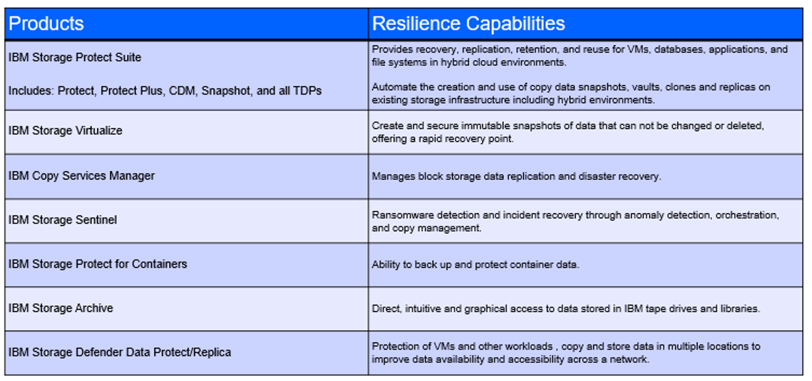

import { OrderedList, ListItem } from "carbon-components-react";

<AnchorLinks small>
  <AnchorLink>What is IBM Storage Defender and what does it do?</AnchorLink>
  <AnchorLink>
    What are the pain points that IBM Storage Defender addresses?
  </AnchorLink>
  <AnchorLink>What do CSM driven deployments look like?</AnchorLink>
  <AnchorLink>
    Why would a customer deploy IBM Storage Defender if they already have an
    existing solution?
  </AnchorLink>
  <AnchorLink>
    The steps to deploy and who is responsible for what, when?
  </AnchorLink>
  <AnchorLink>How do I expand and grow IBM Storage Defender usage?</AnchorLink>
  <AnchorLink>There isn't a current use case, where do I start?</AnchorLink>
  <AnchorLink>Frequently asked questions</AnchorLink>
  <AnchorLink>
    How do I measure and report my IBM Storage Defender deployment?
  </AnchorLink>
</AnchorLinks>

<Row className="resource-card-group">

<Column colMd={4} colLg={4} noGutterSm>
<ResourceCard
      subTitle="Implement new features for primary and secondary storage as they are added to Defender"
      title="Defender modernization"
      href="/common/modernization/modernization-defender/">

</ResourceCard>

</Column>
</Row>

<Row>
<Column colMd={8} colLg={8} noGutterMdLeft>

---

## What is IBM Storage Defender and what does it do?

**IBM Storage Defender** is a data resiliency solution that features exceptional scalability, broad application support, cost-saving data reduction technologies (such as “incremental forever,” deduplication and compression), flexible data retention on tape and immutable object storage, and multiple layers of cyber resilience. It enhances cyber resilience with inline data corruption detection,
creating highly secure and immutable copies, and deep scanning application-consistent copies to look for anomalies and potential malware. IBM Storage Protect also provides long-term data retention for protection from dormant threats or to help meet compliance requirements.

IBM Storage Defender helps recover from data loss by integrating immutable backups, accelerating discovery of threats and orchestrating faster recovery. With IBM Storage Defender, you can gain enhanced protection for your corporate data, better integrate your data protection and data security solutions, and help reduce
the complexity and cost of data storage management.

### What does IBM Storage Defender Do?

#### Streamlines data recovery with granular control

Data managed by IBM Storage Defender is replicated to offsite recovery facilities for safekeeping. Doing this helps deliver fast, flexible restores from primary and remote recovery sites so you can recover individual items, complex systems and entire data centers. IBM Storage Defender delivers near instantaneous recovery of primary workloads from a copy on a production array, can store data in a lower cost storage medium such as tape or your cloud environment, and enables you to conduct forensic analysis on a corrupted environment at a separate isolated location.

#### Offers simplified credit-based licensing

IBM Storage Defender includes all IBM Storage for Data Resiliency capabilities, including data protection, copy data management and virtualization, consumable through credit-based licensing called resource units (RUs). RUs give you the flexibility to choose only the capabilities you need for your enterprise, helping you minimize costs and optimize resources.

#### Functions seamlessly with modern IT environments

IBM Storage Defender offers the capabilities needed in a modern IT environment consisting of virtual machines, databases, applications and file systems in hybrid cloud environments. SLA-based policies automate the entire data protection process, including backup, replication, and secure data retention on premises and in the cloud.

- Scale out data protection for hyperscale VMware deployments as well as additional hypervisors such as Nutanix AHV, Hyper-V and RedHat® RHV
- Support for cloud VMs including AWS EC2, Microsoft Azure VM and GCP
- Advanced data protection for NoSQL workloads including Cassandra and MongoDB
- A wide range of database support including SAP, Oracle, MS SQL and IBM Db2®
- Unified visibility, policy and manageability for data

#### Enhances data resilience with multiple layers of protection and recovery

IBM Storage Defender also provides secure, incorruptible copies of data, with layers of protection, both on array and off array, to help ensure data is recoverable. Additionally, it supports IBM Safeguarded Copy which provides a virtual air gap by automatically creating point-in-time snapshots. For added data resilience, IBM Storage Defender also supports physical air gap data to tape systems such as the IBM Diamondback Tape Library.  
**IBM Storage Defender** combines the functions of other IBM Storage Software offerings into a single toolkit for the customers use in maximizing their data protection and resilience posture. Think of the Storage Defender license as providing the toolbox where customers choose what tools go in the box.

#### Licensing

The product is offered as a **SUBSCRIPTION LICENSE** only and can be used alongside on-premise entitlements of its components, allowing the client to access the expanded functionality of Defender by assigning purchased [RU’s (Resource Units)](https://www.ibm.com/downloads/cas/AWDK6VME) to the additional components in the offering.  
Storage Defender is NOT a bundle or a suite … you license each desired capability. This provides flexibility and cost efficiency.  
Existing licensing models for existing capabilities are still an option AND should a customer want to move to a subscription model then upgrades are available. For example, clients can use their existing Storage Protect entitlements with Defender, and assign the purchased Resource Units of Defender to new capabilities such as as Data Protect, Replica and Protect for Containers. These new capabilities can be acquired ONLY through the Defender subscription license model.  
Additionally .. .the Data Management Service (Control Plane) is a SaaS offering and is licensed with a different part number - but still RU based. For this it is simply 1 RU per instance of DMS.  
What’s available in the Storage Defender Toolbox?

Confused about RUs and think it’s a bit complicated? See [IBM Sales Configurator](https://app.ibmsalesconfigurator.com/#/) for help!
Also, see the Powerpoint (CSM Defender.pptm) in the [box folder](https://ibm.ent.box.com/folder/221755144018?s=rpn0gpbrnlnk5j5rsg046rgw0ei9mml8) for licensing examples.

---

## What are the pain points that IBM Storage Defender addresses?

The IBM team of Sales, Tech Sales and potentially CSM can use the information bellow, along with a Client Engineering engagement to identify use cases and sponsors

### Data resilience need in defense of cyberattacks

Some facts about cyber attacks:

- 83% of organizations have experienced more than one data breach
- 60% of organizations had to raise their product or services prices due to a breach, impacting competitiveness
- 17%of Cyber Attacks are Ransomware
- 26% of Clients who paid the ransom still could not recover the data
- 23 days = average recovery time needed after a ransomware attack
- $5M = Est. average annual cost of a Cyber Attack in 2023

### Defender can significantly reduce and limit these impacts

With disaster recovery, organizations can recover from a known point in time, they know what data or workload has been impacted, and for rapid recovery, they can have copies at metro or global distances. With cyber recovery however, organizations do not know what the recovery point is or when the data first became infected. Since everything is replicated - corruptions, malware, everything - all replicated copies made after the point of attack have been similarly impacted, whether at the storage layer or the application layer, so organizations also do not know how far the infection has spread.

The unfortunate reality is that the probability of a cyber-attack is higher compared to a disaster, so the NEED to be prepared is crucial, or the financial impact to the business could be very significant. This is why cyber recovery is required in addition to the disaster recovery capabilities that organizations already have.

IBM has a [Cyber Resiliency Assessment Tool (CRAT)](https://ibm.seismic.com/Link/Content/DCDG9PJ92CDQg87H8CPFQBh2qVMV). It only takes about 2 hours of your time and it allows us to help you understand where you may have blind spots. Please consider using the assessment, because even if you think you already have a resilient environment, wouldn’t it be worth making sure that is true? If you are truly resilient you will have confirmation, but it is more likely you might come away with a couple of little pointers to help make things even better. However, it could also result in an eye opening moment when you really understand what the risks and exposures your business is facing are revealed.

### Benefits to Clients:

#### Advanced threat protection

Continuously monitor, detect and prioritize threats by data type.

#### Automated data resilience

Identify safest points of recovery and orchestrate recovery across primary and secondary workloads.

#### Flexible consumption model

Storage Defender provides credit-based licensing for storage virtualization, data protection, threat detection and hardware snapshots.

#### Compliance without compromise

Safely retain data longer to guard against dormant threats.

#### Built for hybrid cloud

Backup, restore, manage and monitor across on-premises and cloud-based data storage.

#### Unified visibility

Determine your data resiliency status across all workloads with a single pane of glass control pane.

#### Implementation project

Technology Expert Labs can take ownership of an implementation project using their pre-packaged offerings. See more here

---

## What do CSM driven deployments look like?

Common use cases for Storage Defender are in the below areas:

#### Backup metadata alert, recovery from logical air gap

Use metadata alerts to initiate a recovery from a VMware backup protected by a logical air gap. Anomalies can be detected by Storage Defender by examining a 30-day moving average of VMware backups.

#### Coordinate threat investigation, remediation, and data recovery

Automatically examine user activity and audit logs for suspicious activity, alert the enterprise SIEM with timestamps of suspicious events, and enable the SOC team to remediate using its SOAR solution. Follow through with storage-specific plays provided by Storage Defender.

#### Prioritize threats on SAP Hana with data classification and layered resilience

Data is classified and tagged as containing PII, subject to GDPR, or CCPA as it is ingested to primary or secondary storage. When a data integrity check fails, recovery is enabled from the last safe snapshot or clean backup protected by a physical or logical air gap.

#### Provide visibility for end-to-end data resilience across your primary and secondary workloads

Detect threats such as ransomware, exfiltration and insider attacks, leveraging intelligent software from IBM and its ecosystem partners. These tools can help you identify the safest recovery points. And because IBM Storage Defender integrates with your existing security operations tools and processes, you can recover a minimally viable company sooner.

#### Cyberattack protection for business-critical workloads

IBM Storage Sentinel, included as a component of Storage Defender, is a workload-specific cyber resilience solution that protects your business against ransomware attacks. It uses machine learning to detect, diagnose and identify the sources of ransomware attacks and provides automated recovery orchestration.

---

## Why would a customer deploy IBM Storage Defender if they already have an existing solution?

IBM Storage Defender combines the functions of other IBM Storage Software offerings into a single toolkit for the customers use in maximizing their data protection and resilience posture. Think of the Storage Defender license as providing the toolbox where customers choose what tools go in the box.  
The product is offered as a SUBSCRIPTION LICENSE only and can be used alongside on-premise entitlements of its components, allowing the client to access the expanded functionality of Defender by assigning purchased RU’s (Resource Units) to the additional components in the offering.  
Storage Defender is NOT a bundle or a suite … you license each desired capability. This provides flexibility and cost efficiency.  
Existing licensing models for existing capabilities are still an option **AND** should a customer want to move to a subscription model then upgrades are available. For example, clients can use their existing Storage Protect entitlements with Defender, and assign the purchased Resource Units of Defender to new capabilities such as as Data Protect, Replica and Protect for Containers. These new capabilities can be acquired ONLY through the Defender subscription license model  

### The key features of Storage Defender include:

#### Data protection for enterprise workloads

Protect critical infrastructure including virtual machines, containers, or IaaS and backup for SAP, Oracle®, IBM DB2®, Cassandra and MongoDB.

#### Sensitive data needs layers of data resilience

Resilience requires multiple layers of protection. Storage Defender includes immutable storage, hardware snapshots, backup, and air gap to tape or cloud.

#### Application aware threat detection

Identify anomalies and potential threats with real time detection in IBM FlashSystem®, backup detection, vulnerability scans and data integrity checks.

#### Surgical recovery

Recover your minimally viable company from the safest points. Test recovery prior to restore following an attack or as an ongoing practice.

#### Coordinated security operations

Align infrastructure, data and security teams. SIEM, SOAR and XDR integrations ensure Storage Defender operates within existing enterprise SecOps workflows.

#### Unified view of resilience

Break the silos within teams with a unified view on data resilience and recoverability, enabling alignment on recovery plans in the face of threats.

#### [Competitive Analysis / Product Battlecards](https://ibm.seismic.com/Link/Content/DCVcbX89JWbHh8FW6pJB4BDdPm7j)

---

## The steps to deploy and who is responsible for what, when?

Given that Defender has many components, each component may have their unique deployment procedures.
IBM Lab Services can assist as needed

---

## How do I expand and grow IBM Storage Defender usage?

#### Integration with existing SecOps tools and processes

IBM Storage Defender can integrate security tools like SIEM and SOAR security solutions that are likely already in use in your organization. This integration allows you to build a bidirectional alert and response system between your SecOps and storage teams to establish a set of processes that can reduce the complexity and cost of managing data storage systems.

An example of how this could work in practice is allowing IBM Storage Defender to use its bidirectional integration with your SIEM solution to automatically examine user activity and audit logs for suspicious activity, then issue alerts. This integration helps your SOC team respond to the threat and the storage team to begin recovery if needed.

#### Early detection of internal and external threats

IBM Storage Defender is designed to leverage sensors across primary and secondary workloads to detect threats and anomalies from backup metadata, array snapshots and other relevant threat indicators. Signals from all available sensors are aggregated by IBM Storage Defender, whether signals originate from hardware (FCM) or software (file system or backup based detection). This proactive capability helps you detect and address an array of threats before they can impact your data.

#### Consider one way this could improve your clients operational resilience.

IBM Storage Defender can detect anomalies in an SAP HANA database as data is written to primary or secondary storage, then leverage that knowledge when creating copies of the data to ensure that the data being copied is not compromised.

#### Recover acceleration for business operations

While IBM Storage Defender seeks to eliminate the threats to your data, there are a myriad of ways your data could still be impacted, such as through user or administrator error. Your primary concern is how fast you can recover that data to keep your business running smoothly without disruption. IBM Storage Defender
includes copy data management tools to manage and orchestrate application integrated copies of data. It makes copies available when and where users need them for almost instant data recovery, or for data reuse, by cataloging and managing copy data across hybrid cloud infrastructures.

#### Anomaly Detection

Consider another scenario that further illustrates how IBM Storage Defender can improve your operational resilience. An anomaly in your data can be detected by examining the changes in your databases like Oracle or SAP HANA. This action triggers an IBM Storage Defender alert that can then be used to initiate a recovery from the latest clean, immutable hardware snapshot. This information can be used to recover safely because IBM Storage Defender knows which copy is the latest, clean copy based on the anomaly. Additionally, by using on-premises and cloud clean rooms, IBM Storage Defender can provide a place to conduct safe additional validation of the data before restoring it to production.

---

## There isn’t a current use case, where do I start?

Check out the [IBM Storage Defender Sales Kit](https://ibm.seismic.com/Link/Content/DCgFfq4m3dm9MG7BgD3X6qP7dHWd) Sales Kit for the latest sales materials.  
Check out the [IBM Storage Defender data sheet](https://www.ibm.com/downloads/cas/KZ9QZP4Y) for Product Information.  

### What to say and Show

#### [What to Know - Seller presentations](https://ibm.seismic.com/Link/Content/DCq4jR9mFFgRq8WVcR32CVJ2HJ8j)

#### [IBM Storage Defender Data management overview](https://ibm.seismic.com/Link/Content/DC2673gFq67298HGVD83MB2qM3TP)

#### [IBM Storage Defender Solution Brief](https://www.ibm.com/downloads/cas/AWDK6VME)

### IBM Storage Defender Top Assets for Sellers

#### [IBM Data Resilience](https://ibm.seismic.com/app?ContentId=fe46faf3-7910-4dc7-ac99-1835ee14dd21)

#### [IBM Storage Defender Introduction](https://ibm.seismic.com/app?ContentId=fe46faf3-7910-4dc7-ac99-1835ee14dd21)

#### [IBM Storage Defender Introduction (Recorded)](https://ibm.seismic.com/app?ContentId=fe46faf3-7910-4dc7-ac99-1835ee14dd21)

#### [IBM Storage Defender Ordering Process](https://ibm.seismic.com/app?ContentId=3a44a331-2b31-47cf-960d-a1041dfb4c0c)

#### [Sales Configurator](https://app.ibmsalesconfigurator.com/#/)

#### [Sales Kickoff Replay](https://ibm.box.com/s/vcum30mo2qdgsm7e1zg58bmk3igskm5h)

#### Weekly Office Hours

For IBM Sellers and BPs every Friday at 10am Eastern. To sign up please send an email to schowrig@us.ibm.com

 

---

## Frequently asked questions

- **As an IBM CSM, do I get credit for deploying IBM Storage Defender on IBM Cloud?**

Yes, IBM Storage Defender is one of the <a href='https://w3.ibm.com/w3publisher/customersuccess/the-practice/csm-covered-offerings' target='_blank' rel='noreferrer noopener'>Growth offerings that IBM CSMs cover</a>.

#### [IBM Storage Defender FAQ](https://ibm.seismic.com/Link/Content/DCCCcFjcH97PmGCT9P3G6BJ93Mmj)

#### [Licensing details and FAQ](https://www.ibm.com/docs/en/storage-scale?topic=STXKQY/gpfsclustersfaq.html)

---

## How do I measure and report my Defender deployment?

Contact Defender offering management for guidance. ILMT does not work for IBM Storage Defender. Additionally, since Defender contains multiple components, it is vital to be able to track the RU’s associated with each component to ensure proper accounting of revenue by IBM. Please consult with Product Management for declaration questions

#### Storage Defender Product Management:

\- Juan Carlos Jimenez juan.c.jimenez@ibm.com 
\- Kim Ballard kgilliar@us.ibm.com 
\- Si McAleer mcaleer@us.ibm.com 

</Column>

<Column colMd={4} colLg={4} noGutterMdLeft>

<Aside>

<strong>Customer Success Practice Leaders:</strong>
<OrderedList>
  <ListItem>- Fraser MacIntosh (@fraser)</ListItem>
  <ListItem>- Lorrie Heiken (@lorrieheiken)</ListItem>
</OrderedList>
<strong>CSM Slack Channel:</strong> <a
  href="https://ibm-cloudplatform.slack.com/archives/C04MG0NEJ2C"
  target='_blank' rel='noreferrer noopener'
>
  #csm-storage
</a>
 
<strong>Seismic:</strong> <a
  href="https://ibm.seismic.com/Link/Content/DCqqPXmjJBWD28hV8TXG9gmjV42d"
  target='_blank' rel='noreferrer noopener'
>
  Sales Kit
</a> with Presentations and Pre-sales assets
 
<strong>Product Documentation:</strong> <a
  href="https://www.ibm.com/docs/en/announcements/storage-defender"
  target='_blank' rel='noreferrer noopener'
>
  Announcement Letter
</a>

</Aside>

<Aside>

<strong>Product Channels</strong>
  
<strong>IBM Storage Defender</strong> <a
  href="https://ibm-systems-storage.slack.com/archives/C04SZAVGWQZ"
  target='_blank' rel='noreferrer noopener'
>
  #defender-help
</a>
 
</Aside>

<Aside>
<strong>Contacts</strong> 
<strong>Worldwide Sales Leaders</strong>: 
<a href="https://w3.ibm.com/#/people/379255897" target='_blank' rel='noreferrer noopener'>Shelly Howrigon</a> 
<a href="https://w3.ibm.com/#/people/056983866" target='_blank' rel='noreferrer noopener'>Ian Shave</a> 

<strong>WorldWide Tech Sales Leaders</strong>: 

<a href="https://w3.ibm.com/#/people/0G2679897" target='_blank' rel='noreferrer noopener'>
  Christian Burns
</a>
 
<a href="https://w3.ibm.com/#/people/014602649" target='_blank' rel='noreferrer noopener'>
  Chris Vollmar
</a>
 

<strong>Worldwide Channel Leader</strong>: 

<a href="https://w3.ibm.com/#/people/923704897" target='_blank' rel='noreferrer noopener'>
  Randy Daniel
</a>
 

<strong>Storage Defender Product Management</strong>: 

<a href="https://w3.ibm.com/#/people/1J4620897" target='_blank' rel='noreferrer noopener'>
  Juan Carlos Jimenez
</a>
 
<a href="https://w3.ibm.com/#/people/9A8701897" target='_blank' rel='noreferrer noopener'>
  Kim Ballard
</a>
 
<a href="https://w3.ibm.com/#/people/777606897" target='_blank' rel='noreferrer noopener'>
  Si McAleer
</a>
 

</Aside>

</Column>

</Row>

<Row>

<Column>

---

</Column>
</Row>
