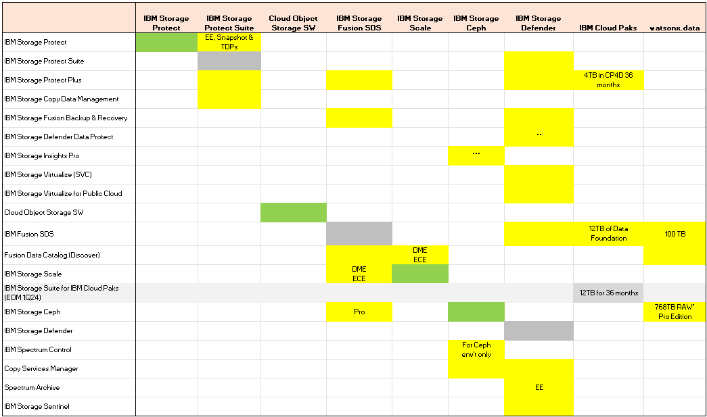

## IBM Storage Software Matrix for CSMs 

<AnchorLinks small>
  <AnchorLink>Introduction</AnchorLink>
  <AnchorLink>The Matrix</AnchorLink>
  <AnchorLink>IBM Storage Software Products</AnchorLink>
  <AnchorLink>IBM Storage Software Suites</AnchorLink>
  <AnchorLink>How can I get further help?</AnchorLink>
</AnchorLinks>

---

## Introduction 

It can be complex to work out which software customers are entitled to, or how to make sure a customer can get one of the products which dosen't appear in the high-level list of CSM focus software.  

This page aims to help demistify what's available to the customer and how it can be licensed. The list is current for 2024 CSM covered products.

Packages and products for CSM focus are listed in the columns, the products they contain are in the rows. 

---

## The Matrix

**Key**

<InlineNotification kind="info">
  Please submit queries or corrections to Fraser MacIntosh Storage Community of Practice Lead
  @fraser on IBM Slack, or via the <a href="https://ibm.enterprise.slack.com/archives/C04SZJSGDDG">#csm-storage</a> slack channel
</InlineNotification>

---

## IBM Storage Software Standalone Products

### IBM Storage Protect
Storage Protect is available standalone in various licensing and entitlement models, Front End TB (FET), Back end TB (BET) and Processor Value Units (PVU)
 

### IBM Storage Protect Plus
Storage Protect Plus comes with entitlement for IBM Storage Fusion Backup & Restore, Storage Protect Suite, Storage Defender and with a limited 4TB/36 month availabillity with Cloud Paks. Storage Protect Plus should not be considered for new deployments, CSMs should be discussing with their customers how to start planning their move away from SPP.
 

### IBM Storage Copy Data Management
Copy Data Manacement is available through Storage Protect Suite.
 

### IBM Storage Fusion Backup & Recovery
Storage Fusion backup and recovery is bundled with IBM Storage Fusion. It is also available through IBM Storage Defender, where it can also be used to backup non-Fusion Red Hat OpenShift clusters.
 

### IBM Storage Insights Pro
Storage Insights Pro is availbale through IBM Storage Control entitlement for IBM Storage Ceph.
 

### IBM Storage Virtualize (SVC)
Virtualize SVC (license for SAN Volume Controller hardware) is available in Defender
 

### IBM Storage Virtualize for Public Cloud
Virtualize for Public Cloud is available in Defender.
 

### Cloud Object Storage SW
IBM Cloud Object Storage software is available standalone.
 

### Fusion Data Catalog (Discover)
Fusion Data Catalog formerly called IBM Spectrum Discover, is bundled with Storage Fusion, Storage Scale DME & ECE and watsonx.data.
Fusion Data Catalog is available also to run on Red Hat OpenShift clusters.
 

### IBM Storage Scale
Scale Data Management Edition (DME) and Scale Erasure Code Edition (ECE) comes with entitlement for Fusion Data Catalog (formerly Discover)
 

### IBM Storage Ceph
IBM Storage Ceph comes with entitlement for Storage Control and Copy Services Manager, both for the Ceph environment only.
In addition through the entitlement for Control it also comes with Insights Pro.
 

### IBM Spectrum Control
Spectrum Control comes with entitlement for cloud based Insights Pro, in addition to the on-prem Control software.
 

### Copy Services Manager
Copy Services Manager is available through Storage Defender. In certain circumstances CSM is available with Control and thereby also Insights Pro. Please ask for advice from your Storage CSM leads for confirmation if you want ot use this entitlement/featureset.
 

### IBM Storage Archive
IBM Storage Archive is available as Library Edition for Linux and Enterprise Edition.
NB: Enterprise Edition requires IBM Storage Scale; Library Edition for Windows has been discontinued.
 

### IBM Storage Sentinel
IBM Storage Sentinel is a primary storage anomaly detection system which is available standalone and as part of IBM Storage Defender.
 
---

## IBM Storage Software Suites

### IBM Storage Protect Suite
IBM Storage Protect Suite delivers entitlement to IBM Storage Protect Extended Edition (formerly Spectrum Protect, formerly TSM) with Protect Snapshot and all the Tivoli Data Protection Agents.
IBM Storage Copy Data Management, IBM Storage Protect Plus and through protect plus also entitlement for IBM Storage Fusion backup and recovery.
 

### IBM Fusion SDS
The following packages are available in Fusion SDS - IBM Storage Protect Plus; IBM Storage Fusion Backup & Recovery; Fusion Data Catalog; IBM Storage Scale DME & ECE; IBM Storage Ceph (Pro)
 

### IBM Storage Suite for IBM Cloud Paks (EOM 1Q24)
Storage Suite for Cloud Paks is EOM and should no longer be actively sold. For customers still claiming entitlements it contains:
IBM Storage Virtualize for Public Cloud; Cloud Object Storage SW; Fusion Data Catalog (Discover); IBM Storage Scale.
 

### IBM Storage Defender
IBM Storage Protect Suite delivers entitlement to IBM Storage Protect Extended Edition (formerly Spectrum Protect, formerly TSM) with Protect Snapshot and all the Tivoli Data Protection Agents.
IBM Storage Copy Data Management, IBM Storage Protect Plus and through protect plus also entitlement for IBM Storage Fusion backup and recovery
IBM Storage Protect Plus; IBM Storage Fusion Backup & Recovery; IBM Storage Virtualize (SVC); IBM Storage Virtualize for Public Cloud; IBM Fusion SDS; Copy Services Manager; IBM Storage Archive EE; IBM Storage Sentinel.
 

### IBM Cloud Paks
Cloud Pak for Data comes with 4TB of IBM Storage Protect Plus and by extention also IBM Storage Fusion Backup and Recovery. This entitlement is limited for 36 months at the point of license agreement.
12TB Fusion Data Foundation Essentials comes with cloud paks.
 

### Wastonx.data
Wastonx.data comes with 100TB of Fusion SDS and by extention Fusion Data Catalog. It also comes with 768TB RAW/500TB Usable of IBM Storage Ceph.
 

### Watsonx.ai 
watsonx.ai comes with entitlement to 12TB Fusion Data Foundation Essentials.
 

---

## How can I get further help?

If it's urgent contact your Storage Practice Lead: Fraser MacIntosh  
Slack: @fraser  
Email: fraser.macintosh@uk.ibm.com  
Cell/Mobile: +44 (0) 7747633322 (please note Fraser is a UK resident)  

If it's not urgent: Ask in the [#csm-storage](https://ibm.enterprise.slack.com/archives/C04SZJSGDDG) channel or the AmA/Office Hours meetings (see pinned messages in the #csm-storage channel for details)

