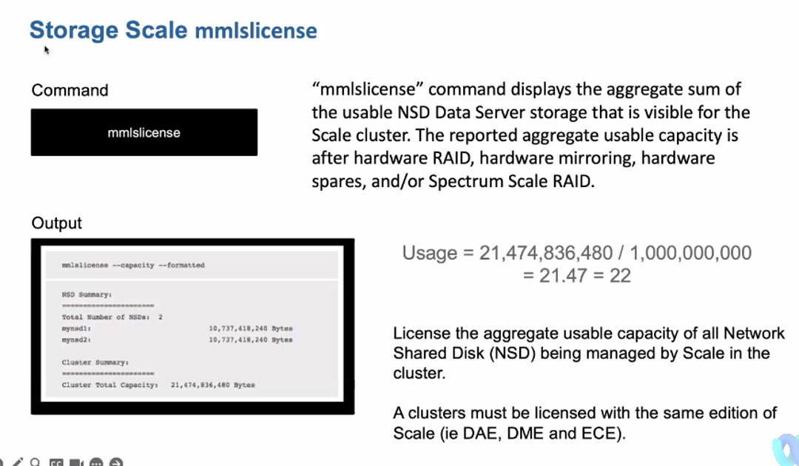

import { OrderedList, ListItem } from "carbon-components-react";

<AnchorLinks small>
  <AnchorLink>What is IBM Storage Scale and what does it do?</AnchorLink>
  <AnchorLink>
    What are the pain points that IBM Storage Scale addresses?
  </AnchorLink>
  <AnchorLink>What do CSM driven deployments look like?</AnchorLink>
  <AnchorLink>
    Why would a customer deploy IBM Storage Scale if they already have an
    existing solution?
  </AnchorLink>
  <AnchorLink>
    The steps to deploy and who is responsible for what, when?
  </AnchorLink>
  <AnchorLink>How do I expand and grow IBM Storage Scale usage?</AnchorLink>
  <AnchorLink>There isn't a current use case, where do I start?</AnchorLink>
  <AnchorLink>Frequently asked questions</AnchorLink>
  <AnchorLink>
    How do I measure and report my IBM Storage Scale capacity-based deployment?
  </AnchorLink>
</AnchorLinks>

<Row>
<Column colMd={8} colLg={8} noGutterMdLeft>

---

## What is IBM Storage Scale and what does it do?

**IBM Storage Scale** in the [IBM Storage](https://www.ibm.com/storage) portfolio is a cluster file system that provides concurrent, high-performance, high-availability access to data, data replication, policy-based storage management, and multi-site operations.  
IBM Storage Scale provides a global data platform for high-performance, next-generation data services. Accelerate your AI initiatives with parallel access to Yottabytes of file and object data using multiple APIs concurrently to the same data. Engineered to speed data access recovery times to seconds after a cyberattack. Access a single copy of data from most any file or object storage system including data in the public cloud.  
**The components that are provided by IBM Storage Scale are**: 
\- A High Performance Parallel Filesystem. 
\- Ability to exploit all available network bandwidth. 
\- Be hardware agnostic, use multi-vendor. 
\- Intelligent Automated Data Tiering. 
\- Bursting to the Cloud. 
\- Provide Global Collaboration. 
\- Be Software Defined – use any enterprise hardware. 
\- Proven references at large Scale. 
\- Multi-Protocol Access to data. 
\- Proven High Performance Data Analytics references. 
\- Provide end to end Sysadmin Disk to Desktop Support 

#### [IBM has been recognized as a Leader 7 years in a row](https://www.ibm.com/account/reg/us-en/signup?formid=urx-40622)

"Distributed file systems and object storage deployments are growing faster than ever in both volume and size as the consolidated platform for unstructured data services in global data centers. This research helps I&O leaders to assess the vision and execution of vendors in this market."  
_This graphic was published by Gartner, Inc. as part of a larger research document and should be evaluated in the context of the entire document. The Gartner document is available upon request from IBM._  
_Gartner does not endorse any vendor, product or service depicted in its research publications, and does not advise technology users to select only those vendors with the highest ratings or other designation. Gartner research publications consist of the opinions of Gartner’s research organization and should not be construed as statements of fact. Gartner disclaims all warranties, expressed or implied, with respect to this research, including any warranties of merchantability or fitness for a particular purpose. Magic Quadrant for Distributed File Systems and Object Storage, 19 October 2022, Julia Palmer, Jerry Rozeman, Chandra Mukhyala, Jeff Vogel._  
_GARTNER and Magic Quadrant are registered trademarks and service mark of Gartner, Inc. and/or its affiliates in the U.S. and internationally and are used herein with permission. All rights reserved._

---

## What are the pain points that IBM Storage Scale addresses?

**Storage Scale prospects may face the following challenges**
[See the Seller Enablement Deck for more information (slide 8)](https://ibm.seismic.com/Link/Content/DCdFBPR9pgVpJGhQ6MVPj6Fh8gWd)

- New generations of application, such as AI and analytics, bring new challenges of storage infrastructure. Distinctive qualities required include:
  - Ability to match performance requirements
  - Ability to scale anywhere from small to extremely large deployments
  - Ability to share data to different applications
  - Ability to minimize data movement, data copies
  - Ability to manage the data complexity
- Cyber resiliency requirements mandate securing the data storage layer

 
<strong>Additional challenges Storage Scale System solves for prospects</strong>

- Lack of expertise to build and deploy, for example hardware, networking and so on
- Time consuming to design, implement, optimize, and test the solution before deployment

### Risks in unproven architecture

[The Prospecting guide](https://ibm.seismic.com/Link/Content/DC4PhfXPhMPp3GMDpfjDbP8gmT73) has a bit on points and on value props. You can think about value props as something that solve a pain point, for example the following is a value prop:

- Cyber Secure Data Security Services
- Safeguarded Copy and built-in encryption with multi-site resiliency

You can turn that back around into a pain point: “I don’t have a good solution for security and resiliency for my unstructured data”

 
 

### IBM Storage Scale provides the below benefits for Clients

#### Improve efficiency

Build a sustainable, low-energy and high-performance infrastructure, that is flexible for multiple concurrent workloads. [Read the Redbook (6.2 MB)](https://www.redbooks.ibm.com/abstracts/sg248333.html)

#### De-risk the business

Allow applications to access the same data no matter what storage interface is used or where the storage is located. [Read the Redbook (9.8 MB)](https://www.redbooks.ibm.com/abstracts/redp5666.html)

#### Unleash the Enterprise Core

Optimize all your workloads and gain the performance, security, protection and efficiency you require. [Read the Redbook (1.1 MB)](https://www.redbooks.ibm.com/abstracts/redp5549.html)

 
 

### What are the Key Features of Storage Scale?

#### High performance object storage

Give your applications the choice of interfaces to the data it needs with a high-performance S3 interface to your file and object data. [Read the solution brief (647 KB)](https://www.ibm.com/downloads/cas/BY5PV7L4)

#### Plug-and-play data services

Leverage software services that are easy to configure, easy to manage and provide the capabilities for AI, HPC and enterprise workloads. [Read the solution brief (2.5 MB)](https://www.ibm.com/downloads/cas/MDDZZD4J)

#### NVIDIA and IBM Storage Scale

Get support for GPU direct storage (GDS), NVIDIA SuperPOD and NVIDIA AI solutions with 3 easy-to-install configurations. [Read the solution brief (889 KB)](https://www.ibm.com/downloads/cas/AAQZYLBW)

#### Kubernetes and IBM Storage Scale

Access a high-performance interface and simple to deploy and grow storage solution for containers. [Read the solution brief (456 KB)](https://www.ibm.com/downloads/cas/DJNOKNNJ)

#### Cloudera and IBM Storage Scale

Make the most of IBM Storage Scale Hadoop connector that supports Cloudera Analytics and Apache Spark. [Read the solution brief (3.5 MB)](https://www.redbooks.ibm.com/abstracts/redp5608.html)

#### IBM Cloud Pak for Data with IBM Storage Scale Container Native

Use IBM AI tools such as Watson Knowledge Catalog, Watson Studio, Watson Machine Learning and Apache Spark. [Read the Redbook (8.8 MB)](https://www.redbooks.ibm.com/abstracts/sg248488.html)

 
 

### Scale is part of a [Global Data Platform](https://ibm.seismic.com/Link/Content/DCd9352ca6-4984-4fcd-ad97-4715c7764496) for AI

#### High performance enterprise storage

- Kubernetes container applications
- AI and ML workloads and analytics
- HPC and high-performance workloads
  [Learn more about IBM Storage for Data and AI solutions](https://www.ibm.com/ai-storage)

#### Flexible building blocks (edge, core, cloud)

- NVMe flash nodes with turbo tier
- Red Hat® OpenShift storage capacity
- Public cloud capacity and tiering
  [Learn more about IBM Storage Scale building blocks](https://www.ibm.com/products/storage-scale-system)

#### Optimization of data with enterprise resiliency

- Snapshots and multi-site replication
- Safeguarded Copy and CyberVault Enabled
- Encryption and air-gaped solutions
  [Learn more from the datasheet (1.3 MB)](https://www.ibm.com/downloads/cas/GQN4XN15)

---

## What do CSM driven deployments look like?

### Common use cases for Storage Scale

#### Information Life Cycle Management

Optimize the use of premium and less expensive storage resources. Automated IBM Storage Scale policy driven file and object placement, migration, listing, compression, encryption, and deletion. Support for grouping storage devices based on their performance, cost, locality, and reliability characteristics. Includes Archive of data across DISK and TAPE

#### Resiliency

High performance backup/restore

#### Big data and analytics w/ Hadoop

Instead of HDFS (Hadoop Filesystem) being the only data repository, use/exploit IBM Storage Scale common enterprise data platform for Hadoop applications. Integration of existing Hadoop-nodes in one common architecture.

#### High Performance Computing/Data Intensive Technical Computing

IBM Storage Scale software provides high performance enterprise shared data infrastructure, accessible via multiple protocols, to modernize and transform data

#### Modernize and Transform:-Datalake:

Creation of a common enterprise data platform (Data Ocean) infrastructure based on Scale software to provide high performance, low-cost, scalable centralized storage

#### Artificial intelligence and Machine Learning (AI/ML)

A scale-out file and object software-defined storage platform designed for AI, ML, and high-performance computing workloads. This includes new generation AI workloads such as Big Data and Analytics with Hadoop, Machine Learning, Deep Learning

### AI use cases – particularly with NVIDIA GPUS

#### Image analytics / computer vision (millions of images)

**- Manufacturing** -> uses AI to take pictures of parts/components/materials to identify defects, quality assurance. 
**- Insurance Company** -> uses AI to automate damage claim images for home/roof damage or auto accidents. 
**- Retail** -> retail store may use AI to monitor foot-traffic or use AI to build a digital model of store to study layout and optimize flow and product placement. 

#### Video analytics

**- Health and safety surveillance** 
**- Smart Cities**

#### Financial Services (Capital markets)

**- Risk Management (Monte-Carlo Simulations)** 
**- Pricing Strategies** 
**- Portfolio/Wealth Management** 
**- Algorithmic Trading** 

#### Banking

**- Fraud detection and prevention** 
**- Transaction processing** 
**- Credit Risk / Lending** 

#### Insurance

**- Claims prediction** 
**- Risk classification / Pricing** 
**- Fraud Detection**

#### Life sciences

**- Drug discovery** 
**- Microscopy (CryoEM)** 
**- Computational Chemistry**

<InlineNotification>
  IN SHORT: ALL OF THESE USE CASES REQUIRE NVIDIA GPUs TO BUILD AND TRAIN THE AI
  MODEL. IF THE CLIENT UTILIZES NVIDIA GPUs THEN LEAD WITH STORAGE SCALE.
</InlineNotification>

Again, many businesses will have a mix of AI applications: Some focused on solving business process problems while other AI will be used to automate and/or address more technical oriented challenges in other parts of the business.

The best way to approach this is to first understand how the client is using AI today. Is it more of a “businessey” kinda AI or technical. If “businessesy” then it’ll likely be something that Ceph or watsonx.data can handle. If the AI they are doing requires GPUs, then you want to position Storage Scale. For now, keep it that simple.

[IBM Storage Scale Sales Kit](https://ibm.seismic.com/Link/Content/DCQDCTgTqjC2M8m22JRCFhpBH2PV)

---

## Why would a customer deploy IBM Storage Scale if they already have an existing solution?

A customer would deploy IBM Storage Scale to get the benefits of a [global data platform for unstructured data](https://ibm.seismic.com/Link/Content/DCmc7qB6W62mJG7CmMQXJVTqcj73)

### Data Virtualization and Global Data Platform

IT infrastructure choices for business applications continue expanding and evolving from traditional data centers to public cloud, and even out to the edge and remote offices. These choices expand further as businesses begin using GPU-accelerated infrastructure for data-intensive use cases such as AI and machine learning. These choices highlight a critical requirement for better methods for accessing data and collaborating securely while eliminating data redundancy and inconsistencies.  
As new applications and use cases roll out, data silos can appear across the various IT infrastructure options. These silos present challenges such as operational/cost inefficiencies and lack of data governance, highlighting a need for storage solutions that can unify unstructured data repositories across IT infrastructures.  
A [global data platform](https://community.ibm.com/community/user/storage/blogs/matthew-geiser1/2022/03/23/global-data-platform) for file and object data can address these challenges.  
See more at this [link](https://community.ibm.com/community/user/storage/blogs/matthew-geiser1/2022/03/23/global-data-platform) and in the summary below. 

### A summary of customer challenges and how global data platform addresses them

Customers are struggling to provide unified and consistent data services across diverse infrastructure to support their business objectives. This data is often siloed, and customers often lack the fine-grained visibility needed to map data to business priorities. **The key concerns are**:

**Managing data across diverse infrastructure**. 
Edge to core data center to public cloud. 
Data silos - where is the data I need? What is the business value of a given set of data? Management complexities Etc ...  
**Providing a unified and consistent set of data services for all data across all infrastructure** 
Unified and shared file and object access that enables applications to create and access data via their preferred / “native” protocol  
**The ability to get the right data to the right application at the right time, without making unnecessary copies of data.**  
**Visibility, control and automation into the file and object environment to drive efficiency**  
**Security services to identify and detect threats to protect an organizations file and object data** with the ability to quickly response and recover when security breaches occur. And…. How to do all this without deploying multiple “point products” further compounding the silo and management problems  
**Dealing with unprecedented data challenges to scale AI** 
\- There’s more data, In more locations, In more formats, With less quality 
\- How do I leverage analytics and AI at scale to gain competitive advantage?  
IBM offers a [global data platform](https://community.ibm.com/community/user/storage/blogs/matthew-geiser1/2022/03/23/global-data-platform) for unstructured data that provides a unified and consistent set of data services across diverse infrastructure to support customers business objectives to obtain competitive advantage from their data.  
**Data Access Services** – unified shared file and object data access to any unstructured data storage system 
**Data Caching Services** – Getting the right data to the right application at the right time, without making unnecessary copies of data 
**Data Management Services** – Continuous scanning and cataloging all unstructured data to provide visibility, control, and automation of an organizations policies regarding governance, compliance and retention of file and object data 
**Data Security Services** – Comprehensive tools and capabilities to identify and detect threats to protect an organizations file and object data with essential response and recovery capabilities when security breaches occur. 

### [IBM Storage Scale Battlecards](https://ibm.seismic.com/Link/Content/DCg2mdRDCWcqXGhJff3d6QhpQBDP)

#### Performance

\- [VAST Battlecard](https://ibm.seismic.com/Link/Content/DCT66JV28Q2gJG2VgRC7VFWfVmV3) 
\- [DDN/Lustre](https://ibm.seismic.com/Link/Content/DCfghX6HcQcPhGcT3m62QBpQ8fC3) 

#### Competing with DataDirectNetworks (DDN) (IBM only): [AG/EMEA](https://yourlearning.ibm.com/activity/PLAN-AF05365A9B0B) | [APAC-JP](https://yourlearning.ibm.com/activity/PLAN-19968DC8CA93)

**Redbooks & red papers** 
Access the full list of Redbooks here: [IBM Storage Scale](http://www.redbooks.ibm.com/Redbooks.nsf/searchsite?SearchView=&query=spectrum%20scale&SearchWV=true) | [IBM Storage Scale System](http://www.redbooks.ibm.com/Redbooks.nsf/searchsite?SearchView=&query=ess&SearchWV=true) (Tip: sort by publish date for the latest) 
\- [High Performant File System Workloads for AI and HPC on AWS using IBM Storage Scale (Jan 2021)](https://ibm.seismic.com/Link/Content/DCcda88c80-c6da-47e2-b816-4ac6d1e8b07e) 
\- [Data Accelerator for AI and Analytics (Jan 2021)](https://www.redbooks.ibm.com/abstracts/redp5623.html?Open) 
\- [Deployment and Usage Guide for Running AI Workloads on Red Hat OpenShift and NVIDIA DGX Systems with IBM Storage Scale (Sept 2020)](https://www.redbooks.ibm.com/redpieces/abstracts/redp5610.html) 
\- [Introduction Guide to the IBM Elastic Storage System (May 2020)](http://www.redbooks.ibm.com/abstracts/redp5253.html?Open) 
\- [Securing Data on Threat Detection by Using IBM Storage Scale and IBM QRadar (May 2020)](https://www.redbooks.ibm.com/redpapers/pdfs/redp5560.pdf) 
\- [IBM Storage Scale Immutability Introduction, Configuration Guidance, and Use Cases (Apr 2020)](http://www.redbooks.ibm.com/redpieces/abstracts/redp5507.html?Open) 
\- [IBM Storage Scale CSI Driver for Container Persistent Storage (Apr 2020)](http://www.redbooks.ibm.com/abstracts/redp5589.html?Open) 
\- [Implementation Guide for IBM Storage Scale System 3000 (Apr 2020)](http://www.redbooks.ibm.com/abstracts/sg248443.html?Open) 
\- [HIPAA Compliance for Healthcare Workloads on IBM Storage Scale (Mar 2020)](http://www.redbooks.ibm.com/abstracts/redp5591.html?Open) 
\- [Cloudera Data Platform Private Cloud Base with IBM Storage Scale](https://www.redbooks.ibm.com/abstracts/redp5608.html?Open) 

---

## The steps to deploy and who is responsible for what, when?

See [IBM Storage Scale: Concepts, Planning, and Installation Guide](http://www.ibm.com/support/knowledgecenter/STXKQY/ibmspectrumscale_welcome.html)

---

## How do I expand and grow IBM Storage Scale usage?

Check out the [IBM Storage Scale Sales Kit](https://ibm.seismic.com/Link/Content/DCQDCTgTqjC2M8m22JRCFhpBH2PV) for the latest sales materials

---

## There isn’t a current use case, where do I start?

The following are key use cases / features for Storage Scale that can be leveraged by clients. See [Data and AI Solutions and Use Cases with IBM Storage Scale and ESS](https://ibm.box.com/s/kw869qeqssw5l64zsioxoyikcke49g0e) for more information.

### Usage Case 1: Backup / restore

#### Representative customer request:

\- Help completing backups within a backup window (recovery point objective (RPO)) 
\- Assistance completing the restores within a restore window (recovery time objective (RTO)) 
\- Improved management and utilization of backup application silos 
\- Guaranteed backup data integrity 

#### IBM solution:

\- IBM Storage Scale client for IBM Storage Protect Server 
\- IBM Elastic Storage System as centralized data pool 

#### Customer benefit:

\- Faster back-up and restore of their business data (within a limited time period) based on parallel access to multiple IBM Storage Protect Servers 
\- More cost-effective/higher utilization backup storage target 
\- Low operational load on the IT resource team (automated, policy driven tiering) 
\- Seamless migration of data without downtime; lower operational risks 
\- All the data across all the tiers including Tape available in one global namespace- making data recall (recovery) and compliance-driven data discovery fast and efficient. It can be the difference between passing and failing a legal or financial compliance audit. 

### Usage Case 2: Archive

#### Representative customer request:

\- Need for newer and smarter storage strategy for archive 
\- Data management for over 5 TB per day per vessel of raw seismic data plus 10-100 times more volume of analyzed data 
\- Requirement per Norwegian regulations for all generations and formats of 
seismic data to be stored in a national repository 

#### IBM solution:

\- Fully redundant solution supported by one vendor 
\- IBM Storage Scale and IBM Storage Archive software along with tape and disk hardware including the IBM Elastic Storage System 

#### Customer benefit:

\- High performance due to read/write streaming being faster with tape than disk 
\- Low cost due to tape characteristics including $/TB and environmentals 
\- High levels of automation based on data management policies 
\- High availability including non-disruptive upgrades 

### Usage case 3: Information Lifecycle Management

#### Representative customer request:

\- I cannot manage the amount of data growth I have in file and object storage 
\- I need to provide an enterprise shared data infrastructure that automatically manages my data from creation to deletion 

#### IBM solution:

\- Optimized the use of premium and less expensive storage resources 
\- Automated policy driven file and object placement, migration, listing, compression, encryption, and deletion 
\- Support for grouping storage devices based on their performance, cost, locality, and reliability characteristics 

#### Customer benefit:

\- Shared data infrastructure with superior efficiency and effectiveness 
\- Save money and time by using IBM Storage Scale software to optimize data placement to the best storage tier, automate common data management tasks, and deliver superior scalability and performance 
\- Automated data management: online capacity add, policy engine, scan engine, flash – disk – tape – archive pools, secure encryption, remote caching for collaboration 

### Usage case 4 – Data ocean unified storage

#### Representative customer request:

\- For my new generation workloads, I have a data storage, data integration, application data workflow problem 
\- I can’t implement modern competitive advantage applications, because I’m blocked by issues with application data integration, data accessibility 
\- My data is stored in too many different places, with no integration, no common ability to manage 
\- I need an enterprise class, truly global shared data infrastructure 

#### IBM solution:

\- Creation of a common enterprise data platform (Data Ocean) infrastructure 
\- Based on IBM Storage Scale software and Elastic Storage System (ESS) hardware 
\- To provide high performance, low-cost, scalable, centralized storage 

#### Customer benefit:

\- Construct a common enterprise data platform strategy for unstructured file and object data for the enterprise 
\- that enables zero latency big data analytics for new generation cloud, mobile, and converged applications 
\- by implementing a continuous data access, shared enterprise data infrastructure for multiple applications, with premium performance, scale, automated data management efficiency and effectiveness 

### Usage Case 5 – High performance computing - Data intensive technical computing

#### Representative Customer request:

\- High performance sequential throughput 
\- For leading edge and emerging Industry Analytics applications 
\- such as oil/gas, healthcare, genomics, physics research, defense/intelligence, exploratory data analysis (EDA) and more 
\- Requiring up to multi-petabyte data scale, low cost, extreme performance, data manageability 

#### IBM solution:

\- IBM Storage Scale software provides high performance enterprise shared data infrastructure, accessible via multiple protocols 
\- Proven for 15 years in the most demanding supercomputers 
\- Elastic Storage System as packaged storage solution for peta-scale supercomputing 

#### Customer benefit:

\- Combine diverse structured and unstructured data types for high performance, zero latency analytics for business insight 
\- Premium performance, premium scale, premium manageability 
\- ESS with IBM Storage Scale Native RAID provides premium data reliability, premium data integrity, consistent persistent performance 

### Usage case 6 – Data and analytics with Hadoop

#### Representative customer request:

\- Hadoop/HDFS environments usually require time-consuming on-loads and off-loads of data to and from other data sources 
\- Hadoop/HDFS setups are increasingly inefficient in terms of data-copies (sometimes up to 8 copies of data!) 
\- Lack of redundancy/enterprise RAS 
\- Usability (ease-of-use) 

#### IBM solution:

\- Instead of HDFS (Hadoop Filesystem) being the only data repository, use/exploit IBM Storage Scale common enterprise data platform for Hadoop applications 
\- Integration of existing Hadoop-nodes in one common architecture 

#### Customer benefit:

\- One file system with a global namespace for easy-scalability and very efficient Meta Data mechanisms mean very fast analysis on very large volumes of data = shorter time to better results 
\- Integrated backup and automated policy driven tiering: less Administrative expense 
\- No re-investment needed 
\- IBM proven RAS 
\- No need to change API/program interfaces (Java binding) - no hidden costs 
\- Lower $$ investment in raw storage capacity because more efficient data protection (including distributed RAID) than traditional Hadoop 

### Use case 7: Storage for AI - Machine Learning and Deep Learning (ML/DL)

### Use case 8: Workload containerization

### Use case 9: ISV solutions – SAS Grid

### External Case Studies

#### [University of Birmingham](https://www.ibm.com/case-studies/university-of-birmingham-systems-software-spectrum-scale)

**Driving innovative research forward by taking control of data** 
Today’s research simulations are generating more data than ever before, a trend that shows no signs of slowing. The University of Birmingham seized control of storage resources to meet rising demand for its research facilities, helping to reduce risk of data loss, simplify compliance with data protection rules and foster ground-breaking research.

#### [pixitmedia](https://www.ibm.com/case-studies/pixitmedia-spectrum-scale)

Hollywood in the hybrid cloud: Data management solutions keep the action rolling . The media and entertainment industry faces growing data challenges with the greater need to work remotely and produce content more efficiently. The UK’s leading post-production provider, pixitmedia, is stepping up to optimize video production and modernize with parallel performance using IBM® software-defined storage solutions for hybrid cloud. Results include:  
**Optimize resource utilization** by ensuring 100% performance at 99.9% capacity efficiency
**75% lower IT infrastructure costs** on average by offering customers greater cost controls
**Reduce file sharing transfers** from 24 hours to minutes for faster editing and collaboration

### Additional Internal Case Studies

\- [Autonomous driving use case using Storage Scale System (Nov 2021)](https://ibm.seismic.com/Link/Content/DCG2Jh3C9J84jGTXbPcJg4bXP99V) 
\- [Hybrid Cloud and AI BP working with a top cloud provider adopting IBM Storage Scale ECE (Dec 2021)](https://ibm.seismic.com/Link/Content/DC0965ed49-3d8f-40c8-a0d5-a4fa66878c76)
\- [IBM Storage Scale System in a US Government deployment (Feb 2022)](https://ibm.seismic.com/Link/Content/DCb9fc10d5-af1a-4191-8f58-2212d8fded91)
\- [US auto manufacturer processing autonomous driving data using HDFS on the IBM Storage Scale System (Mar 2022)](https://ibm.seismic.com/Link/Content/DC573658af-3442-4402-9e2a-d0d2aee935f4)

---

## Frequently asked questions

- **As an IBM CSM, do I get credit for deploying IBM Storage Scale on IBM Cloud?**

Yes, IBM Storage Scale is one of the <a href='https://w3.ibm.com/w3publisher/customersuccess/the-practice/csm-covered-offerings' target='_blank' rel='noreferrer noopener'>Growth offerings that IBM CSMs cover</a>.

### [IBM Storage Scale FAQ](https://www.ibm.com/docs/en/storage-scale?topic=STXKQY/gpfsclustersfaq.html)

These IBM Storage Scale Frequently Asked Questions and Answers provides you the most up-to-date information on topics including ordering IBM Storage Scale, supported platforms, and supported configuration sizes and capacities. This FAQ is maintained on a regular basis and must be referenced before any system upgrades or major configuration changes to your IBM Storage Scale cluster. We welcome your feedback, if you have any comments, suggestions or questions regarding the information provided here send email to scale@us.ibm.com.

### [Licensing details and FAQ](https://www.ibm.com/docs/en/storage-scale?topic=STXKQY/gpfsclustersfaq.html)

#### Reference Architecture

[Storage Scale reference architecture for entry-level HPC using NetApp E-Series](https://www.netapp.com/pdf.html?item=/media/31665-tr-4884.pdf)

---

## How do I measure and report my IBM Storage Scale capacity-based deployment?

It is very simple to measure capacity being used for IBM Storage Scale. ILMT does not work since Scale is licensed by capacity and not by PVU.  
At the command line on a IBM Storage Scale cluster, you can issue the below command and it will return the usable capacity in bytes. This can then be converted to tebibytes or pebibytes using a converter tool available online.  
`mmlslicense --capacity –-formatted`  
Clients for use IBM Storage Scale GUI (look under the “About” tab) to find this information.

</Column>

<Column colMd={4} colLg={4} noGutterMdLeft>

<Aside>

<strong>Customer Success Practice Leaders:</strong>
<OrderedList>
  <ListItem>- Fraser MacIntosh (@fraser)</ListItem>
  <ListItem>- Lorrie Heiken (@lorrieheiken)</ListItem>
</OrderedList>
<strong>CSM Slack Channel:</strong> <a
  href="https://ibm-cloudplatform.slack.com/archives/C04MG0NEJ2C"
  target='_blank' rel='noreferrer noopener'
>
  #csm-storage
</a>
 
<strong>Demo:</strong>
<a
  href="https://ibm.seismic.com/Link/Content/DCQDCTgTqjC2M8m22JRCFhpBH2PV#/?anchorId=3eb54fab-22bf-48d6-b4e7-ed6181693e1c"
  target='_blank' rel='noreferrer noopener'
>
  IBM Storage Scale Demos and Videos
</a>
 
<strong>Roadmap:</strong> Reach out to <a
  href="https://w3.ibm.com/#/people/0A1240897"
  target='_blank' rel='noreferrer noopener'
>
  Thomas O'Brien
</a>
 
<strong>Seismic:</strong> <a
  href="https://ibm.seismic.com/Link/Content/DCQDCTgTqjC2M8m22JRCFhpBH2PV"
  target='_blank' rel='noreferrer noopener'
>
  Sales Kit
</a> with Presentations and Pre-sales assets
 
<strong>Tech Zone:</strong> - <a
  href="https://techzone.ibm.com/search?searchbox=%22Spectrum+Scale%22&StatusFilter=Active&VisibilityFilter=%5B%22IBMers%22%5D"
  target='_blank' rel='noreferrer noopener'
>
  Activation Kit
</a> with Demo environments and enablement
 
<strong>Product Documentation:</strong> <a
  href="https://www.ibm.com/docs/en/storage-scale"
  target='_blank' rel='noreferrer noopener'
>
  Knowledge Center
</a>

</Aside>

<Aside>

<strong>Build your skills</strong>
 
<strong>IBM Storage Scale Level 1</strong> <a
  href="https://ec.yourlearning.ibm.com/w3/playback/10191501"
  target='_blank' rel='noreferrer noopener'
>
  Learning Plan
</a>
 
<strong>IBM Storage Scale Level 2</strong> <a
  href="https://yourlearning.ibm.com/activity/PLAN-3CD7B2915635"
  target='_blank' rel='noreferrer noopener'
>
  Learning Plan
</a>
 
<strong>IBM Storage Scale Level 3</strong> -<a
  href="https://yourlearning.ibm.com/activity/PLAN-04CB5EA64BCE"
  target='_blank' rel='noreferrer noopener'
>
  Sales
</a> -<a
  href="https://yourlearning.ibm.com/activity/PLAN-A755EDEC6F23"
  target='_blank' rel='noreferrer noopener'
>
  Tech Sales
</a>
 
</Aside>

<Aside>

<strong>Product Channels</strong>
  
<strong>IBM Storage Scale</strong> <a
  href="https://ibm-systems-storage.slack.com/archives/C33GW20C8"
  target='_blank' rel='noreferrer noopener'
>
  #scale-help

</a>
 
</Aside>

<Aside>

**Badges and Education**

<a
  href="https://www.credly.com/org/ibm/badge/tech-data-ibm-spectrum-scale-admin-linux"
  target='_blank' rel='noreferrer noopener'
>
  Administration Badge at Tech Data
</a>
 
<a href="https://www.ibm.com/training/certification/C0001703" target='_blank' rel='noreferrer noopener'>
  IBM Certified Deployment Professional - IBM Storage Scale
</a>  
Storage for Data and AI Sales Foundation: <a
  href="https://yourlearning.ibm.com/activity/PLAN-7A9B0451C7DC"
  target='_blank' rel='noreferrer noopener'
>
  IBM
</a> | <a href="https://learn.ibm.com/course/view.php?id=7313" target='_blank' rel='noreferrer noopener'>
  BP
</a>

 
 
<strong>Level 1 course:</strong>
 
Storage for Data and AI: <a
  href="https://yourlearning.ibm.com/activity/PLAN-A42BF954C1E0"
  target='_blank' rel='noreferrer noopener'
>
  IBM
</a>
 
 

<strong>Level 2 courses:</strong>
 
IBM Storage Scale and IBM Storage Scale System L2: <a
  href="https://yourlearning.ibm.com/activity/PLAN-3CD7B2915635"
  target='_blank' rel='noreferrer noopener'
>
  IBM
</a> | <a href="https://learn.ibm.com/course/view.php?id=6811" target='_blank' rel='noreferrer noopener'>
  BP
</a>
 
IBM Cloud Object Storage L2: <a
  href="https://yourlearning.ibm.com/activity/PLAN-0819259FEAE6"
  target='_blank' rel='noreferrer noopener'
>
  IBM
</a> | <a href="https://learn.ibm.com/course/view.php?id=6811" target='_blank' rel='noreferrer noopener'>
  BP
</a>
 
IBM Storage Scale Discover L2: <a
  href="https://yourlearning.ibm.com/activity/PLAN-9D0C40F6D53B"
  target='_blank' rel='noreferrer noopener'
>
  IBM
</a> | <a href="https://learn.ibm.com/course/view.php?id=7307" target='_blank' rel='noreferrer noopener'>
  BP
</a>
 
 

<strong>Level 3 courses:</strong>
 
Storage for Data and AI for Sales L3: <a
  href="https://yourlearning.ibm.com/activity/PLAN-04CB5EA64BCE"
  target='_blank' rel='noreferrer noopener'
>
  IBM
</a> | <a href="https://learn.ibm.com/course/view.php?id=10151" target='_blank' rel='noreferrer noopener'>
  BP
</a>
 
Storage for Data and AI for Tech Sales L3: <a
  href="https://yourlearning.ibm.com/activity/PLAN-A755EDEC6F23"
  target='_blank' rel='noreferrer noopener'
>
  IBM
</a> | <a href="https://learn.ibm.com/course/view.php?id=10159" target='_blank' rel='noreferrer noopener'>
  BP
</a>
 
 

<strong>Tech Sales Education</strong>
 
Data, AI, and Storage Technical Sales Series: <a
  href="https://ec.yourlearning.ibm.com/w3/series/10185836?layout=grid"
  target='_blank' rel='noreferrer noopener'
>
  IBM
</a> | <a
  href="https://ibm.ent.box.com/s/wtf0v6gim0zt36bg5j5n6idgaem38zac"
  target='_blank' rel='noreferrer noopener'
>
  BP
</a>
 
 

<strong>Technical Sales Series</strong>
 
IBM Storage Scale System technical overview: <a
  href="https://ec.yourlearning.ibm.com/w3/playback/10188545"
  target='_blank' rel='noreferrer noopener'
>
  IBM
</a> | <a
  href="https://ibm.ent.box.com/s/wtf0v6gim0zt36bg5j5n6idgaem38zac"
  target='_blank' rel='noreferrer noopener'
>
  BP
</a>
 

Data and AI Solutions and Use Cases with IBM Storage Scale and IBM Storage Scale
System: <a href="https://ec.yourlearning.ibm.com/w3/playback/10190140" target='_blank' rel='noreferrer noopener'>IBM</a> | <a href="https://ibm.ent.box.com/s/wtf0v6gim0zt36bg5j5n6idgaem38zac" target='_blank' rel='noreferrer noopener'>BP</a> 
IBM Storage Scale Technical Overview: <a href="https://ec.yourlearning.ibm.com/w3/playback/10191501" target='_blank' rel='noreferrer noopener'>IBM</a> | <a href="https://ibm.ent.box.com/s/wtf0v6gim0zt36bg5j5n6idgaem38zac" target='_blank' rel='noreferrer noopener'>BP</a> 
Storage Scale Principles of Operation: <a href="https://ec.yourlearning.ibm.com/w3/playback/10193471" target='_blank' rel='noreferrer noopener'>IBM</a> | <a href="https://ibm.ent.box.com/s/wtf0v6gim0zt36bg5j5n6idgaem38zac" target='_blank' rel='noreferrer noopener'>BP</a> 

</Aside>

<Aside>
  <strong>Training and Workshops</strong>
   
  <a
    href="https://www.ibm.com/training/search?query=Spectrum%20Scale"
    target='_blank' rel='noreferrer noopener'
  >
    IBM Training
  </a>
</Aside>

<Aside>
<strong>Contacts</strong> 
Product Mgmt (Scale): <a href="https://w3.ibm.com/#/people/0A1240897" target='_blank' rel='noreferrer noopener'>Tom O'Brien</a> 
Product Mgmt (Discover): <a href="https://w3.ibm.com/#/people/0A1240897" target='_blank' rel='noreferrer noopener'>Tom O'Brien</a> 
Product Mgmt (ESS): <a href="https://w3.ibm.com/#/people/7D1215897" target='_blank' rel='noreferrer noopener'>Mamdouh Khamis</a> 
Marketing: <a href="https://w3.ibm.com/#/people/0J2088897" target='_blank' rel='noreferrer noopener'>David Wohlford </a> 
Sales and GTM: <a href="https://w3.ibm.com/#/people/498925897" target='_blank' rel='noreferrer noopener'>J D Zeeman</a> 
GTM and WW Sales: <a href="https://w3.ibm.com/#/people/479081897" target='_blank' rel='noreferrer noopener'>Doug McGuire</a> 
VP, Storage SW Sales: <a href="https://w3.ibm.com/#/people/209617897" target='_blank' rel='noreferrer noopener'>Melissa Downer</a> 
Tech Sales Enablement: <a href="https://w3.ibm.com/#/people/1G8490897" target='_blank' rel='noreferrer noopener'>Chris Maestas</a> 
Tech Sales Enablement: <a href="https://w3.ibm.com/#/people/887473897" target='_blank' rel='noreferrer noopener'>John Sing</a> 
Tech Sales Enablement: <a href="https://w3.ibm.com/#/people/527685897" target='_blank' rel='noreferrer noopener'>Madhav Ponamgi</a> 
Sales Enablement: <a href="https://w3.ibm.com/#/people/0J2402897" target='_blank' rel='noreferrer noopener'>Erin Scott</a> 

</Aside>

</Column>

</Row>
