<AnchorLinks small>
  <AnchorLink>Your role in helping your customer get support (CSM)</AnchorLink>
  <AnchorLink>Getting ready to advocate for your customers</AnchorLink>
  <AnchorLink>Help your customer get issues resolved</AnchorLink>
  <AnchorLink>Support Process for IBM Cloud Paks and non-Sustainability Software Growth Offerings</AnchorLink>
  <AnchorLink>Support Process for IBM Products on Hyperscalers (IBM Cloud, AWS, Azure)</AnchorLink>
  <AnchorLink>Support Process for Sustainability Software</AnchorLink>
  <AnchorLink>Support Process for IBM Cloud and Cloud services</AnchorLink>
  <AnchorLink>Support Process for Red Hat</AnchorLink>
  <AnchorLink>General IBM Support Process Information</AnchorLink>
  <AnchorLink>Opening a support case</AnchorLink>
</AnchorLinks>

import {Link} from 'gatsby';
import FileLink from '../../../components/FileLink';

## Your role in helping your customer get support

As part of the technical community, your role in this process is to see that your customer is getting the attention they need from IBM Support. You are not responsible for following and reporting back on the progress of open issues.   
However, you can and should be an advocate for your customer with IBM Support. There are several tools available to you as an IBMer to help you be an advocate. Some of these are role specific, while others can be leveraged by all customer facing IBMers. Information about requesting access and using each tool can be found in the **Getting ready to advocate for your customers** section  

- <a target='_blank' rel='noreferrer noopener' href="https://ibm.gainsightcloud.com/">Gainsight (CSM only)</a>, can be used by CSMs to see high-level information about Support Cases related to an entitlement. However, this view is only updated once a day.
- <a target='_blank' rel='noreferrer noopener' href="https://w3.ibm.com/tools/caseviewer/">IBM Case Viewer</a> shows detailed, read-only information for a single Support Case with a 'TS' prefix. Use this if you already know the Support Case number.
- <a target='_blank' rel='noreferrer noopener' href="https://ibm.biz/support-search">IBM Support Search</a> is a tool that can show Support Cases and other Support related documents. This is useful if you need to see cases quickly without having access through Case Viewer or if you want to see associated Skill Cases (internal Support Cases opened by Support to engage other teams).
- <a target='_blank' rel='noreferrer noopener' href="https://watson.service-now.com/nav_to.do?uri=%2Fhome.do%3F">ServiceNow</a> can be used to view information for a Support Case with a 'CS' prefix
- <a target='_blank' rel='noreferrer noopener' href="https://smartcare.rchland.ibm.com/Dashboard/">IBM SmartCare</a> has access to view all Software and Hardware Support Cases for a customer as well as Managed Escalations.
- <a target='_blank' rel='noreferrer noopener' href="https://nhub.csptools1.ibm.com/#/">IBM Notification Hub</a> can be configured to send you Slack alerts (including to private channels) when a Support Case is created, updated, has a status change or is closed.
- <a target='_blank' rel='noreferrer noopener' href="https://ibm.biz/cases-by-coverage">Case Report</a> allows you to see a squad view of open cases
You can find out more about each of the tools in the sections below.

**Severity**  
Review the <a target='_blank' rel='noreferrer noopener' href="https://www.ibm.com/support/pages/ibm-enterprise-support-and-preferred-care-severity-definitions">public website</a> for severities customers may assign to their support case. Ensure that the case severity mirrors the associated business impact listed in this table.

- **Severity 1: Critical System or Service Down**: Business critical functionality is inoperable, or a critical interface has failed. This usually applies to a production environment and indicates an inability to access products or services resulting in a critical impact on operations. This condition requires an immediate solution. **Note:** IBM will work with the customer 24 hours a day, seven days a week to resolve Severity 1 problems provided the customer has a technical resource available to work during those hours. The customer must reasonably assist IBM with any problem diagnosis and resolution. **For IBM Cloud services**, the customer must log a Service Down case within 24 hours of first becoming aware that there is a critical business impact and the Cloud service is not available.
- **Severity 2: Significant**:	A product, service, business feature, or function of the product or service is severely restricted in its use, or the customer is in jeopardy of missing business deadlines.
- **Severity 3: Some**: The product, service or functionality is usable, and the issue does not represent a significant impact on operations.
- **Severity 4: Minimal**:	An inquiry or non-technical request.

## Getting ready to advocate for your customers
Proactively, there are a few things you can do to be prepared to help your customers. As soon as you are assigned a new customer, you should work through the steps below to ensure you are ready to help them when a problem arises.

<Accordion>

<AccordionItem title='Getting approved for Trust Policy Services'>
When you need quick access to a support case, you need pre-approved access to Trust Policy Services. This access requires your manager's approval, so do this right now and you won't be stuck later. Follow <a target='_blank' rel='noreferrer noopener' href="https://merlin-playbook.mybluemix.net/#/documents/d8ef83556dd220e40cfa1445bfd2c3fb">these directions</a>.

Once you have Trust Policy Services access, when you need to view a case and don't have access the case, go directly to the <a target='_blank' rel='noreferrer noopener' href="https://tps.intranet.ibm.com/tools/support/tat/csp/cspCustomerTab">CSP Data Access Page</a>, and enter the customer number (CMR/ICN) associated with that case. You can copy that from the <a target='_blank' rel='noreferrer noopener' href="https://ibm.ent.box.com/s/clsn3wfz3yt0l98e8a1puha20yxdih4z">Case Report</a>. If you click on a case and it says you don't have access, follow the instructions in the "Access the Case Details" section below.
</AccordionItem>

<AccordionItem title='Case Viewer'>
The <a target='_blank' rel='noreferrer noopener' href="https://w3.ibm.com/tools/caseviewer/">IBM Case Viewer</a> is a great place to view a support case that has a 'TS' prefix (most Cloud Paks and related Point Product offerings).   
Case Viewer allows a user to search for Support Cases using a Support Case Number, IBM Customer Number or Product Name   

*Gaining access*: options exist to gain access to Support Cases to a **specific case** and to cases for a **specific customer**. Follow the instructions to gain access using the <a target='_blank' rel='noreferrer noopener' href="https://merlin-playbook.mybluemix.net/#/documents/6761f002706803e8cfd2fbcb925fcccd">CSP Data Access Tool</a>.   

*Searching for cases*:
 - it is easiest if you already have the IBM Support Case Number and enter that in the search box
 - if you know your customers IBM Customer Number, you can search for cases using that, however, you will only be able to see the 100 most recent cases. **IBM SmartCare** will be able to show you all the cases for an ICN   

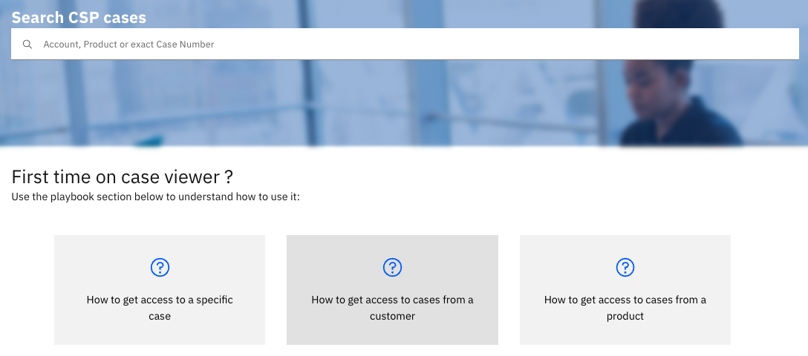
  

*What useful information can you see?*:
 - Product Name: this helps you to understand which Product the case was opened against. Cloud Pak customers often open tickets using Point Product names.
 - Contact Name (and contact information): this is the name of the person at the Customer that will receive updates on the Support Case.
 - Owner: this is the IBM Support Engineer assigned to the Support Case and is the main focal point on the IBM side.
 - Must Gather: information about the product and environment. **This includes the Business Impact Statement**
 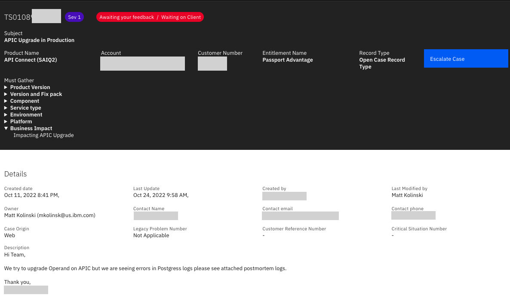
 - Diagnostics: links to the files uploaded by the customer. You will not have access to view the contents of these files.
 - Public Comments: these comments are visible to the customer in their support portal.
 - IBM Internal Comments: conversations between IBM Support teams and Development. You should not relay the information in these comments to the customer.
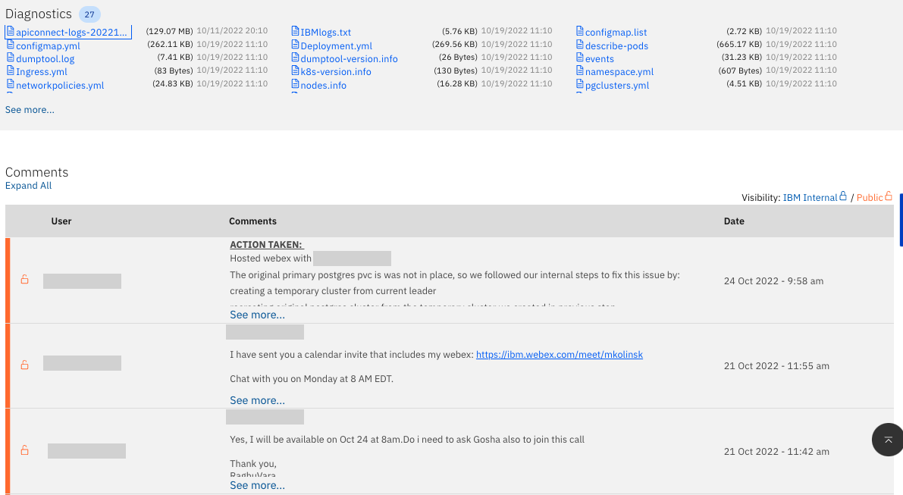

</AccordionItem>

<AccordionItem title='Notification Hub'>
Set up rules in <a target='_blank' rel='noreferrer noopener' href="https://nhub.csptools1.ibm.com/#/">IBM Notification Hub</a> to notify you whenever one of your customers opens a severity level 1 (Sev 1) support case for your product set.    
When you get that notification, you may choose to reach out and let the customer know that you are aware, and IBM is on it.  Watch the case in Case Viewer and set up another Notification Hub rule to notify you of any update in that case.  Remember that your notifications can be sent to a Slack channel or direct message, SMS, email and more.   
The benefits are showing the customer you care, building relationships, credibility and trust for IBM and you. They will be grateful, less angry, and much more likely to talk with you about future opportunities.
  

Example rule:
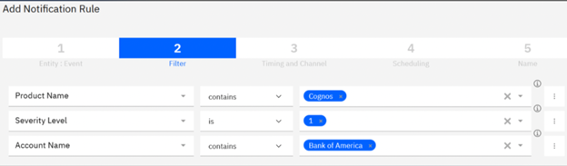

</AccordionItem>

<AccordionItem title='Case Report'>
<a target='_blank' rel='noreferrer noopener' href="https://ibm.ent.box.com/s/clsn3wfz3yt0l98e8a1puha20yxdih4z">Follow the directions</a> on gaining access to this Cognos report, and learn how to run it for your customer, squad and/or brand.
A best practice is to run it daily.
You can even <a target='_blank' rel='noreferrer noopener' href="https://ibm.box.com/s/13aavjaylo94u53yaxch8pxp8muwm717">schedule</a> it to run.  You will see any new cases based on your report filters and take appropriate action. Data is as recent as the previous day.
</AccordionItem>
<AccordionItem title='ServiceNow'>

<a target='_blank' rel='noreferrer noopener' href="https://watson.service-now.com/nav_to.do?uri=%2Fhome.do%3F">ServiceNow</a> can be used to view information for a Support Case with a 'CS' prefix

Get access to Service Now using this <a target='_blank' rel='noreferrer noopener' href="https://watson.service-now.com/nav_to.do?uri=%2Fess_portal%3Fid%3Dsc_cat_item%26sys_id%3D9a1240ebdbcdef0472583c00ad9619ad%26sysparm_category%3D9b26f7d8dbe48f008799327e9d96199e">link</a>

</AccordionItem>
<AccordionItem title='Gainsight (CSMs only)'>
Gainsight has a **Support** menu item for some entitlements. This will provide a high-level view of Support Cases and is updated once per day.

Use the **IBM Case Viewer**, **ServiceNow** and/or **SmartCare** for more up to date information on active Support Cases.

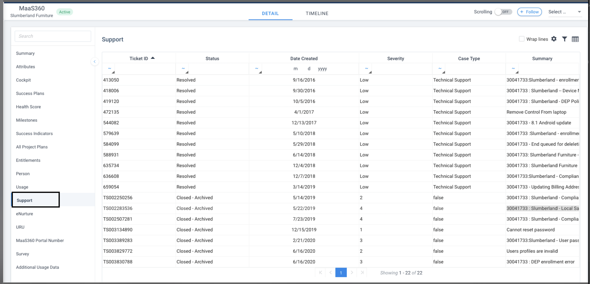
</AccordionItem>

<AccordionItem title='SmartCare'>
<a target='_blank' rel='noreferrer noopener' href="https://smartcare.rchland.ibm.com/Dashboard/">IBM SmartCare</a> has access to view all Software and Hardware Support Cases for a customer as well as Managed Escalations.

- Use '**My SmartCare --> Setup Clients**' to add your customers to the dashboard

- Once you have data for your customer, you can see any **Managed Escalations**
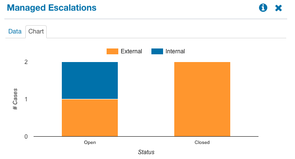

 

- You can also **drill-down** into the support cases. By default, the CSP Software Case view will show you the open Support Cases by Group and Severity. Click on any of the bars to drill into the data
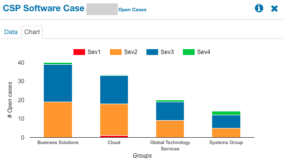

 

- You can then use the search criteria to look at all Support Cases for the customer by changing the **Group**, **Product** and/or **Status** filters. It is easier to set Group=all to begin with to locate the Group that the product you are search for is in (Cloud Paks seem to be in either Business Software or Cloud). Clicking on any case will take you to the IBM Case Viewer. You can also export the data to a spreadsheet.
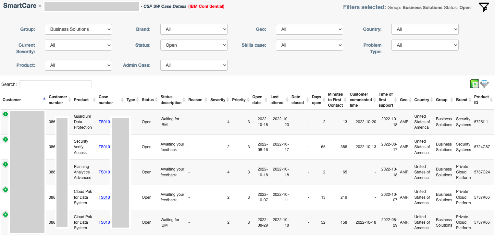

 

- You can create email alerts for when your customer opens a Sev 1 or Sev 2 case. To setup this rule, follow the steps:
 

- Click Setup Notifications.
- Click on brand then search.
- Enter your customer's name – very important that you validate you have highlighted the correct customer.
- You have many options on this page but generally, click PMR/PMH SEV 1 & 2 for your customer with the default other options, then review to see if you want to select (or deselect) any other options.
- Click save.
- At this point, you can share this rule with others or click cancel to just create the rule for you.
- The email that this rule generates can be forwarded to others on your technical and sales teams for follow-up action.

</AccordionItem>

<AccordionItem title='Support Guide (AKA the Support Handbook)'>
This guide <a target='_blank' rel='noreferrer noopener' href="https://www.ibm.com/support/pages/node/733923">(AKA the Support Handbook)</a> is meant for customers and IBMers and details how to open cases and work with Support. Note that a case can be opened at any time, so if you want the client to open a Proactive case, just have them open it in advance of their potential issue, at Sev 2 or 3.

</AccordionItem>

<AccordionItem title='Managed Escalation'>
A Managed Escalation Case (MEC) can be used when customer satisfaction is at risk due to ongoing unresolved support cases that are impacting an upcoming production deployment project or revenue.
  
A MEC replaces Complaints, Critical Situations and Proactives. A MEC is owned by an Escalation Owner who works with the customer to understand the business impact and agree on "success criteria" and then provides leadership on all customer facing activities to ensure satisfactory progress is being made toward the agreed goals.
  
The process for either a customer or IBMer to request a Managed Escalation Case be opened is documented on the <a href="https://w3.ibm.com/w3publisher/software-support/support-key-services/support-process-escalations" target='_blank' rel='noreferrer noopener'>IBM Support Escalations page</a>
  

The **Escalation Owner** will hold regular calls with the customer and the IBM team to report on progress of the MEC. During a Managed Escalation, the Support team has access to special teams within development that can provide additional assistance to the Support engineers. Ask your MEC escalation owner whether the Tiger team or other special teams should be used in your case.
  

The Escalation Managers are:
- Automation: Gena Traylor (gtraylor@us.ibm.com, @gtraylor)
- Data and AI: Don Barr (donbarr@ca.ibm.com, @donbarr)
- Security: Jane Harris (jane@us.ibm.com, @Jane)
- Security: Mehul Amin (Mehul.amin@ibm.com, @Mehul Amin)
- Maximo, Tririga, ICD, OMS, EIS and SCIS: David Bose (dbose@us.ibm.com, @Dave)
- Sterling Data Exchange & ELM: Anisat Simmons (simmonsa@us.ibm.com @simmons)

 

**Examples of when to use a Managed Escalation Case**:

- A customer has a production go-live date in the next 2 months but has one or more open, unresolved support cases that are putting the go-live in jeopardy

- When repeated escalations haven't resolved support cases and/or a case opened for months without being able to get to root cause and resolution

- When unresolved support cases are putting revenue at risk. This may be impact to an ELA, Subscription License renewal or new transactional revenue that is dependent on the success of the product that is in focus.

**Examples that don't qualify for a Managed Escalation Case**:
- A support case has been opened in the last 24 hours, is not yet resolved and the escalation process above hasn't been used. In this case you must follow the **Escalation for Cloud Paks process** above first.

- A customer that has many ongoing support cases across many projects. In this case you should look into a <a href="https://w3.ibm.com/w3publisher/expert-labs-subscription-services/subscription-bdm/tam" target='_blank' rel='noreferrer noopener'>Technical Account Manager from Technology Expert Labs</a>.

- Enhancement Request. If a support case determines that an Enhancement Request is required and that the product is working as designed. In this case, use the request for enhancement program. <a href="https://pages.github.ibm.com/csm-playbook/playbook/support/request-enhancement">Request for Enhancement</a> process

</AccordionItem>

</Accordion>

**Business Impact**  
Business Impact is not part of the template that customers use to open support cases but is very important when it comes to prioritization by IBM Support teams and by Red Hat if the case requires their help.  
**Please ensure that a note is added to the support case once it is opened that contains a description of the impact the issue is having on the customers business** and that the impact statement is kept up to date during the life of the support case.  

Examples of business impact statements are:  
"we have a production outage impacting business activities"  
"this customer now has 6 support cases and will not sign a new ELA for $1.5M until they are resolved" 
"our customer had committed to complete production roll out by July 15, and must have this support case solved by July 1st otherwise they will incur additional expense" 

## Help your customer get issues resolved

Once you’ve proactively set up access to the tooling described above, here’s what to do when your client has opened a case and you need to reactively get engaged.

### General Practices

**Access the Case Details**

Due to GDPR, you won't automatically have access to every case, even if you've seen cases from this very client. You already have access to <a target='_blank' rel='noreferrer noopener' href="https://merlin-playbook.mybluemix.net/#/documents/d8ef83556dd220e40cfa1445bfd2c3fb">Trust Policy Services</a> and know how to quickly gain access to a specific case using the CMR/ICN (because you followed the instructions in the "Getting ready to advocate for your customers"" section above). If you have problems, reference the "Getting ready to advocate for your customers"" section again.   
If you already have the Case number, you don't need to know the CMR/ICN. When you see this message from Case Viewer that you do not have access,  
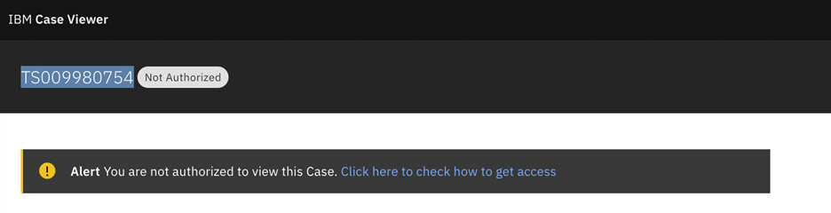

Copy the Case from the upper left (TS…), navigate to the <a target='_blank' rel='noreferrer noopener' href="https://tps.intranet.ibm.com/tools/support/tat/csp/cspCustomerTab">CSP Data Access Page</a>, click "Search Customer by Case Number", paste the case number, then hit the magnifying glass to search. Your Customer Number is automatically populated. Now simply click Add.  In a few minutes you will be able to view the case.  
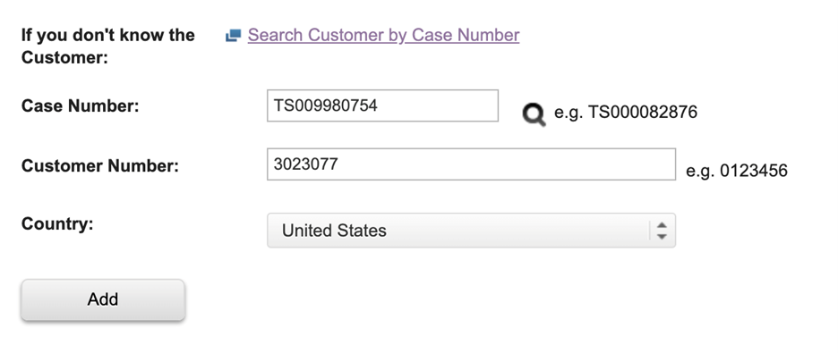

**Create an private slack channel**

CSM, Technology Expert Labs, or the Brand Technical Seller create a slack channel to bring together the relevant Sales, Tech, CSM, and Support IBMers. As a best practice, follow the steps below to create a private slack channel that can be accessed by ALL WORKSPACES. Note: if you simply click "New Channel", it will be available ONLY from your current workspace. Notification Hub requires the channel to be available from the Technical Support workspace, so creating it using this technique makes it available to all workspaces. any participants expect the same, so to avoid issues, please follow this best practice.

- Create a direct message and include relevant IBMers. Make sure to include the Case Owner (from IBM Support). You can add additional members as needed.
- Once you start messaging in that channel, click the member icon in the upper right, click settings, and click "Change to a private channel".
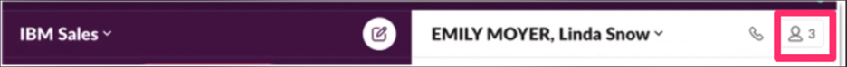
- For the channel name, be sure to use the format [client-description-TS#].
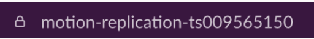
- Ask all participants to change their channel setting so they receive all messages from this channel until the case is closed. To make the change, click the channel name and select, “Get notifications for all messages”.

**Configure Notification Hub to trigger alerts to your private channel**

Rather than expecting everyone in the channel to continuously monitor the case using Case Viewer, you can set up a simple rule in Notification Hub to automatically send case updates to the private channel. For any issues with items in this section, you can post to the #csp-notification-hub Slack channel.

- First add the Notification Hub application to Slack using the following steps:
1. Open the Technical Support Workspace in Slack
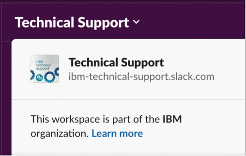
 
2. Navigate to your Private channel, select Get Notifications for All Messages, click Integrations, and then Add an App
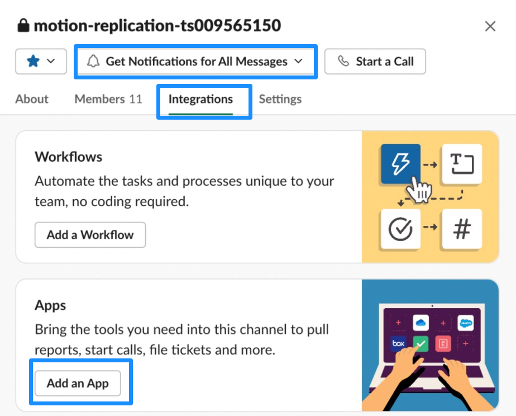
 
3. Select NHub-Channels and click Add
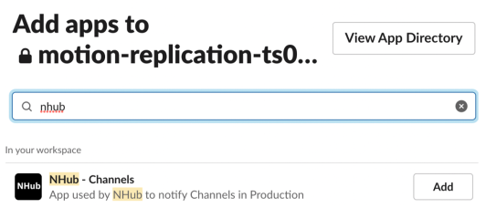
 
4. Your screen will now display the NHub-Channels App in your Integrations
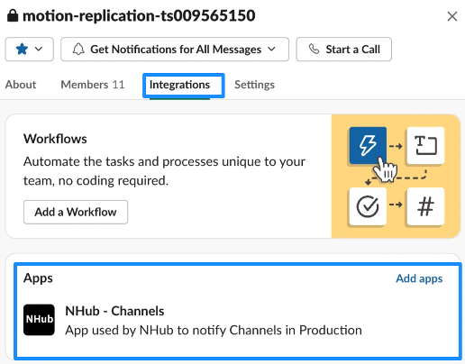
 
5. You will receive a notification like this one in your private Slack channel and you are all set!
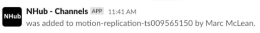
 

- Now create a rule for your case. This rule will cause any update to the case to trigger a notification to your channel.
Note that you will use the Post(feed) event. Since Case Post Created captures all updates, you only need the “Case Number is TS…” entry on the Filter screen. Click Continue.  Also, you can only filter for one case number at a time, it will not accept a comma separated list. If you require more than one case to alert to a slack channel, you will have to create a new Notification Rule for each and point them to your private channel.
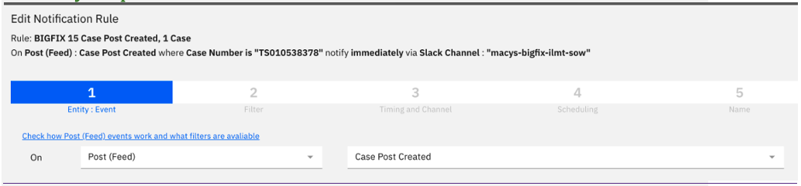
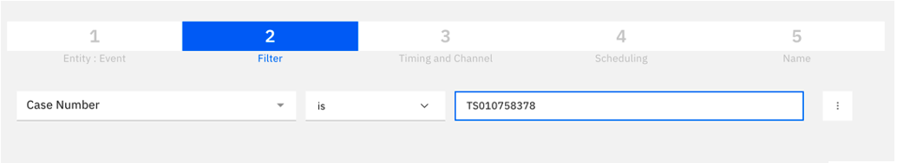
- Enter your private Slack channel name and Test delivery. You’ll get a test notification in the Slack channel if you have properly added the Notification Hub bot and correctly entered the channel name on this screen.
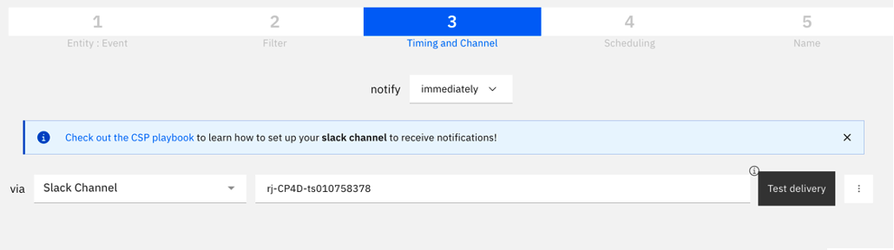
- Click Continue accepting all defaults to create, test and save the rule.

## Support Process for IBM Cloud Paks and non-Sustainability Software Growth Offerings

**Business Impact**  
Business Impact is not part of the template that customers use to open support cases but is very important when it comes to prioritization by IBM Support teams and by Red Hat if the case requires their help.  

**Please ensure that a note is added to the support case once it is opened that contains a description of the impact the issue is having on the customers business** and that the impact statement is kept up to date during the life of the support case.

Examples of business impact statements are:
- "we have a production outage impacting business activities"
- "this customer now has 6 support cases and will not sign a new ELA for $1.5M until they are resolved"
- "our customer had committed to complete production roll out by July 15, and must have this support case solved by July 1st otherwise they will incur additional expense"

### Escalation for Cloud Paks and Point Products

Refer to the <a target='_blank' rel='noreferrer noopener' href="https://w3.ibm.com/w3publisher/software-support/support-key-services/support-engagement-escalations">IBM SW Support Engagement Process</a> page for the latest information on **How to engage the SW Support Teams for critical issues**.  This page includes details on the client escalation process and channels, managed escalations and proactives, as well as SWAT, Partner or IBM Cloud assisted escalations.

The flowchart below shows the flow of a support case, when escalation is possible and the escalation process:
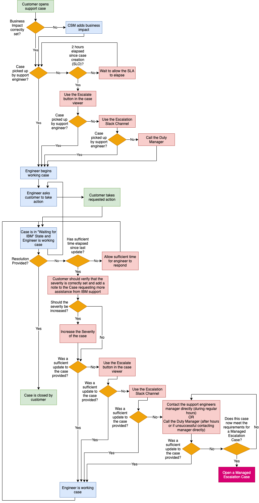

Escalation of Cloud Pak and point products should use the following steps to help escalate a case:

1. Ensure a case is opened and it is marked with the **correct severity**

2. If more assistance is needed, and the initial SLO (2 hours) has elapsed - the customer, CSM or Tech Seller should verify that the severity of the case is set correctly and add a note to the case requesting more assistance from IBM Support

3. Increase the **severity** if applicable

4. For cases with the **Case Escalate** button available the customer should use this process. The Case Escalate button is not available until the case is at least 2 hours old. This allows the customer or IBMer to alert the Support engineer that there are concerns about the case and that the case needs additional attention. <a href="https://merlin-playbook.mybluemix.net/#/documents/a1ddd3517e319cd838feb718736ba90f" target='_blank' rel='noreferrer noopener'>Here is what IBM Support does when the escalation button is clicked</a>

5. As a CSM or Tech Seller, if the support case still isn't getting the required attention after using the **Case Escalate** button, you can request an escalation using the designated slack channels and/or via the <a href="https://ibm.ent.box.com/file/1162875444692?s=4o3jvgw8pmyt26t5tytufzthak3r08hw" target='_blank' rel='noreferrer noopener'>Support Matrix</a>:

- IBM Automation: <a href="https://ibm-cloud.slack.com/archives/C3JRLJ1J6" target='_blank' rel='noreferrer noopener'>#support-escalations-automation</a>
- Data & AI: <a href="https://ibm-cloud.slack.com/archives/C4LRATRGE" target='_blank' rel='noreferrer noopener'>#support-escalations-data-and-ai</a>
- Cloud Platform/SaaS offerings: <a href="https://ibm-cloud.slack.com/archives/C60HGPTPG" target='_blank' rel='noreferrer noopener'>#cloud-support</a>
- Security: <a href="https://ibm-cloud.slack.com/archives/C04TUR6ENPN" target='_blank' rel='noreferrer noopener'>#support-escalations-security</a>
- Z: Use the <a href="https://supportcontent.ibm.com/support/pages/crf884?check_logged_in=1" target='_blank' rel='noreferrer noopener'>Contact Reference File (CRF)</a>

6. As a CSM or Tech Seller, if the support case still isn't getting the required attention after using the **Case Escalate** button and the slack channel, you can reach out to the assigned support engineer's manager to request more focus. If it is outside of regular working hours and you can't reach the manager, you should call the Duty Manager to alert them that the case requires additional attention. The number is: 1-800-IBM-SERV , 1-800-426-7378

7. In certain circumstances, further escalation is possible using a **Managed Escalation Case**. The <a href="#managed-escalation-cases">Managed Escalation Case section</a> describes the program and criteria for opening a case.

8. During a Managed Escalation, the Support team has access to special teams within development that can provide additional assistance to the Support engineers. Ask your MEC escalation owner whether the Tiger Team, Center of Excellence or other special teams should be used in your case.

For Proactive Engagement, pre-determined support focals work proactively with ATL, Sales and CSMs to manage any urgent situation, done through regular cadence with sales and field to focus on escalation issues early and engage directly to the support leadership before it escalates further.
Geo Focals
- EMEA: Stuart Asbury/UK/IBM
- Americas: Victor Casanas/Tampa/IBM
- Asia Pacific: Peter Dalliston/Australia/IBM
- Japan:  Kazuya Inoue/Japan/IBM

### Red Hat Cases

If the case requires assistance from Red Hat, the IBM Support team will open a case with Red Hat directly.   

**Red Hat Remote Access Rider Update**
Our Cloud Pak OpenShift Support Process will no longer require our clients to separately sign the Red Hat Remote Rider as part of the support engagement process when Red Hat remote support is required. IBM & Red Hat have agreed to remove the Remote Rider as part of the support workflow because client agreement of the Remote Rider terms has been moved into the IBM Licensing Agreement that the client must agree to when purchasing Cloud Pak entitlements. These terms will come into effect as part of our BAU LI update process 

Important updates from the Red Hat case will be added to the IBM Case by the IBM Support team   

*Access to the Red Hat Knowledge Base*  
A significant portion of the Red Hat technical hints and tips as guidance is reserved for Red Hat paid subscribers or Partners. Cloud Pak customers are considered Red Hat paid subscribers and as a result should have access to all the content in the <a href="https://access.redhat.com/search/#/" target='_blank' rel='noreferrer noopener'>Knowledge Base</a>.  
IBMers can create a Red Hat ID and join the IBM Partner account to gain access to the Knowledge Base. Instructions are provided <a href="https://ibm.seismic.com/Link/Content/DCWfXWHpFXTRgGhWRDhTQpTbPDp8" target='_blank' rel='noreferrer noopener'>in Seismic</a> on how to do this.

*Access to the Red Hat Support Portal:*  
The CSM Worldwide Practice Leaders have **access to the Red Hat support system** to be able to view the progress directly. This may be necessary if you are unable to get timely updates from the IBM Support team. Please reach out to your Practice Leaders (for <a href="https://w3.ibm.com/w3publisher/customersuccess/community-connections/automation-platform-community" target='_blank' rel='noreferrer noopener'>Automation</a>, <a href="https://w3.ibm.com/w3publisher/customersuccess/community-connections/data-and-ai-community" target='_blank' rel='noreferrer noopener'>Data & AI</a> or <a href="https://w3.ibm.com/w3publisher/customersuccess/community-connections/security-platform-community" target='_blank' rel='noreferrer noopener'>Security</a>) for help viewing information in the Red Hat case.  

### Managed Escalation Cases

A Managed Escalation Case (MEC) can be used when customer satisfaction is at risk due to ongoing unresolved support cases that are impacting an upcoming production deployment project or revenue.

A MEC replaces Complaints, Critical Situations and Proactives. A MEC is owned by an **Escalation Owner** who works with the customer to understand the business impact and agree on "success criteria" and then provides leadership on all customer facing activities to ensure satisfactory progress is being made toward the agreed goals.

The **Escalation Owner** will hold regular calls with the customer and the IBM team to report on progress of the MEC. During a Managed Escalation, the Support team has access to special teams within development that can provide additional assistance to the Support engineers. Ask your MEC escalation owner whether the Tiger team or other special teams should be used in your case.

The Escalation Managers are:
- Automation: Gena Traylor (gtraylor@us.ibm.com, @gtraylor)
- Data and AI: Don Barr (donbarr@ca.ibm.com, @donbarr)
- Security: Jane Harris (jane@us.ibm.com, @Jane)
- Security: Mehul Amin (Mehul.amin@ibm.com, @Mehul Amin)
- Maximo, Tririga, ICD, OMS, EIS and SCIS: David Bose (dbose@us.ibm.com, @Dave)
- Sterling Data Exchange & ELM: Anisat Simmons (simmonsa@us.ibm.com @simmons)

**Examples of when to use a Managed Escalation Case**:

- A customer has a production go-live date in the next 2 months but has one or more open, unresolved support cases that are putting the go-live in jeopardy

- When repeated escalations haven't resolved support cases and/or a case opened for months without being able to get to root cause and resolution

- When unresolved support cases are putting revenue at risk. This may be impact to an ELA, Subscription License renewal or new transactional revenue that is dependent on the success of the product that is in focus.

**Examples that don't qualify for a Managed Escalation Case**:
- A support case has been opened in the last 24 hours, is not yet resolved and the escalation process above hasn't been used. In this case you must follow the **Escalation for Cloud Paks process** above first.

- A customer that has many ongoing support cases across many projects. In this case you should look into a <a href="https://w3.ibm.com/w3publisher/expert-labs-subscription-services/subscription-bdm/tam" target='_blank' rel='noreferrer noopener'>Technical Account Manager from Expert Labs</a>.

- Enhancement Request. If a support case determines that an Enhancement Request is required and that the product is working as designed. In this case, use the request for enhancement program. <a href="https://pages.github.ibm.com/csm-playbook/playbook/support/request-enhancement">Request for Enhancement</a> process

The process for either a customer or IBMer to request a Managed Escalation Case be opened is documented on the <a href="https://w3.ibm.com/w3publisher/software-support/support-key-services/support-process-escalations" target='_blank' rel='noreferrer noopener'>IBM Support Services page</a>

**Cloud Pak Support helpful links**
* <a href="https://playbook.cloudpaklab.ibm.com/cp-support#How_do_I_get_Support_for_a_CloudPak" target='_blank' rel='noreferrer noopener'>Cloud Pak support site</a>

* <a href="https://www.ibm.com/mysupport/s/topic/0TO50000000IYkUGAW/cloud-pak-for-data?language=en_US&amp;productId=01t50000004uiBJAAY" target='_blank' rel='noreferrer noopener'>Known issues site for Cloud Pak for Data</a>

## Support Process for IBM Products on Hyperscalers (IBM Cloud, AWS, Azure)

| Delivery | Problem Area | Automation | Data & AI | Security |
|----------|--------------|------------|-----------|----------|
| Bare Metal | IBM Product | IBM Support via CSP | IBM Support via CSP | IBM Support via CSP |
| Bare Metal | OpenShift (included in IBM Product) | IBM Support via CSP (1) | IBM Support via CSP (1) | IBM Support via CSP (1) |
| Bare Metal | Platform (ie, AWS) | Cloud Vendor (ie, AWS) | Cloud Vendor (ie, AWS) | Cloud Vendor (ie, AWS) |
| Managed Service (ROSA, ROKS, ARO) (2) | IBM Product | IBM Support via CSP | IBM Support via CSP | IBM Support via CSP |
| Managed Service (ROSA, ROKS, ARO) (2) | OpenShift | Cloud Vendor or Red Hat | Cloud Vendor or Red Hat | Cloud Vendor or Red Hat |
| Managed Service (ROSA, ROKS, ARO) (2) | Platform (ie, AWS) | Cloud Vendor (ie, AWS) | Cloud Vendor (ie, AWS) | Cloud Vendor (ie, AWS) |
| IBM SaaS Service | IBM SaaS Service | IBM Support via CSP | IBM Support via CSP | IBM Support via CSP |
| IBM SaaS Service | OpenShift (included in IBM Product) | IBM Support via CSP > IBM,  SRE via CSP > RH | IBM Cloud Support via Service Now > IBM SRE via Service Now > RH | IBM Support via CSP > IBM SRE via JIRA > RH |
| IBM SaaS Service | Platform (ie, AWS)(3) | Cloud Vendor (ie, AWS) direct or via IBM SRE | Cloud Vendor (ie, AWS) direct or via IBM SRE | Cloud Vendor (ie, AWS) direct or via IBM SRE |

"(1)" assumes entitlement is via IBM/Cloud Pak else Red Hat directly  
"(2)" Teams engage each other through TSANet if necessary  
"(3)" SRE is the focal into AWS and Red Hat  

## Support Process for Sustainability Software

To find support for Sustainability Software products, review this document. This <a href="https://ibm.ent.box.com/s/p314ia363u9q4xas053idrlqvup3pm59/file/705236342483" target='_blank' rel='noreferrer noopener'>Sustainability Software internal Support Guide</a> is a supplement to the <a href="https://ibm.ent.box.com/s/p314ia363u9q4xas053idrlqvup3pm59/file/706617356418" target='_blank' rel='noreferrer noopener'>IBM Support Quick Start Guide</a> (on-premises) and the <a href='https://ibm.ent.box.com/s/p314ia363u9q4xas053idrlqvup3pm59/file/705236186984' target='_blank' rel='noreferrer noopener'>IBM Cloud SaaS Support Quick Start Guide</a> for customers after completion of a Software or Cloud Service sale. These internal guides provide additional resources for you to manage customer expectations, escalation, and support extension.

Escalation Slack Channels:

- Tririga: <a href="https://ibm-cloud.slack.com/archives/C02K34LUDFY" target='_blank' rel='noreferrer noopener'>#support-escalations-tririga</a>
- Maximo: <a href="https://ibm-cloud.slack.com/archives/C02L524LJ72" target='_blank' rel='noreferrer noopener'>#support-escalations-maximo</a>
- Order Management: <a href="https://ibm-cloud.slack.com/archives/C02KRLY29FU" target='_blank' rel='noreferrer noopener'>#support-escalations-order-mgmt</a>
- Envizi: <a href="https://ibm-cloud.slack.com/archives/C0487DWKHK8" target='_blank' rel='noreferrer noopener'>#support-escalations-envizi-eis</a>
- SCIS: <a href="https://ibm-ai-apps.slack.com/archives/C04TN59UX7D" target='_blank' rel='noreferrer noopener'>#support-escalations-scis-mroio</a>
- Sterling Data Exchange: <a href="https://ibm-cloud.slack.com/archives/C04U91D8ULQ" target='_blank' rel='noreferrer noopener'>#support-escalations-sterling-data-exchange</a>

## Support Process for IBM Cloud and Cloud services

Get the support you need for IBM Cloud. Learn about the support plans, resources, support communities, FAQs, and how to create a support case. Visit <a href="https://www.ibm.com/cloud/support" target='_blank' rel='noreferrer noopener'>IBM Cloud Support</a>.

<iframe width='100%' src="https://video.ibm.com/embed/recorded/131124061"/>

It is important to set expectations with your customer to avoid difficulties during the support process.

### Open a support case

To open a support case, see this <a href="https://cloud.ibm.com/docs/get-support?topic=get-support-open-case" target='_blank' rel='noreferrer noopener'>document</a>.

### Escalate an issue for IBM Cloud

You can point your customer to the <a href="https://cloud.ibm.com/docs/get-support?topic=get-support-escalation" target='_blank' rel='noreferrer noopener'>escalation process</a> if they are not getting a satisfactory response.

### Managing Customer Incident Reports

In addition to typical break/fix issues, our customers will often ask for an <a href="https://watson.service-now.com/nav_to.do?uri=%2Fkb_view.do%3Fsysparm_article%3DKB0010880" target='_blank' rel='noreferrer noopener'>incident report</a> information following an as-a-Service (aaS) offering outage. When you receive a request, immediately ask your customer to open a support case as the primary form of communication.

### Request access to Cloud ServiceNow

To <a href="https://watson.service-now.com/kb_view.do?sysparm_article=KB0011711" target='_blank' rel='noreferrer noopener'>request access to Cloud ServiceNow Cases & Incident</a> to assist your customers:

Request the following type of access:

1. Access type --> 4. a. Read-Only Access.

2. Then select Case, Incident  Do not select any other record types -- that will only result in rejection of request.

3. The Review team who actions user requests for Cloud ServiceNow will approve CSMs who request Read-Only Access to Case & Incident.

**Note** CSM requests for any other access will be rejected per the guidance provided to the Review team.

* RCA requests are triggered by the customer opening a support case against the offering.

* Support manages communications directly with the customer, but you can check for the latest information in the support case.

* Review the <a target='_blank' rel='noreferrer noopener' href="https://watson.service-now.com/kb_view.do?sysparm_article=KB0010880">internal documentation</a> for all things delivered through the IBM Cloud catalog.

### Credits due to outages

* A credit request is triggered by the customer opening a support case against the offering.

* Credits are calculated by the support team by working with the offering's operations team.

* Any credit is driven based on the Service Description for that offering. Customer-facing service descriptions for each offering are available <a href="http://www-03.ibm.com/software/sla/sladb.nsf/sla/saas?OpenDocument" target='_blank' rel='noreferrer noopener'>online</a>.

## Support Process for Red Hat

Both IBM and Red Hat use Salesforce.com as a platform to capture and track support interactions with entitled customers. See the <a href="https://w3.ibm.com/w3publisher/ibm-and-red-hat-customer-support/support-tools" target='_blank' rel='noreferrer noopener'>Support tools and processes</a> for how you should work with Red Hat.

There are several support flows, depending on your customer's use case:

* **RHEL as part of OCP via an IBM Cloud Pak** Support flows through the OCP COC <a href='https://www.ibm.com/mysupport/s/?language=en_US%5Ch' target='_blank' rel='noreferrer noopener'>via a support case in SalesForce</a> who will handle the issue or engage the Red Hat Linux SBR Team in the back end.

* **Stand-alone RHEL entitled though IBM** Support is provided by Chris Ansari's Team <a href='https://www.ibm.com/mysupport/s/?language=en_US%5Ch' target='_blank' rel='noreferrer noopener'>via a support case in SalesForce</a>. They will be engaged either directly or through a skill case, depending on where the case is opened.

* **Stand-alone RHEL entitled through Red Hat** Customer opens a case with Red Hat support through the <a href='https://access.redhat.com/support/' target='_blank' rel='noreferrer noopener'>RH portal</a>. If RH needs IBM support help, they will engage via TSANet. If such a case comes to IBM and is routed to Chris's Team in error, the IBM team can check the entitlement to determine which support team needs to engage (IBM or RH) and handle as appropriate.

For case visibility, the CSM will need to ask the Customer to add them to the case, or, use <a href="https://merlin-playbook.mybluemix.net/#/folder/31d6e626-d47c-4ec8-8203-7327d69c1bcc" target='_blank' rel='noreferrer noopener'>IBM's Case Viewer</a> and ask the support rep to add them to the case.

**Red Hat Remote Access Rider**
Our Cloud Pak OpenShift Support Process will no longer require our clients to separately sign the Red Hat Remote Rider as part of the support engagement process when Red Hat remote support is required. IBM & Red Hat have agreed to remove the Remote Rider as part of the support workflow because client agreement of the Remote Rider terms has been moved into the IBM Licensing Agreement that the client must agree to when purchasing Cloud Pak entitlements. These terms will come into effect as part of our BAU LI update process   

### Escalate an issue for Red Hat

Review the <a href="https://w3.ibm.com/w3publisher/ibm-and-red-hat-customer-support/escalation-management" target='_blank' rel='noreferrer noopener'>escalation process</a> to determine the right actions to take.

**Red Hat Cases**  
If an IBM case requires assistance from Red Hat, the IBM Support team will open a case with Red Hat directly.   
Important updates from the Red Hat case will be added to the IBM Case by the IBM Support team   
The CSM Worldwide Practice Leaders have access to the Red Hat support system to be able to view the progress directly. This may be necessary if you are unable to get timely updates from the IBM Support team. Please reach out to your Practice Leaders (for <a href="https://w3.ibm.com/w3publisher/customersuccess/community-connections/automation-platform-community" target='_blank' rel='noreferrer noopener'>Automation</a>, <a href="https://w3.ibm.com/w3publisher/customersuccess/community-connections/data-and-ai-community" target='_blank' rel='noreferrer noopener'>Data & AI</a> or <a href="https://w3.ibm.com/w3publisher/customersuccess/community-connections/security-platform-community" target='_blank' rel='noreferrer noopener'>Security</a>) for help viewing information in the Red Hat case.  

### Frequently asked questions

The <a href="https://w3.ibm.com/w3publisher/ibm-and-red-hat-customer-support/frequently-asked-questions" target='_blank' rel='noreferrer noopener'>FAQ section</a> addresses some of the issues more commonly encountered when collaborating with Red Hat. If you have a question that is not answered here, please post it in the <a href="https://ibmandredhatguests.slack.com/archives/GQ6E5QH9T" target='_blank' rel='noreferrer noopener'>#support-steering-community-guest</a> channel on Slack, where it will be answered, and these FAQ pages updated with the information.

## General IBM Support Process Information

Your customer must work with IBM Support to a open case when a product is not functioning properly. Refer your customer to the <a href="https://www.ibm.com/support/home/" target='_blank' rel='noreferrer noopener'>IBM Support Home page</a> to engage IBM Support.   

If your customer does not have access to IBM support, they will need to  <a href="https://www.ibm.com/mysupport/s/article/IBM-Support-Community-registration?language=en_US">register with IBM Support</a>.   

To view your customer's open and recently closed cases:

1. Go to Gainsight. Here you will find a high-level description of the open tickets. Unfortunately, the information is not always the latest.

2. If you need to dig deeper, you can review all open and closed tickets for your customer by using <a target='_blank' rel='noreferrer noopener' href="https://smartcare.austin.ibm.com/Dashboard">IBM Smart Care</a>. The dashboard enables you to track, analyze, and improve your customer's experience pro-actively across all IBM divisions, brands and Geographies. When you first [get started](https://w3.ibm.com/w3publisher/smartcare-users/education/get-started-with-smartcare) with this tool, you need to [request access](https://w3.ibm.com/w3publisher/smartcare-users/access-and-support/request-access).

3. The <a target='_blank' rel='noreferrer noopener' href="https://ibm-case-viewer.w3ibm.mybluemix.net/">IBM Case Viewer</a> is another way to view customer cases. You have to be registered as a Customer Advocate for each of the customer's account numbers to view their cases.  There are [instructions](https://merlin-playbook.mybluemix.net/#/documents/b26c440b95ba6a02d6950bc8d3abbda6) to describe how to get case access.

### Escalation process

You should point your customer to the escalation process when or if the customer is not getting the response they expect and they have a significant impact to their business. Your customer might have formally complained, or you might feel that they are about to complain and you can prevent it by being proactive.

You might also have a situation where a customer has escalated an issue but has not received a satisfactory response from IBM Support. You have a role to play when the customer is not getting what they need from IBM Support.

Your customer can open tickets and start the escalation process.

<FileLink to="/files/handy-dandy-1-pager.pdf">Read the handy dandy one pager</FileLink>

**Helpful support links**

* <a href="https://www.ibm.com/mysupport/s/article/User-Administration?language=en_US" target='_blank' rel='noreferrer noopener'>Help your customer access their Support Account</a>

* <a href="https://www.ibm.com/support/pages/node/733923" target='_blank' rel='noreferrer noopener'>Learn about the Support offerings</a>

## Opening a support case

The <a href='https://www.ibm.com/mysupport' target='_blank' rel='noreferrer noopener'>IBM Support Portal</a> is used to open and manage support cases. **As a CSM or Tech Seller, your customer should open their own support cases using their IBM Customer Number (ICN) as they have entitlement to Support.**

If you are working with an entitlement that the customer doesn't have support for (often in pre-sales situations), then you can open a support case using an IBM Internal ICN for product defects.

Use the following Customer Master Record Numbers (CMR) or ICNs to open a support case when the customer's ICN cannot be used.

| Brand | CMR/ICN | Geo | Country of origin |
|-----------|----------|----------|------------|
| Sustainability Software | 5411129 | All Geos | |
| Automation | 4602209 | Americas | United States of America |
| Automation | 0004492 | APAC | Singapore |
| Automation | 099030F | Japan | |
| Automation | 0993119 | EMEA | Romania |
| Data & AI | 4601545 |All Geos | United States of America |
| CloudPak for Security (OCP based) | 4601545 | All Geos | United States of America |
| Other security products | 4608143 | NA | |
| Other security products | 0996160 | LA | |
| Other security products | SWGTECH | EMEA | |
| Other security products | 099635C | JP | |
| Other security products | 0990310 | GCG | |
| Other security products | 030393 | Korea | |
| Other security products | 0991651 | Singapore | |
| Other security products | 0993540 | Australia | |
| Other security products | 0990276 | New Zealand | |
| Other security products | 0990308 | Hong Kong | |
| Other security products | 0999187 | Indonesia | |

If this is the first time you are using the ICN, you need to request access:

1. Log in at <a href="https://www.ibm.com/mysupport/s/" target='_blank' rel='noreferrer noopener'>IBM Support</a>
2. From Manage account support, select Support access
3. Type the product name, the ICN and the country of origin (see the table above)
4. Wait for access to be granted
5. Open a support case

For Sustainability Software and Cloud Paks, here are other useful support details:

* Sustainability Software
   * <a href='https://www.ibm.com/support/pages/node/795690' target='_blank' rel='noreferrer noopener'>IBM Support Offerings</a>
   * <Link to='/common/support/access-ibm-support#help-your-customer-get-issues-resolved' target='_blank' rel='noreferrer noopener'>Support for Sustainability Software</Link>

* Cloud paks
    * <a href='https://playbook.cloudpaklab.ibm.com/cp-support/' target='_blank' rel='noreferrer noopener'>Cloud Pak Playbook</a>

Choose appropriate priority based on business impact to ensure proper focus and prioritization.

**Note:** This is a known support process with SLAs. Tech sales, services, and CSMs should not use the internal defect process or Aha! for support issues.
