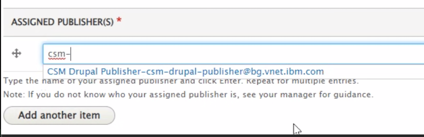

<AnchorLinks small>
  <AnchorLink>Why create a technote?</AnchorLink>
  <AnchorLink>When to create a technote?</AnchorLink>
  <AnchorLink>Create an IBM Support Technote</AnchorLink>
  <AnchorLink>What is Drupal in Support</AnchorLink>
  <AnchorLink>How to become a IBM Support Technote Publisher</AnchorLink>
  <AnchorLink>Search for an IBM Support Technote</AnchorLink>
  <AnchorLink>Useful links</AnchorLink>
</AnchorLinks>

## Why create a technote?
As a CSM, creating technotes is important as it is a **documented and validated solution for a specific problem**, which is not covered in the product documentation at a certain point in time.  A technote could be a step-by-step guide to configure a product or solution, or a troubleshooting guide listing symptom(s) and resolution instructions.

All IBM Support Technotes are externally accessible and searchable with any search engine (ie. Google) thus making it easy to find by IBMers and clients.

As part of the feedback loop, the IBM Content team actively reviews technotes with high view counts and incorporates them into the product documentation.

## When to create a technote?
A technote should be created if there is a problem and resolution which is not currently documented in the product documentation.  For questions, discussions and blogs, use of the appropriate [IBM Community](https://community.ibm.com/community/user/sitemap) to collaborate and share knowledge will help grow the community of IBMers and customers. **Note**: The IBM Communities are public facing so please be sure not to disclose any confidential information in these forums.

## Create an IBM Support Technote

1. Log in to the [Drupal Workbench](https://supportcontent.ibm.com/) with your w3 ID.  Logging in will create an account for you if this is the first time.

2. Click on **Create content** and select one of the following Article types.
      - **[How-to](https://w3.ibm.com/standards/ibm-content/page/content-types/How-to)**: Instructions on how to complete a task or achieve a goal such as a step-by-step guide to configuring a product or solution.
      - **[Troubleshooting](https://w3.ibm.com/standards/ibm-content/page/content-types/Troubleshooting)**: Describes a single symptom and includes resolution instructions.

3. Fill in the required fields (marked with a *****) in the form. Refer to this [guide](https://w3.ibm.com/standards/ibm-content/page/content-by-org/Support) for best practices and examples.
      - **IMPORTANT**: Select the Distribution as follows so the technotes will be externally searchable
          - *Public/Basic (Internet)* is published to https://www.ibm.com and is seen by IBM clients
      - **IMPORTANT**: Click Add Products to provide taxonomy values (Product, Component/Topic, Platform, Version)
      - **IMPORTANT**: Ensure the technote DOES NOT contain any client or IBM confidential information.  It should not contain any of the following:
          - IP addresses
          - Client, company or individual names
          - PMR or case numbers
          - Phone numbers
          - Email addresses

4. Set Save as: **Draft** and click Save.

5. When you are ready to publish the article you will need to designate a **Publisher** to review and approve.
      1. Update your Drupal Profile with an assigned Publisher
          1. Click your name in the Workbench and select **Edit Profile**
          1. Navigate to the **Assigned Publisher(s)** section
          1. Enter **csm-drupal-publisher** and click Enter.
          
      1. Publishing a document
          1. Open the document.
          1. Select the **Edit** tab.
          1. Make your changes and add your comments in the **Revision log message** window.
          1. Select `csm-drupal-publisher` as the designated **Publisher** from the drop down menu.
          1. Set **Change To** value to **Waiting Publish Approval** and click **Save**.
          Note: The Publisher will be sent an email notification alerting them of the request.

**Sample technotes for reference**:
  - How-To: <a href="https://www.ibm.com/support/pages/node/6507335" target='_blank' rel='noreferrer noopener'>Cloud Pak for Data connection to Microsoft SQL Server with Windows Authentication</a>

## What is Drupal in Support

The **Drupal in Support** is a content management system (CMS) to reduce complexities, simplify sharing, and promote consistent messaging by enabling teams within Support, Development, and Offering Management to
  1. Produce technical content and digital pages using a "self-service" model
  2. With real-time publishing capabilities
  3. Supported by best-in-class standards for structured content, SEO, lifecycle management, content re-use and workflow

The system is based on [Drupal](https://www.drupal.org/), an open source CMS and it provides:

  - **Standards**: regulate the content management process across the enterprise to establish global scale, velocity and speed-to-market.
  - **Proximity**: simplified workflows, improved platform user experience, and reduced IT developer dependency can bring content management execution closer to core decision makers.
  - **Content-first strategy**: content lifecycle management; structured, semantically tagged, reusable content; and the culling of outdated and underperforming content can help marketers shift spending from endless and ineffective redesigns to creating content and assets that better convey the IBM story and increase customer engagement and conversion.
  - **Quality**: best practices in SEO and content creation can help drive content effectiveness and improve the quality of the customer experience in pursuit of revenue growth.

Learn more [here](https://w3.ibm.com/w3publisher/drupal-in-support).

## How to become a IBM Support Technote Publisher

Be a certified Publisher on [Drupal](https://supportcontent.ibm.com/) in two easy steps!  The course will provide guidance on how to perform the publisher role, where to find available resources when reviewing an article for publishing approval and how to improve the overall quality of an article.

1. Log in to the [Drupal Workbench](https://supportcontent.ibm.com/) with your w3 ID.  Logging in will create an account for you if this is the first time.
2. Complete the [IBM Your Learning - Becoming a Drupal Publisher](https://yourlearning.ibm.com/activity/ITS-DL55522G) training.
3. Once you have been certified as a Drupal Publisher, reach out to `@hollisc` or `@Jianbin (JB) Tang` to get added to the **csm-drupal-publisher** BlueGroup to be a designated reviewer/publisher.

Once you have successfully passed the course, your [Drupal](https://supportcontent.ibm.com/) profile will be updated within 2 days and you will receive an email confirmation when your profile has been assigned the publisher role.
You can also request the publisher role by posting a screen capture of your certificate in [#drupal--in--support](https://my.slack.com/messages/CAQ0197AQ).

## Useful links

* [IBM Content - Document Types](https://w3.ibm.com/standards/ibm-content/page/content-types)
* [IBM Content - Best Practices](https://w3.ibm.com/standards/ibm-content/page/best-practices)
* [Drupal in Support - User Guide](https://w3.ibm.com/w3publisher/drupal-in-support/user-guide)
* [SEO 101](https://moz.com/beginners-guide-to-seo/why-search-engine-marketing-is-necessary)
* [SEO Starter Guide](https://developers.google.com/search/docs/fundamentals/seo-starter-guide)

## Search for an IBM Support Technote

When a technote is saved in the **Published** state, the URL will be made live. It will take approximatelyy 2-3 days on average for the Google indexing to be updated.
You will be able to search using your search engine of choice.

Alternatively, one can also search for Technote from the [IBM Support](https://www.ibm.com/mysupport/) as well.