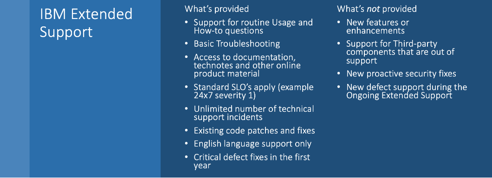
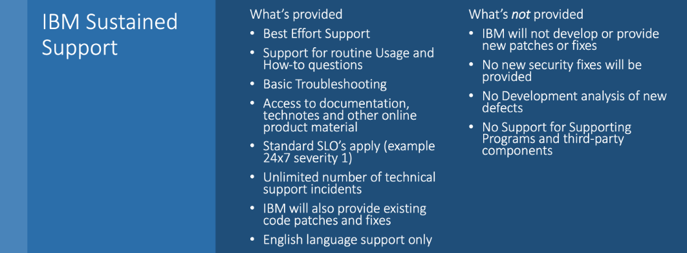
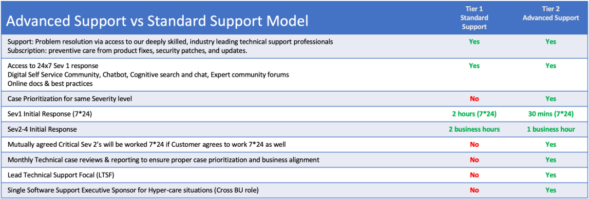
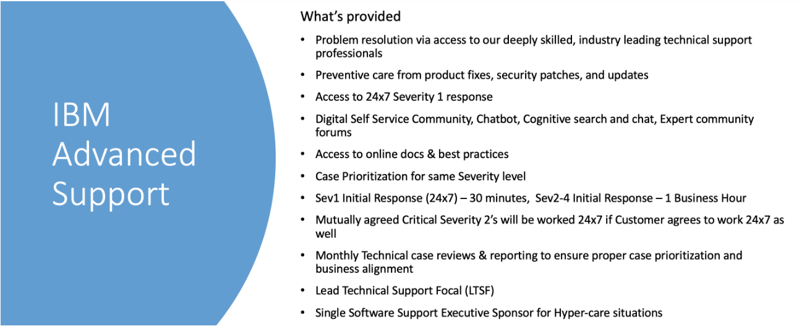

<AnchorLinks small>
<AnchorLink>IBM Support Offerings</AnchorLink>
<AnchorLink>IBM Extended Support</AnchorLink>
<AnchorLink>IBM Sustained Support</AnchorLink>
<AnchorLink>IBM Advanced Support</AnchorLink>
<AnchorLink>IBM Partner Support</AnchorLink>
</AnchorLinks>

## IBM Support Offerings
IBM understands clients might need additional time when planning to move to a supported version or might need a higher level of support. To meet that need, IBM is offering [three NEW Support Offerings](https://w3.ibm.com/w3publisher/software-support/support-key-services/support-offerings). 

  

## IBM Standard Support
Customers paying S&S (Subscription and Support) for an IBM offering receive the following:
- Subscription: preventative care from product fixes, security patches, and updates
- Support: problem resolution via access to our deeply skilled, industry leading support professionals
- Access to on-demand support tools such as: digitial self service community, chatbot, cognitive seach and chat, expert community forums, online docs and best practices
- Severity 1 tickets will be worked 24x7 with an initial case response within 2 hours
- Severity 2-4 tickets are worked during regular office hours, Monday to Friday only. 

In general, each version of an IBM product will receive 3 years of support from it's release date. After 3 years, the product reaches "End of Support", and customers must purchase IBM Extended Support in order to receive the qualities of service above. 

  

## IBM Extended Support
For clients that are using IBM distributed software programs, IBM Extended Support provides additional years of support once products have reached the end of Standard Support for a specific version / release.

Year 1 of Extended Support (Initial Extended Support) includes:
- Support access for usage, existing and new critical bug fixes, no proactive security fixes

Years 2 through 4 of Extended Support (On-Going Extended Support) includes:
- Support access for usage and existing fixes only, no security fixes

You can find out more information about IBM Extended Support as well as a FAQ on the [Software Support Organization website](https://w3.ibm.com/w3publisher/software-support/support-key-services/support-offerings/extended-support)

  

## IBM Sustained Support
For clients that are using IBM distributed software programs, IBM Sustained Support provides support for products that have been withdrawn from market and the last supported version / release has reached its end of support date. (no new versions or releases are available, product EOM/EOS Last Version/Release)

Provides up to 5 years of support post-EOM/EOS Last Version/Release:
- Usage & How-to Support
- Access to Existing Security Fixes
- Access to Existing Fixes in FixCentral
- Self-Help and Product Documentation
- Only available for the last supported version

You can find out more information about IBM Sustained Support as well as a FAQ on the [Software Support Organization website](https://w3.ibm.com/w3publisher/software-support/support-key-services/support-offerings/sustained-support)

  

## IBM Advanced Support
For clients that are using either an IBM distributed software program or an IBM Cloud Service, IBM Advanced Support provides an enhanced experience with prioritized case handling and shorter response time objectives.

IBM Advanced Support provides a higher tier, priority care support beyond that provided with standard Subscription and Support
- Provides higher case prioritization and target responsiveness
- Provides holistic approach to advising clients based on case patterns
- Advanced Support Focal (ASF)
- Single Software Support Executive Sponsor
- Differentiated Support experience for Customer based on their needs 

You can find out more information about IBM Advanced Support as well as a FAQ on the [Software Support Organization website](https://w3.ibm.com/w3publisher/software-support/support-key-services/support-offerings/advanced-support)

## IBM Partner Support

To ensure partner success and maximum value from IBM Partner Plus, IBM Support offers partners a consolidated <a href='https://www.ibm.com/partnerplus/support' target='_blank' rel='noreferrer noopener'>landing page</a> for all their support needs. Here partners can request expert assistance, manage existing cases, and find answers to common questions.

 
