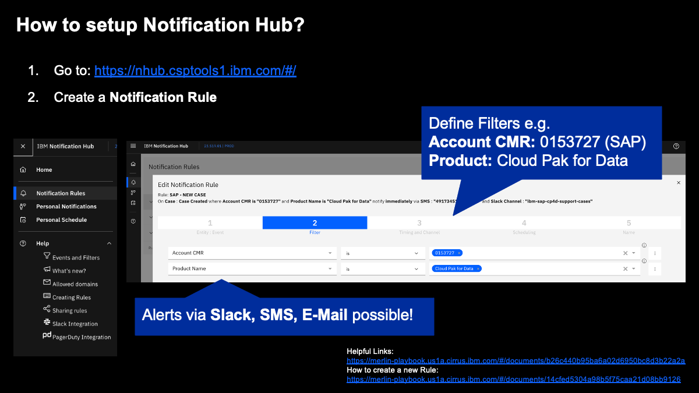
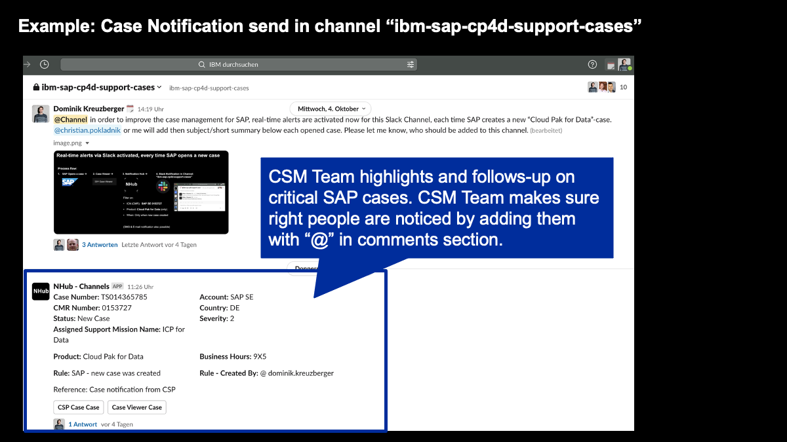
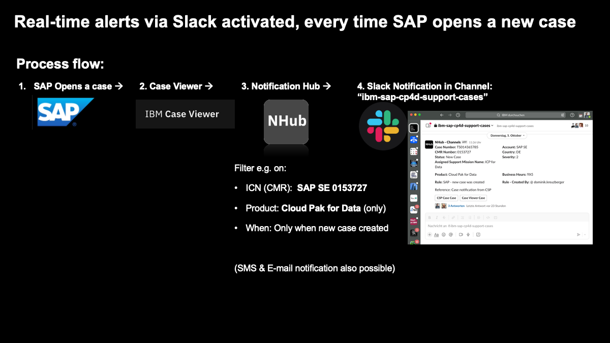

import { Link } from "gatsby";

It is essential to react to customer requests with clock speed – i.e. in Critical customer situations. The manual approach takes lots of time.

Enable yourself by setting up Notification Hub and get timely information about the cases your customer is opening, responding, updating the severity or other actions. Either by Email, SMS, Slack direct message or Slack channel message.

Going the extra mile and enabling your team by setting up the Notification Hub to post to a Slack channel leverages the speed of information flow as all the members of the channel will get notified.

## How to setup Notification Hub?

Follow the [CSP Playbook](https://merlin-playbook.us1a.cirrus.ibm.com/#/documents/14cfed5304a98b5f75caa21d08bb9126) on setting up notification rules.

### Demo Video

<iframe
  src="https://video.ibm.com/embed/recorded/133129206?showtitle=false"
  style="border: 0;"
  webkitallowfullscreen
  allowfullscreen
  frameborder="no"
  width="720"
  height="405"
  referrerpolicy="no-referrer-when-downgrade"
></iframe>

1. Log on to [Notification Hub](https://nhub.csptools1.ibm.com/#/), select Notification Rules from the menu, and Add Notification Rule
2. On `Entity : Event` select `Case` and `Case Created` to be notified on case creation.
3. On the `Filters` section of the rule, use `Account CMR` and `Product Name` to filter for your specific account and product.
4. On `Timing and Channel` select how you want to be notified (email, sms, slack direct message or slack group channel).

<InlineNotification>
  If you want to send alerts to a Slack Channel, make sure you follow the{" "}
  <Link to="https://merlin-playbook.us1a.cirrus.ibm.com/#/documents/ed5b1546b7fa4a3b487943a55cf2f1d8">
    documented procedure
  </Link>
  . If your channel is not on the <Link to="https://ibm-technical-support.slack.com/">
    Technical Support workspace{" "}
  </Link>
  you will need to add it via a request in your workspace #admin-requests
  channel.
</InlineNotification>

5. On `Scheduling` you can optionally set a time window for these notifications.
6. Finally, name your rule.

## Set up CaseViewer access

Go to [CSP Data Access](https://tps.intranet.ibm.com/tools/support/tat/csp/cspCustomerTab#) here and add yourself as a customer advocate for your customer.

Once approved, you can access a read-only version of your customer case by visiting https://w3.ibm.com/tools/caseviewer/case/TSXXXXXXXXX

## Example Use Case

Our friends in DACH used this process above to streamline the support process, you can read more about it on [their blog](https://w3.ibm.com/w3publisher/csm-dach/toolbox/notification-hub).

