## Request documentation enhancements

The process to submit requests to enhance and/or improve Cloud Pak documentation can be found in the [Cloud Pak Content Consistency Playbook](https://w3.ibm.com/w3publisher/product-scout-program/scout-instructions/submitter-instructions)

  

## Request product enhancements

When your customer encounters an adoption inhibitor or seeks a feature that is not currently available, use the feedback loop to put it on the radar of the product manager.

Enhancements can be initiated by the IBM technical community, customers, and business partners.

  

## Product Scout

CSMs are part of the [Product Scout](https://w3.ibm.com/w3publisher/product-scout-program/) program.

In order to help Product Management priortize product enhancements based on customer impact, the Product Scout program "crowd-sources" information about customers needing an enhancement from across all markets and GEOs from Customer Success, Tech Sales, Client Engineering and Technology Expert Labs.

Your role as a CSM is described on the [Product Scout Publisher Page](https://w3.ibm.com/w3publisher/product-scout-program/scout-instructions/submitter-instructions). You are expected to quantify the impact of an enhancement for your customer and communicate it to your market/product [Product Scout](https://w3.ibm.com/w3publisher/product-scout-program/scout-names/) and work closely with your scout to ensure that you idea is accepted, given a roadmap slot and delivered.

You can find out more about the Product Scout program on the [publisher page](https://w3.ibm.com/w3publisher/product-scout-program/) and access the issue trackers on [ideas.ibm.com](https://ideas.ibm.com/issue-tracker)

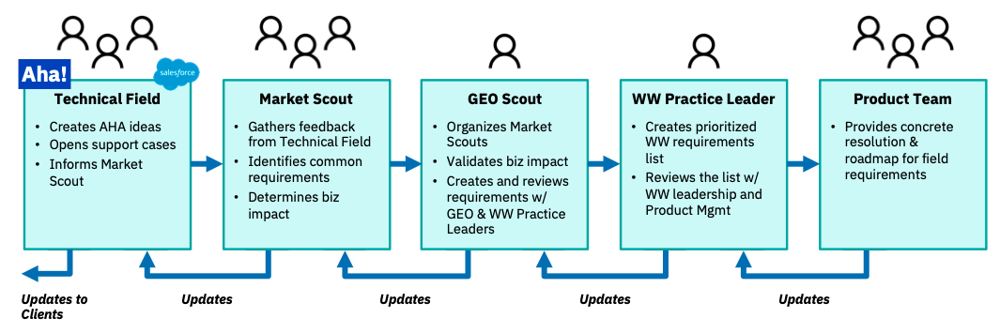

#### CSM practice leaders

View CSM Practice Leaders in their corresponding community:

* <a href="https://w3.ibm.com/w3publisher/customersuccess/community-connections/sustainability-software-community/community-experts" target='_blank' rel='noreferrer noopener'>Sustainability Software Practice Leaders and SMEs</a>

* <a href="https://w3.ibm.com/w3publisher/customersuccess/community-connections/automation-platform-community/community-experts" target='_blank' rel='noreferrer noopener'>Automation Platform Practice Leaders and SMEs</a>

* <a href="https://w3.ibm.com/w3publisher/customersuccess/community-connections/data-and-ai-community/community-experts" target='_blank' rel='noreferrer noopener'>Data and AI Practice Leaders and SMEs</a>

* <a href="https://w3.ibm.com/w3publisher/customersuccess/community-connections/public-cloud-community/community-experts" target='_blank' rel='noreferrer noopener'>Public Cloud Practice Leaders and SMEs</a>

* <a href="https://w3.ibm.com/w3publisher/customersuccess/community-connections/red-hat-openshift-community/community-experts" target='_blank' rel='noreferrer noopener'>Red Hat OpenShift Practice Leaders and SMEs</a>

* <a href="https://w3.ibm.com/w3publisher/customersuccess/community-connections/security-platform-community/community-experts" target='_blank' rel='noreferrer noopener'>Security Practice Leaders and SMEs</a>

  

## Submit a product enhancement request

<Accordion>

<AccordionItem title='Enhancement process for IBM Sustainability Software'>

## Enhancement process for Sustainability Software

### Customer or business partner-initiated enhancement requests

<a href="https://ideas.ibm.com/" target='_blank' rel='noreferrer noopener'>Sustainability Software External Link to the Ideas Portal</a>

### Enhancement requests initiated by members of the IBM Technical Community

IBMers who need to submit an enhancement request may start by contacting the appropriate Sustainability Software Customer Success Practice Leader so they can help you through the process.

#### INTERNAL links to the Ideas Portals:

* <a href="https://ibm-ai-apps-internal.ideas.aha.io/" target='_blank' rel='noreferrer noopener'>Maximo, TRIRIGA, EIS, ELM, and Supply Chain</a>

When submitting an idea, consider these best practices:

* In the "IBM Wide Managed Tags: ideas" field, add the following:
    * The source (for example: IBM Customer Success) and
    * Type (for example: ai_apps_filed)

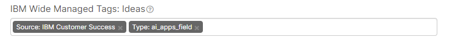

* Search first. You might find your idea has already been submitted and you can vote for it to add your impact.
* Be specific on the impact of the idea. The more measurable the idea, the stronger the business case.

#### Sample idea creation screen shots

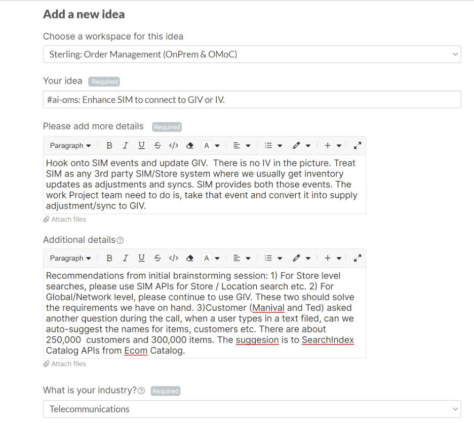

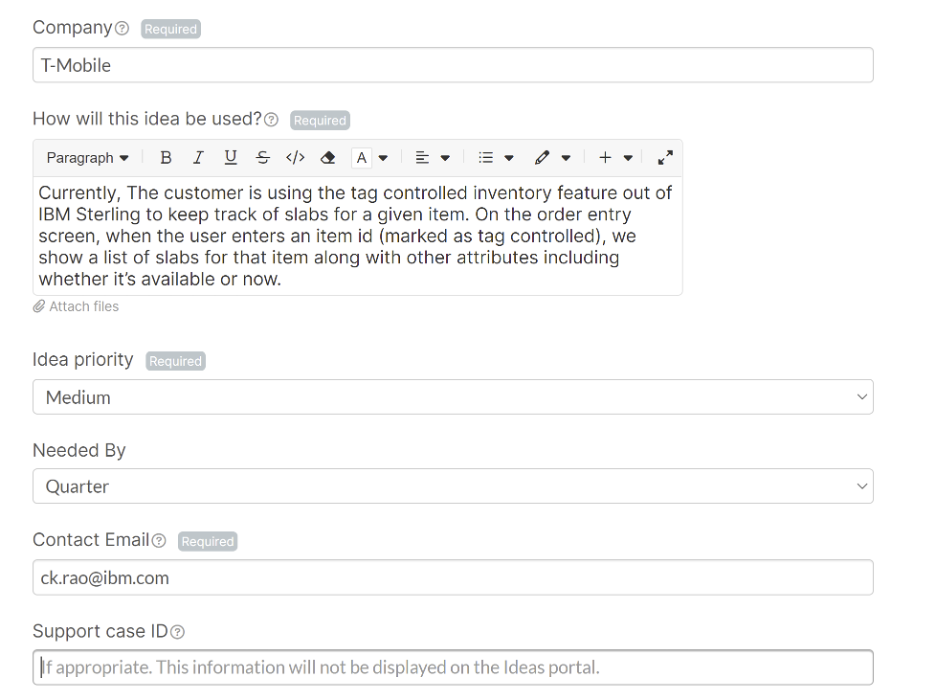

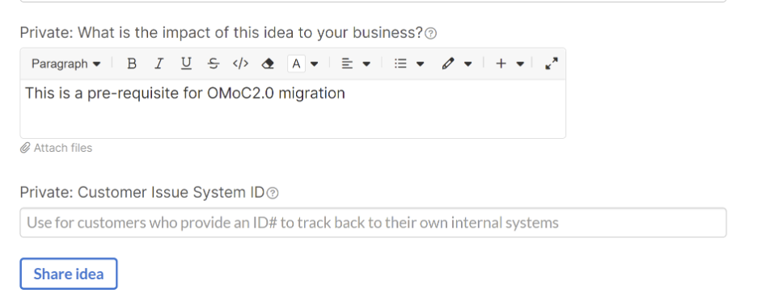

</AccordionItem>

<AccordionItem title='Enhancement process for IBM Cloud and Cloud services'>

## Enhancement process for IBM Cloud and Cloud services

IBM Cloud CSMs will enter new enhancement requests via the Gainsight tool, where all information, account actions and plans are documented for IBM Cloud customers.

1. Navigate to the Cockpit in Gainsight.

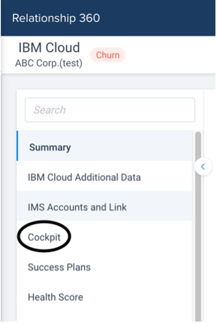

2. In the Cockpit, use the Create CTA button in to top right.

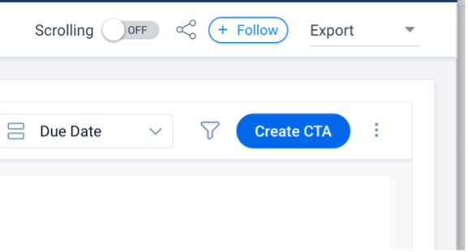

3. Input data as requested in all fields. In “Type” scroll to Enhancement Req and select.  This specifies this CTA as a new Enhancement Request.

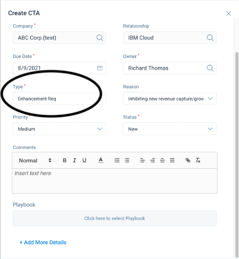

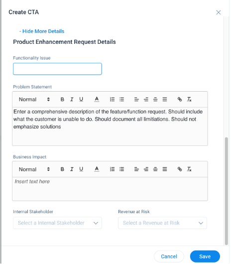

4. Move to + Add More Details, expand, and add the core information about the enhancement requested.  It is critical that Offering Management be able to discern what new capability you are asking for and what is the business impact – both to IBM and to the customer.

5. Following submission of the CTA, a new entry will be created in AHA Public Cloud – IBM Cloud Ideas – Internal.

</AccordionItem>

<AccordionItem title='Enhancement process for IBM Cloud Paks'>

## Enhancement process for IBM Cloud Paks

Use the following links to submit enhancement requests.

* <a href="https://ideas.ibm.com" target='_blank' rel='noreferrer noopener'>ideas.ibm.com</a>

When you submit an idea, consider these best practices:

* Search first. You might find your idea has already been submitted and you can vote for it to add your impact.
* Be specific on the impact of the idea. The more measurable the idea, the stronger the business case.
* When you create the idea, in the "Choose a workspace for this idea" field, be sure to select "Cloud Pak for xxx".
* In the "Your idea" field, use #cpfield to enable identification, search, and voting.

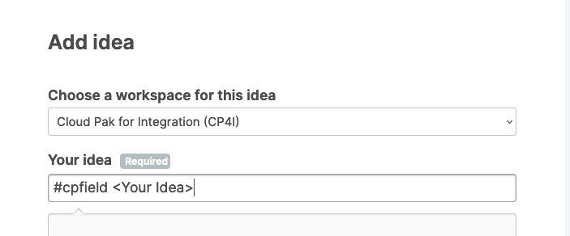

* Under IBM Wide Managed Tags: Ideas, be sure to select the appropriate page to enable tracking based on your role:
  * If you are a business partner, select Source: IBM Business Partner
  * If you are a CSM, select Source: IBM Customer Success
  * If you are from Expert Labs, select Source: IBM Technology Expert Labs
  * If you are a Client Engineer, select Source: IBM Garage Services

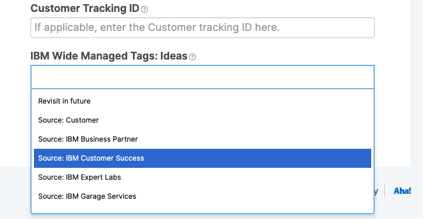

### Additional resources for Cloud Pak enhancements

When your customer encounters an inhibitor to their adoption of a Cloud Pak, work with your practice lead using the enhancement process.  Some resources you may use during that process include:

##### Product manager monitored slack channels

Submit a technical inhibitor to the appropriate Slack channel.  Channels will be monitored by OM and development who can help you determine whether you have a defect or product enhancement:

* <a href="https://ibm-cloud.slack.com/archives/C01EFL1K9NE" target='_blank' rel='noreferrer noopener'>#cpfield-cp4data</a>
* <a href="https://ibm-cloud.slack.com/archives/C01EFS697A7" target='_blank' rel='noreferrer noopener'>#cpfield-cp4integration</a>
* <a href="https://ibm-cloud.slack.com/archives/C01E0TTGD63" target='_blank' rel='noreferrer noopener'>#cpfield-cp4applications</a>
* <a href="https://ibm-cloud.slack.com/archives/C01E0TUDMM5" target='_blank' rel='noreferrer noopener'>#cpfield-cp4automation</a>
* <a href="https://ibm-cloud.slack.com/archives/C01EFSAA9MH" target='_blank' rel='noreferrer noopener'>#cpfield-cp4mcm</a>
* <a href="https://ibm-cloud.slack.com/archives/CESAJF4PJ" target='_blank' rel='noreferrer noopener'>#cp4sec\_sales\_enable</a> (existing Security channel)

Hot inhibitors will be categorized by OM and Dev as either a Defect or an urgent Inhibitor Enhancement Request.

</AccordionItem>

</Accordion>
