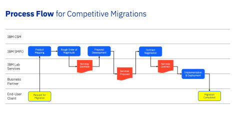
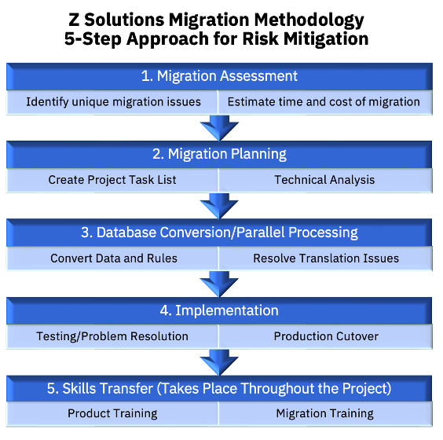

<AnchorLinks small>

  <AnchorLink>Overview of the zConversion Play</AnchorLink>
  <AnchorLink>What’s the role of CSM in the Play?</AnchorLink>
  <AnchorLink>Who are the other players?</AnchorLink>
  <AnchorLink>What are the requisites to be considered for approaching the play?</AnchorLink>
  <AnchorLink>How Should CSM approach the Conversion Play?</AnchorLink>
  <AnchorLink>SMPO</AnchorLink>
  <AnchorLink>Partner resources</AnchorLink>
  <AnchorLink>Additional Links</AnchorLink>

</AnchorLinks>

## Overview of the zConversion Play
A competitive migration /conversion involve customers interested or in the process of migrating from a competing vendor's Z products to IBM products. Mostly the scenario will revolve around migrating products from the competing vendors BMC and Broadcom

## What’s the role of CSM in the Play?
CSM’s role in the play is to drive the efforts for a successful migration from the competitive products to IBM products drawn down from the ELA. CSMs will leverage the Software Migration Project Office (SMPO) team to help customers accomplish the migration effort, engage the Product team to address the product related queries and involve other players whenever and wherever necessary.

## Who are the other players?

| SMPO | Expert team focused on Mainframe ISV migrations to IBM Products |
| --------- | --------- |
| Brand Sellers | Sellers have deep brand expertise and an in-depth knowledge of the competitive landscape |
| zClient Architect  | Solution and subject matter experts responsible for driving z-focused agenda and part of the pre-sales |
| Product Teams | Responsible for development of the z Products |

## What are the requisites to be considered for approaching the play?

* Confirm the intent with the sponsor and other stakeholders within IBM that the conversion involves utilizing the products from ELA. If the targeted products are not available in ELA, confirm the intent to have them onboarded under the ELA. It is important to know that the CSM’s scope will be limited to the products in ELA.
* Review the ELA catalogue of the customers and compare against the current install base at the customer. Work within IBM (zBrand Sellers, zClient Architect) and the stakeholders at customer (Mainframe Architect, Line of Business owners) to understand the current landscape of competitor products.
* Review and identify the Mapping of the competitive products to corresponding IBM products. This is for CSM’s reference.

    * <a href="http://www.lookupmainframesoftware.com/">http://www.lookupmainframesoftware.com/</a>
    * <a href="https://www.ibm.com/it-infrastructure/z/resources/products-a-to-z">https://www.ibm.com/it-infrastructure/z/resources/products-a-to-z</a>
    * <a href="https://w3.ibm.com/systems/productpages/">https://w3.ibm.com/systems/productpages/</a>
    * <a href="https://ibm.ent.box.com/file/965516774543?s=ay90n0xr3el9f5kj6b2aye5452e5qvq">https://ibm.ent.box.com/file/965516774543?s=ay90n0xr3el9f5kj6b2aye5452e5qvq</a>

    Note: SMPO might have done a customized mapping per account based on the ISV licenses and ensure to check them as well.

## How Should CSM approach the Conversion Play?

* Reach out to SMPO & z Brand sellers to understand the history and scope of the project. SMPO might have already had a discussion/effort done for the migration.
* Understand the customer's current usage of the competing vendor's product and what they are looking for in an IBM product.
* Identify any concerns or objections that the customer may have about switching to IBM products. Involve other players at IBM to address the concerns.
* Continue to engage with all the stake holders to drive the deployment. Engage or involve the necessary players to mitigate the risks associated with the deployment.
* As the project progresses, track the updates on Gainsight against the relationship if it is available. Else, continue to capture the updates on Box and update them once the relationships are loaded.
* CSMs should work closely with SMPO and other players involved to create a comprehensive migration plan that outlines the steps needed to migrate the customer from the competing vendor's product to IBM products. The plan should detail the timelines, resources, and processes involved in the migration.
* Throughout the migration process, CSMs should work closely with the customer to ensure a smooth transition. They should regularly communicate with the customer, provide updates, and offer support to ensure that the customer's expectations are met or exceeded.

## SMPO

### Contacts
Worldwide SMPO Z Software ISV Competitive Replace Team

* Mary Quigley - Director - Global Software Migration Project Office (SMPO) Z Software Sales
* Carrie Speth - Principal - Global Software Migration Project Office (SMPO) – WW Business Unit Leader - Sales & Tech Sales
* Sally Touscany - Principal - Global Software Migration Project Office (SMPO) – Americas Business Unit Leader
* Donald Whitt - Principal - Global Software Migration Project Office (SMPO) – Americas Business Unit Leader Technical Sales
* John Adby – Principal - Global Software Migration Project Office (SMPO) – WW Technical Sales Manager - EMEA & APAC
* Christine Spana – Principal - Global Software Migration Project Office (SMPO) – Migration Brand Sales Specialist – Distributed

### Seismic Page
<a href="https://ibm.seismic.com/Link/Content/DCq6T8d4fD3gmGmM2XDBFPVdTdD3">SMPO Seismic link</a>

### Approach for Conversion
CSMs will engage throughout the process along with SMPO and specifically work closely with the client on the step 4

## Partner resources
Details on the capabilities of the partners and the products they can cover is available in the Box <a href="https://ibm.box.com/s/nujzc1d8gjscktlet3zdwk39cs3svnvb">link</a>

## Additional Links
* <a href="https://ibm.box.com/s/c04k2ht2lrk51rw6shv5yjnprwlf5s6e">Competitive replacement</a>
