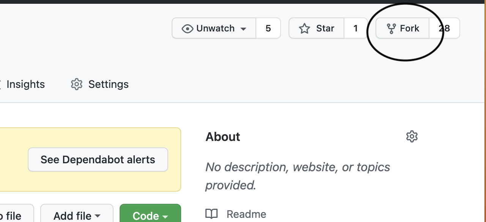
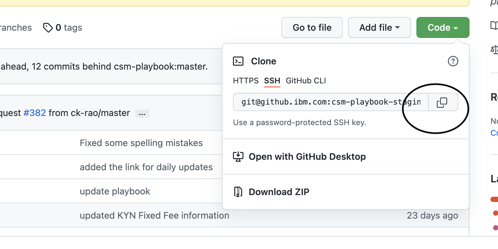
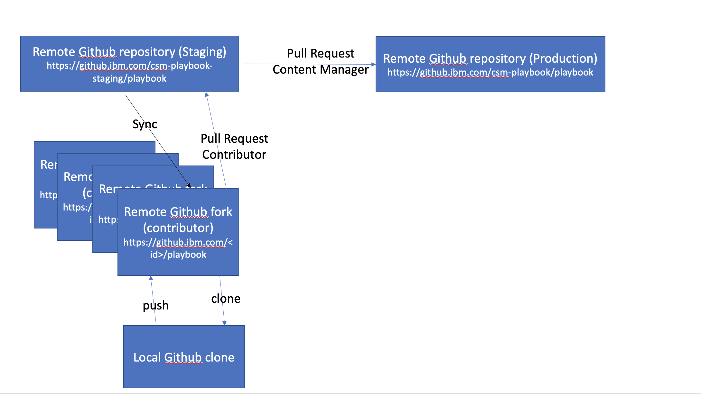

<Row>
<Column colMd={9} colLg={9}>

This document guides you to set up your machine and contribute content to the CSM Playbook. Contributions are made by creating a fork of the site repository, adding your content in the forked repository, then creating a pull request back to the site repository. The detailed steps to do this are provided below.

---------------------

<AnchorLinks small>
<AnchorLink>How to contribute</AnchorLink>
<AnchorLink>First timer</AnchorLink>
<AnchorLink>Fork this repository</AnchorLink>
<AnchorLink>Clone the repository</AnchorLink>
<AnchorLink>Install JavaScript dependencies</AnchorLink>
<AnchorLink>Set up the Upstream</AnchorLink>
<AnchorLink>Build the playbook, locally</AnchorLink>
<AnchorLink>Contribute content</AnchorLink>
<AnchorLink>Create a Pull Request</AnchorLink>
<AnchorLink>Building on Staging and Production</AnchorLink>
<AnchorLink>Common set up problems</AnchorLink>
<AnchorLink>Markdown</AnchorLink>
<AnchorLink>Style and consistency</AnchorLink>
</AnchorLinks>


---------------------


## How to contribute
You can contribute to the playbook in several ways. You can report a bug, submit feedback, or create new content. When you open a bug or submit feedback, you can expect the playbook team to respond and implement the change requested. If you are planning to author, you will need to learn how to contribute. Overall, the most important thing is that you provide feedback to keep the content fresh and accurate. <br/>
**<a href='https://github.ibm.com/csm-playbook-staging/feedback/issues/new?assignees=&labels=bug&template=bug_report.md&title=' target='_blank' rel='noreferrer noopener'>Bug report</a>**  To open an issue for a bug, such as a broken link or a need for a new paragraph, etc., open a Bug report github issue. <br/>
**<a href='https://github.ibm.com/csm-playbook-staging/feedback/issues/new?assignees=&labels=feedback&template=feedback.md&title=' target='_blank' rel='noreferrer noopener'>Feedback report</a>** If you have comments or suggestions for changes, open a Feedback issue.
**<a href='https://github.ibm.com/csm-playbook-staging/feedback' target='_blank' rel='noreferrer noopener'>GitHub issue</a>** To contribute as an author (creating pages and new content), open a GitHub issue. Contact Susan (@slafera) or Hollis(@hollisc) for enablement. You will follow the instructions found on this page.


## First timer
1.  If you don't have git on your machine, <a href='https://docs.github.com/en/get-started/quickstart/set-up-git' target='_blank' rel='noreferrer noopener'>install it.</a>
2.  If you don't have a GitHub enterprise account, go to [http://github.ibm.com/](http://github.ibm.com/) to create a GitHub Enterprise account.
3.  To be added to our project and repo (github.ibm.com/csm-playbook-staging/playbook), slack Susan LaFera, @slafera with your GitHub id.
3.  Install the latest Node.js version from https://nodejs.org/en/ Install the minimum and default options.
4.  Install the <a href='https://code.visualstudio.com' target='_blank' rel='noreferrer noopener'>Visual Studio Code</a> editor. It provides some nice integration with GitHub.
5.  If you don't already have an SSH key, you must generate a new SSH key to use for authentication. You need to set up the SSH key in your Github account to match what is on your local machine. Follow the <a href='https://docs.github.com/en/authentication/connecting-to-github-with-ssh/generating-a-new-ssh-key-and-adding-it-to-the-ssh-agent' target='_blank' rel='noreferrer noopener'>instructions</a> to generate an SSH key and/or add the your SSH key to the SSH agent.

</Column>
</Row>

<Row>
<Column colMd={6} colLg={6}>

## Fork this repository

You will store your markdown files in Enterprise GitHub.  The repo we work in is the <a href='https://github.ibm.com/csm-playbook-staging' target='_blank' rel='noreferrer noopener'>CSM Playbook staging repo</a>. ```  https://github.ibm.com/csm-playbook-staging/playbook ```
You have to create your own Fork of this repo. <br/> A fork is a new repository that shares code and visibility settings with the original “upstream” repository. Upstream = the master staging site of the repo.
In the GitHub repo, go to the upper-right corner of the window and click **Fork**.
This will create a copy of this repository in your account.<br/>

Be sure to fork the repo into your space. For example, if your GitHub user name is abc, you would fork to @abc.

</Column>

<Column colMd={6} colLg={6}>

<br/>




</Column>
</Row>

<Row>
<Column colMd={6} colLg={6}>

## Clone the repository

Now, clone the forked repository to your local machine. Go to your GitHub account, open the forked repository, click on the code button, select SSH, and then click the copy to clipboard icon.  In your terminal window, type ```git clone [and paste the SSH command you just copied]```

</Column>

<Column colMd={6} colLg={6}>

<br/>



</Column>

</Row>

<Row>
<Column colMd={9} colLg={9}>

This diagram shows the relationship between your GitHub fork and the master repo.



## Install JavaScript dependencies

Install the JavaScript dependencies (only needed the first time you clone the repository).  Open a (Mac)terminal window (Find Terminal in LaunchPad) (Windows)Power Shell or command prompt and change directories (cd) to the directory where you forked the code. At the command prompt,  type: ```npm install ```

## Set up the Upstream

The upstream is the master copy of the repository. Configure Git to pull changes from the upstream repository into the local clone of your fork.
From your terminal window, go into the playbook directory and set up the upstream by typing:<br/>
``` git remote add upstream git@github.ibm.com:csm-playbook-staging/playbook.git ```

<br/>

Validate that the origin and upstream are correct. Type:<br/> ``` git remote -v```

You should see the URL for your fork as ```origin```, and the URL for the upstream repository as ```upstream```. (with your fork name, not slafera) 

```  origin	git@github.ibm.com:slafera/playbook.git (fetch)```<br/>
 ```  origin	git@github.ibm.com:slafera/playbook.git (push)```<br/>
``` upstream	git@github.ibm.com:csm-staging-playbook/playbook.git (fetch) ```<br/>
```upstream	git@github.ibm.com:csm-staging-playbook/playbook.git (push) ```

## Build the playbook, locally

Be sure you have already run **npm install** in the directory where you have your clone.
To run the site locally, in your terminal window, type the following command to start a build: ``` npm run dev ```

To review the site on your own machine, go to a browser and type: ``` http://localhost:8000/ ```

## Contribute content

### Forks and Pull Requests best practices

Please follow these best practices after you read the instructions for contributing:

One change / documentation update per pull request (PR) <br/>
Always pull the latest changes from upstream and rebase before creating any pull request. <br/>
New pull requests should be created against a branch of your forked repository. <br/>
All new contributions should first be tested locally before PR submission. 

### Create an issue in GitHub

For each new piece of content that you contribute, create an issue in GitHub to track your work. <br/>
Open an issue in <a href="https://github.ibm.com/csm-playbook-staging/playbook#workspaces/csm-playbook-624b288a761a56000d63f7f8/board?repos=1252925" target='_blank' rel='noreferrer noopener'>GitHub</a>. All work on the content is tracked in the issue. To save time and work, avoid using email.<br/>
To assign the issue, you must be added to GitHub.


### Make your changes
1. Before you start to make changes, in your terminal window, check out the master branch via ```git checkout master``` .
2. Sync with the master branch of the csm-playbook-staging repo to ensure you're working with the latest files. Pull the latest from the upstream ```git pull upstream master```
3. Sync changes to your fork ```git push origin master```
4. Create a new branch for the changes you want to make ```git checkout -b <branch name>```
5. Make changes to CSM Playbook or Mod Guide in your editor<br/>
    **Store images** in the src/images folder<br/>
    **Store files** in the src/static/files folder<br/>
    **Store content** in the src/pages folder<br/>
    If you are creating a new page that should appear in the navigation, update src/data/nav-items.yaml to include the new page 
6. Commit your intermediate changes as you go and as appropriate.  Repeat until satisfied
7. Type ```npm run dev``` in your terminal window to test that the content is error free. View your local build at http://localhost:8000/
8. Review the content on your local server and repeat these steps as necessary while you iterate on the content and resolve any build issues.
9. When you are finished with all your commits and ready to push your changes, fetch the latest upstream changes (in case other changes had been delivered upstream by others while you were working on your contribution) ``` git pull upstream master ```
10. In the CLI, type ```git status```. This will show all the files that you changed.
11. Next, type ```git add src/pages/``` or whatever string is appropriate for the files you changed.
12. Type ```git commit -m"description of change"```
13. Type ```git push origin <branch name>``` to publish the changes on your branch to your fork **origin**


## Create a Pull Request


To push your changes from your fork to the csm-playbook-staging repo by using the GitHub UI, follow these steps:

2. In a web browser, go to your fork. On the **Code** tab, click **New pull request**.    

3. On the "Comparing changes" page, make sure that your fork is the head fork (on the right) and the csm-playbook-staging repo is the base fork (on the left).


4. Click **Create pull request**.

5. On the "Open a pull request" page, in the comment field:

* Type `#`, followed by your GitHub issue number.

6. Click **Create pull request**.


You will see a message stating that merging is blocked and that your pull request can be merged only by project collaborators.

Even though it looks like an error, your pull request was submitted successfully and Susan or her backup will merge it shortly.

**Important:** If there are errors in your MD files, your PR might be rejected until the content is fixed.

## Building on Staging and Production

After your PR is merged, your changes will be live on staging after about 30 minutes:
     https://pages.github.ibm.com/csm-playbook-staging/playbook/

It will take a while for your changes to be make it to production (https://pages.github.ibm.com/csm-playbook/playbook/), because this is a manual process - Susan has to sync the production github repo and run the production build.

When the content is final, Susan pushes the final version to the production site for external viewing. Be sure to check the production version of the playbook to ensure your changes are there.

##	Nightly builds and typical ETAs:
Local – Day1 - Create a pull request to go to staging.<br/>
Staging – Day 2  - changes appear on staging. Confirm the changes reflect what you expect - Let Susan know.<br/>
Production – Day 3 - changes appear on staging.

For urgent changes, please work with Susan to get the changes to production with manual immediate builds.


## Common set up problems

### Issue installing npm install


If you receive the following error: ENOTEMPTY, run this set of commands:

      rm -rf node_modules

      rm package-lock.json

      npm install

If you have other errors, you could consider adding the dependencies in the following way:

      npm install uuid@7.0.3 -force

      npm install -g gatsby-cli

### Not able to use SSH

You need to get an SSH key

### git not recognized in the CLI

Install GitHub 


## Markdown

-----------------

### Gatsby Carbon components

You can use the <a href='https://gatsby-theme-carbon.vercel.app/components/' target='_blank' rel='noreferrer noopener'>components</a> from Gatsby theme Carbon; however, please be sure to test. Not all components are coded correctly in the linked document and some components have not actually been made available to us.

The coding /themes references:
a.	https://gatsby-theme-carbon.vercel.app/getting-started
b.	Example: https://gatsby-theme-carbon.vercel.app/components/ResourceCard

### Links

* To link to other content on the site, use the following format:

```          <Link to='/directory/filename'>Text</Link> ```

* To link to a file that we store in the repo:

```          <FileLink to='/files/filename.extension'>Text</FileLink> ```


Note: Be sure the following are at the top of your file after the Description:

```  import {Link} from 'gatsby'; ```

<br/>

```  import FileLink from '../../components/FileLink'; ```


   * Do not include https://www.ibm.com/ in the URL.

          

* To link to external sites, use HTML markup:

```        <a href="URL" target='_blank' rel='noreferrer noopener'>Link text</a> ```

* Make sure that links to external sites open in new windows. Use HTML markup. For example:

         ```<a href="http://docs.aws.amazon.com/AmazonS3/latest/dev/Versioning.html" target='_blank' rel='noreferrer noopener'>text</a>```

### Tables

To add a table, use this syntax


              | Column header | Column header  |
              | --- | --- |
              | Row | Row |
              | Row | Row |

### Images

To add the image in your Markdown file, use this syntax.

     ```  ```


## Style and consistency

-----------------

Be sure to write well by keeping these standards in mind. For the complete corporate IBM style and word-usage guide, see <a href="http://ibm.biz/ibm-style-guide" target='_blank' rel='noreferrer noopener'>IBM Style</a>.


### Capitalization

Use sentence-style capitalization. In sentence-style capitalization, you capitalize only the initial letter of the first word in the text and other words that require capitalization, such as proper nouns. Proper nouns include the names of specific people, places, companies, languages, protocols, and products.


### Citations and attributions

Before you quote more than one sentence of text from non-IBM publications, obtain approval from your legal department.

If you are quoting an IBM publication, you do not need approval from your legal department, but you must provide attribution to the source.

If you include quotations in your article, mark the quotations with numerals, include a "References" section at the end of your article, and make that section a subheading by preceding "References" with three number signs (###). For example:

### References

1. Clark, Anita. "There are 3 ways to motivate people to work harder, faster and smarter: 1. Threaten them." _LinkedIn Pulse_, June 23, 2015. https://www.linkedin.com/pulse/summer-here-lets-picnic-office-today-what-your-fun-anita-clark.
2. Urquhart, Jody. "Creating a Fun Workplace... 13 Ways to Have Fun at Work!" _AGCareers.com Newsletters_. Accessed October 1, 2015. http://www.agcareers.com/newsletters/creating.htm.

### Conversational style

* Use the right tone. Carefully consider the content and audience.

* Be clear. Use simple verbs and tenses. Use simple language. Avoid needless words. Try to keep sentences to 32 words or fewer, and vary sentence lengths.

* Be direct. Use active voice. Use present tense.

* Focus on the audience. Use second person pronouns to engage the audience. Write about what the audience cares about.

For more information, see the Conversational style topic in <a href="http://ibm.biz/ibm-style-guide" target='_blank' rel='noreferrer noopener'>IBM Style</a>.

### Formatting

For full guidance about formatting, see the Highlighting and Lists topics in <a href="http://ibm.biz/ibm-style-guide" target='_blank' rel='noreferrer noopener'>IBM Style</a>.

#### Bold and italics

* Use bold only to indicate user interface elements that you click in tasks, such as in tutorials or courses.

* Do not use bold to highlight important words or phrases in lists or body text.

* Continuous integration can help you detect and address errors early, often minutes after they've been injected into the product. Effective continuous integration requires **automated unit testing** with appropriate code coverage.

* Continuous integration can help you detect and address errors early, often minutes after they've been injected into the product. Effective continuous integration requires automated unit testing with appropriate code coverage.

* Use italics only to indicate variables, words or phrases that are being defined, and citations that aren't links, such as the title of a book.


### Images

Before you add an image, ask yourself whether it is truly helpful. Images are helpful in these cases.

* Add information that is difficult or impossible to express in text
  * Illustrate a user interface that is complex
  * Show an unlabeled element
* Help locate information
  * Identify a small element in a complex user interface
  * Orient users who do not have the user interface in front of them
* Show results
  * Provide a checkpoint after a series of steps or user actions (a needed checkpoint)

If you decide that an image is truly helpful, follow these guidelines when you capture it.

   * Images must be in .jpg or .png format.
   * Images must be no larger than 720 px.
   * Set the resolution to 72.
   * When you capture an image of a web browser, don't capture the header and footer of the browser, or anything else that identifies which browser you are using.
   * Do not capture images that show other companies' logos or icons.
   * Do not show the names of IBM employees or customers and any actual server names or addresses or other proprietary information, such as project code names.
   * Never modify a screen capture that involves images of another company’s product.
   * Image names follow this format: ```meaningful-image-name.png```


### Trademarks

When you refer to IBM as the company, do not add the registered trademark.

Mark the first instance of all IBM product names with the proper trademark symbol, either &reg; or &trade;. A list of IBM trademarked names is available on the <a href="https://www.ibm.com/legal/us/en/copytrade.shtml">Copyright and trademark information</a> page. After you mark the first instance of the name, do not mark subsequent instances.

**Exception** If the first instance of an IBM product name is in a title or heading, do not mark the instance in the title or heading. Instead, mark the name on its first instance in the body text.

If you are creating offline material such as an Adobe Acrobat (PDF) file, be sure to include attribution statements for the following company trademarks, referring to the <a href="https://www.ibm.com/legal/us/en/copytrade.shtml">Copyright and trademark information</a> for details:

* Adobe
* Intel
* AXELOS(IT Infrastructure Library and ITIL)
* Linear Tape-Open, LTO, and Ultrium
* Linux
* Microsoft
* Oracle (Java)
* RStudio
* Red Hat
* The Open Group (UNIX)
* VMware


* Red Hat
* OpenShift


### Punctuation

* Avoid parentheses. By including text within parentheses, you are indicating that the text is decreased in importance. In general, include information that is important and eliminate information that is not. Parentheses can also interrupt the flow of a sentence. Try to rewrite the text or use other punctuation instead of parentheses.

   If you must write a sentence that includes text in parentheses, ensure that the sentence is grammatically correct and technically accurate if you omit the parenthetical text.

* Use exclamation marks sparingly. A good rule of thumb is to have no more than one exclamation mark per page.

* Unless they're part of a quotation, place periods and commas outside of quotation marks.

### Reuse from non-IBM sites

Before you can reuse published content from a non-IBM site, you must have permission from the content owner.

Be careful to not blantantly copy content from other sites. However, it is acceptable to restate ideas and expound on them. If you publish content that is similar to content from another site, do so only if you are adding value to that content.


### Terminology

For complete terminology and word usage guidance, see the <a href="https://w3.ibm.com/standards/terminology/cgi-bin/lookup.pl?user_group=corporate" target='_blank' rel='noreferrer noopener'>IBM Terminology look-up page</a> and the <a href="http://ibm.biz/word-usage" target='_blank' rel='noreferrer noopener'>Word usage list</a>.

#### Terms to avoid

In most cases, do not use the following words. For the latest list of do-not-use terms per the corporate Terminology Review Board, see <a href="https://w3.ibm.com/w3publisher/inclusive-it-terminology/terms-to-replace" target='_blank' rel='noreferrer noopener'>Inclusive IT Terminology</a>.

   * *black hat hacker*. Never use. The terms "white hat" and "black hat" promote racial bias because black is used to indicate malevolence while white indicates ethical, positive behavior. Use *attacker* instead.
   * *blacklist*. Never use. Use *blocklist* instead.
   * *Chinese wall*. Never use. Use *ethical wall* or *firewall* instead.
   * *man hour*, *man day*. Never use. Use *person hour* and *person day* instead.
   * *master*. Never use when paired explicitly or implicitly with *slave*. Select one of the following replacement terms: "controller", "leader", "manager", "main", "coordinator", "parent", or "primary [server, node, process, or other noun]".
   * *master repository*. Use with caution. This term is not prohibited but should be replaced when possible and appropriate. Consider using *main repository* or *primary repository* in new products/functions.
   * _may_. Use with caution. Replace with _can_ or _might_ as appropriate.
   * *please*. Use with caution. Do not use in IBM technical information. Terms of politeness are superfluous, convey the wrong tone for technical material, and are not regarded the same way in all cultures.
   * *slave*. Never use. Select one of the following replacement terms: "worker", "child", "helper", "replica", "follower", or "secondary [server, node, process, or other noun]".
   * *white hat hacker*. Never use. The terms "white hat" and "black hat" promote racial bias because black is used to indicate malevolence while white indicates ethical, positive behavior. Use *offensive security researcher* instead.
   * *whitelist*. Never use. Use *allowlist* instead
   * First-person pronouns, such as *I*, *we*, *our*, *us*, and *let's* are unacceptable in most content. First-person pronouns can be used in videos where the speakers have introduced themselves or in the question portion of FAQs.

#### Commonly misspelled terms

|  Incorrect |  Correct |
| ---------- | ----------- |
| collocation | colocation |
| Cloud Native, cloud native | cloud-native |
| ICP, ICp | IBM Cloud Private |
| micro services, micro-services | microservices |
| on-premise | on-premises |
| Openshift | OpenShift |
| RedHat, RH | Red Hat |
| SauceLabs | Sauce Labs|
| tool chain, ToolChain | toolchain |


### Titles and headings

* Use the imperative verb form, which engages the reader to act.

* Use sentence-style capitalization.

* Follow these general rules for subdividing text and creating headings:

  * Divide content only when two or more subsections are required. In other words, do not create subsection A unless the content also requires a subsection B.

  * Do not place one heading directly after another. Ensure that each heading is followed by text, or consider whether one heading can be removed. If the text that separates the headings is trivial, one of the headings is likely unnecessary.

* Do not end a heading with a period or colon.

* Separate a heading from a subheading by using a colon. Do not use dashes or parentheses for this purpose. Begin a subheading after a colon with a capital letter, regardless of whether the heading uses sentence-style or headline-style capitalization.

* Make headings brief, descriptive, and grammatically parallel.

</Column>
</Row>
