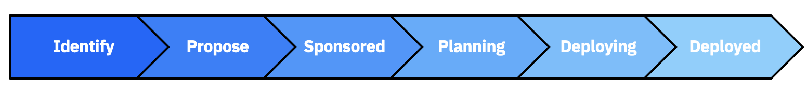

import {Link} from 'gatsby';
import FileLink from '../../components/FileLink';

<Row>

<Column colMd={9} colLg={9}>

Software deployments led by CSMs are tracked through <Link to='/onboard/gainsight-create-growth-plan/'>Growth Plans</Link> in Gainsight. In ISC, these deployments are called Deployment Opportunities. The projects progress through a standard lifecycle and are tracked by the Project Stage field on a Growth Plan. In Gainsight, the stages are called <Link to='/onboard/gainsight-milestones'>Milestones</Link>.

Milestones are used for all offerings, with the exception of IBM Cloud.  For IBM Cloud, monthly usage is a better representation of customer adoption.

## Deployment stages (Milestones) in Gainsight

Within the Deliver phase, there are a number of stages of deployment. Within each stage there are various activities that you perform to ensure successful deployment.

| Stage (Milestone) | Description | Stage (Milestone) Exit Criteria |
| -------- | -------- | ------- |
| **Identify** | The use case is an early idea that you have identified based on previous discussions with the customer and understanding their strategy.  When you are in this stage you have not yet had meaningful discussion with the customer. | You are discussing the use case with the customer. |
| **Propose** | The use case is being positioned with the customer.  All projects in this stage should have a forecast Sponsor date for when you expect the customer to make a decision. | You obtained a sponsor at your customer who wants to move forward with the use case. OR You determined the use case is no longer a path with the customer and close it out as No Plans to Deploy. |
| **Sponsored** | A sponsor has agreed to proceed with deploying the use case. When in this stage the sponsor may not yet be ready to move forward, but is committed.  Projects can skip from Propose to Planning if work continues after the sponsor is identified. | Resources at the customer are ready to engage and start planning the actual deployment. |
| **Planning** | The customer is in the process of planning the actual deployment of the project.  All projects in this stage should have a target installation date, and you may be able to forecast a go live date as well. | The initial installation has been completed successfully. |
| **Deploying** | The customer installed the products in the plan in their first environment  (e.g., sandbox, dev/test, prod, etc.). All projects in this stage should have a forecast production go-live date. | The customer has their first use case in production.  To test this ask yourself the following questions:  1. If the customer had to make a decision on renewal today, would they renew as they are getting value and would be impacted without it?  2. If there was an outage, would their business be impacted? |
| **Deployed** | The deployment is installed and operational in a production environment.  To achieve this stage does not mean all of the entitlement is in use, but that at least a portion is used for the project as defined.  Update the Project Outcome field to Closed - Successful. | Your manager will use the guidelines on Validating Deployments to review the deployment. |
| **No plans to deploy** | The customer has decided not to pursue this use case.  Typically this stage follows proposed if a sponsor is not found for the project, but projects can be moved to this stage at any time. | Update the Plan Outcome field and create a Timeline entry to explain why the use case will not move forward. |

</Column>

</Row>
