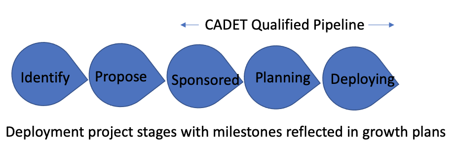
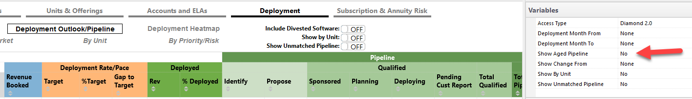
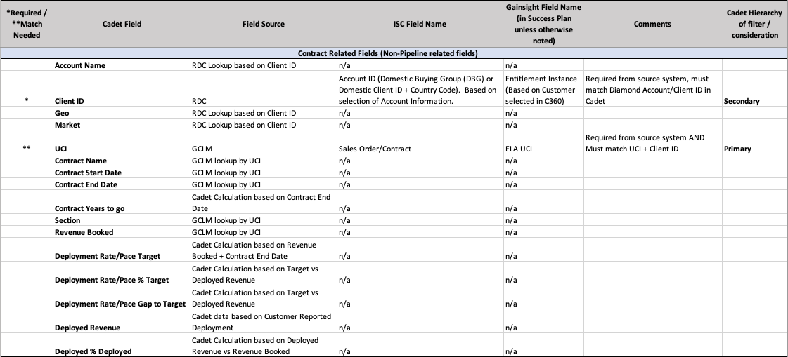
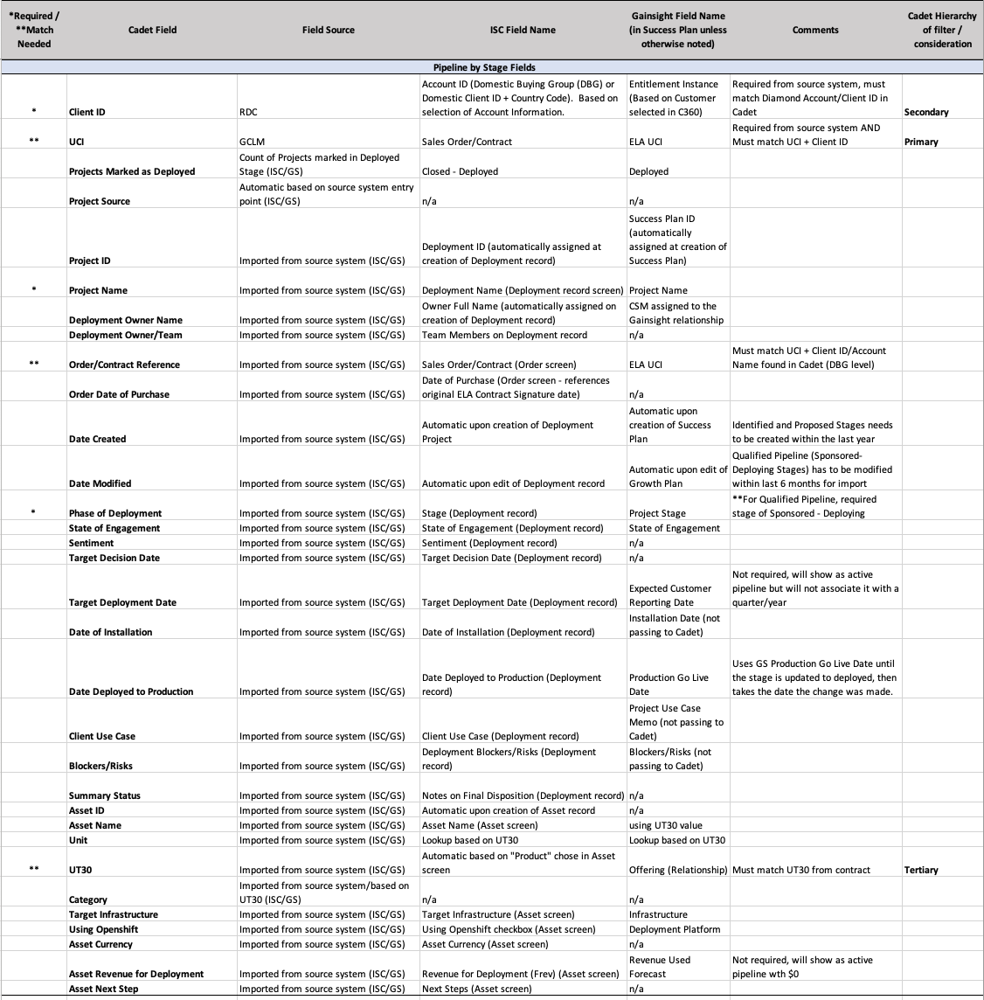

import {Link} from 'gatsby';
import FileLink from '../../components/FileLink';

<Row>

<Column colMd={9} colLg={9}>

## What is a Diamond pipeline?

In CADET, the Diamond pipeline represents the revenue from the rollup of growth plan/deployment opportunities for reporting sections in an ELA. The growth plans / deployment opportunities can be at different stages of deployment. The stages included in the pipeline are those that have been updated in the last 12 months (for stages Identify and Propose) and those updated in the last 120 days for stages Sponsored, Planning, Deploying, and Deployed where a customer report has not been received. A pipeline that has not been updated is considered "aged" and instructions for viewing an aged pipeline are in the topic, <Link to='/deploy/ela-pipeline/#cadet-pipeline-logic'>CADET pipeline logic.</Link>

The Pipeline is based on information in the Gainsight growth plans or ISC deployment opportunities, which are synced with CADET twice daily. All Gainsight active growth plans are sent to CADET; however, only ISC deployment records that are not provided via the Gainsight feed are sent to CADET.

Both Gainsight and ISC show the ELA consumption based on an individual deployment use case. In CADET, the pipeline is consolidated from Gainsight and ISC. The individual opportunities are estimates of deployment revenue based on the seller’s understanding of how many licenses will be deployed. The actual revenue per license is not an estimate. The actual revenue by part number is found in the CADET Diamond Management System [DMS] under the Deployment Heatmap (see the column, Internal Trans Consumption Rate (PPQ)).

For Diamond customer pipeline projects, these deployments include Customer Success covered products and any other software product in the ELA.

</Column>

<Column colMd={3} colLg={3}>

   

<Aside>

**Building your pipeline learning**

<a href='https://ibm.ent.box.com/s/2ngajp6ynrgl89agss3o04it2vz16fs6' target='_blank' rel='noreferrer noopener'>Replay of building pipeline session</a>

</Aside>

<Aside>

**CADET**

<a href="https://w3.ibm.com/w3publisher/client-success-and-software-adoption/cadet" target='_blank' rel='noreferrer noopener'>Using CADET</a>

</Aside>

</Column>
</Row>

<Row>

<Column colMd={9} colLg={9}>

### What do I need to be aware of as I build my Diamond pipeline?

**In CADET, look for parts in reporting and non-reporting sections** 
Diamond customers might have the same product within multiple different contract sections. These are commonly referred to as ‘Dual Entitlements’. For example: 
+ The same product can appear in a contract reporting section (eg ACEL / CEL / UEL / CTL / Substitution) and in a Fixed section. 
+ Trade-ups are always non-reporting sections or outside the ELA. Therefore, if there is a trade-up, it is not included in the pipeline and use cases against that license are not reported. Remember that only contracts that require reporting have a pipeline.  

**Growth Plan / Deployment Opportunity creation and modified dates** 
To be included in the pipeline, the project must be as follows: 
- **Identify, Propose** For stages, Identify and Propose, where the customer deployment report has NOT been recorded by the IBM DPO for that period, the project must have been created in the last 12 months to be included in Total Pipeline. 
- **Sponsored / Planning / Deploying / Deployed** For these stages, where the customer deployment report has NOT been recorded by the IBM DPO for that period, the project must have been modified in the last 120 days to be included in the Qualified and Total Pipeline.
- If the dates for either scenario have been exceeded, the pipeline record is categorized as an aged pipeline and removed from the Qualified and Total Pipeline views.

</Column>
</Row>

<Row>
<Column>

| Stage | Customer Deployment Report | Creation date | Modified date | Pipeline |
| --- | --- | --- | --- | --- |
| Identify, Propose | NOT recorded by the IBM DPO for that time period | the project created in the last 12 months |  | included in Total Pipeline |
| Sponsored, Planning, Deploying, Deployed  | NOT recorded by the IBM DPO for that time period |  | modified in the last 120 days | included in Qualified & Total Pipeline |

</Column>
</Row>

<Row>
<Column colMd={9} colLg={9}>

**Stage** 
The pipeline is categorized as follows based on stage: 
- **Identify, Propose** Early Stage Pipeline (aka Stretch) is included in the Total Pipeline. 
- **Sponsored, Planning, Deploying** is included in the Qualified Pipeline and Total Pipeline. (Where a customer deployment report has NOT been recorded by the IBM DPO for that time.)
  

| Stage | Pipeline |
| --- | --- |
| Identify, Propose | Early Stage Pipeline (aka Stretch) is included in the Total Pipeline. |
| Sponsored, Planning, Deploying | is included in the Qualified Pipeline and Total Pipeline. |

**UCI match**  
The contract UCI in the growth plan/deployment opportunity must match the contract UCI in CADET. In CADET, the UCI is most commonly found in the following locations: 
- Deployment Rate/Pace > By ELA
- Deployment Heatmap

</Column>
</Row>

<Row>

<Column colMd={9} colLg={9}>

### Ensure pipeline accuracy

Ensure that the growth plans/deployment opportunities have updated deployment sizings. The following fields in Gainsight or ISC are critical to ensuring the accuracy of the deployment pipeline in the CADET Diamond Management System:

Active or closed plan 
Deployment stage 
Expected Customer Reporting Date (GS) / Target Deployment Date (ISC) 
Revenue Used Forecast (GS) / Total Revenue for Deployment (ISC) 
UCI (unique contract identifier) to indicate the ELA contract being deployed 
UT30 within the contract reporting section 
Client associated with the closed Diamond ELA contract 

To determine the dates for your deployment opportunity, be aware of:

| Term | Tool | Definition |
| --- | --- | --- |
| Target Deployment Date | ISC | The date the CSM expects the client to report active use deployment to IBM DPO |
| Date Deployed to Production | ISC | The date the CSM expects to progress the deployment stage to ‘DEPLOYED’. |
| Expected Customer Reporting Date | Gainsight | The date the CSM expects the client to report active use deployment to IBM DPO |
| Production Go-Live | Gainsight  | The date the CSM expects to progress the deployment stage to ‘DEPLOYED’. |
 
Example: Expected Customer Reporting Date/Target Deployment Date value should be near to or on the last day of the quarter the period the client is reporting for.
If the client is reporting for 1Q23, the date should be 3/31/23, even if they will send the report on 4/5/23.
 
For additional instructions on the Expected Customer Reporting Date and the Target Deployment Date, please see the <a href='https://ibm.box.com/s/xn018fxs8mn3puf9yubcp0051nfqqn4a' target='_blank' rel='noreferrer noopener'>presentation.</a>

For Gainsight:  Deployment Type = Initial or Additional licenses used  

## CADET Pipeline logic

**Pending Customer Report:** Captures pipeline records that a CSM has marked as in the deployed stage and a customer deployment report has NOT been recorded by the IBM DPO for a given period. 

**Excluded Pipeline:** Captures pipeline marked as Identify / Propose / Sponsored / Planning / Deploying / Deployed, where a customer deployment report HAS been recorded by the IBM DPO for a given period and any prior period. 

When a quarter ends (ex: Sept 30), the Active Pipeline for that quarter (ex: 3Q) continues to flow for one month when IBM has not received a deployment report from the customer.  At the end of the first month of the next quarter (ex: Oct 31), that Pipeline is moved to Excluded with the reason "Pending Report, Prior Quarter Target Deployment Date."  CSMs need to update the record with the current quarter or a future quarter deployment date to bring that record back into Active Pipeline (based on when the CSM thinks the customer will report). 

**Qualified Pipeline:** Represents active pipeline in Sponsored / Planning / Deploying stages and Pending Customer Report within Current Qtr, Future Qtr AND where a customer report has NOT been recorded for those times. (Expected Customer Reporting Date field in GS, or Target Deployment Date field in ISC, must be populated for Active Pipeline to be attributed to a specific quarter) 

**Total Pipeline:** Represents active pipeline in Identify / Propose / Sponsored / Planning / Deploying stages and Pending Customer Report with Current Qtr, Future Qtr, or BLANK Dates AND where a customer report has NOT been recorded for those times. 

**Aged Pipeline:** By default and by definition, an aged pipeline is not included in CADET DMS pipeline reports.  However, you can include an aged pipeline by changing the Show Aged Pipeline Variable, which is available in most of the Deployment Outlook/Pipeline views.

<Caption>Deployment/Outlook Pipeline</Caption>

To restore an aged qualified pipeline record to active, modify the record in any way to change the modification date.  If it is a non-qualified record created over a year ago, you must either progress it to a qualified pipeline stage (e.g., Sponsored) if appropriate or delete it and create a new non-qualified pipeline record.

</Column>

<Column colMd={3} colLg={3}>

   

<Aside>

**Expected Customer Reporting Date and how it impacts Diamond pipeline**

<a href='https://ibm.box.com/s/3po6a0klf3kxjczmv6bt6jtgzzmsdzpp' target='_blank' rel='noreferrer noopener'>Watch the video</a>

 

<a href='https://ibm.box.com/s/xn018fxs8mn3puf9yubcp0051nfqqn4a' target='_blank' rel='noreferrer noopener'>View the deck</a>

</Aside>

 

<Aside>

**How to do a deployment sizing and create a growth plan**

<a href='https://yourlearning.ibm.com/activity/PLAN-919BD88EA45F' target='_blank' rel='noreferrer noopener'>Learning plan</a>

</Aside>

</Column>

</Row>

<Row>
<Column>

<Accordion>

<AccordionItem title='CADET data requirements for Deployment Outlook/Pipeline report population'>

 

</AccordionItem>

</Accordion>

</Column>
</Row>

<Row>

<Column colMd={8} colLg={8}>

</Column>
</Row>

<Row>

<Column colMd={9} colLg={9}>

## Who is responsible for building the pipeline?

The short answer is everyone. However, the CS Account Specialist is the primary owner of the pipeline with the account team.

**As a CS Account Specialist, you:** 

Create deployment records (in Gainsight or in ISC as directed by your Market leader) for the use cases you identify as you or the account team work with the customer. 
Create or update a growth plan in Gainsight for anything in the Diamond catalog not supported by a CS Brand Architect. 
Formulate the sizing estimate for the deployment opportunity. 
**TIP:** Leverage your Diamond Market Program Manager where available.  

**As a Customer Success Brand Architect, you:** 

Own deployment growth plans in Gainsight for your Specialty area including any  opportunities identified by the CS Account Specialist or Account team 
Coordinate the progression of the growth plans thru the project stages 
Formulate the sizing estimate for the deployment opportunity 
Collaborate on growth plan capability gaps with your CS Account Specialist and Account team  

**Account Team** 

Creates deployment records for the use cases they identify. 
Assists in the progression of the deployment opportunity pipeline. 
Collaborates on ways to accelerate the deployment. 

</Column>

</Row>

<Row>

<Column colMd={9} colLg={9}>

## How often should I review my pipeline?

You should review the pipeline with your manager every week. If you find that you are not on track, then you need to go back to use case discovery and find new opportunities for deployment.

</Column>

</Row>

<Row>
<Column colMd={9} colLg={9}>

## Next steps

Evaluate your pipeline regularly for risk and work with your customers to continue to identify new opportunities and grow the pipeline.

</Column>
</Row>

<Row>
<Column colMd={9} colLg={9}>

## Evaluating risk

### What is the Risk Analysis report in CADET?

The Risk Analysis report provides a standard method for prioritizing the Diamond ELA contracts that need focus as related to SW Deployment. The method enables users to identify risk and opportunity by Unit, Market, Account, Contract and Category.
The analysis is based on:
* Contract lifecycle phase (onboarding, deploy, expand, renew)
* Risk: Deployed reported revenue and current qualified pipeline
 
### Why is the Risk Analysis helpful?
There is a single standard for assessing potential risk in our Diamond contracts. This enables a consistent methodology and dialogue for solving the greatest opportunity for risk. It provides all levels of Customer Success (CSMs to Market/Unit Leadership) visibility to this critical information.
 
### Who is the target audience for the Risk Analysis report?
First-line managers, market, and unit leaders are the primary audience for the Risk analysis.  This resource provides a focused approach across a spectrum of accounts to identify the greatest areas of risk.  CSM Account Specialists assigned to an account will easily see the composition of the products in the contract and where the greatest risk exists for deployment and pipeline by product.
 
### Where is the Risk Analysis report located in CADET?
The report is available from the Diamond Management System [DMS] > Deployment tab > Outlook/Pipeline subtab, in the Risk Analysis section.
 
### Risk assessment definitions

**Red:** Deployed = $0 and Qualified Pipeline = $0  
**Orange:** Deployed = $0 and Qualified Pipeline > $0  
**Yellow:** Deployed > $0 and Qualified Pipeline > $0  
**Green:** Fully Deployed or Over Deployed

</Column>

<Column colMd={3} colLg={3}>

 

<Aside>

**Watch the video**

<a href='https://ibm.box.com/s/3gq2syn38fafsmmhst8kgxq4gvjusbm6' target='_blank' rel='noreferrer noopener'>7-minute video on how to use the report</a>

</Aside>

</Column>

</Row>
