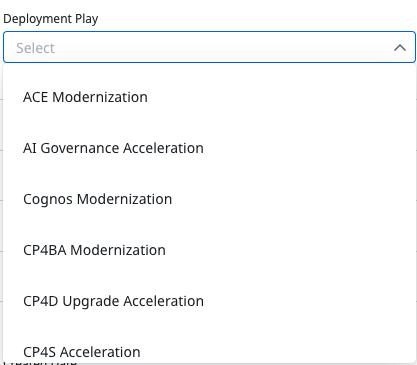

import {Link} from 'gatsby';
import FileLink from '../../components/FileLink';

<Row>

<Column colMd={9} colLg={9}>

For each deployment project, you will need to define the use case. A use case describes how a solution helps a user accomplish a particular goal to receive business value. For example, the project's use case could be to provide a retail store’s tax analyst with a data analytics platform to help gather, analyze, and visualize holiday sales data.

The first step is to determine your starting point. Does your customer have a well-defined use case or not? The answer determines where you go next.

</Column>

</Row>

<Row>

<Column colMd={3} colLg={4}>

</Column>

<Column colMd={6} colLg={6}>

  

### Identify and align on a use case.

</Column>

</Row>

-----------

<AnchorLinks small>
<AnchorLink>You have a prioritized use case</AnchorLink>
<AnchorLink>My customer is ready to move to the cloud</AnchorLink>
<AnchorLink>Overcome objections to Red Hat OpenShift adoption</AnchorLink>
<AnchorLink>My customer needs to move to a Cloud Pak from a point product or upgrade product version</AnchorLink>
<AnchorLink>There is no use case identified</AnchorLink>
<AnchorLink>Journey maps</AnchorLink>
<AnchorLink>Collaborate with the CE team</AnchorLink>
<AnchorLink>Document the Success Plan</AnchorLink>
</AnchorLinks>

------------

<Row>

<Column colMd={9} colLg={9}>

## You have a prioritized use case

You should check with the IBM Account Team to determine if a use case was identified during the pre-sales stage. A use case might have also been defined during the Account Planning process.

If the use case is already defined, take note of as many details as possible as you will need to document this in Gainsight. If you have any questions or gaps in knowledge about the use case, you can always ask clarifying questions to the client. You will learn more about the business value and technical environment throughout the deployment stages. 

Create the <Link to='/onboard/gainsite-create-growth-plan'>Growth Plan in Gainsight</Link> at any time during the deployment lifecycle, but most growth plans are created when a use case is first identified. Estimate the sizing as soon as you have enough information about the use case, then continue to refine it as the deployment progresses. 

</Column>

<Column colMd={3} colLg={3}>

  

<Aside>

**Licensing and sizing**

<Link to='/intro/licensing-sizing'>Find resources and configuartion tool</Link> 

</Aside>

</Column>
</Row>

<Row>
<Column colMd={9} colLg={9}>

## My customer is ready to move to the cloud

If you have met with your customer’s sponsor and determined that they have a well-defined use case that requires them to move to IBM Cloud to modernize an existing application or create a new one, help them to get started using the IBM Cloud. After you understand their use case and environment, install and configure their cloud. If they are using offering features that they are unfamiliar with, demo the features they can use in their solution. Regularly keep in touch to assist with Support, renewal, and expansion.

</Column>

</Row>

<Row>
<Column colMd={9} colLg={9}>

## Overcome objections to Red Hat OpenShift adoption

There are several scenarios where the customer has determined that they need to move to the cloud, but are not convinced that Red Hat OpenShift is the right solution for them. There are <Link to='/common/redhat/objections' target='_blank' rel='noreferrer noopener'>videos and decks created by the Red Hat team </Link> to help you handle and overcome objections to customer adoption of Red Hat OpenShift.
These scenarios are where the customer:

- Has decided to use xKS and doesn't understand the additional benefits OpenShift provides.
- Is currently using or considering VMWare Tanzu and does not understand the value of Openshift.

</Column>
</Row>

<Row>
<Column colMd={9} colLg={9}>

## My customer needs to move to a Cloud Pak from a point product or upgrade the product version

If you have met with your customer’s sponsor and determined that they have a well-defined use case that requires upgrading to a new version of a product or that requires moving to an IBM Cloud Pak, they might simply want your help installing their offering on the platform of their choice.  After you understand their use case and environment, help them install and configure their offering. If they are using offering features that they are unfamiliar with, demo the features they can use in their solution. Regularly keep in touch to assist with Support, renewal, and expansion.

</Column>
</Row>

<Row>

<Column colMd={8} colLg={8}>

### Point products to Cloud Pak guidance

Clients have invested millions into their infrastructure to build the most robust application platform. To protect that investment, they now need IBM's help to modernize their estate. When the client has the desire to understand the benefits and ROI of migrating traditional, tiered, enterprise applications to containers, the IBM team can help our clients identify suitable candidates for container deployment. On the other hand, not all applications are meant for containers. We can also evaluate the readiness of existing applications. Proper preparation, accurate estimates, deep expertise, and a modernization plan are the best insurance for a successful modernization.

</Column>

<Column colMd={3} colLg={4}>

  

<Aside>

**Cloud Pak modernization**

<FileLink to='/onboard/cloudpak-modernization-guide' target='_blank' rel='noreferrer noopener'>Cloud Pak modernization</FileLink> 

<a href='https://pages.github.ibm.com/csm-playbook/playbook/asset-modernization/' target='_blank' rel='noreferrer noopener'>Cloud Pak modernization guidance interactive tool</a>

</Aside>

</Column>
</Row>

<Row>
<Column colMd={9} colLg={9}>

## There is no use case identified

There are multiple reasons why an entitlement may not have a pre-defined use case. It might have been sold as a result of a financial deal such as an Enterprise License Agreement (ELA). The client might not even know they are entitled to the particular product. When this happens, it is up to you to sell the customer the value of a product that they have already purchased.

You will need to ultimately arrive at a set of well-defined use cases. Your very first step is to study the use cases that are available for your product either in the product pages of this playbook or in your product area’s CSM community.

The customer use case defines what they want to accomplish. The business outcome defines the business value they will get from the solution. You will likely need to use the Business Outcome Framework to clarify the value of a solution. The next step is to help them gain a deeper understanding of the technology needed to reach their goals.

If your customer primarily interacts with IBM through their Partner, be sure to integrate the partner throughout these activities.

There are several assets available to help you discover a use case.

| Asset | Description | Links |
| --- | --- | --- |
| Use Case Discovery |  | <Link to="/use-case-discovery/" target='_blank' rel='noreferrer noopener'>Hold a use case discovery session to find the right opportunity</Link> |
| Business Outcomes Framework |  | <Link to='/onboard/business-outcomes-framework' target='_blank' rel='noreferrer noopener'>Define the business value of the solution</Link> |

</Column>

</Row>

<Row>

<Column colMd={9} colLg={9}>

## Journey maps

Use the <Link to='/common/modernization/overview'>Modernization journey maps</Link> for a software offering that provides you with a framework and set of assets to help identify opportunities, gain sponsorship, and ultimately drive a software deployment. These journeys were co-created by product management, Technology Expert Labs (TEL), Client Engineering, and Customer Success.

Use the <Link to='/common/acceleration-plays/overview'>Acceleration plays</Link> for the path to prospect and deploy a new product.

</Column>
</Row>

<Row>

<Column colMd={9} colLg={9}>

## Collaborate with the CE team

To help with use case identification and business opportunity selection, bring in resources from the IBM Client Engineering team. Collaboration between the Client Engineering team and IBM Customer Success is essential to jumpstart idle entitlements.

### What does collaboration look like?

You as a CSM, function as a "bookend" for an engagement with the Client Engineering team. CSMs are assigned to customers with Cloud Pak and AI Apps growth offering entitlements. As CSMs find the sponsors for the entitlements, they should bring in the Client Engineering team to conduct use case discovery and complete design and development. The PoX needs to scale to production. This is where the CSM "catches" the PoX and ensures that there is a services delivery team or partner to take the workload to production. The first bookend is that initial engagement with the customer to find the sponsor and need. The chapters are the Use Case Discovery and PoX. The second bookend is scaling to production.

You, as the CSM, are expected to participate in or lead the Use Case Discovery session and design/deployment with the Client Engineering team to ensure that your customer has a working PoX with a destination at the end of the engagement. You must understand how the use case will help the customer achieve their business outcomes because once the engagement is over, you are accountable and responsible for production deployment and growing that entitlement. It's about lifetime value and getting 100% capacity of the entitlement to be consumed.

</Column>
</Row>

<Row>

<Column colMd={9} colLg={9}>

## Document the Success Plan

After determining the use case, you need to document your plan to deploy the prioritized solution.

In Gainsight, there are several types of Success Plans that you can use to document the customer landscape, your objectives, and the steps to execute so that your manager, executives, and peers can read the plan and understand the status.

Use different success plan types to communicate your objectives for a use case, or describe the risk or churn. When deciding which type of success plan to create, ask yourself: what are the next best actions to take with my customer and how do I document it? 

You do not need to create a Success Plan for a relationship if you know the customer has no plans for that Relationship. If you find out that the customer will never use the entitlement and will not renew it, you should create a Retention Plan to try to mitigate the risk of losing that projected revenue.  You should be working between one to three growth plans with the client at any given time.

| Purpose of the success plan | Type of Success Plan | Learn more |
| --- | --- | --- |
| Help your customer move forward. The action plan for client adoption, growth, or expansion with key dates for the client to realize the outcome. | Growth Plan | <Link to='/onboard/gainsight-create-growth-plan' target='_blank' rel='noreferrer noopener'>Drive deployments through a Growth Plan in Gainsight</Link> |
| Provides details on a risk that can result in reduced revenue or churn, and provides actions to mitigate the risk. | Retention Plan | <Link to='/expand-renew/what-is-retention-plan' target='_blank' rel='noreferrer noopener'>Create a Retention Plan in Gainsight</Link> |
| Explains revenue loss. Provides details on why the client is leaving IBM. Should always follow a Retention Plan.| Defection Report | <Link to='/expand-renew/create-defection-plan' target='_blank' rel='noreferrer noopener'>Create a Defection Report in Gainsight when your customer is going to churn</Link> |
| Currently for SSW only until other deployments reach maturity.  Enables CSMs to capture their activity after a Deployment before the customer is ready for another use case. | Nurture Plan | <Link to='/onboard/gainsight-nurture-plan/'>Create a Nurture Plan in Gainsight</Link> |

  <ExpressiveList
    title="Effective Success Plan best practices"
    titleType="expressive-02"
    background="true">

**Choose a descriptive name** that is tied to the business value of the use case. 
**Select an accurate due date** and keep this date updated as the plan proceeds. 
**Keep your project status accurate**.  In many reports, only Active plans are visible. 
**Be detailed in the "free text field"** (use case, client situation, why weren't we successful), be as descriptive as possible. You want someone reading this field to understand the full situation. 
**Review your plan** with your manager and peers to get feedback and continually improve. 
**Keep the plan up to date.** Use Timeline to record important activity. Update Objectives, add new ones as needed, and close ones that have been completed. 
**Complete the Outcome and Results fields** after you close the plan, to record what happened, why and any lessons learned. 
**Ensure the current objective is clear.** 
        &nbsp;&nbsp;Growth plan: What is the measurable outcome or value? 
        &nbsp;&nbsp;Retention / Defection:  What is causing the risk or churn? 
**Leverage** the best of IBM to accelerate outcomes. 
**Include concrete actions** with target dates 
**Describe the actions being taken** - by when and by whom - to achieve the desired outcome 
**Deployment Play.** If the growth plan is tied to a <Link to='/common/modernization/overview' target='_blank' rel='noreferrer noopener'>Modernization journey</Link> or <Link to='/common/acceleration-plays/overview'>Acceleration play</Link>, select the appropriate play from the "Deployment Play" drop-down list in the Details section of the Success Plan. This will enable leadership to track the effectiveness of these plays. In addition, there are also new templates available (and still being added) that you can add to success plans that are associated with the deployment plays.

</ExpressiveList>

### When to select a Growth Plan vs a Nurture Plan

- If the customer does not have documented deployments, a growth plan is appropriate, as a Deployment should be recorded before a Nurture Plan is created.
- If the customer is not using their full entitlement or is there still some left to deploy, then select growth plan.  
- If the entitlement is fully used and the customer is not ready to expand usage further just yet, a Nurture Plan might be appropriate.
Remember that you can create a Growth Plan to hold your ideas for growth and create a Nurture Plan to keep track of your work with the client until they're ready to tackle a new deployment.

See <Link to='/onboard/gainsight-create-growth-plan/'>Create a Growth Plan</Link> for more information.

### When to use Comments vs Timeline

In the upper right corner of a Success Plan is a "Comments" button.  This allows people to make comments and @ tag people in them, much like the comments in a Timeline.  However, the benefit of using Timeline to comment on plans is that Timeline will be visible throughout Gainsight, while Comments are only visible on that specific success plan.  The use of Timeline is recommended.

### Lifecycle of a Success Plan

**Draft:** Identify and refine the plan with the client and extended teams. 
**Active:** Work on a well-refined and interlocked plan of attack. 
**Closed:** You are done with this use case project and will move to the next one, or you have stopped work. Update the Plan Closure Info section with plan results and next steps.

**Note:** It is okay if a plan does not reach completion. If the idea does not work out, close the plan and create a Timeline entry to explain what happened.

### Delete a Success Plan

**Don't!** Do not delete a success plan. It can cause broken links and confusion.  Instead, close the plan and set the appropriate status, listed below, with a Timeline explanation to retain history and provide an audit trail.  

**Growth plan:** Project stage = No plans to Deploy 
**Retention plan:**  Retention Plan Outcome = Created in Error - Canceled 
**Defection report:**  There is no good field to indicate an error so it may be acceptable to delete the plan. 
**Nurture plan:** Nurture Plan Outcome = Cancelled - Created in Error 

The only time you might want to delete a success plan is if it truly was created in error.  Examples: Created on the wrong relationship, or the wrong type of plan was created, or there truly was no reason to create a plan in the first place.  It is not easy to recover a deleted plan and in many cases, is not even possible.  Deleting a plan requires a two-step process:  Select "Delete" (in red) and click Yes to validate the deletion.

### Error when navigating to a Success Plan

If clicking on the Success Plan link, or putting a copied URL into the browser results in an error, it's likely that the Success Plan was deleted.  They are very hard to recover if they can even be recovered.  

</Column>

<Column colMd={3} colLg={4}>

  

<Aside>

**Success Plans and Partners**

<Link to='/onboard/csm-partner-ecosystem#working-with-partners-in-gainsight'>Working with Partner Success Plans</Link>

</Aside>

</Column>

</Row>
