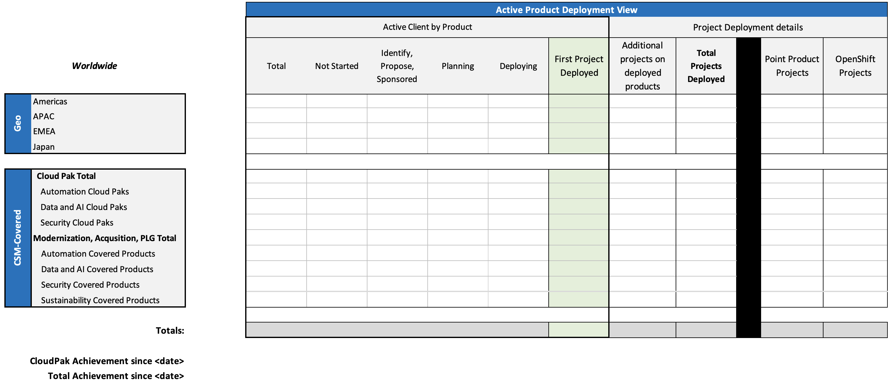
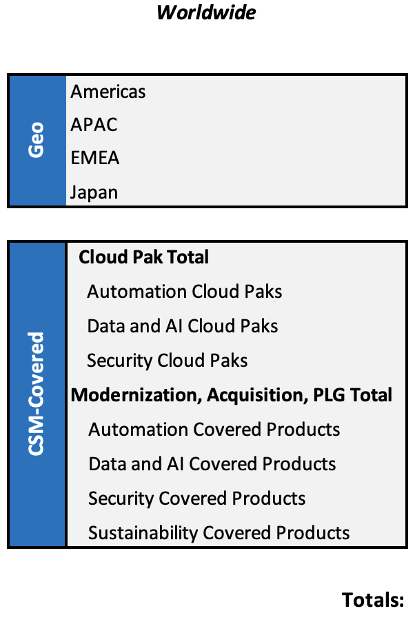
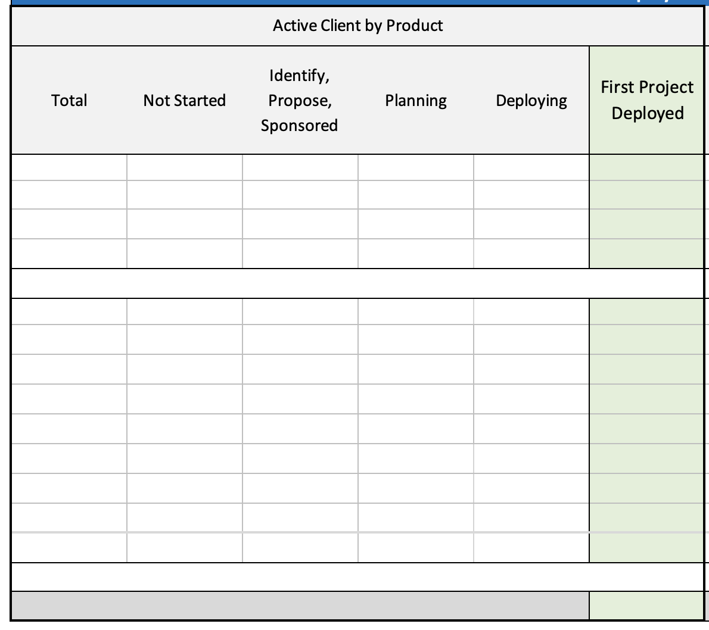
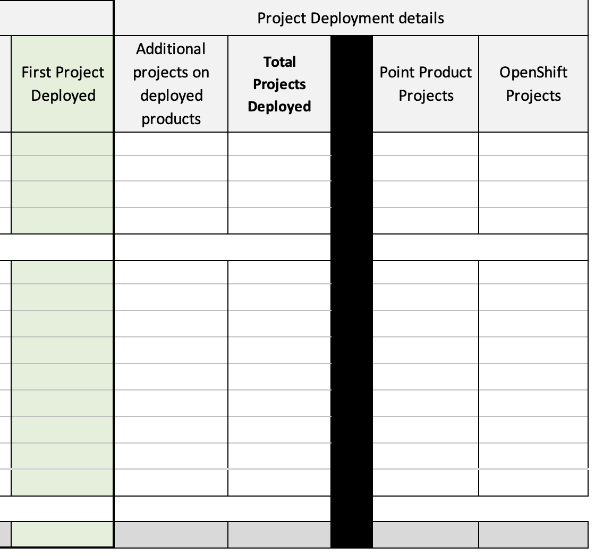
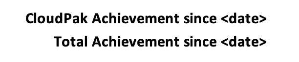

import {Link} from 'gatsby'

<Row>

<Column colMd={3} colLg={4}>

</Column>

<Column colMd={6} colLg={6}>
 

### Are you protecting and growing revenue?

</Column>

</Row>

--------

<AnchorLinks small>
  <AnchorLink>Key success metrics</AnchorLink>
  <AnchorLink>Net Revenue Retention (NRR)</AnchorLink>
  <AnchorLink>SaaS and Subscription License renewal rate</AnchorLink>
  <AnchorLink>Deployment scorecard</AnchorLink>
  <AnchorLink>How to read the scorecard</AnchorLink>
  <AnchorLink>Data and AI, IBM Cloud, and the CS Deployment Scorecard</AnchorLink>
  <AnchorLink>Milestones in Gainsight</AnchorLink>
</AnchorLinks>

---------

<Row>

<Column colMd={9} colLg={9}>

## Key success metrics

For our customers, innovation at speed and scale is critical to their success. They need to see that they are achieving outcomes from their investment and reducing their time to market.

For CS, the goal is to:
* Deploy prioritized products
* See adoption of Red Hat OpenShift
* Deploy ELAs in the Diamond program
* Retain and expand customer use of IBM products

## Net Revenue Retention (NRR)

Net Revenue Retention (NRR) is a key financial metric for Customer Success. It reflects the health of our existing customer base. It measures the revenue retained and revenue expanded from the install base over a period of time. An NRR of 100% means that customers we had 12 months ago are generating the same recurring revenue today as they did a year ago.  A healthy business has an NRR over 100%. To accomplish an NRR over 100%, you need to expand revenue faster than revenue churned.

Renewals allow IBM to maintain a recurring revenue stream and ensure IBM customers are properly entitled to use our software portfolio.

The following KPIs are critical to monitor the success of CS:

Total ELA Deployment Revenue, Total Software Deployment, OpenShift Deployment, SaaS Growth, Cloud Usage, Cloud NRR.

 The NRR target should be over 100% to signal revenue expansion is greater than declining revenue. 

  <ExpressiveList
    title="How to calculate NRR"
    titleType="expressive-02"
    background="true">
Net Revenue Retention is typically measured in 12 months based on revenue.  The simple calculation is:  

**Current recurring revenue (either S&S or Subscription)  /  Recurring revenue from the starting period**
 
For example:

Today a customer is spending $120 (current recurring revenue) / $100 is the amount the customer was spending on software 12 months ago - the NRR would be 120%. 

Similarly, if a customer is currently spending $80 / $100 is the amount the customer was spending on software 12 months ago - the NRR would be 80%

Finally, if a customer was spending $0 12 months ago, they would not have an NRR.  They are considered a new customer.   

</ExpressiveList>

## SaaS and Subscription License renewal rate

A key moment in the client journey, validating the work we have done driving deployment, is the renewal of their contract. Measuring the renewal rate for SaaS and Subscription licenses shows the financial impact of that work as the client continues to generate revenue for IBM with that product.

## Key deployment metrics

**Software Project Deployments:**

Success is our customers getting their use cases deployed into production, backed by the CSM-covered products they have purchased from IBM.

**Red Hat OpenShift Deployments:**

Red Hat OpenShift is the cornerstone of the IBM Hybrid Cloud and AI strategy. Solutions deployed on Red Hat OpenShift advance our customers' modernization objectives.

**Diamond ELA Deployment:**

Deployment of an ELA is a key indicator of customer satisfaction and customer value derived from IBM Software. Increased deployment often results in earlier and larger renewals and a barrier to competition

## Deployment scorecard

In Customer Success, the Deployment Scorecard tracks client progression deploying our <a href='https://w3.ibm.com/w3publisher/customersuccess/the-practice/csm-covered-offerings' target='_blank' rel='noreferrer noopener'>CS-covered products</a>.  The scorecard is aligned with how CS financially tracks Net Revenue Retention (NRR) so that a client is only represented in the scorecard if there is product annuity revenue to protect and grow.

</Column>
</Row>

<Row>

<Column colMd={7} colLg={7}>

## How to read the scorecard

The rows of the scorecard are grouped in two ways - by geography and product.

**Geography** shows the total number of active clients by product across all products.

**CS-covered product groups**
* Cloud Pak - represents both Cloud Paks and Cartridges as defined by finance in our financial reporting. 
* Modernization, Acquisition, PLG - represents the other products prioritized for coverage with Customer Success due to the key strategic nature of the offering. 

You can drill into Markets, Countries, Regions, and individual products in the scorecard.

Note:  Please see <Link to='/deploy/measure-success#data-and-ai-ibm-cloud-and-the-cs-deployment-scorecard'>below</Link> for more details related to services on IBM Cloud.

</Column>

<Column colMd={5} colLg={5}>

  

</Column>
</Row>

<Row>

<Column colMd={6} colLg={6}>

### Active client by product

The main portion of the scorecard is set up based on Active Client by Product. 

An Active Client by Product is defined as a client (Domestic Buying Group + Country) who has purchased a particular product (UT30) and has active annuity revenue.  The number of unique client/product purchases is the value you will see in the total.  

For each value in the total, the most advanced status as the client progresses their deployment is shown.  Starting at Not Started and progressing through the client having deployed their first project. 

</Column>

<Column colMd={6} colLg={6}>

</Column>
</Row>

<Row>

<Column colMd={6} colLg={6}>

### Project details

After the client has had their first success with the product they have deployed, the scorecard shows the number of additional projects that the client has deployed for that product.  For example, the client has started with data governance with Cloud Pak for Data (the first project) and then starts a data science project with a different team as they take advantage of more capabilities on the platform (additional project).   An Active Client by Product will only ever have 1 "first" project deployed, but as they add more projects, they can have many "additional" projects deployed. 

The other element in the project deployment details is the classification of how many of the total projects are leveraging Point Products within their entitlement, and how many have modernized and are running on top of Red Hat OpenShift.  The Customer Success mission is to continue to land more and more clients on OpenShift and drive that number up as CS helps them modernize.

</Column>

<Column colMd={6} colLg={6}>

</Column>
</Row>

<Row>

<Column colMd={7} colLg={7}>

### Achievement by date

Finally, at the bottom of the scorecard the achievement in deployment since a certain date is shown.  While  Cloud Pak deployment remains a critical measure, you will see that in the top line, followed by the total achievement across all CS-covered products.  

This Achievement is a net attainment:
* As clients progress their deployment or new clients purchase a product, a +1 will count for that milestone.
* If we see clients churn, a -1 will count against that milestone.

</Column>

<Column colMd={5} colLg={5}>

</Column>
</Row>

<Row>

<Column colMd={9} colLg={9}>

## Data and AI, IBM Cloud, and the CS Deployment Scorecard

A number of the Data and AI offerings are delivered from a go-to-market perspective in the IBM Cloud Catalog.  Key examples include watsonx.ai, watsons.data, Watson Assistant and the individual services that make up Cloud Pak for Data as a service.  This method of how we go to market is important because it results in some different dynamics: 

* Regardless of the subscription clients purchase, what they are purchasing is a set of credits to spend on IBM Cloud.  They can use those credits for anything within the IBM Cloud Catalog. As a result, the "purchase" and the "using" are two different motions and not directly connected.
* Revenue is recognized on a consumption basis - meaning that the only way IBM gets revenue is to drive more usage of service.  This also means that there is no one UT30 for the services available on IBM Cloud, and there is no one UT30 for Cloud Pak for Data as a Service. 

</Column>
</Row>

<!--

Due to these differences, continue reading to understand what triggers a deployment for the services on IBM Cloud - all based on usage.  

</Column>
</Row>

| Product: | Watson Assistant or watsonx Assistant |
| --- | --- |
| Scorecard Section | Modernization, Acquisition, PLG section |
| Scorecard Name | CP4D Cartridge Watson Assistant" due to the shared UT30 with the Cloud Pak - even though the SaaS offering is not a Cloud Pak |
| Services that count | Conversation |
| Milestones | Usage based |
| Requires Subscription? | Yes, customer must have purchased **Watson** Subscription Bundle |

| Product: | Cloud Pak for Data as a Service |
| --- | --- |
| Scorecard Section | Cloud Pak Section |
| Scorecard Name | Cloud Pak for Data |
| Services that count | Data Virtualization, Watson Knowledge Catalog |
| Milestones | Usage based, usage metrics to note Deployed are in the process of being finalized between our practice leaders and product management for these two services |
| Requires Subscription? | Yes, customer must have purchased **Cloud Pak for Data** subscription bundle |

| Product: | watsonx.ai |
| --- | --- |
| Scorecard Section | Modernization, Acquisition, PLG section |
| Scorecard Name | watsonx.ai |
| Services that count | watsonx.ai (Watson Studio does not count) |
| Milestones | Usage based, usage metrics to note Deployed are in the process of being finalized between our practice leaders and product management for this service |
| Requires Subscription? | Yes, customer must have purchased **IBM watsonx As A Service** subscription bundle |

| Product: | watsonx.data |
| --- | --- |
| Scorecard Section | Modernization, Acquisition, PLG section |
| Scorecard Name | watsonx.data |
| Services that count | watsonx.data |
| Milestones | Usage based, usage metrics to note Deployed are in the process of being finalized between our practice leaders and product management for this service |
| Requires Subscription? | Yes, customer must have purchased **IBM watsonx As A Service** subscription bundle |

| Product: | IBM watsonx Code Assistant |
| --- | --- |
| Scorecard Section | Modernization, Acquisition, PLG section |
| Scorecard Name | IBM watsonx Code Assistant |
| Services that count | IBM watsonx Code Assistant |
| Milestones | Usage based, usage metrics to note Deployed are in the process of being finalized between our practice leaders and product management for this service |
| Requires Subscription? | Yes, customer must have purchased **IBM watsonx Code Assistant** subscription bundle |

-->

<Row>

<Column colMd={9} colLg={9}>

## Milestones in Gainsight

<Link to='/onboard/gainsight-milestones'>Milestones</Link>  are used to track the customer’s deployment journey with IBM and represent the most advanced use case deployment status.

Customer Success uses growth plans in Gainsight to document the progression of each use case to share across the business.  In ISC, the Deployment is used to track use case deployments.  Both growth plans and Deployments progress through the <Link to='/deploy/document-the-plan'>Deployment stages</Link>, which directly correlate to Milestones.

Milestones are used for all offerings except IBM Cloud. For IBM Cloud, monthly usage is a better representation of customer adoption. 

</Column>
</Row>
