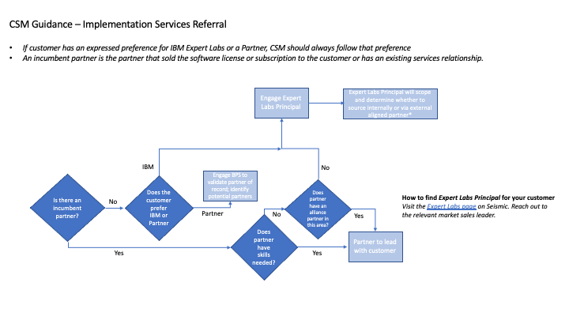

import {Link} from 'gatsby'
import FileLink from '../../components/FileLink';

<Row>

<Column colMd={9} colLg={9}>

In this stage, the customer is in the process of planning the actual deployment of the project. All projects in this stage should have a target installation date and you might be able to forecast a go-live date as well.

</Column>

</Row>

<Row>

<Column colMd={3} colLg={4}>

</Column>

<Column colMd={6} colLg={6}>

  

### Plan the deployment of the project.

</Column>

</Row>

-----------

<AnchorLinks small>
<AnchorLink>Validate the use case</AnchorLink>
<AnchorLink>Create the architecture </AnchorLink>
<AnchorLink>Identify the resources needed to deliver </AnchorLink>
<AnchorLink>Identify the delivery milestones </AnchorLink>
<AnchorLink>Plan to hold regular meetings </AnchorLink>
<AnchorLink>Use Client Flash to update executives </AnchorLink>
<AnchorLink>Build an integrated learning plan </AnchorLink>
<AnchorLink>Scale out the workload </AnchorLink>
</AnchorLinks>

-----------

<Row>

<Column colMd={9} colLg={9}>

## Validate the use case

Through the Identify and Propose phases, there is an initial perspective on the return on investment, architecture, and what is required to move the use case into production. Confirm that the initial perspective is still valid.

### Guide development using a set of practices and principles that align with your customer's strategy

</Column>
</Row>

<Row>

<Column colMd={6} colLg={6}>

 

As a CSM, you are not expected to architect a solution, but you are expected to participate in the development of the solution architecture. Architects work with the squad to architect the application, platform, and operational environment.

Collaborate with your customer on a minimum viable architecture.

* Leverage the IBM Cloud Architecture Center for proven patterns.
* Document other technology dependencies for the workload.

For complex environments, consider if you should recommend a paid Expert Lab Architecture Workshop. Refer to the assets page for your product for architecture-specific links.

</Column>

<Column colMd={3} colLg={4}>

  

<Aside>

**Did Client Engineering (CE) do a PoX?**

<a href refid='https://pages.github.ibm.com/skol/hypersonic-landing-page-squidfunk/' target='_blank' rel='noreferrer noopener'>IBM Technology Sales Technology Patterns</a>

</Aside>

<Aside>

**Design Red Hat® OpenShift® and IBM Cloud Pak® solutions based on the real-life experience of solution architects around the world.**

<a href='https://www.ibm.com/cloud/architecture/articles/ibmaot-redhat-openshift/red-hat-openshift-solution-design-guidance' target='_blank' rel='noreferrer noopener'>See the AoT solutions</a>

</Aside>

</Column>

</Row>

<Row>

<Column colMd={8} colLg={8}>

### Learn about architecting a solution

Watch the video and review the deck from Fast Start 2021 to learn about how you should talk to your customer about architecture.

</Column>

</Row>

<Row>

<Column colMd={4} colLg={4}>

<iframe width='100%' src='https://video.ibm.com/embed/recorded/129473143?autoplay=0&html5ui=1&showtitle=false&playsinline=1&site-embed=1'/>

</Column>

<Column colMd={4} colLg={4}>

<FileLink to='/files/csm-fast-start-architect-101.pdf'>Fast start 101</FileLink>

</Column>

</Row>

<Row>

<Column colMd={8} colLg={8}>

### Bring your use case to life through the architecture

Watch the video and review the deck from Fast Start 2021 to learn about how you can bring your customer's use case to life through the architecture.

</Column>

</Row>

<Row>

<Column colMd={4} colLg={4}>

<iframe width='100%' src='https://video.ibm.com/embed/recorded/129473253?autoplay=0&html5ui=1&showtitle=false&playsinline=1&site-embed=1'/>

</Column>

<Column colMd={4} colLg={4}>

<FileLink to='/files/csm-fast-start-bring-your-use-case-to-life.pdf'>Bring your use case to life</FileLink>

</Column>

</Row>

<Row>

<Column colMd={9} colLg={9}>

## Create the architecture
 Technology Expert Labs, when architecting solutions that are first of a kind (FOAK), include combinations of products and offerings that have never been combined before, or include components of multiple growth offerings.

### Review the architecture with the CSM Practice Leaders

CSMs can request an architectural review to assess proposed production-ready solutions that use Cloud Paks before implementation or for troubled deployment projects.

If you have created an architecture for your solution or have a troubled deployment project, have it reviewed by the <a href='https://w3.ibm.com/w3publisher/customersuccess/community-connections/community-connections' target='_blank' rel='noreferrer noopener'>CSM Practice Leaders</a>. As the CSM who is working on the architecture, start the review process by opening a github issue in the <a href="https://github.ibm.com/customer-success-management/architecture-review" target='_blank' rel='noreferrer noopener'>customer-success-management/architecture-review repository</a>. This review can take place whether you created the architecture yourself or with the assistance of other IBM teams.

You might need to conduct a larger SME review meeting for a complex architecture.

</Column>

</Row>

<Row>

<Column colMd={9} colLg={9}>

###  Learn

| Resource | Learn more |
| --- | --- |
| Review the reference architectures and resources | <a href="https://www.ibm.com/architectures/hybrid?mhsrc=ibmsearch_a&mhq=architecture" target='_blank' rel='noreferrer noopener'>IBM Hybrid Cloud Architecture Center</a> |

</Column>

</Row>

<Row>

<Column colMd={9} colLg={9}>

## Identify the resources needed to deliver

As you work through the deployment plan, identify the resources needed for successful delivery and ensure they are available.

If you identify gaps in resources, consider introducing your customer to an implementation partner like Technology Expert Labs, IBM Consulting, or another team from the broader IBM ecosystem. Be sure to check whether the customer already has a relationship with a technology partner (i.e., an incumbent partner). See the section, <Link to="/onboard/csm-partner-ecosystem" target='_blank' rel='noreferrer noopener'>Working with IBM Partners</Link> or you might need to find a specific <a href="https://w3.ibm.com/w3publisher/cloud-and-cognitive-expert-labs" target='_blank' rel='noreferrer noopener'>Technology Expert Labs offering</a>.

Use the decision tree to help you decide whether to engage a partner or Technology Expert Labs to help your customer.

### Implementation Services Referral

* If your customer has expressed a preference for IBM Technology Expert Labs or a Partner, you should follow that preference.
* An incumbent partner is the partner that sold the software license or subscription to the customer or has an existing services relationship.

### How to find the Technology Expert Labs Principal for your customer

Visit the <a href="https://ibm.seismic.com/app?ContentId=d8215a40-35c2-4daf-8c17-940148b54eb5#/doccenter/f6bc8873-d580-4ee8-a903-c4e0d3a7eee9/doc/%252Fdd85c941b1-5f54-2314-ce72-b98c4c0974c2%252FdfOTRiYmU4NTQtNWY4NC03Y2QyLWZjYWUtOGIxYmFmZjkyZThk%252CPT0%253D%252CU2VsbGVyIGVuYWJsZW1lbnQ%253D%252Flf2c7b524b-935a-48e3-ac8c-d1caf3228219/grid/?anchorId=2825498f-cca0-4348-bc23-3505ba832b45" target='_blank' rel='noreferrer noopener'>Technology Expert Labs page on Seismic</a>. Reach out to the relevant market sales leader.

### How to find the Brand Partner Specialist (BPS) for your customer

1. Use ISC to find the Account associated with your customer.
2. Use Seller Search to locate the BPS for the applicable product area.

If no results are found, contact Jane Bossert (jbossert@us.ibm.com) or Ann Schiefer (ann_schiefer@us.ibm.com) for assistance.

</Column>

</Row>

<Row>

<Column colMd={9} colLg={9}>

## Identify the delivery milestones

Knowing the delivery milestones identified by your customer allows you to recognize if the project is on or off track. The milestones vary based on the product, the use case, and the dynamics at the customer. As a CSM, you should review against typical deployments to identify:

* Milestones not considered by the customer
* Unrealistic timeframes

During milestone delivery, stay tightly connected to the customer's progress. Listen for issues so you can resolve them before they become critical situations by managing customer expectations. When necessary, work with the broader IBM ecosystem to teach your customer to escalate a support ticket. When your customer identifies missing product capabilities, raise the issue with product management to collaborate on a path forward.

Note: When working with a business partner through delivery, consider that they may already have delivery milestones in place as part of their contract. Any modifications to the milestones should be discussed and agreed among all stakeholders.

</Column>

</Row>

<Row>

<Column colMd={9} colLg={9}>

## Plan to hold regular meetings

You need to plan to hold regular checkpoint meetings with the team who is implementing the solution as well as with the exeutives to ensure alignment with the customer's goals. Hold quarterly <Link to='/onboard/executive-business-review' target='_blank' rel='noreferrer noopener'>Executive Business Reviews (EBRs)</Link> with the customer executives to ensure alignement on the current deployment and to discover future opportunities.

## Use Timeline in Gainsight to update and track your activities

Use <Link to='/onboard/gainsight-timeline' target='_blank' rel='noreferrer noopener'>Timeline</Link> to log information about your own activity and customer interactions in a way that enables you to gather insights and drive action. Timeline is accessible from almost anywhere in Gainsight; a best practice is to add a Timeline entry from the entity you’re working on.

## Use Client Flash to update executives

Use <Link to="/onboard/gainsight-client-flash" target='_blank' rel='noreferrer noopener'>Client Flash</Link> in Timeline to provide executives the current state of an entitlement for an account. Every two weeks you should provide a 1-2 sentence headline describing the current state, next steps, and any reasons for a loss (if applicable).

</Column>
</Row>

<Row>

<Column colMd={9} colLg={9}>

## Build an integrated learning plan

Consider what additional education your customer might need.  This could take many forms:

* Training for new resources for scaling the workload
* Paid training offered by IBM

</Column>
</Row>

<Row>

<Column colMd={9} colLg={9}>

## Scale out the workload

Support your customer through the production deployment by listening for roadblocks and sharing expertise to achieve the optimal outcome while you continue to work on a "what's next" plan.

Do not work in a customer's <Link to="/deploy/install-provision#production-environment-guidance">production environment</Link>.

There are common objectives shared by all customers; however, it is important to tailor this phase to your customer's expectations.

</Column>

</Row>
