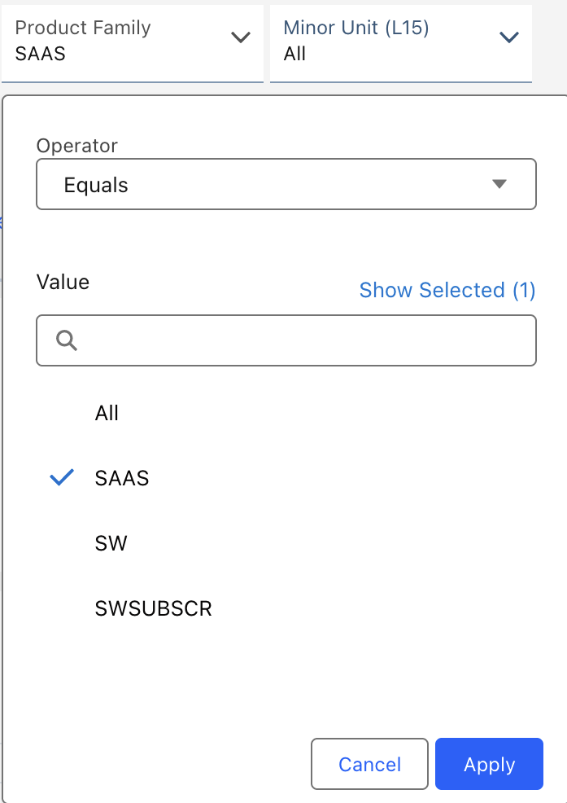
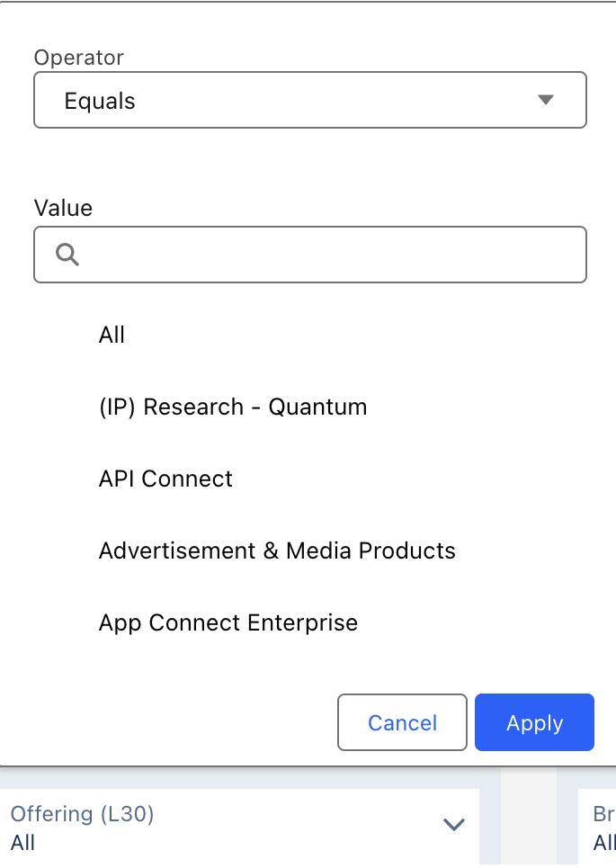
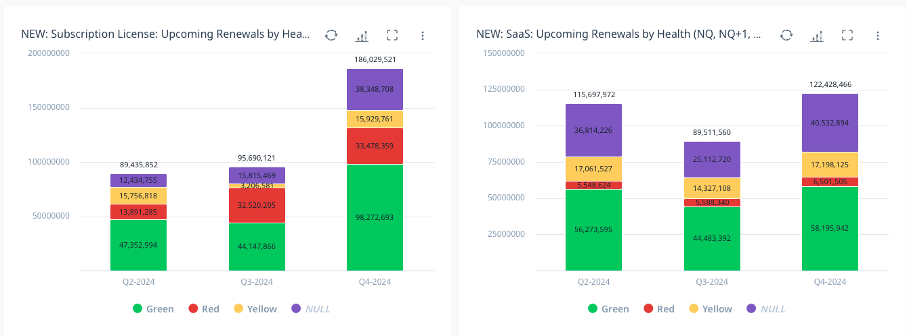

import {Link} from 'gatsby'

<AnchorLinks small>
  <AnchorLink>What is the role of a CSM in the renewal process?</AnchorLink>
  <AnchorLink>What is the role of a Subscription and Annuity rep?</AnchorLink>
  <AnchorLink>Best practices for collaborating between CSM and the renewal team</AnchorLink>
</AnchorLinks>

<Row>

<Column colMd={3} colLg={4}>

</Column>

<Column colMd={6} colLg={6}>

### It costs 5X more to attract a new customer than to keep an existing one.

</Column>

</Row>

<Row>

<Column colMd={9} colLg={9}>

## Renewals are key to growth

* Understand your role in the renewal.
* Monitor the upcoming renewals for your client in your Gainsight dashboard.
    * For renewals coming in the next 3-4 months, engage your renewal counterpart and talk through the strategy to retain and GROW the client.
    * For renewals further out, engage the client and ensure they are deploying and getting value from the product.  Start to lay the foundation for potential expansion paths.
* Use the product playbook pages for insights on how to drive adoption and paths to grow the client.  Consider opportunities to expand to new features, new departments, or even to more product tiers.
* Use the Annuity Dashboard in ISC to view upcoming renewals.

</Column>
</Row>

<Row>

<Column colMd={9} colLg={9}>

## What is the role of a CSM in the renewal process?

Renewals are important for two reasons. The first is to allow IBM to retain recurring revenue. The second is to ensure customers are properly entitled to continue to use IBM software.

Customer success is all about getting the customer's solution deployed. Deployment is the first step.
However, deploying an initial use case does not mean a customer is getting value, using it as a core part of the business, or that they are seeing ROI from their purchase.  The incentive pool is funded (and another aspect of each measurement) based on the renewal and expansion of the revenue from your customer.  The ONLY way to achieve that is to drive additional use cases.

Due to your deep and continuous relationship with the customer, you can play an important role in renewals.  While the renewal team is typically focused on the renewal transaction itself, the CSM has early insight into potential risks, knows what the customer's goals are, and might be able to help set the stage for a successful renewal.

The Gainsight Health Score is available in ISC on the Annuity dashboard on the Renewals at Risk tab.  Be sure your Gainsight data is accurate and paints a clear picture to the S&A rep so they can properly prioritize the opportunities with the greatest risk for renewal.

</Column>

<Column colMd={3} colLg={3}>

  

<Aside>

**CS measurements of success**

<Link to='/deploy/measure-success/#aligning-to-our-kpis'>Align to CS KPIs</Link>

</Aside>

</Column>

</Row>

<Row>

<Column colMd={9} colLg={9}>

### SaaS renewals

Renewals is a key moment where you can have the biggest impact on the SaaS growth metric.  If a client is not using their full capacity, there is the risk of churn, which will cause the revenue stream to go down.

</Column>

<Column colMd={3} colLg={3}>

  

<Aside>

**All CS-covered SaaS products**

<a href='https://w3.ibm.com/w3publisher/customersuccess/the-practice/success-metrics/understanding-saas-growthCS-covered' target='_blank' rel='noreferrer noopener'>CS-covered SaaS products</a>

</Aside>

</Column>
</Row>

<Row>
<Column colMd={3} colLg={3}>
   

Use the filters on the <Link to='https://ibmsc.lightning.force.com/analytics/dashboard/0FK3h000000IqgdGAC'>Annuity Dashboard</Link> in ISC to view SaaS opportunities.

</Column>

<Column colMd={3} colLg={3}>

<Caption>Product Family = SAAS </Caption>

</Column>

<Column colMd={3} colLg={3}>

<Caption>UT30 = the SaaS product list</Caption>

</Column>

</Row>

<Row>

<Column colMd={9} colLg={9}>

## What is the role of a Subscription and Annuity rep?

The S&A rep engages with customers ~120 days in advance of ACV expiration date and drives the renewal process from quoting to closure; manages forecasting and booking of revenue. It is critical for you to <Link to='/intro/access-annuity-info' target='_blank' rel='noreferrer noopener'>access renewal information and collaborate with your Subscription and Annuity Rep</Link>. You should also review the <Link to='/expand-renew/what-is-acv' target='_blank' rel='noreferrer noopener'>ACV</Link>, which is tied to the ongoing revenue stream (S&S) that is at risk for renewal.  
S&S / Annuity: On-premise and Cloud Paks renewals 
Contract Extension Rep (CER): SaaS and MLS renewals

</Column>

</Row>

<Row>
<Column colMd={9} colLg={9}>

## Know what is coming up for renewal

On the Renewal Dashboard, you have two bar charts that show the ACV that is expiring in the next 3 quarters - one for Subscription licenses and one for SaaS.  The charts do not show the current quarter because it is likely too late to change the renewal outcome, but there is still time to change the outcome of the future quarters.

To see current quarter renewals, you can sort on Next Renewal Date on the My Customer List - Health Scores report.

You can get more information about your customer's entitlements on the <Link to='/onboard/gainsight-entitlement/'>Understanding Entitlements</Link> page.

</Column>
</Row>

<Row>

<Column colMd={9} colLg={9}>

## Renewal Health and Retention Plans

As you work with your customer, you should understand any renewal risk far in advance of a renewal taking place. There are early warning indicators you need to look for as signs that a customer might churn.

### How can I identify risk?

You need to create a <Link to='/expand-renew/what-is-retention-plan' target='_blank' rel='noreferrer noopener'>Retention Plan in Gainsight</Link> when you have a relationship that has a red or yellow health score or have identified risk as in the following scenarios:

 * 9 months before a renewal and there is no sponsor or use case identified
 * 6 months before a renewal and the entitlement is not in deploying state
 * A red or yellow <Link to='/health-scores' target='_blank' rel='noreferrer noopener'>Health scores</Link>  in Gainsight
 * Competitive threat appeared (bake-off, competitive POC, re-architecting, etc)

The retention plan conveys the risk and the actions that might reverse it. Otherwise, you can simply do a timeline update using the type "renewal activity" to document key discussion updates.

  <ExpressiveList
    title="Health score"
    titleType="expressive-02"
    background="true">

**A health score of NA/Null:** 
 Why don't these relationships have a health score? Dig into these, figure out what's going on and update your CSM Sentiment to reflect the odds of renewal. 
**Red and yellow health:**  
Red means the customer is not likely to renew 
Yellow means there is a notable risk that they will not renew.

Investigate and determine why these accounts are red or yellow.  Do you agree? If not, adjust your CSM Sentiment to explain why not.

All red and most yellow relationships should have a retention plan that provides insight into what is causing the risk - and more importantly - what steps you are taking to overcome that risk.  If you need help from the broader team, select "Help Needed".  This is to ensure that the risk is understood and that there are actions in place to overcome them.
If there isn't a retention plan - start one!
</ExpressiveList>

</Column>

</Row>

<Row>

<Column colMd={9} colLg={9}>

Know that you are not alone in this. Use the Practice Leaders to pull out all stops to prevent churn and save the customer.

Update the Gainsight renewal sentiment once a month. The CSM Sentiment should reflect the likelihood of contract renewal for that entitlement. The sentiment is reset to gray if the CSM has not updated it in 90 days. Execs look at this every week to understand the renewal status per entitlement.

</Column>

</Row>

<Row>

<Column colMd={9} colLg={9}>

## Best practices for collaborating between CSM and the renewal team

The joint goal for both CSM and the renewal team is to pursue a contract renewal that improves the overall customer experience with IBM, increases customer usage, and increases renewal rates.

If you haven't yet done this, find your rep, reach out, and start making a plan to guide the customer through their upcoming renewal. The S&A rep is listed as the Opportunity Owner in ISC.

The Gainsight Health Score is available in ISC on the Annuity dashboard on the Renewals at Risk dashboard. Ensure that the renewal risk data sent to ISC from Gainsight is as accurate as possible. The Health Score data is used by the S&A seller to prioritize the opportunities with the greatest level of risk to renewal and they will be looking to you to help explain why a relationship is at risk.

Renewals are organized using a timeline that starts when your customer is approaching the renewal date. Create "Renewal Update" Timeline entries to explain your progress - remember that your manager will be looking here for updates!

</Column>

<Column colMd={3} colLg={3}>

  

<Aside>

**Gainsight Health Score data in ISC on the Annuity Dashboard**

<Link to='/health-scores/#health-scores-in-isc'>Health Score in ISC</Link>

</Aside>

</Column>

</Row>

<Row>
<Column>

## Renewal timeline and actitities

| Time before expiration | CSM Action | Deployment stage |
| ------------ | ------------ | ------------- |
| 9 months | Create a defection plan if there is no plan to deploy. | "Planning" or higher |
| 6 months | CSM & the renewal team agree on a communication plan based on current customer usage and sentiment. Be sure to incorporate any Business Partner relationship into your plan and include them in the planning process. | "Deploying" or higher |
| 4 months | 1. A call to action (CTA) is created in Gainsight to notify a CSM that a renewal activity is pending.   2. The CSM and renewal team build a communications plan to guide interactions with the customer. The plan addresses the following:  - Documents any unique customer circumstances that should be taken into consideration when creating the renewal communication plan.  - The CSM shares their insight with the renewal team as part of plan development process.  - Who will contact the customer (CSM, Subscription and Annuity Rep, Partner) * When will they contact the customer?  - What customer information should be included (ex: usage data, migration projects, growth plans, etc.)?   - Will the customer be part of a "renewal plan" (ex: direct marketing campaign efforts)?  - What is our recommended next contract action (i.e. what is going to be proposed to the customer)?  - What ordering system needs to be used to process the renewal paperwork?  - Who (Renewals, Sales or Partner) is going to process the renewal paperwork?  3. The Communication Plan needs to be approved by both the renewal team and the CSM. If agreement cannot be reached, the communication plan should be reviewed by both the CSM and the renewals leadership to finalize a plan.  4. The CSM closes out the CTA in Gainsight and adds the communication plan details into the CTA timeline entry.  5. The renewal team updates the forecast and the CEP. | "Deploying" or higher |
| 3 months | The CSM properly dispositions the CTA in Gainsight, updating the CTA timeline with any changes.  - Execute the agreed-to communication plan.  - The CSM properly dispositions the CTA in Gainsight, updating the CTA timeline with any changes.  - The designated IBM contact (per the agreed communication plan) processes the final agreement with the customer if terms are reached.  - The renewal team reports the status of the renewal through the forecast practice and CEPM. | Deployed |
| 30 days | The customer is notified of the upcoming renewal date. | Deployed |
| 15 days | Perform the same actions as at the 3-month timeline until the renewal date. | Deployed |
| Renewal date | Confirm the renewal with the customer. | Growing |

</Column>
</Row>

<Row>

<Column colMd={9} colLg={9}>

### Renewal date

On the renewal date, confirm the renewal with the customer.
If it is not renewed and it is an IBM Cloud account, the Subscription and Annuity Rep either opens a support ticket at <a href="https://engage-support.ibm.com/#sw/backlog">IBM Engage Support</a> to suspend the account or submits an extension request following these <a href="https://ibm.box.com/s/zsc8x0k2r0wizv6uwbwe85u8hvcwy91n">instructions.</a>

When your customer is going to churn, you need to explain the reason for the revenue loss by <Link to='/expand-renew/create-defection-plan' target='_blank' rel='noreferrer noopener'>creating a Defection Report in Gainsight</Link>.

</Column>

</Row>
