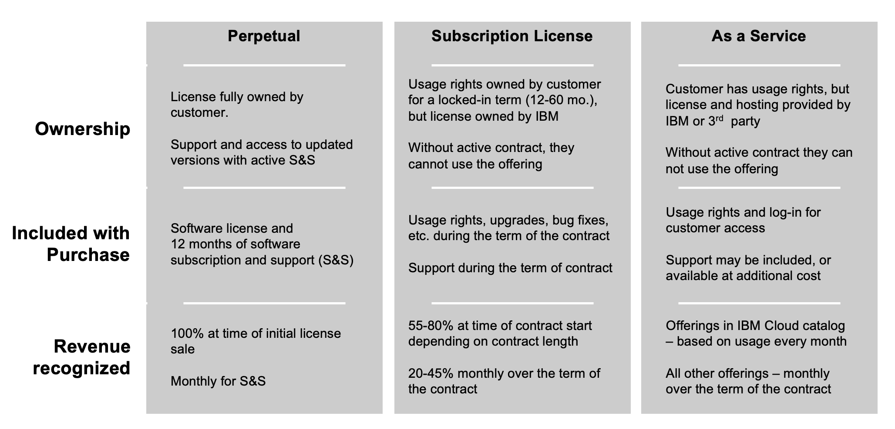

<Row>

<Column colMd={8} colLg={8}>

## ACV is an indicator

The ACV in Gainsight is an indicator of customer activity and entitlements, but not every customer entitlement has an ACV value.

For all relationship types, Gainsight shows the ACV that is tied to the ongoing revenue stream (S&S) that is at risk for renewal.  This means that for SaaS and Subscription Licenses, 100% of the ACV is shown. Other entitlements that have a license or transactional ACV are not shown in Gainsight since that ACV is not at risk.

**Note**: The ACV in Gainsight is not the full ACV for a contract, nor is it intended to match other systems.  It is directionally correct but should not be used as a firm value in reporting.

**CSMs cover these License Types**

</Column>

</Row>

<Row>

<Column colMd={8} colLg={8}>

**Why doesn't the ACV in Gainsight match FastPass?**

The Gainsight ACV for a Perpetual client or part number might be different from FastPass. This is because Gainsight is only focused on the SW Subscription & Support (S&S) portion of the ACV that is up for renewal, while FastPass includes the ACV tied to the License or transaction portion of the deal. The standard split is approximately 80% License / 20% S&S, however, this can vary by part number.

For all relationships, Gainsight shows the ACV that is tied to the ongoing revenue stream that is at risk for renewal. For Subscription License and SaaS, 100% of the revenue is at risk, so that is the total ACV.  Other entitlements have a license or transactional ACV that is not shown in Gainsight since that ACV is not at risk.

FastPass will show the total deal size; use Gainsight to focus on the Quantity and Revenue at Risk since that is what CSMs can control.

**Why does an entitlement show a $0 ACV?**

  If the ACV = 0, it is part of an ELA catalog and there is revenue attributed that we need to retain. We just don't know how much. Typically, a $0 ACV also has a Quantity of 1.
  
  If the ACV > 0, the value is either the full contract value (subscription) or the S&S stream up for renewal (perpetual). The other thing to note is that does not mean it is the full value. Some customers have a contract with S&S and a catalog entitlement. The value you see is just for the S&S entitlement. You might not have visibility to the catalog amount. 
  
  ACV is directionally correct but cannot be used in reporting for certainty.

**My relationship shows an ACV - why is the deployment not reported in the scorecard?**

The executive scorecard reports deployments for those relationships with current annuity revenue. If no revenue has been reported in the last 3 months, the deployment will not be reported in the scorecard - regardless of the ACV shown in Gainsight.

**Possible scenarios that could explain why there is no annuity revenue:**

- The entitlement seen shows that it is part of an ELA Catalog. This means that it was not part of the deployment plan when the team did the deal. If the client is using the Cloud Pak from the catalog, then when they report, that would result in annuity revenue. 
- The client had an entitlement for it and chose not to renew S&S. They can still use it even if we no longer have revenue.
- The client is using a point product license for the deployment and not the Cloud Pak.

</Column>
</Row>
