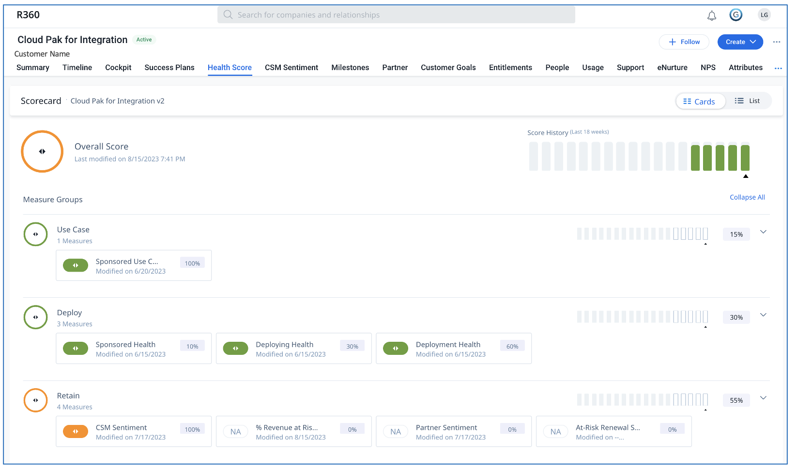
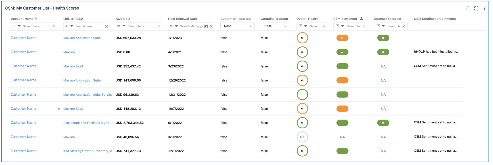
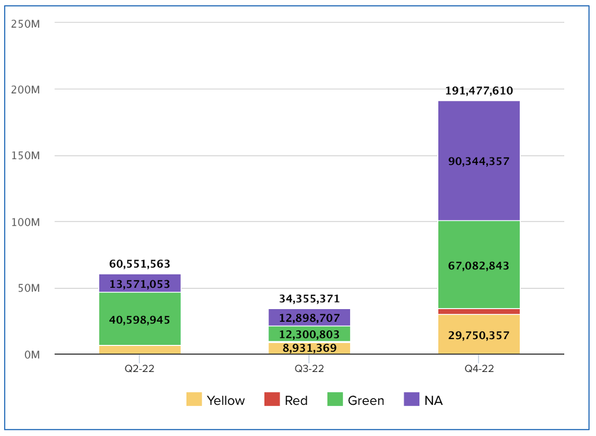
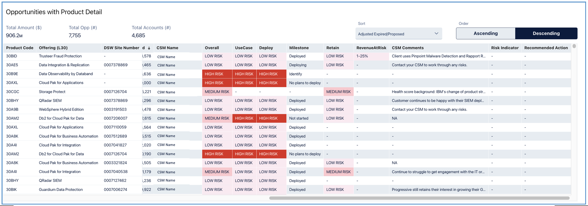
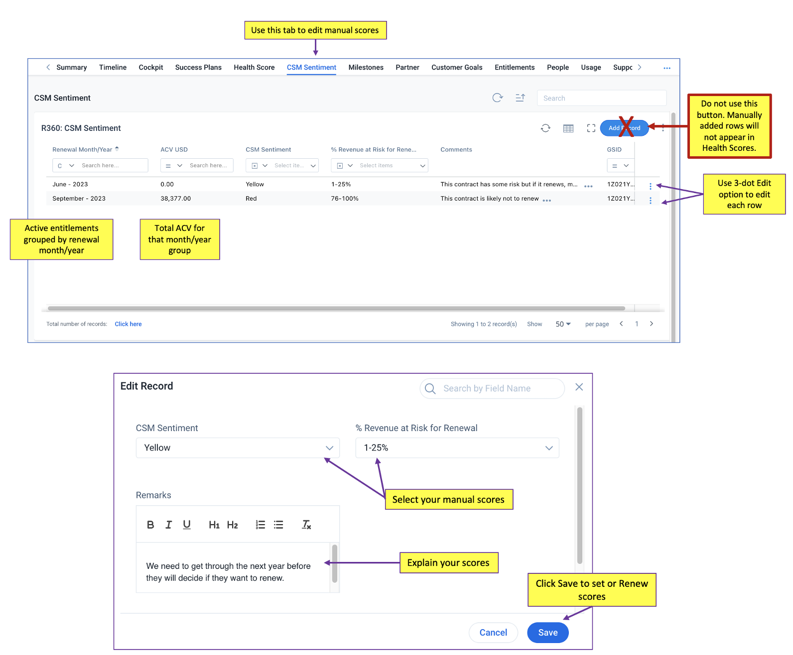
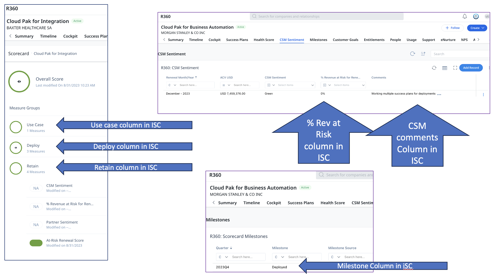
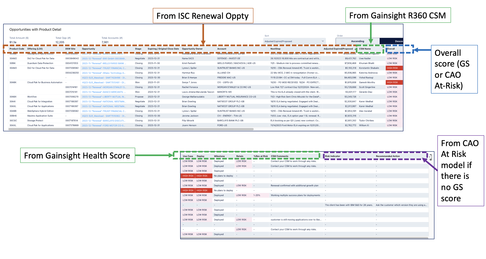

import {Link} from 'gatsby'

<Row>

<Column colMd={8} colLg={8}>

## What is a health score?

Using the Health score in Gainsight, you can get insights into where there is a risk to the revenue stream for customers using our products.  The health score is calculated from a combination of manual (CSM-updated) and automated (calculated based on certain criteria) measures. In most cases, measures will be common across relationships but some relationships have measures specific to them.  Relationships with milestones based on usage instead of growth plans, such as MaaS360 and Planning Analytics SaaS, have different health score structures than the other Software products.

If the customer has no plans to use this entitlement at all, you should open a Retention Plan to explain this situation. This will alert your manager and the leaders that the revenue slated for this entitlement may not be realized.

If you have been assigned to a relationship on a Diamond ELA Client and have learned that the customer does not have it in their catalog, work with your FLM to remove your CSM assignment.

Guidelines for Red, Yellow, and Green values vary by measure.

</Column>

<Column colMd={4} colLg={4}>

  

<Aside>

<a href='https://ibm.box.com/s/88nt5kkc2mqv29p74h6sk5yp7qrxqd9e' target='_blank' rel='noreferrer noopener'>IBM Cloud Health Score Enablement video</a>  
<a href='https://ibm.box.com/s/1doo9khxmdt3ypvmywtrs5kxll9hqd41' target='_blank' rel='noreferrer noopener'>Updating CSM Sentiment Enablement video</a>  

</Aside>

<Aside>

**Gainsight education**

<a href='https://education.gainsight.com/scorecards-nxt?next=%2Fscorecards-nxt%2F698819' target='_blank' rel='noreferrer noopener'>Video provided by Gainsight (without the IBM customization)</a>

</Aside>

</Column>

</Row>

<Row>
<Column colMd={6} colLg={6}>

## Where can I find the Health Score?

**On the R360...**

The primary view of the health score is on the R360.  Here you can see the various measure groups that have been defined for the relationship, their current score and weight (the % of the total score they comprise), the date last updated and their history.  You can view them by Cards or a List, depending on your preference. To see information about how the measure is determined, hover over the measure name.

</Column>
<Column colMd={6} colLg={6}>

  

</Column>
</Row>

<Row>
<Column colMd={6} colLg={6}>

**On the Health Score dashboard reports...**

The CSM Dashboard and some manager dashboards show the "Health Scores" report, which displays the various health score components for each relationship.  Small arrows indicate if the score has gone up, gone down or not changed since the previous day (scores are refreshed nightly).

</Column>
<Column colMd={6} colLg={6}>

 

</Column>
</Row>

<Row>
<Column colMd={6} colLg={6}>

**On the Renewal dashboard reports...**

The CSM Dashboard and some manager dashboards show bar charts for upcoming renewals by health score. These charts show the ACV up for renewal in that quarter, colored by the health of that relationship.  You should investigate any renewals that are not green and understand the situation.

</Column>
<Column colMd={6} colLg={6}>

 

</Column>
</Row>

<Row>
<Column colMd={6} colLg={6}>

**On the Annuity dashboard in ISC...**

The Gainsight Health Score data is displayed in the ISC Annuity dashboard on the Renewals at Risk tab. Using this data,  the S&A seller can better determine where the greatest risk to renewal lies and prioritize their work accordingly.

This tab combines risk data from two sources: 

* Model-based risk data for S&S entitlements. This data is from the Chief Analytics Office (CAO) At-Risk model, which calculates risk for S&S entitlements based on numerous factors including ACV, support tickets, and downloads.

* CS-based risk data, which comes from Gainsight health scores for CS-covered products where a CSM has been assigned and a health score has been calculated.

</Column>
<Column colMd={6} colLg={6}>

 

</Column>
</Row>

<Row>
<Column colMd={8} colLg={8}>

## Health Score measure groups

A Health Score can have one to many measure groups, each containing one or more measures that allow for a more detailed analysis of the score. Each measure is weighted to guide how the score rolls up to the overall Health Score metric. If a particular measure does not have a score, the weights for the remaining scores are proportionally increased based on their original weighting percentage.  

### The scores and how they are calculated

</Column>
</Row>

<Row>
<Column colMd={12} colLg={12}>

<Accordion>

### Software scores

| Measure group / Measure | % total score | % Measure group | Automated / Manual |
| --- | --- | --- | --- | --- |
| **Use case** | **15%** | | **Automated** |
| Sponsored use case | | 100% | Automated |
| **Deploy** | **30%** | | **Automated** |
| Sponsored health | | 10% | Automated |
| Deploying health | | 30% | Automated |
| Deployment health | | 60% | Automated |
| **Retain** | **55%** |  | **Mix of automated and manual** |
| CSM Sentiment | | 50% | Manual |
| % Revenue at Risk for Renewal | | 15% (20% for SaaS) | Manual |
| Partner Sentiment | | 30% | Manual |
| At-Risk Renewal Score | | 5% (NA for SaaS)| Automated |

<AccordionItem title='Use case (automated, 15% of the total score)'>

The Question:  Does the client have a sponsored use case for the product? 
This measure looks at the current milestone and how long a CSM has been assigned. If there is no CSM assigned, this measure is not calculated.

**Measure: Sponsored Use Case** 

| Green | Yellow | Red | N/A | Insights and recommendations |
| --- | --- | --- | --- | --- |
| A CSM is assigned and the current milestone is Sponsored, Planning, Deploying, or Deployed. | The CSM has been assigned for 30 days or less and the Milestone is Not Started, Identify, or Propose.  A use case has not been sponsored yet but the CSM is still fairly new to the relationship. Will the use case be sponsored? | A CSM is assigned and the current milestone is No Plans to Deploy, or the CSM has been assigned for more than 30 days and the current milestone is still Not Started, Identify or Propose. Is there a valid, sponsored use case for this product? | There is no CSM assigned or there is a CSM assigned but there is no Milestone. There is not enough information to calculate a health score. | Without a sponsored use case for the product so that deployment can occur, the revenue is at risk of renewal. |

</AccordionItem>

<AccordionItem title='Deploy (automated, 30% of the total score)'>

The Question:  Is there enough time to deploy the product before the renewal?  

These scores reflect the health of deployment by looking at milestones compared to renewal dates and risks. These scores build on each other.  The early measures have to be green before later measures will be scored. For example, you cannot be green in Deployment until the relationship is green in Sponsored Health and Deploying Health. 

**Measure: Sponsored Health (10% of Deploy score) ** 

| Green | Yellow | Red | N/A | Insights and recommendations |
| --- | --- | --- | --- | --- |
| The current milestone is Sponsored (at least one use case has a business sponsor), or the next renewal date is more than 9 months out (there is still time to obtain a sponsor for a use case). | The current milestone is still Identify or Propose and the next renewal date is between 8 and 9 months out (ideally a use case would be sponsored within 8 months of renewal). | The current milestone is still Identify or Propose and the next renewal date is less than 8 months out (running out of time to deploy), or the current milestone is No Plans to Deploy or Not Started (deployment will not happen or has not yet started). | No CSM is assigned, a CSM is assigned but there is no Milestone, or the next renewal date is either null or in the past. There is not enough information to calculate a health score. | If a sponsored milestone has not been reached by the time the renewal is 9 months out, there might be a deployment risk. |

**Measure: Deploying Health (30% of Deploy score)** 

| Green | Yellow | Red | N/A | Insights and recommendations |
| --- | --- | --- | --- | --- |
| The current milestone is Deployed or Deploying, or the current milestone is Sponsored and the next renewal date is more than 6 months out (there is still time to progress the deployment). | The current milestone is Sponsored or Planning and the next renewal date is between 5 and 6 months out (there is still time but it's getting close to being too late). | The current milestone is Sponsored or Planning and the next renewal date is less than 5 months out (there's likely not enough time to complete deployment before the renewal date). | The Sponsored Health measure is not green. | If a Deploying milestone has not been reached within 5 months of renewal, there might be a deployment risk. This score will be N/A unless Sponsored Health is green. |

**Measure: Deployment Health (60% of Deploy score)** 

| Green | Yellow | Red | N/A | Insights and recommendations |
| --- | --- | --- | --- | --- |
| The current milestone is Deploying and the project tied to this milestone has a Production Go Live date in the future, and there are no open Risk Objectives or risk ratings for that project, or the relationship is already Deployed. | The current milestone is Deploying and the project tied to this milestone has a Production Go Live date in the future, and that project has at least one open Objective with a risk rating of Yellow, Green or Null. | The current milestone is Deploying and the project tied to this milestone has a Production Go Live date of null or in the past, or the current milestone is Deploying and the project tied to this milestone has at least one open Objective with a risk rating of Red. | The sponsored health measure and the deploying health measure are both not yet green.  | For relationships in the Deploying stage, this measure determines how healthy the upcoming deployment is based on the Production Go Live date and the existence of open Project Risk Objectives or Risk Ratings. This score will be N/A unless Sponsored Health is green. If the relationship has a Deployed project and a Deploying milestone because it's waiting for customer reporting, the Expected Customer Reporting date will be used instead of Production Go-Live. |

</AccordionItem>

<AccordionItem title='Retain (a mix of manual and automatic measures, 55% of the total score)'>

The Question:  What does the CSM or Partner feel is the likelihood of renewal, and what percentage of the contract is at risk?  For perpetual (S&S) entitlements, an additional question is: what does the CAO's At-Risk model calculate the risk of renewal to be? 

Each of the scores in this group is calculated at the renewal month/year level and then rolled up to the overall measure score on the Health Score page.  See the section below on how to update your Retain scores.

**Measure: CSM Sentiment (50% of Retain score)** 

The Sentiment measure is your assessment of the customer related to their use of the offering and their likelihood of renewal. If this measure is not updated or revalidated within 100 days, it is automatically reset to N/A. You will receive a reminder CTA after 90 days without an update, which gives you 10 days to update the score before it’s nulled out.  
This score measures the risk of the contract renewing.  If there is a risk to a specific project, use a Project Risk Objective on the growth plan to document that risk.  

| Green | Yellow | Red | N/A | Insights and recommendations |
| --- | --- | --- | --- | --- |
| Customer is on track to get value from the entitlements based on their next renewal date, and should renew. This means the client is engaged and progressing a use case towards deployment, or for a new entitlement, you received a Transition Document with information about the initial use case and sponsor and have a clear path to get started. | CSM foresees risk to renewal but it is being worked and there is a line of sight to resolve, or if this is a new entitlement and you have not received a Transition Document, the sponsor is not identified, the use case is not defined, and/or you do not have a clear path to get started, then you should assess this measure as yellow. Creating a retention plan to document the risk and mitigation plan is recommended. | CSM does not foresee a renewal without intervention. Creating a retention plan to document the risk and mitigation plan is required. | No CSM is assigned, or the CSM has not made an update in 100 days and the score has been nulled out. | The CSM's perspective on the likelihood of the contract renewing.   If your relationship has a "null" CSM Sentiment health score, you will receive a CTA asking you to set the sentiment.  If your client has purchased products that they are not currently using (e.g. part of an ELA) and there is no CSM Sentiment to report, you can close the CTA as 'Closed No Action Needed' and set the Reason Code of the CTA to 'Customer Not Using'.  This will prevent you from receiving any additional CSM Sentiment CTAs. | 

**Measure: % Revenue at Risk for Renewal (15% of Retain score; 20% for SaaS offerings)** 

The CSM’s perspective on how much of the contract ACV is at risk. This is a percentage of the ACV up for renewal that you think might not renew. For example, if you think that 25% of the ACV will not renew, then the value in this field would be 1-25% (25% is at risk of renewal).

| Green | Yellow | Red | N/A | Insights and recommendations |
| --- | --- | --- | --- | --- |
| 0% and 1% to 25% of revenue is at risk. | 25% to 75% of revenue is at risk. | 76% to 100% of revenue is at risk. | The score is blank or the CSM has not made an update in 100 days and the score has been nulled out. | The CSM should use this measure to indicate the percentage of revenue that they feel is at risk of renewing. This measure should be updated (or revalidated) every 100 days or it will be automatically reset to N/A. |

**Measure: Partner Sentiment (30% of Retain score)** 

| Green | Yellow | Red | N/A | Insights and recommendations |
| --- | --- | --- | --- | --- |
| Partner feels the customer is on track to get value from the entitlements based on their next renewal date and should renew. This means the customer is engaged and progressing a use case towards deployment. | Partner foresees risk to renewal but it is being worked and there is a line of sight to resolve. | Partner does not forsee a renewal without intervention. |  No Partner is assigned, or the Partner has not made an update in 100 days and the score has been nulled out. | When assigned, the Partner provides their assessment of the customer related to the customer's use of the offering and the likelihood of renewal. This measure should be updated (or revalidated) every 100 days or it will be automatically reset to NA. If the relationship does not have a Partner, this score will be null. |

**Measure: At-Risk Renewal Score (5% of Retain score; N/A for SaaS offerings)** 

For perpetual (S&S) entitlements, the CAO's office has developed the At-Risk model to predict the likelihood of a customer renewing their Subscription and Support entitlements. If the entitlement is not S&S, this score is null. 

The At-Risk model ingests customer downloads data, support ticket data, and historical renewal data to predict the likelihood (0%-100%) that a customer will renew their non-ELA Subscription and Support entitlements. These predictions are first created for each entitlement 9 months before expiration and are subsequently updated 6 & 3 months before expiration.  
CSMs can use the Risk Indicator, which is the top factor contributing to the non-renewal prediction, to quickly identify non-renewal drivers and take action to mitigate the risk of non-renewal.  The detailed score and Risk Indicator are visible in the Entitlements section of the R360. Scroll to the right in the Active Entitlements report to see the 3, 6, and 9 months scores as well as the Risk Indicator.  

For more information on the At-Risk model, visit the <a href='https://w3.ibm.com/w3publisher/at-risk' target='_blank' rel='noreferrer noopener'>At-Risk w3 Page</a>. For more information on the Chief Analytic Office (CAO), visit the <a href='https://w3.ibm.com/w3publisher/chief-analytics-office' target='_blank' rel='noreferrer noopener'>CAO’s website</a>.    

| Green | Yellow | Red | N/A | Insights and recommendations |
| --- | --- | --- | --- | --- |
| There is a high likelihood that this customer will renew their Subscription and support. No action is needed. | There is a moderate likelihood that this customer will renew their Subscription and support. Review the Risk Indicator and other customer health measures to determine the best risk-mitigating steps, if necessary. | There is a low likelihood that this customer will renew their Subscription and Support. Review the Risk Indicator for this customer and take risk-mitigating actions to retain this customer. | This is not a perpetual entitlement. | This score is calculated for any S&S entitlement, regardless of milestone or CSM assignment.  You can see the details behind this score in the At-Risk Renewal Score Details report on the R360 Entitlements tab. |

</AccordionItem>

</Accordion>

<Accordion>

### IBM Cloud

| Measure group / Measure | % total score | % Measure group | Automated / Manual |
| --- | --- | --- | --- | --- |
| **Relationship (Sentiment) ** | **20%** | | **Automated** |
| QBR in last 90 Days | | 30% | Automated |
| IBM Exec Sponsor Engaged | | 10% | Automated |
| GSI Kyndryl Engaged | | 10% | Automated |
| Merger or Acquisition | | 15% | Automated |
| Direct Contact with Customer  | | 35% | Automated |
| **Cloud usage ** | **20%** | | **Automated** |
| Cloud usage | | 15% | Automated |
| Datacenter closure | | 20% | Automated |
| Using PaaS | | 20% | Automated |
| Adopt MZR| | 10% | Automated |
| EOL Services | | 20% | Automated |
| Using Power VS | | 15% | Automated |
| **Cloud Support ** | **20%** | | **Automated** |
| Sev 1 tickets or verified outages| | 45% | Automated |
| Billing issues | | 35% | Automated |
| Active Paid Support | | 20% | Automated |
| **Cloud Engagement ** | **40%** | | **Automated** |
| IBM Cloud Engagement| | 100% | Automated |

<AccordionItem title='Relationship (Sentiment) (automated, 20% of the score)'>

Measures customer sentiment and involves five sub-measure criteria.  The five
criteria have been historically important to maintaining a healthy relationship with our customers and identifying obstacles to furthering the IBM-customer relationship over time. For IBM Cloud, create a CTA with the subject 'EXCLUDE FROM CSM ENGAGEMENT' and close it.  Rules in Gainsight will recognize this and stop you from getting the CTA.  

**Measure: QBR in last 90 Days (30%)** 

| Green | Red | Insights and recommendations |
| --- | --- | --- |
| A timeline entry exists with an activity date within 90 days of the current date. | A Client Business Review (QBR Type) with an activity date within 90 days of the current date does not exist. | Looks at whether a QBR has been held or is scheduled within 90 days.  This is found through a Timeline type of ‘Client Business Review’ where the Review Type dropdown is set to QBR.  |

**Measure: IBM Exec Sponsor Engaged (10%)** 

| Green | Red | Insights and recommendations |
| --- | --- | --- |
| 1 Person with the role of IBM Executive Sponsor. | No Persons with the role of IBM Executive Sponsor. | The measure looks for an executive sponsor on the R360.   To set this value, navigate to your account's R360 and select the "Person" section in the left navigation. Select a name (or select the "+ Person" if it's a new person) and scroll down on the right side of the page to "roles."  Use the dropdown to select "IBM Executive Sponsor". |

**Measure: GSI Kyndryl Engaged (10%)** 

| Green | Red | Insights and recommendations |
| --- | --- | --- |
| The Client Type field is not tagged as Kyndryl or GSI. | The Client Type field is tagged with either Kyndryl or GSI. | The measure is looking at the Client Type flag for the values of GSI or Kyndryl.  This should be an automated measure at this point and will only need adjustment if the account was not previously marked. To set the flag navigate to your account's R360 and select "IBM Cloud Additional Data" on the left navigation.  Locate "Client type" on the right side of the page.  Use the dropdown menu and select "Kyndryl" and save the selection. |

**Measure: Merger or Acquisition (15%)** 

| Green | Red | Insights and recommendations |
| --- | --- | --- | 
| If neither the Retention Reason(s) nor Defection Reason is set to "Merger or Acquisition". | If either the Retention Reason(s) or Defection Reason is set to "Merger or Acquisition". | This measure is currently connected to a Retention Plan or Defection Report where the Retention/Defection reason or Secondary Retention reason is "Merger/Acquisition."  This will be automatically scored in the Relationship measure group, but it will require the CSM to mark the Retention/Defection reason on their respective Success Plan. |

**Measure: Direct Contact with Customer (35%)** 

| Green | Red | Insights and recommendations |
| --- | --- | --- | 
| Direct contact with the customer (flag is checked). | Direct contact flag is not set. | This flag, found on the IBM Cloud Additional Data section of the R360, has been initialized to true on all existing R360s that have a CSM and the account is not a Kyndryl account.  The CSM will have to adjust the flag if there is a status change or if the account is new. | 

</AccordionItem>

<AccordionItem title='Cloud Usage (automated, 20% of the score)'>

Expanding upon MRU, this measure group additionally looks at four other
aspects such as factors that could disrupt cloud service and the type of service model being used.  

**Measure: Cloud Usage (15%)** 

| Green | Yellow | Red | Insights and recommendations |
| --- | --- | --- | --- | 
| If prior month ratings are greater than ratings 3 months ago. | If prior month ratings are less than ratings 3 months ago. | If prior month ratings are null, or if it is a large client (prior month ratings are greater than $1500), and they've declined in ratings by 50% or more. | This measure looks at the combined PaaS and IaaS ratings for the prior month and for 3 months ago because we want to use full months of ratings. |

**Measure: Datacenter Closure (20%)** 

| Green | Red | Insights and recommendations |
| --- | --- | --- | 
| No CTA or eNurture outreach in the last 365 days. | A CTA or eNurture outreach has been generated for the client in the last 365 days. | The measure is looking for a CTA (cockpit) or notification of a Data Center Migration in eNuture within the last 365 days. | 

**Measure: Using PaaS (20%)** 

| Green | Red | Insights and recommendations |
| --- | --- | --- | 
| The client is using only PaaS or a combination of IaaS and PaaS. | The client is only using IaaS. | The measure is checking to see if the client is using PaaS in addition to IaaS, which is visible in the usage trends on the R360. |

**Measure: Adopt MZR (10%)** 

| Green | Red | Insights and recommendations |
| --- | --- | --- | 
| Over 50% of the client's workload is in an MZR. | Less than 50% of the client's workload is in an MZR. | The measure looks at IaaS workload by data center, and the percentage of the workload that is in an MZR vs an SZR. |

**Measure: EOL Services (20%)** 

| Green | Red | Insights and recommendations |
| --- | --- | --- | 
| No CTA or eNurture outreach in the last 365 days. | A CTA or eNurture outreach has been generated for the client in the last 365 days. | The measure is looking for a CTA (cockpit) or notification in eNurture regarding a service EOL or EOS within the last 365 days. | 

**Measure: Using Power VS (15%)** 

| Green | Null | Insights and recommendations |
| --- | --- | --- | 
| The client has had PaaS usage for the service since the beginning of last month. | The client is not using Power VS (the 15% is spread across the remaining measures in the Usage measure group). | The measure is checking to see whether the client has any usage data for the PaaS service "Power Systems Virtual Service" since the beginning of last month. |

</AccordionItem>

<AccordionItem title='Cloud Support (automated, 20% of the score)'>

This measure group encapsulates the type of customer support plan,
whether billing issues are present, and maintains the previous measure of SEV 1 tickets/outages.  

**Measure:  Sev 1 Tickets or Verified Outages (45%)** 

| Green | Yellow | Red | Insights and recommendations |
| --- | --- | --- | --- | 
| Support tickets exist but there have been no outages or Sev 1 tickets in the last 90 days or there haven't been any support tickets in the last 90 days. | There have been no outages but there has been at least one Sev 1 ticket in the last 90 days. | There has been an outage and two or more Sev 1 tickets in the last 90 days. | The measure looks at the priority of the tickets found in the Support section of the R360 and it looks at the Ticket Summary for the word "outage". |

**Measure: Billing Issues (35%)** 

| Green | Red | Insights and recommendations |
| --- | --- | --- |
| There are no open support tickets that have "RSET" in the Assignment Group column of the ticket. | There is at least one open support ticket that has "RSET" in the Assignment Group column of the ticket. | The account is considered as having billing issues if the Assignment Group column in the Support report found in the Support Section of the R360 contains the value 'RSET'. |

**Measure: Active Paid Support (20%)** 

| Green | Red | Insights and recommendations |
| --- | --- | --- |
| The customer is paying for Support. | The customer is not paying for Support. | The existence of Paid Support can either be found on the R360 as the 'Paid Support' service in the IaaS Monthly Service Usage section or if there is a Support Burndown report in the Burndown section of the R360 (PaaS). | 

</AccordionItem>

<AccordionItem title='Cloud Engagement (automated, 40% of the score)'>

This is the largest portion of the scorecard and is
represented by the type of Success Plan present on the account.  

**Measure: IBM Cloud Engagement (100%)** 

| Green | Yellow | Red | Insights and recommendations |
| --- | --- | --- | --- | 
| A Growth Plan exists with at least 2 timeline entries on the R360 within the last 60 days, or an Onboarding plan exists. | A Growth Plan exists but has less than 2 timeline entries on the R360 within the last 60 days, or a Retention plan exists. | A Defection Plan exists. | IBM Cloud Engagement is measured by evaluating the success plans on the R360.  The plans are manually created by the CSM and require regular timeline entries to retain a green score.  The measure looks at Growth,  Retention, Defection,  and Onboarding Plans. | 

</AccordionItem>

</Accordion>

<Accordion>

### MaaS360 

| Measure group / Measure | % total score | % Measure group | Automated / Manual |
| --- | --- | --- | --- | --- |
| **Retain** | **55%** |  | **Mix of automated and manual** |
| CSM Sentiment | | 50% | Manual |
| % Revenue at Risk for Renewal | | 15% (20% for SaaS) | Manual |
| Partner Sentiment | | 30% | Manual |
| **Usage** | **25%** |  | **Automated** |
| CHI Plus Prediction | | 25% | Automated |
| **Support** | **5%** |  | **Automated** |
| Support Tickets | | 100% | Automated |
| **Engagement** | **15%** |  | **Automated** |
| Copilot response | | 100% | Automated |

<AccordionItem title='Retain (a mix of manual and automatic measures, 55% of the total score)'>

The Question:  What does the CSM or Partner feel is the likelihood of renewal and what percentage of the contract is at risk?  For perpetual (S&S) entitlements, an additional question is: what does the CAO's At-Risk model calculate the risk of renewal to be?  

Each of the measures in this group is determined by renewal month.  See below for how to update your Retain scores.

**Measure: CSM Sentiment (50% of Retain score)** 

The Sentiment measure is your assessment of the customer related to their use of the offering and their likelihood of renewal. If this measure is not updated or revalidated within 100 days, it is automatically reset to N/A. You will receive a reminder CTA after 90 days without an update, which gives you 10 days to update the score before it’s nulled out.  
This score measures the risk of the contract renewing.  If there is a risk to a specific project, use a Project Risk Objective on the growth plan to document that risk.  

| Green | Yellow | Red | N/A | Insights and recommendations |
| --- | --- | --- | --- | --- |
| Customer is on track to get value from the entitlements based on their next renewal date, and should renew. This means the client is engaged and progressing a use case towards deployment.  --OR-- For a new entitlement, you have received a Transition Document with information about the initial use case and sponsor and have a clear path to get started. | CSM foresees risk to renewal but it is being worked and there is a line of sight to resolve. --OR-- If this is a new entitlement and you have not received a Transition Document, the sponsor is not identified, the use case is not defined, and/or you do not have a clear path to get started, then you should assess this measure as yellow. Creating a retention plan to document the risk and mitigation plan is recommended. | CSM does not foresee a renewal without intervention. Creating a retention plan to document the risk and mitigation plan is required. | No CSM is assigned, or the CSM has not made an update in 100 days and the score has been nulled out. |  |

**Measure: % Revenue at Risk for Renewal (15% of Retain score; 20% for SaaS offerings)** 

The CSM's perspective on how much of the contract ACV is at risk.  This is a percentage of the ACV up for renewal that you think might not renew.  For example, if you think that 25% of the ACV will not renew, then the value in this field would be 1-25% (25% is at risk of renewal).  

| Green | Yellow | Red | N/A | Insights and recommendations |
| --- | --- | --- | --- | --- |
| 1% to 25% of revenue is at risk. |  25% to 75% of revenue is at risk. | 76% to 100% of revenue is at risk.| 0% risk, the score is blank, or the CSM has not made an update in 100 days and the score has been nulled out. | The CSM should use this measure to indicate the percentage of revenue that they feel is at risk of renewing. This measure should be updated (or revalidated) every 100 days or it will be automatically reset to N/A. | 

**Measure: Partner Sentiment (30% of Retain score)** 

| Green | Yellow | Red | N/A | Insights and recommendations |
| --- | --- | --- | --- | --- |
| Partner feels the customer is on track to get value from the entitlements based on their next renewal date and should renew. This means the customer is engaged and progressing a use case towards deployment. | Partner foresees risk to renewal but it is being worked and there is a line of sight to resolve. | Partner does not foresee a renewal without intervention. | No Partner is assigned, or the Partner has not made an update in 100 days and the score has been nulled out. | When assigned, the Partner provides their own assessment of the customer related to the customer's use of the offering and the likelihood of renewal. This measure should be updated (or revalidated) every 100 days or it will be automatically reset to N/A. If the relationship does not have a Partner, this score will be null. | 

</AccordionItem>

<AccordionItem title='Usage (automatic, 25% of the total score)'>

**Measure: MaaS360 Usage** 
TBD

**Measure: CHI Plus Prediction** 

| Green | Yellow | Red | N/A | Insights and recommendations |
| --- | --- | --- | --- | --- |
| Propensity to Expand is the likelihood the customer will increase usage. | Propensity to Maintain is the likelihood the customer will neither decrease nor expand their usage. | Propensity to Decrease is the likelihood the customer will decrease usage. | There is insufficient data to make a prediction. | CHI prediction uses data science and machine learning to provide a 90-day look ahead to predict the likelihood that a customer will expand, decrease or defect. The machine learning models leverage usage, support, entitlement, and other types of data to provide predictions. | 

</AccordionItem>

<AccordionItem title='Support (automatic, 5% of total score)'>

What is the customer's level of engagement with our support ticketing system?  

**Measure: Support Tickets**  

| Green | Yellow | Red | Insights and recommendations |
| --- | --- | --- | --- | 
| Support tickets exist for this customer. | No tickets in last 30 days, prior 90 days. | No tickets in the last 30 days, there were tickets in the prior 90-day time period. | 

</AccordionItem>

<AccordionItem title='Engagement (automatic, 15% of total score)'>

This measure is based on eNurture open rates.  

**Measure: CoPilot Response**  

| Green | Yellow | Red | Insights and recommendations |
| --- | --- | --- | --- | 
| eNurture open rate is >20%. | eNurture open rate is between 0.05% and 20%. | eNurture open rate is <0.05%. | |

</AccordionItem>

</Accordion>

</Column>

</Row>

<Row>

<Column colMd={8} colLg={8}>

## When do I update or review the health score?

Some scores are automatically calculated based on CSM Assignment and Milestones.  You can influence these scores by keeping your growth plans updated and accurate.  Pay attention to red and yellow scores, read the comments, and understand the criteria used to set the score. 

The manual scores in the Retain measure group must be updated every 90 days.  As a CSM, it is your responsibility to keep the CSM Sentiment and % Revenue at Risk scores updated regularly.  If, after 90 days, you do not update them, you will get a CTA reminding you to update your scores. After 100 days, the scores are set to null and shown as N/A. 

The Health Scores are sent to the Annuity dashboard in ISC and appear on the Renewals at Risk tab. Remember that the S&A rep needs your input and is relying on your unique perspective in the form of your manual Retain scores to help determine the revenue at risk and to determine the greatest risk to renewal.  You and the S&A rep might be able to take some action to influence the score and mitigate any loss.

Partners must also keep their manual Partner Sentiment scores updated every 90 days or they will receive the same CTA and the score is set to null after 100 days.

</Column>
</Row>

<Row>

<Column colMd={8} colLg={8}>

## What are the steps to update the manual Retain scores?

As a best practice, you should renew or update the CSM Sentiment and the % Revenue at Risk measures monthly to ensure they are relevant.  

</Column>
</Row>

<Row>

<Column colMd={6} colLg={6}>

### Set the CSM Sentiment and % Revenue at Risk measures
To set, update or renew the CSM Sentiment and % Revenue at Risk measures, navigate to the CSM Sentiment tab on the R360. The table on this tab shows a line for every month/year combination in which there is an entitlement up for renewal.  If there are no entitlements, you will see a "Default" line item to edit. If the relationship no longer has active entitlements but still has revenue in the ledger, you will see a “Pending churn” line item to edit. 

You will indicate scores at the month/year level and they are rolled up nightly to the overall health score.  Note that only renewals coming up in the next year (365 days) are displayed.  If there are no renewals in the next year, then the next renewal month/year line item is shown.  

**Set or change the current scores:** 

* Select the 3-dot menu on the right end of the line that you want to update
* Click Edit
* Select the appropriate values in the CSM Sentiment and % Revenue at Risk for Renewal dropdowns
* Type your comments related to your scores, explaining why you set them in this way
* Click Save at the bottom of the screen

NOTE: Do not use the "Add Record" button at the top of the tab.  Scores added this way will not be visible and will not impact health scores.

**Renew the score** 
Be sure to renew the Health Score every 90 days. Renewing means the score is still relevant and no update is needed. Click Edit and Save for each row that has a score.

**Adding Comments** 
If any comments were provided when updating the manual CSM Sentiment or % Revenue at Risk scores, a comment will be present next to the score on the Health Score tab like this:  "Comments exist.  Please see the CSM Sentiment tab for details."  You can make additional comments by clicking on the score and adding a Timeline Activity. The most recent Timeline entry will display on the Health Score tab, but all will be visible if you click on the score. 

**Score History** 
Below the CSM Sentiment Table is a CSM Sentiment History table.  Updated nightly, this table displays all changes made to the health score in the last week. Every Sunday, the most recent update for the week is preserved in the table.   Since the ability to provide CSM Sentiment will disappear if all the entitlements expire, this History table may be useful to see what the score used to be.

</Column>

<Column colMd={6} colLg={6}>

  

<Aside>

**Enablement**
<a href='https://ibm.box.com/s/1doo9khxmdt3ypvmywtrs5kxll9hqd41' target='_blank' rel='noreferrer noopener'>Updating CSM Sentiment Enablement video</a>  

</Aside>

   

</Column>
</Row>

<Row>

<Column colMd={9} colLg={9}>

## Health scores in ISC

The Gainsight Health Score is available in ISC on the Annuity dashboard on the Renewals at Risk dashboard. The Health Score data is used by the S&A seller to prioritize the opportunities with the greatest level of risk to renewal.

### Ensure the renewal risk data is accurate

You can ensure that the renewal risk data sent to ISC from Gainsight is as accurate as possible by:

* Keep your growth plans accurate and up to date.  Growth plans drive Milestones and Milestones drive the automated Use Case and Deploy health scores.

* Update your CSM Sentiment regularly.  Remember that Red = High risk of renewal; Yellow = Medium risk of renewal; Green = Low risk of renewal.

* Provide the % Revenue at Risk value.  This is a range that shows the percentage of the $ACV up for renewal that is at risk.

* Enter useful CSM Sentiment comments.  Your comments are displayed on the Annuity dashboard for the S&A reps, so the more details you share, the more they will know. 

* Understand where to find the At-Risk data in Gainsight so that you can explain the full picture of risk to the S&A rep. (hint: See the “At-Risk Renewal Score Details” report at the bottom of the Entitlements tab.)

### Gainsight data in ISC

The following images show where you will find the Gainsight data in ISC.

</Column>
</Row>

<Row>

<Column colMd={9} colLg={9}>

## Health Score FAQ

**Q. My relationship has a deployed growth plan, but the Use Case and Deploy measures are N/A - Why?**   
**A.** These measures are designed to expose revenue at risk, so they look at the deployment Milestones which are set when there is annuity revenue in the ledger. If there are no milestones, these measures will be N/A since technically there is no revenue to protect (yet.)

**Q. When should I update my CSM Sentiment?**   
**A.** Review and update your Sentiment and % Revenue at Risk scores regularly.  Every 90 days is required, but if something changes, update the score more often.

**Q. My R360 has several entitlements but I only see one line in my CSM Sentiment report to update**  
**A.** There can be two reasons for this: 1 - only the first year (365 days) of entitlement data is shown. 2 - entitlements are grouped by renewal month/year.  If all entitlements have the same month/year, they will be grouped into one line for CSM Sentiment updates.

**Q. My R360 record has more than one IBM Customer Number (ICN) or site ID in the Entitlements section.  How do I update the CSM Sentiment?**  
**A.** At this time, the health score is not collected for individual ICNs or site IDs.  Evaluate the CSM Sentiment and % Revenue at Risk across all ICNs. If one of them has a risk, highlight that risk in the score. It is better to surface a risk than hide it.  Use the Comment to explain which ICN has the risk.  When this data is passed to ISC, the S&A seller can see your comment and reach out to you to discuss it. 

**Q. Where do I see the details behind the At-Risk score?**  
**A.** Scroll to the bottom of the Entitlements tab.   You will see the At-Risk Renewal Score Details report.  This report provides the model-calculated Renewal Probability score and the Risk Indicator that had the highest impact on the score.

 

## What are the outcomes?

After identifying and evaluating the health of the relationship, you should be able to work with the IBM account team to determine any necessary actions required to address the risks and move the project or relationship back to green.

After the S&A rep has reviewed your health score and comments, you should expect the rep to contact you to get your input on a mitigation plan for any opportunities identified at risk for renewal.

</Column>
</Row>

<Row>

<Column colMd={9} colLg={9}>

## What are the next steps?

If you have identified risks, there are several next steps:

If the plan has risk but the overall relationship is still healthy, use a Project Risk CTA on the Objectives tab of the growth plan.  This should highlight the risk to the project and steps to mitigate the risk.

If the relationship is at risk, you should create a retention plan that lists the risks and provides an action plan to mitigate those risks.

</Column>

<Column colMd={3} colLg={3}>

  

<Aside>

**The plan has risk**

<Link to='/expand-renew/project-risks' target='_blank' rel='noreferrer noopener'>Enter a Project Risk Objectve</Link>

</Aside>

 

<Aside>

**The relationship is at risk**

<Link to='/expand-renew/build-retention-plan' target='_blank' rel='noreferrer noopener'>Build a retention plan</Link>

</Aside>

</Column>
</Row>
