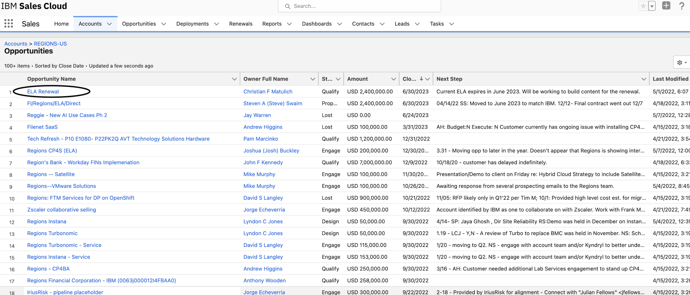
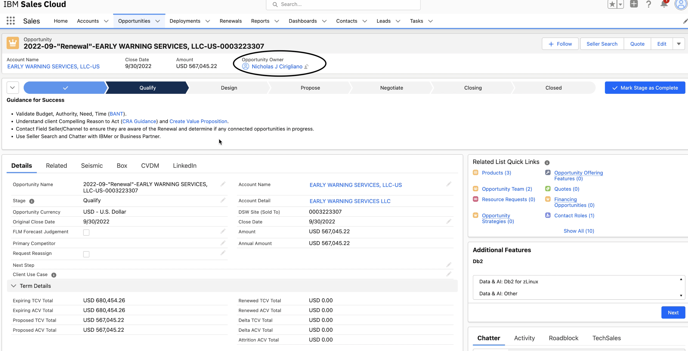
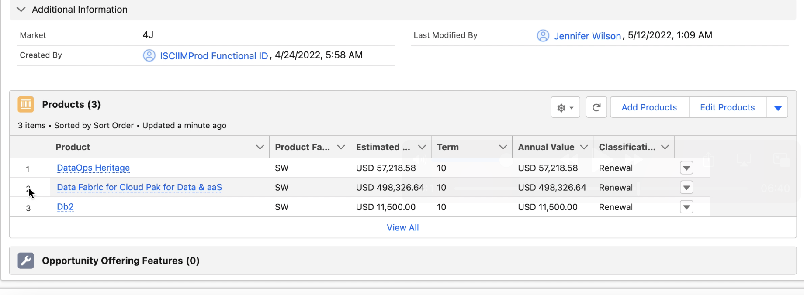
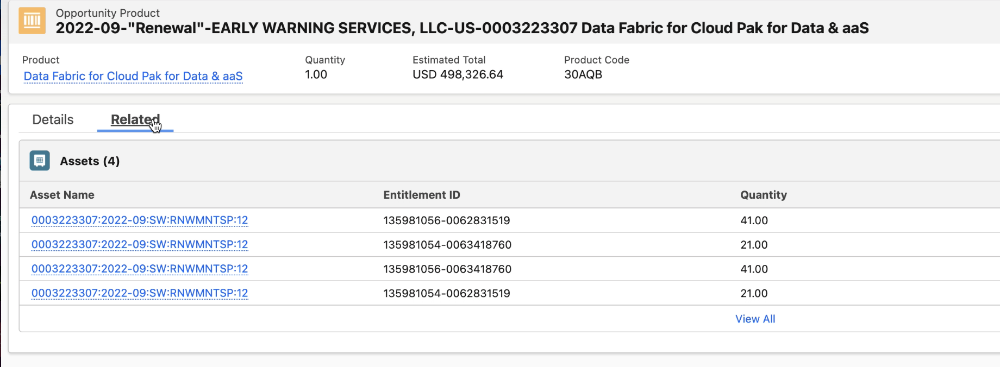
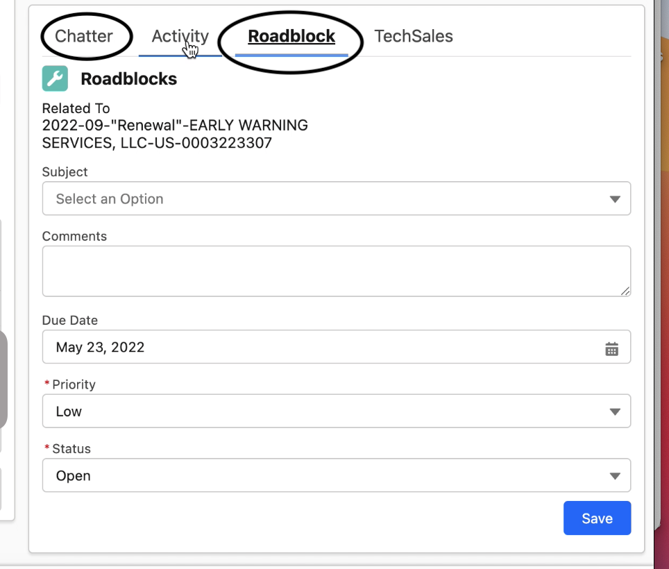

<AnchorLinks small>
  <AnchorLink>Access renewal information in ISC</AnchorLink>
  <AnchorLink>What was sold and what is up for renewal</AnchorLink>
  <AnchorLink>Engage your Subscription and Annuity counterpart</AnchorLink>

</AnchorLinks>

import {Link} from 'gatsby'

<Row>

<Column colMd={9} colLg={9}>

## Access renewal information in ISC

Use the information in ISC to identify and engage with your Subscription and Annuity rep.

To access renewal information in ISC, follow these steps:

1. Log into ISC and find your customer.
2. After you find your customer in ISC, and open the account, click on the **Related** tab.
3. On this tab, scroll down to the **Opportunities** area of the window. Under Opportunity Names, scan for any names that include **Renewal** in the name. These are your renewal opportunities.

4. All S&S renewals are named following this convention:

| S&S renewals name format | Example |
| --- | ----|
|   mm/yy Renewal Customer name | 2022-09-"Renewal"- EARLY WARNING SERVICES, LLC-US-0003223307 |

All S&S opportunities after August 2022 are included in ISC.

All Subscription and SaaS renewals use the following convention:

| Subscription and SaaS renewals name format | Example |
| --- | ----|
| Q322-SLR(Subscription License Renewal) (or SaaS)_MaaS_Load-Charge agreement # | Q322- SLR_MaaS_Load - SA#77452622-DIRECT- |

6. When you select the Opportunity, you will see the Opportunity owner listed here. This is the Subscription and Annuity rep who is responsible for pursuing the opportunity.

## What was sold and what is up for renewal

1. You will see multiple products listed under Products (This is intended to simplify billing for customers).
The product is listed using the Unified Taxonomy Level 30 name. The UT30 name is one level higher than the
product name the client has purchased.

2. Click on the Product name. You will see a high-level overview of the product and you will see what the Renewal team is forecasting.
3. Click on the Related tab. You will see the part numbers that are up for renewal.

4. Click on the Asset Name and you will see the technical contact, what is expiring and when, the contract value, and quantity. The value represents the ongoing stream, not the transactional value.
5. You can also view any Partner details.

</Column>

<Column colMd={3} colLg={3}>

   

<Aside>

**Find your customer in ISC**

<Link to='/onboard/gainsight-what-was-sold/#how-to-find-your-customer-in-ibm-sales-cloud-(isc)'>Use the DGBID to find your customer</Link>
</Aside>
</Column>
</Row>

<Row>

<Column colMd={9} colLg={9}>

## Engage your Subscription and Annuity counterpart

1. In ISC, use Chatter to share insights with the opportunity owner. The Annuity team is also using the Roadblock feature to document any risks to be worked.

2. Under Activities, you will find those documented roadblocks and can collaborate on the action plan to overcome them.

</Column>

<Column colMd={3} colLg={3}>

  

<Aside>

**Gainsight Health Score data in ISC on the Annuity Dashboard**

<Link to='/health-scores/#health-scores-in-isc'>Health Score in ISC</Link>

</Aside>

</Column>

</Row>

<Row>

<Column colMd={9} colLg={9}>

### Ensure the renewal risk data is accurate

The Gainsight Health Score is available in ISC on the Annuity dashboard on the Renewals at Risk dashboard. Ensure that the renewal risk data sent to ISC from Gainsight is as accurate as possible. The Health Score data is used by the S&A seller to prioritize the opportunities with the greatest level of risk to renewal and they will be looking to you to help explain why a relationship is at risk.

</Column>
</Row>