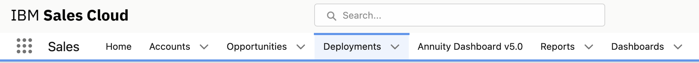
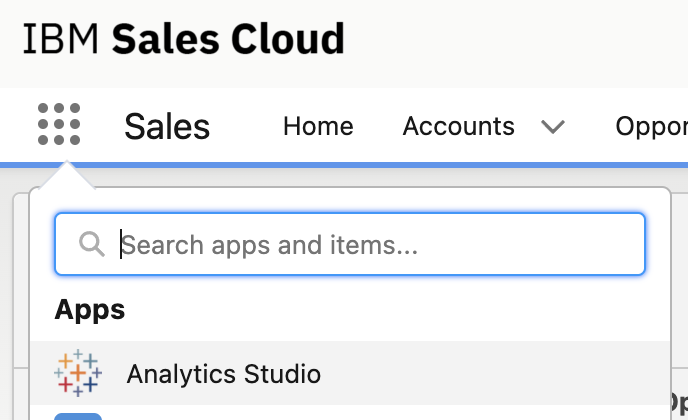
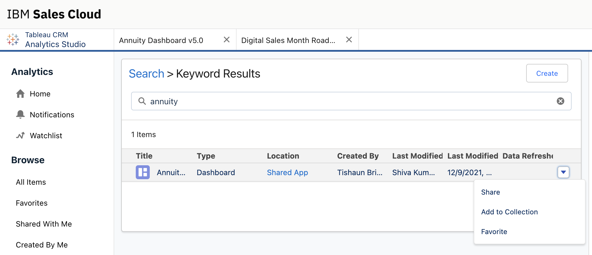
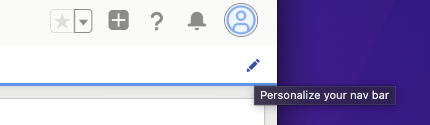
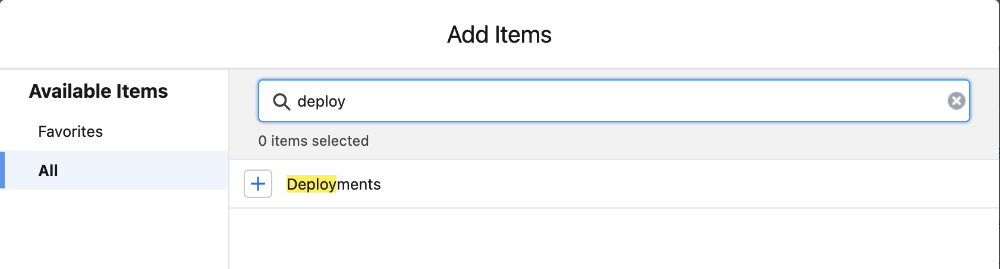
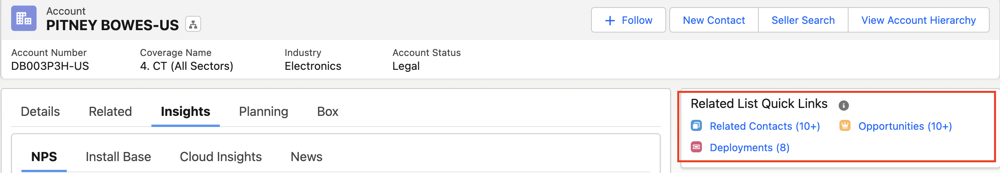
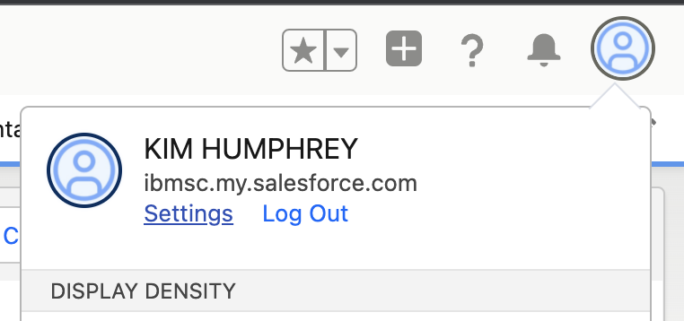
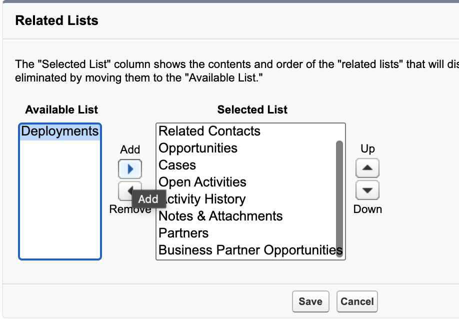

<AnchorLinks small>
  <AnchorLink>What do I need to do to get the right view?</AnchorLink>
  <AnchorLink>Customize your view</AnchorLink>
</AnchorLinks>

<Row>

<Column colMd={9} colLg={9}>

## What do I need to do to get the right view?

By default, you will not see deployment information logged by the tech sales team or the renewal dashboard in your ISC view.  Follow these steps to see those records.  At the end, you should have the Deployments and the Annuity Dashboard in your main navigation, as well as customer deployments on your account quick links.

**Important: Gainsight remains your primary tool.**

ISC is a tool to help you learn about your clients. You are not expected to manage your work in ISC, own and progress deals, or extract and compare data from ISC to Gainsight.  Remember that the ISC ACV will rarely match the ACV shown in Gainsight since Gainsight only shows ACV at risk of renewal.

## Customize your view

For easy navigation, you need to have "Deployments" and the "Annuity Dashboard" on your main navigation.

If you do not see both, follow these steps:

1. To add the Annuity Dashboard, first make it a favorite. To favorite it, go to Analytics Studio.  To get to Analytics Studio, click on Apps in the main navigation of ISC. After you favorite it, it is available for you to add to your navigation.

**Note** Only ISC users with a "seller" role can access Analytics Studio. If you do not see the CRM Analytics information, you might need to request Seller access for your ISC account in <a href='https://ibm.idaccesshub.com/ECMv6/request/requestHome' target='_blank' rel='noreferrer noopener'>IBM AccessHub</a>. See the <a href='https://ibm.seismic.com/app?ContentId=600ae627-23aa-4be2-96a0-55839faa9b60#/doccenter/5477419a-9474-4c51-94af-b442e9169fab/doc/%252Fdd98c5a3df-6b7c-1d77-6f07-d12e63954c78%252FdfOTRiYmU4NTQtNWY4NC03Y2QyLWZjYWUtOGIxYmFmZjkyZThk%252CPT0%253D%252CSG93LXRv%252Flf8909cd15-6dd7-4089-93c5-2e7b1a40dae6//?mode=view&s' target='_blank' rel='noreferrer noopener'>Seismic page</a> that describes the roles.

2. In Analytics Studio, type Annuity in the Search field. Besides the search result, use the drop-down menu on the right to add the Annuity Daskboard as a favorite.

After you finish adding the dashboard, you can leave Analytics Studio and return to the ISC main dashboard.

### Update the main Navigation

1. Click the pencil in the upper right to Personalize your Nav Bar.

2. Click the button in the upper right to Add Items

3. Click All in the left navigation.  Then search on Deployments.  When you see Deployments, click on the plus to turn it into a green checkmark to add.

Under Favorites, you should see the Annuity Dashboard. Follow a similar path to select the Annuity Dashboard for your navigation bar.

4. Click Add 2 Nav Item at the bottom of the window.

You can now customize your view to order the tabs in your navigation bar as you would like to see them.

Pro tip: If you want to save space, you can rename the "Annuity Dashboard v5.0" to another name like "Renewals" using the pencil to edit the name.

You should now see Deployments and the Annuity Dashboard in your main navigation.

</Column>

</Row>

<Row>
<Column colMd={8} colLg={8}>

To easily navigate to all the deployment records of a customer, you should add "Deployments" to the quick links view of all accounts. This view is useful as you are onboarding with a client or looking up information that is driving our scorecard.

If you do not see it, follow these steps:

1. To customize this view, click on your name in the upper right of the ISC dashboard and click Settings.

2. In the search area of the navigation, search for "Customize my Pages". Select it in the navigation results.
3. On the right you will see different pages you can customize.  For this purpose, select "Accounts" from the drop-down and click Customize Page.
4. You should see "Deployments" in your available list to add to the view and click Save.

After you have completed this step, you should see on the account window a link to quickly get to a list of any deployment records created for that client.

</Column>
</Row>
