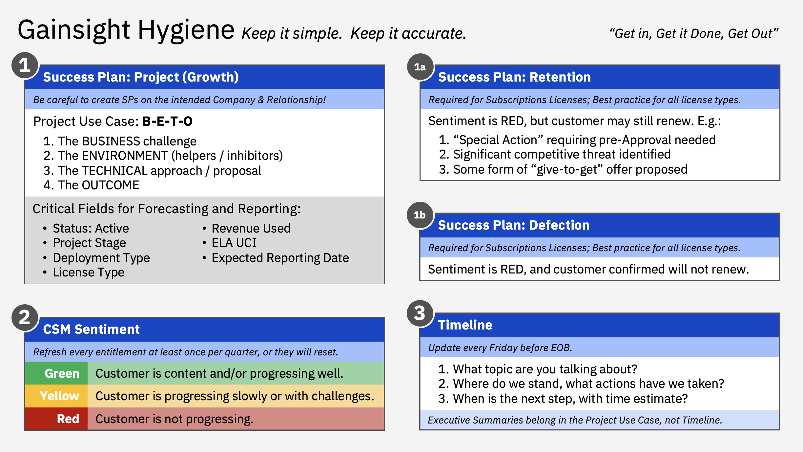

import {Link} from 'gatsby';
import FileLink from '../../components/FileLink';

<Row>

<Column colMd={3} colLg={4} noGutterSm>

</Column>

<Column colMd={6} colLg={6}>

### Gainsight is the management tool for CS.

</Column>

</Row>

<Row>

<Column colMd={9} colLg={9}>

In Gainsight, you can access the customers you are assigned to, create your success plans, document key updates, and communicate the health of the project and deployment progress.
Use Gainsight to:

* Understand your customer and their entitlements through the C360 and R360 records.
* Manage your to-do list and record account activity with Cockpit and Timeline.
* View the health and deployment progress of your accounts by using Health Score and Dashboards.
* Plan, document and track deployments and risk mitigation using consistent formats provided by Success Plans and templates when they are available.

</Column>
</Row>

<Row>
<Column>

| Gainsight activity | Scope | Frequency |
| --- | --- | --- |
| **Success (Growth) Plans**   &nbsp;&nbsp;&nbsp;- Project Use Case: BETO Format   &nbsp;&nbsp;&nbsp;- Platform, Infrastructure, Theme, Storage, Play, IBM Extended Teams, etc.   &nbsp;&nbsp;&nbsp;- Forecast (Dates, Type, License) & Diamond ELA Plans (Dates, UCI, Revenue) | All active projects | Ongoing |
| **Timeline updates**   &nbsp;&nbsp;&nbsp;Topic, status, next step, any help needed | All active projects | Weekly |
| **Client Flashes**  &nbsp;&nbsp;&nbsp;- “Twitter-style” (240 characters) executive summary   &nbsp;&nbsp;&nbsp;- At R360 (Relationship) level   &nbsp;&nbsp;&nbsp;- Visible in ISC watsonx Dashboard | All watsonx entitlements | Weekly |
| **CSM Sentiment**   &nbsp;&nbsp;&nbsp;- Set Red/Yellow/Green and include comments   &nbsp;&nbsp;&nbsp;- Visible in ISC Renewal Dashboard | All entitlements | Quarterly |
| **Client Business Reviews/Executive Business Review (EBR)**   &nbsp;&nbsp;&nbsp;- <Link to='/onboard/executive-business-review/#record-the-client-session-in-gainsight'>Timeline activity for any CVA or EBR executed</Link>   &nbsp;&nbsp;&nbsp;- At C360 (Customer) level | All Diamond customers | Monthly or Quarterly |
| **Monitor CTAs**   &nbsp;&nbsp;&nbsp;- Use these proactive alerts   &nbsp;&nbsp;&nbsp;- Provide feedback on CTA fatigue | All CTAs | Ongoing |

</Column>
</Row>

<Row>
<Column>

## Gainsight activities

| Activity | Description | Learn more |
| --- | --- | --- |
| ACV | The Annual Contract Value (ACV) is an indicator of customer activity and entitlements  | <Link to='/expand-renew/what-is-acv' target='_blank' rel='noreferrer noopener'>How ACV is used in renewals</Link> |
| Call-to-Action (CTA) | Created by Gainsight, by the CSM, or by a manager, these are a CSM’s to-do items and are visible in the Cockpit.  CTAs can be classified into several different types including Risk, Activity, and Event. CTAs are the backbone of the Cockpit workspace and typically contain more granular tasks for the CSMs to complete. Objectives created within a Success Plan will appear in Cockpit as CTAs. | <Link to='/onboard/gainsight-cockpit' target='_blank' rel='noreferrer noopener'>Understand CTAs</Link> |
| CTA Assist | Enlist a peer CSM's assistance | <Link to='/onboard/gainsight-assist-ctas'>CTA Assist</Link> |
| CTA Partner Assist | Enlist a peer CSM's assistance with a Partner | <Link to='/onboard/gainsight-assist-ctas-partner'>CTA Partner Assist</Link> |
| Client Flash | Use Client Flash in Timeline to provide executives with the current state of an entitlement for an account. | <Link to='/onboard/gainsight-client-flash' target='_blank' rel='noreferrer noopener'>How to update Client Flash</Link> |
| Cockpit | Cockpit is your home base for viewing and managing key customer activities. | <Link to='/onboard/gainsight-cockpit' target='_blank' rel='noreferrer noopener'> Manage activities by using the Cockpit</Link> |
| Customer 360 (C360) | The comprehensive view of an individual customer, showing key information about the customer such as coverage information, Geo, Market, DBGID, CSM assignment, and the offerings they've purchased - known as "Relationships". Click the hyperlinked customer name on any Gainsight dashboard to access the C360. | <Link to='/onboard/gainsight-what-was-sold/#the-customer-360-record' target='_blank' rel='noreferrer noopener'>Understand C360 and R360</Link> |
| Dashboards | A collection of reports that have been arranged in a logical order to help you answer questions about your business.  Accessible from the drop-down menu in the upper left corner of your Gainsight screen, Dashboards can contain different types of charts, widgets and list reports, and many contain global filters that allow you to refine the data. You will see different Dashboards based on your role. | <Link to='/onboard/gainsight-csm-dash'>CSM Dashboard</Link> |
| Defection Report | Create a Defection Report when your retention plan is not successful and your customer is going to churn. | <Link to='/expand-renew/create-defection-plan' target='_blank' rel='noreferrer noopener'>Learn to create a Defection Report</Link> |
| ELA attributes | In R360, this report gives more information about the ELA/s tied to this relationship. | <Link to='/onboard/ela-attributes'> ELA attributes in Gainsight</Link> |
| Entitlements | Entitlements are what the customer has purchased from IBM. | <Link to='/onboard/gainsight-entitlement' target='_blank' rel='noreferrer noopener'>Learn about entitlements</Link> |
| Find your customer |  Follow the steps to find your customer in Gainsight. |  <Link to="/onboard/gainsight-what-was-sold" target='_blank' rel='noreferrer noopener'>Gainsight steps to find your customer</Link> |
| Forecast dates | Document dates when stages of the project will be reached. | <Link to="/onboard/gainsight-forecast-dates" target='_blank' rel='noreferrer noopener'>Forecast key dates</Link> |
| Growth Plan | A Growth Plan is a type of Success Plan in Gainsight. Create one Growth Plan to represent a use case that a client would deploy and obtain value from. | <Link to='/onboard/gainsight-create-growth-plan' target='_blank' rel='noreferrer noopener'>Growth Plan</Link>. |
| Health Score | Available on the R360, the health score provides visual indications of your client's health in specific areas, called "measures".  Each relationship may have different measures, but every relationship has "CSM Sentiment", which is a manually updated measure.  It provides the CSM's view of the client's overall health.  All the measures are summarized into an overall health score. | <Link to='/health-scores/' target='_blank' rel='noreferrer noopener'>View the Health score dashboard</Link> |
| Milestones | Milestones represent major events in the customer journey and demonstrate progress toward deployment.  Examples of milestones are Planning, Deploying, and Deployed. Milestones are set automatically based on customer reports, usage, Gainsight growth plans or ISC deployment opportunities. | <Link to='/onboard/gainsight-milestones' target='_blank' rel='noreferrer noopener'>Understand and report on deployment progress</Link> |
| Nurture Plan | Create a Nurture Plan when your customer needs time before working on a new use case.  | <Link to='/onboard/gainsight-nurture-plan' target='_blank' rel='noreferrer noopener'>Create a Nurture Plan</Link> |
| Relationship 360 (R360) | Similar to Customer 360, it provides a 360 view of a relationship. A relationship is comprised of one or more entitlements that the customer has purchased, so relationships are also referred to as “offerings”.  The R360 contains information such as success plans, milestones, health score and entitlement data. Most of your CSM work will be recorded on the relationship. | <Link to='/onboard/gainsight-what-was-sold/#the-customer-360-record' target='_blank' rel='noreferrer noopener'>Understand C360 and R360</Link> |
| Renew offerings | Understand risks, track and act on renewals | <Link to='/expand-renew/renew-offerings'>Renewal process</Link> |
| Retention Plan | If the relationship is at risk, you should create a retention plan. | <Link to='/expand-renew/build-retention-plan' target='_blank' rel='noreferrer noopener'>Learn how to build a Retention Plan</Link> |
| Success Plan | A success plan helps the CSM monitor and drive success with individual customers based on long-term objectives and criteria that they define.  We have several types: Growth plans (driving usage, deployment and growth); Retention plans (designed to mitigate a specific risk and avoid customer churn); and Defection reports (following a Retention plan, they explain why the customer has left IBM, or churned). Templates are available for specific growth plan scenarios such as a brand-new customer, or moving into production, and can be combined and edited as desired. | <Link to='/deploy/identify#document-the-success-plan' target='_blank' rel='noreferrer noopener'>Plan for success</Link>    <Link to='/onboard/gainsight-success-plan-templates' target='_blank' rel='noreferrer noopener'> Success Plan templates</Link> |
| TEL projects | View the projects for your customer that TEL has engaged. | <Link to='/onboard/understand-deal/#if-your-customer-worked-with-technology-expert-labs-learn-about-the-deal'>Learn about the TEL project</Link>
| Timeline | Use Timeline to communicate your updates and activity. | <Link to='/onboard/gainsight-timeline' target='_blank' rel='noreferrer noopener'>Update your Timeline regularly</Link> |

<InlineNotification>
To open an issue (bug, enhancement request, merge request) for the Gainsight team, use <a href='https://github.ibm.com/hybrid-cloud/gainsight-support/issues/new/choose' target='_blank' rel='noreferrer noopener'>Gainsight issues</a> in GitHub.
</InlineNotification>

</Column>
</Row>
