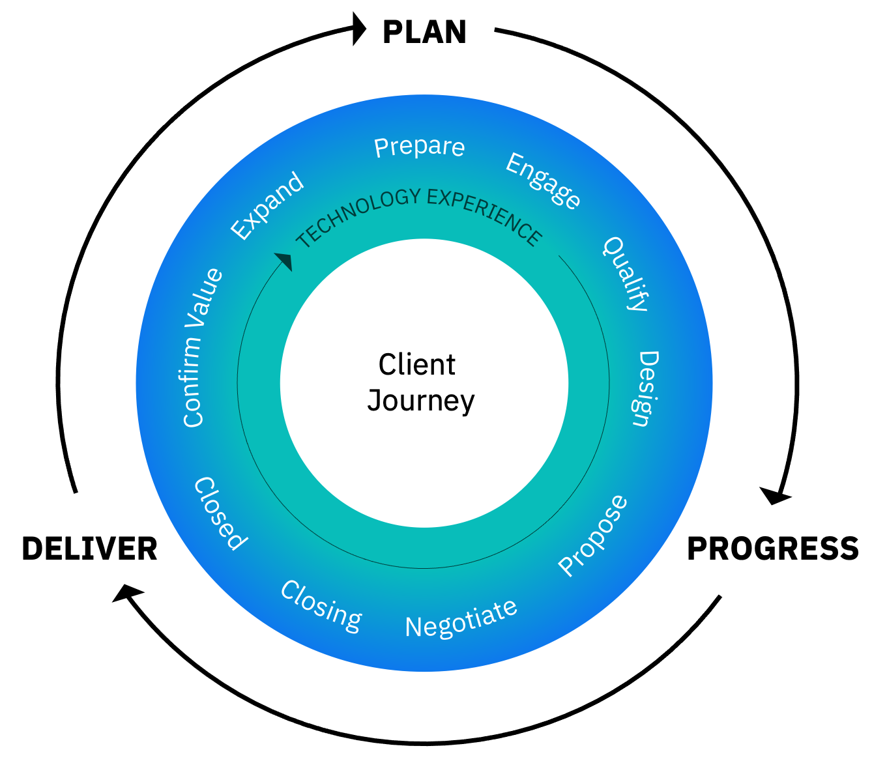
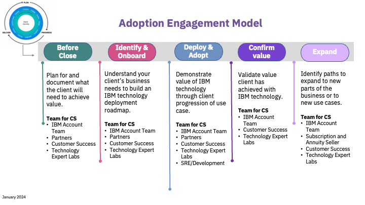

import {Link} from 'gatsby'

<Row>

<Column colMd={9} colLg={9}>

The <a href='https://ibm.seismic.com/Link/Content/DC3dHjbMmgCf78QJ2QdFbTDg2693' target='_blank' rel='noreferrer noopener'>IBM Client Engagement Model (ICEM)</a> is the single IBM sales approach for engaging with clients to drive consistency and enhanced business results. All teams execute the model in alignment with the client's transformation journey. 

ICEM has three phases of customer engagement:

</Column>
</Row>

<Row>

<Column colMd={3} colLg={3}>

**Plan:** Map client goals and strategies to IBM technology and sales plays.
</Column>

<Column colMd={3} colLg={3}>

**Progress:** Propose a compelling reason to act, negotiate terms and prices, and close a sales opportunity.
</Column>

<Column colMd={3} colLg={3}>

**Deliver:** Deliver value on the client expectations identified in the planning phase.

</Column>
</Row>

<Row>

<Column colMd={4} colLg={4} noGutterSm>

</Column>

<Column colMd={6} colLg={6}>

 

As a CSM, your impact is greatest in the Deliver phase; however, you need to engage with the Account team before the Close of a sale to share your knowledge of the client and so you have a better understanding of what is sold. You have input in the Design phase of the Sales cycle.

</Column>

</Row>

------------------

<AnchorLinks small>
<AnchorLink>Adoption Engagement Model</AnchorLink>
<AnchorLink>Transition from the Progress phase to the Deliver phase</AnchorLink>
</AnchorLinks>

------------------

<Row>

<Column colMd={9} colLg={9}>

## Adoption Engagement Model

The Deliver phase is focused on delivering value on the client expectations that were identified in the planning phase.
This means successful implementation and adoption to ensure the client can quantify the business
value of their purchase decision. Client retention and loyalty are the levers that provide
additional opportunities to scale and expand.

</Column>
</Row>

<Row>
<Column>

| Phase | Actions | Resources | Teams | Outcomes |
| --- | --- | --- | --- | --- |
| Before Close | - Participate in Account Planning   - Learn about the IBM team   - Understand what was sold   - Learn about the customer   - Regularly discuss upcoming deals/pipeline with partners & ask questions about implementation plans (CS Partner Specialist) | - Validated sizing and high-level design   - Large Deal Review   - Transition doc   - PoX delivered (as needed)   - High-level growth plan (deployment plan)  | - IBM Account Team   - Partners   - Customer Success   - Technology Expert Labs | - Account Plan   - Initial use case |
| Identify & Onboard | - Introduction to client   - Confirm client business   - Objectives & use case   - Validate MVP   - Validate contract data   - Install/provision product   - Document value realization metrics   - Educate dev team   - Welcome nurture (PLG)| - Use Case Discovery   - Business Outcome   - CSM Playbook   - Onboarding workshop (virtual) (PLG)| - IBM Account Team   - Partners   - Customer Success   - Technology Expert Labs | - Growth Plan   - Business Outcome metrics   - Prioritized use cases   - Go-live forecast date   - Onboarded (PLG)|
| Deploy & Adopt | - Iterate & grow the MVP   - Architect solution   - Install & configure Prod   - Integrate to backend   - Test solution   - Deploy to production   - Harden environment   - Implement Day 2 Ops   - Educate ops team   - Share deployment guides (PLG)   - CSM or partner outreach when zero or novice features implemented (PLG) | - Modernization Guides   - TechZone   - Brand pages in CSM Playbook   - IBM Product pages | - IBM Account Team   - Partners   - Customer Success   - Technology Expert Labs   - SRE/Development | - Running MVP   - Production architecture design   - Workload in production   - Initial customer reporting ( ELA Diamond)   - Hardened solution |
| Confirm Value | - Assess value realized   - Renew entitlements   - Encourage use of additional features (PLG) | - EBR   - NPS | - IBM Account Team   - Customer Success   - Technology Expert Labs | - Renewals   - Feedback | 
| Expand | - Identify new use cases & business opportunities   - Assess success indicators   - Review Retention Plan   - Work with Subscription & Annuity rep   - Create Client Flash | - Client Value Acceleration (Diamond only)   - Use Case Discovery   - Business Outcome | - IBM Account Team   - Subscription and Annuity Seller   - Customer SuccessTechnology   - Expert Labs | - Growth Plan   - Prioritized use cases   - New entitlements   - Updated client account plan   - Client advocacy |

A **CS Partner Specialist** works with the partner throughout these phases to perform the actions and achieve the outcomes that are included in this table.

</Column>
</Row>

<Row>

<Column>

## Transition from the Progress phase to the Deliver phase

The three phases of the ICEM are Plan, Progress, and Deliver. The progression from the Progress to the Deliver phase is a transition from Pre-sales to post-sales. You will engage in some planning activities in pre-sales where you provide deployment status to the IBM team during this transition period. You will also use this time to learn about the customer and their goals.

| Activity |
| ------- |
| Participate in **<Link to='/onboard/strategic-account-planning'>Account Planning</Link>**. This pre-sales activity results in a living, internal business plan. You are responsible for completing the Account Technology Plan template section in Quip named Deployment Strategy. Ensure that the plan owner shares access with you so you have permission to view and update the plan. |
| Participate in the **Large Deal Workshop**. This pre-sales activity for Diamond clients results in a dynamic working document completed by the account team that focuses on customer and internal IBM objectives. |
| The **<Link to='/onboard/transition-doc'>Transition Document</Link>** is designed to ensure CS does not lose momentum with our clients as they purchase our products and move from the pre-sales to post-sales engagement model. If you are covering a partner, you will ensure the Partner has a transition process. |
| **High-level deployment plan** In Gainsight, the deployment plan is called the <Link to='/onboard/gainsight-create-growth-plan' target='_blank' rel='noreferrer noopener'>Growth Plan</Link>. Based on the information you have gathered from the IBM Account team or Partner, you should be able to start to develop this plan after you have an initial use case. |

After the product is sold and you are in the Deliver phase, you will work within Gainsight to manage your activities and you will follow the <Link to='/deploy/document-the-plan'>Deployment Stages</Link>

## Pre and post-sale responsibility matrix 

Thanks to the FSM leadership for this contribution! Discuss this with your leadership to determine if this applies to your market as well.

</Column>
</Row>
