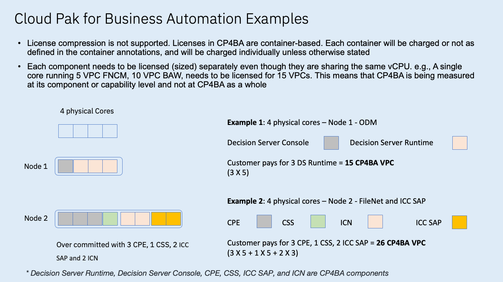
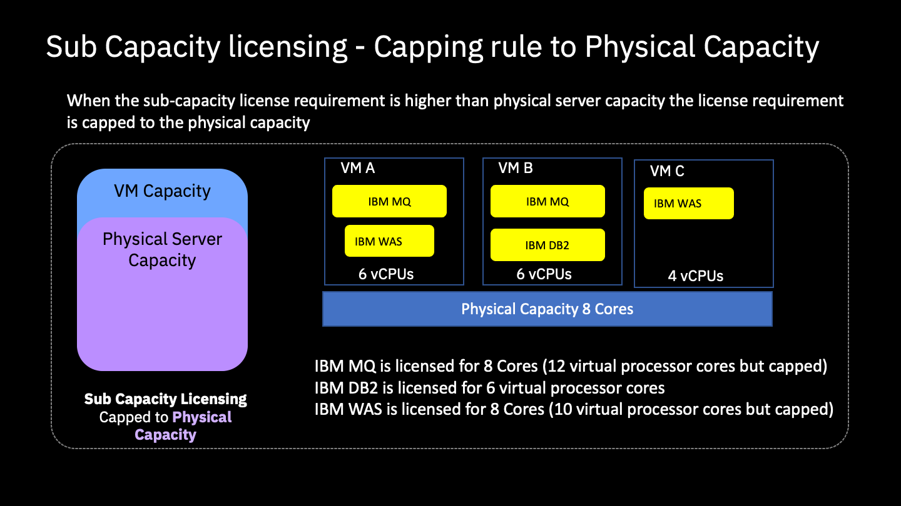

import {Link} from 'gatsby';
import FileLink from '../../components/FileLink';

<AnchorLinks small>
<AnchorLink>Licensing overview</AnchorLink>
<AnchorLink>Sizing</AnchorLink>
</AnchorLinks>

<Row>

<Column colMd={3} colLg={4} noGutterSm>

</Column>

<Column colMd={6} colLg={6}>

  

### You need to understand Licensing agreements and know where to find sizing information for your deployment.

</Column>

</Row>

## Licensing overview

Under the IBM Program License Agreement [IPLA] and Passport Advantage, IBM grants a Licensee a nonexclusive license to use the software when the client lawfully obtains it up to the level of authorized use specified in the Proof of Entitlement (PoE). IBM licenses software for use either for a term or indefinitely (depending on the type of license obtained), and as long as the client complies with the terms of the license agreement.

For exact terms and conditions governing the Use of a specific software program, refer to the <a target='_blank' rel='noreferrer noopener' href="https://www.ibm.com/terms/?id=i125=3301">International Program License Agreement (IPLA)</a>, <a target='_blank' rel='noreferrer noopener' href="https://www.ibm.com/software/sla/sladb.nsf">License Information Documents</a> (bundled and supporting programs can be found by product names in LI) and any additional agreement under which the software was obtained such as the <a target='_blank' rel='noreferrer noopener' href="https://www.ibm.com/software/passportadvantage/pa_agreements.html">IBM International Passport Advantage Agreement</a>.

### Additional licensing information

- **Learning Plan** - <a target='_blank' rel='noreferrer noopener' href="https://yourlearning.ibm.com/activity/PLAN-3558C13F8FC1">IBM Capacity Licensing for CSMs</a>
- Container/Cloud Pak deployments (including Simultaneous multithreading (SMT) and Hyperthreading): <a target='_blank' rel='noreferrer noopener' href="https://www.ibm.com/software/passportadvantage/containerlicenses.html">Container Licenses</a> and <a target='_blank' rel='noreferrer noopener' href="https://www.ibm.com/software/passportadvantage/containerfaqov.html">Container licensing FAQs</a>
- Standalone deployments on VMs: <a target='_blank' rel='noreferrer noopener' href="https://www.ibm.com/software/passportadvantage/subcaplicensing.html">Sub-capacity (Virtualization capacity) licensing</a>
- Standalone deployments metrics: <a target='_blank' rel='noreferrer noopener' href="https://www.ibm.com/software/passportadvantage/pvu_licensing_for_customers.html">Processor Value Units (PVUs)</a> and <a target='_blank' rel='noreferrer noopener' href="https://www-112.ibm.com/software/howtobuy/passportadvantage/pvucalculator/pvucalc.wss">PVU calculator</a>
- Backup and DR Licensing Guide: <a target='_blank' rel='noreferrer noopener' href="https://www.ibm.com/about/software-licensing/assets/guides_pdf/Backup.pdf">Backup and Disaster Recovery Licensing IPLA and ICA-based IBM Programs</a>
- <a target='_blank' rel='noreferrer noopener' href="https://pages.github.ibm.com/csm-playbook/playbook/common/redhat/entitlements">Red Hat OpenShift Entitlements</a>
- <a target='_blank' rel='noreferrer noopener' href="https://ibm.seismic.com/Link/Content/DCMjP3dcDGdXVGcHV6qWTD89Dh9B">CP4I Pricing and Licensing FAQ</a>
- <a target='_blank' rel='noreferrer noopener' href="https://ibm.seismic.com/Link/Content/DCHqJPHDMqMGmGTT9b2Vjjhj9gWG">CP4BA Pricing and Licensing FAQ</a>
- <a target='_blank' rel='noreferrer noopener' href="https://ibm.seismic.com/Link/Content/DCHR838TVCWMp8QV6gV2fcdqFRJV">Z Software Licensing and Pricing</a>

## Sizing

Sizing for Cloud Paks is often oversimplified. Architects and SMEs are often asked to size OpenShift clusters for Cloud Paks without all of the information they need. Work with **Tech Sales** counterparts to validate additional factors that must be considered when performing a sizing effort:

- Identify the required capabilities, runtimes, and services for each Cloud Pak the cluster must support.
- The number of instances of each included capability and runtime as well as the topology for complex services.
- Compute, memory and storage for capability containers (or for each capability, runtime, or service)
- Persistent storage required sizes, providers, access modes, etc.
- Additional services/applications included in the solution (pipelines, service mesh, tools, utilities, monitoring, services)
- Load expectations ie. traffic volume for each capability.
- Hosting platform/hypervisor/cloud. How fast can you scale your cluster nodes?
- Head-Space - unused space in the cluster required for OpenShift to schedule and reschedule workload. A good practice is to have at least one more node than the number of replicas of your most critical service.
- Expected reliability of the cluster and its workload.

**In addition to the Tech Sales team, Practice Leaders, Brand CSM Geo Leaders and Product Managers can help with sizing exercises.** (Responsible PM contacts can be found in the deck links below)

### IBM Sales Configurator

To assist in this decision-making progress, visit the <a target='_blank' rel='noreferrer noopener' href="https://app.ibmsalesconfigurator.com">IBM Sales Configurator</a> as the source of truth. 

### Additional sizing information

- <a target='_blank' rel='noreferrer noopener' href="https://yourlearning.ibm.com/activity/URL-4EFF7651CB34">Diamond ELA deployment sizing training</a>
- <a target='_blank' rel='noreferrer noopener' href="https://ibm.seismic.com/Link/Content/DC4dppJDd3XPD8MQW789h8H3G8Vj">Cloud Pak for Business Automation OpenShift T-Shirt Sizing</a>
- <a target='_blank' rel='noreferrer noopener' href="https://ibm.seismic.com/Link/Content/DCW8hBVMRm3G38cChVqHP3BTMqTG">Cloud Pak for Integration Packaging, Pricing & Sizing Guide</a>
- <a target='_blank' rel='noreferrer noopener' href="https://ibm.seismic.com/Link/Content/DCGC24h392CmqG4DCFCQp8jXgWPj">Cloud Pak for AIOps Workload and infrastructure sizing</a>
- <a target='_blank' rel='noreferrer noopener' href="https://ibm.seismic.com/Link/Folder/DCaedbeb8">Cloud Pak for Data sizing</a>
- <a target='_blank' rel='noreferrer noopener' href="https://ibm.seismic.com/Link/Content/DC2hQWQHhF4678cMqghMQqPq94CP">watsonx.ai T-shirt sizing</a>
- <a target='_blank' rel='noreferrer noopener' href="https://ibm.seismic.com/Link/Content/DC4QGj6Q4Bjm487X6jp6dqm2QGqd">watsonx.data T-shirt sizing</a>
- <a target='_blank' rel='noreferrer noopener' href="https://ibm.seismic.com/Link/Content/DCGGC4fHhT4R882286bqJDJh4G83">OpenShift and Cloud Paks sizing on Power</a>

### Sizing samples

**Licensing counting for Cloud Pak** – Cloud Pak for Business Automation sample

**Sub-capacity licensing for standalone deployments** - <a target='_blank' rel='noreferrer noopener' href="https://public.dhe.ibm.com/software/passportadvantage/SubCapacity/x86_Scenarios.pdf">Capping rule to Physical Capacity</a>

