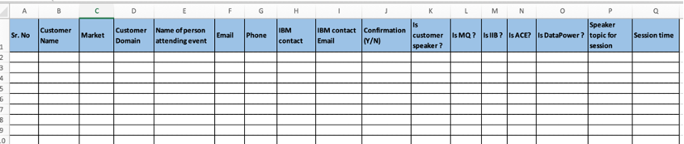
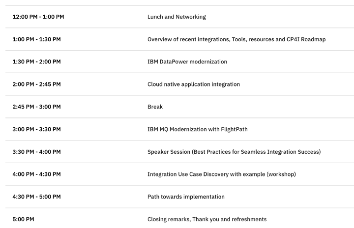

import {Link} from 'gatsby';

<Row>
<Column colMd={9} colLg={9}>

## Building communities and hosting meetings

In the vast landscape of technology and professional interests, a phenomenon has been quietly gaining momentum – **the user group meeting**. 

These gatherings of like-minded individuals are not just casual get-togethers; they are powerhouses of collaboration, learning, and community building. These meetings have become increasingly important in our interconnected world, where people from different corners of the globe can come together to discuss and collaborate on their favorite topics, whether it's a software application or a shared goal. 

</Column>
</Row>

<Row>

<Column colMd={3} colLg={4}>

</Column>

<Column colMd={6} colLg={6}>

  

### Share knowledge and accelerate deployments through user communities.

</Column>

</Row>

<Row>
<Column colMd={9} colLg={9}>

There are several objectives of having user group meetings. The biggest objective is knowledge sharing which can be easily achieved when actual users of a particular product /software come together, discuss their usage, share their implementation journey along with challenges, and finally share their unique experiences. 

It is highly recommended that CSMs explore and host user group meetings that can result in the acceleration of deployments and also help in making strong and trustworthy relations with customers with the help of the following guidelines:
  
1.	**Define Your Goal:** Clearly define the purpose and goals of your user group meeting. What do you want to achieve and what topics will you cover? As a CSM, you need to focus on product usage, capabilities, and how much product awareness you can bring to users. Plan internal meetings with other CSMs, Tech Specialists, and ATLs to understand other customers, their journeys, success stories, and existing challenges. Positive product feedback is always good but make sure you address the issues and challenges that resonate with users and those that reflect best practices that you might consider while defining your agenda. Create your customer information document, which includes customer contacts, IBM products they have currently installed and are using as well as any challenges they are facing. This will give you pointers while deciding your agenda topics. 

You can find a sample template for a customer information document <a href="https://ibm.box.com/s/7ff2e8uwyi0xjx1w122e0cu581knnj5p" target='_blank' rel='noreferrer noopener'>here</a>

2.	**Choose a Platform:** Decide whether your meeting will be in-person, virtual, or a hybrid event. Select the platform that suits your needs. An in-person user group meeting is always recommended as it makes a greater impact. These in-person meetings often allow IBM and our customers to discover unstated needs. Identify accounts and estimate a rough number of attendees. Explore various venue options that can accommodate your estimated headcount. Talk to your business partners about hosting the user group meeting. Select a venue where you can find a large customer user base and that provides an easy commute. If you plan to host in an IBM office, then you can book a venue using the <a href="https://gre.tririga.com/p/web/workplaceServices" target='_blank' rel='noreferrer noopener'>Tririga workplace service tool</a>. Identify venue requirements and work with a location representative on Event Duration, Type of preferred layout, AV/Tech requirement, Room capacity and other relevant information.
 
3.	**Create a Schedule:** Plan the agenda, including speakers, presentations, workshops, and networking sessions along with the duration of each session and proper sequence. 
- A product roadmap session is always recommended to address the product roadmap along with any changes. This helps the user to see the current roadmap and align it with their project plan. 
- Include speaker sessions that align with your objectives and make sure you can arrange them in such a way that it will provide a step-by-step approach to achieving the final goal. Speaker sessions where customers can share their feedback, implementation journey, and challenges are always great additions where hearing success stories and witnessing the achievements of others in your field can fuel your passion and drive for your interests. 
- Account CSMs and Brand CSMs need to work together not only to bring customers but also to make sure that they attend user group meetings and share their experiences. 
- Keep some flexibility in your agenda and include some time for breaks and networking activities. Start the user group meeting with lunch or welcome drinks which can act as a great opportunity for networking.
- Invite Speaker SMEs from different groups like Product Engineering, Expert Lab, and Client Engineering to make a great collaboration showcase.  
Please find attached an agenda for reference:

 
4.	**Promotion and Registration:** Identify available initiatives in IBM and promote your event as a part of available campaigns/initiatives. Spread user group meeting information throughout our CS slack channels, other IBM team's slack groups, user group online communities, social media like LinkedIn, and emails. Collaborate with our Sales, Tech Sales, ATL, Squad leaders, Client Engineering, and product teams so that your user group meeting announcement can reach to maximum users. Try reaching teams who drive user advocacy programs like <a href="https://ibm.seismic.com/Link/Content/DCjd69fW44DBfGTPTPpBmJWQF9JG" target='_blank' rel='noreferrer noopener'>TechXchange program</a> which is a cross-IBM client advocacy program and offers community, education, and technical enablement to current clients. Explore Seismic resources to know more about such initiatives. Create a registration process for attendees. Identify the team responsible for arranging/sponsoring regional events. Please refer to Seismic resources to know more about regional events like TechXchange.

5.	**Marketing:** Explore marketing resources and templates on Seismic that you can leverage for creating flyers, banners, LinkedIn posts etc. Leverage ready-to-use templates or <a href="https://ibm.seismic.com/Link/Content/DC7fDgdRBWBM9GfJGJgWM6gjDB7j" target='_blank' rel='noreferrer noopener'>Do-It-Yourself toolkit</a> to bring standard design in your marketing efforts. 

6.	**Arrangement of food and refreshments and giveaways:** Work with your local catering team and plan a nice menu for the duration of your user group meeting. Don't forget to schedule lunch and snack times aligning with your meeting schedule. You can place your catering order with  <a href="https://ibm-astorplace.catertrax.com/" target='_blank' rel='noreferrer noopener'>CaterTrax</a>. This will accept credit cards and internal charge codes. Planning and arranging any giveaways will be recommended. Explore <a href="https://w3.ibm.com/w3publisher/buy-at-ibm-resources" target='_blank' rel='noreferrer noopener'>BOND</a> to see IBM Giveways. Align with your manager and obtain approval before placing any order for any items.

7.	**Facilitate the Meeting:** Security and building access is very important in planning any in-person event. You must submit your list of attendees to the location security leader for addition to the Landlord security list. Refer <a href="https://w3.ibm.com/w3publisher/nyc/internal-event-planning-guide" target='_blank' rel='noreferrer noopener'>NYC Meeting planning guide</a> if you are planning a user group meeting in NYC. Run your user group meeting smoothly, ensuring that all sessions are well-organized and engaging. Make sure that all your IBM speakers attend each other's sessions to avoid duplication, refer to each other's sessions, and set some context. Record meeting attendance for reporting purposes. Follow all security and compliance processes while executing the meeting.

8.	**Gather Feedback:** After the meeting, collect feedback from participants to improve future events. Validate and share all presentations with attendees if they are eligible for external sharing. Create and share the event survey with all the participants. CSMs need to work on all follow-up questions and requests shared by their customers. 

9.	**Operational Tasks / Closure activities:** Close all operational and expense-related tasks associated with event arrangements. Create a box folder to keep track of all event documents including the attendee list, presentation materials used by speakers, expense-related documents, etc. Submit all your claims for food or any other expenses in <a href="https://us2.concursolutions.com/home.asp" target='_blank' rel='noreferrer noopener'>Concur</a>.

10.	**Thank the Participants:** Send a Thank you note along with the next user group meeting announcement. Share all the presentation decks with attendees after you confirm that they can be shared externally.
 
User group meetings play a crucial role in bringing people together, fostering knowledge sharing, and building strong, supportive communities. Participating in user group meetings can be a transformative experience. Problem-solving, product feedback, inspiration and motivation are also key benefits of User Group Meetings. As CSMs, we should harness the power of technology and passionate user group participants to create an environment where ideas and innovation flourish, resulting in more deployments and scaling. 

In case of any query on User Group Meeting, please contact <a href="mailto:anjali.kulkarni1@ibm.com" target='_blank' rel='noreferrer noopener'>Anjali Kulkarni</a>. 

</Column>
</Row>

